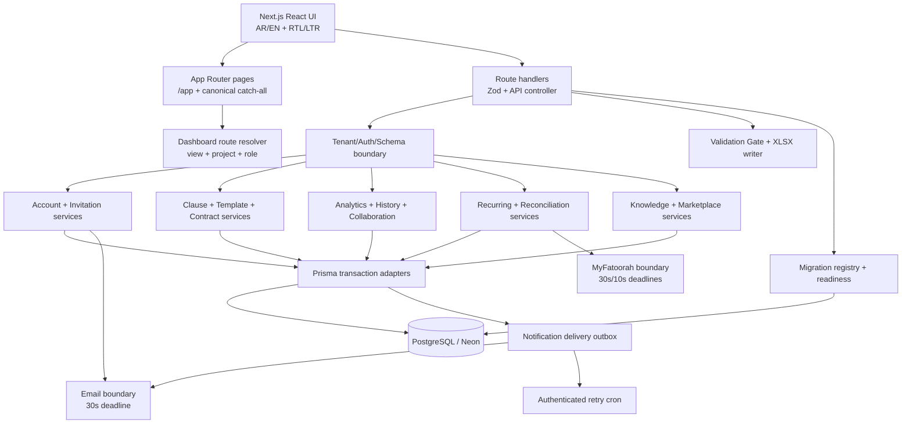

# Design Document: Platform Completion

## 1. Overview

This design completes the nineteen requirements in `requirements.md` by hardening and integrating the partial platform-completion code already present in the repository. The implementation remains a **single Next.js 16 App Router modular monolith** written in TypeScript. Route handlers stay thin; tenant-aware domain services own validation and state transitions; Prisma owns persistence; React components consume stable bilingual API contracts.

The design is intentionally conformance-oriented. Existing files such as `analytics-collector.ts`, `clause-library.ts`, `contract-template-authoring.ts`, `contract-versioning.ts`, `recurring-billing.ts`, `notification-service.ts`, `use-view-router.ts`, and the `20260726000000_platform_completion` migration are implementation starting points, not proof that the requirements are complete.

### 1.1 Baseline review findings

| Area | Reusable baseline | Required correction |
| --- | --- | --- |
| Accounts | Registration, verification, recovery pages/routes, token models, email and rate-limit helpers | Stable codes differ from requirements; token hashes are not per-token salted; unverified page gating is client-only; recovery session revocation/audit are outside the reset transaction; delivery timeout/error branches are incomplete |
| Invitations | Create/list/accept/revoke routes and seat check exist | Role and length bounds differ; list is unbounded; creation/replacement is not atomic; an unauthenticated existing user can currently accept; salted token storage and exact error contracts are missing |
| Analytics | Collector, event model, API and dashboard exist | Vocabulary is not enforced on write; event coverage is incomplete; duration pairing and previous-period semantics are incomplete; missing-table handling synthesizes successful zero metrics |
| Clauses/templates/contracts | Catalog, clause service, template authoring, contract versioning, routes and UI shells exist | Runtime random IDs, validation bounds, template version identifiers, same-hash idempotence, conflict handling, explicit version safety fields, and exact contract revision payloads need correction |
| XLSX | ExcelJS writer and download dispatch exist | Manifest is last rather than first; sheet names derive from type rather than block key; bilingual labels share rows instead of two header rows; not-representable manifest rows and null markers are incomplete |
| Billing | MyFatoorah client, recurring service/routes, webhook verification and reconciliation routes exist | Recurring state is user-scoped rather than workspace/subscription-scoped; caller-supplied amounts and floating arithmetic are used; state guards, exact idempotence, timeouts, mismatch handling, and console reachability are incomplete |
| Knowledge/collaboration/history | APIs and dashboard components exist | Queue merge/cursor/decision semantics are incomplete; comment fallbacks return 501/success-like payloads; presence is process-local; version detail/revert surfaces and strict cursor validation are incomplete |
| Navigation/marketplace | View mapping/hook and marketplace lifecycle routes exist | App Router has only `/app`; project IDs are not encoded; authorization is client-side; marketplace has synthetic catalog fallbacks, incomplete writer checks, two-decimal ratings, and no application idempotency record |
| Readiness/notifications/i18n | Readiness route, deployment safety, notification service, i18n registry/tests exist | Readiness probes guessed table names instead of `_prisma_migrations`; missing-table failures are inconsistent; delivery is not a transactional outbox and uses timestamp event IDs; retries are absent; many new surfaces still contain literals |
| Migration | An unapplied additive-intent migration exists | The SQL contains `DROP CONSTRAINT`; required fields/indexes are incomplete; no shared migration registry maps migration IDs to capabilities |

No application or database mutation is performed while creating this specification. Migration application remains a separately approved release action against an isolated branch first and is never part of build, development, start, or spec generation.

## 2. Goals and Non-Goals

### Goals

- Make every required capability reachable from a route, control, scheduler, or documented provider callback.
- Preserve tenant isolation and role checks before resource access.
- Use atomic, idempotent transitions where a requirement names multiple writes.
- Fail closed for missing schema, missing provider configuration, validation failures, and integrity failures.
- Preserve Arabic/English parity and server-first RTL defaults.
- Copy tenant commercial values exactly; never calculate, recommend, infer, aggregate, or optimize bid pricing.
- Keep migrations additive and application rollout backward compatible.

### Non-goals

- Splitting the application into services or adding a message broker.
- Replacing NextAuth, Prisma, Neon, MyFatoorah, Resend, Zustand, or the existing document engine.
- Applying migrations to the shared Neon database.
- Calculating prices, totals, margins, unit rates, discounts, refunds, prorations, or commercial strategy.
- Rewriting unrelated dashboard, agent, document, or marketing features.

## 3. Architecture



### 3.1 Layer boundaries

1. **Presentation** — App Router pages and dashboard components render only API/persisted state and registry text.
2. **HTTP boundary** — Route handlers parse Zod schemas, invoke an auth wrapper, and map domain results to one response contract.
3. **Domain services** — Pure validation/reference functions plus transaction-aware commands. Services accept a Prisma client or transaction client for isolation testing.
4. **Persistence** — Prisma models, additive SQL constraints/indexes, and serializable transactions.
5. **External boundaries** — MyFatoorah and Resend calls use explicit configuration checks, abortable deadlines, redacted errors, and injectable adapters.
6. **Asynchronous delivery** — `NotificationDelivery` is a durable outbox. Analytics is a single best-effort post-commit append attempt with a unique event key and no retry, as required.

### 3.2 Shared request and error contract

`withTenant`, `withAdmin`, and public-account wrappers are extended rather than bypassed. Resource handlers resolve the authenticated user and `Tenant_Context` before reading a resource identifier. Public account routes use the same validation/error mapper without tenant resolution.

```ts
type ApiFailure = Readonly<{
  ok: false;
  code: string;
  message: Readonly<{ ar: string; en: string }>;
  fieldPaths?: readonly string[];
  retryAfterSeconds?: number;
  missingTable?: string;
}>;

type Page<T> = Readonly<{
  items: readonly T[];
  nextCursor: string | null;
}>;
```

For compatibility, the response may retain an `error` alias, but `code` and `message.ar/en` are authoritative. Unknown thrown errors become a generic bilingual 500 without leaking provider, SQL, token, or document content. `SchemaMigrationPendingError` is recognized centrally and becomes HTTP 503 `SCHEMA_MIGRATION_PENDING`; route-local synthesized successes and 501 responses are removed.

### 3.3 Time, cursor, and identifier conventions

- Persist timestamps in UTC and serialize ISO 8601 UTC strings.
- Use injected clocks in domain services and tests.
- Encode keyset cursors as versioned base64url JSON containing all sort keys. Decode through a strict schema and verify the cursor belongs to the addressed tenant/resource.
- Generate runtime identifiers with `crypto.randomUUID()`/Prisma defaults only. Runtime `Math.random()` is prohibited.
- Treat date ranges as `[start, end)` to prevent overlap between current and preceding analytics windows.

## 4. Detailed Component Design

### 4.1 Account and invitation domain

**Files extended or introduced**

- `src/lib/account-service.ts`, `src/lib/invitation-service.ts`
- `src/lib/token-digest.ts`, `src/lib/provider-timeout.ts`
- Existing `/api/auth/*`, `/api/invitations/*`, public forms, `auth.ts`, and `proxy.ts`

A token record stores a cryptographically random raw value only long enough to construct one email, plus a random per-token salt and a versioned digest. Verification uses constant-time comparison. Raw values never enter API responses, logs, audit details, or persistence. Existing unsalted records may be verified through a bounded legacy reader during rollout, but every newly issued token uses the salted format.

Registration validates reserved identity before uniqueness and creates required identity/workspace/membership/token state in a serializable transaction. The unique index on normalized email closes the race left by a pre-query. Email delivery occurs after commit with a 30-second deadline; its failure cannot roll back the account. Recovery reset places password update, token consumption, session revocation, and audit creation in one transaction. Invitation acceptance re-reads token/user/membership/seat state inside the serializable transaction.

`proxy.ts` gates unverified JWTs before application rendering. Exact verification/sign-out/session paths remain allowed; denied APIs return bilingual 403 and denied pages redirect server-side. The verification page calls the NextAuth session update path after success so a current browser does not wait for periodic claim refresh.

### 4.2 Analytics collection and API

`ANALYTICS_EVENT_TYPES` is the sole vocabulary and is used by a Zod enum, writer, aggregate mapper, and UI labels. `recordCommittedAnalyticsEvent` accepts only identifiers, counts, and nonnegative integer durations. Metadata is constructed from typed event-specific schemas instead of recursively accepting arbitrary objects.

Each origin creates a stable `eventKey` from the mutation record/revision/transition. A unique database index makes duplicate calls harmless. The origin commits first, then schedules exactly one collector attempt through Next.js post-response work or awaits the bounded append before responding. Collector failure is logged once and never changes the origin response.

Aggregation is split into pure functions and a scoped query:

- validate a maximum 366-day `[start,end)` range;
- query only `Tenant_Context.workspace.id`;
- return counts for every vocabulary value;
- pair earliest start and earliest matching terminal event per subject and compute whole-millisecond median;
- compute count differences against the adjacent equal-duration range;
- return `null` for unavailable medians and an explicit empty indicator.

### 4.3 Clause library

The existing frozen contract catalog remains the source of public catalog clauses. Seeding runs in deterministic catalog order, recomputes canonical hashes, upserts by catalog key, changes only drifted catalog rows, and never touches workspace custom rows. The applicability-to-mandatory mapping is `GENERAL -> true`, all other declared applicability values -> false.

Custom clauses are scoped to `Tenant_Context`, use catalog-declared categories, reject markup/template/bidi control syntax, and receive cryptographic IDs. The browser receives only active catalog clauses plus active custom clauses in the caller workspace. Selection resolves the requested identifiers, adds mandatory clauses for the chosen template family, deduplicates, and orders by catalog order then ID.

### 4.4 Workspace contract templates and generated contract versions

The existing JSON-backed template models are retained for backward compatibility, while additive numeric version fields become authoritative for workspace authoring. A canonical serializer sorts object keys and preserves section/array order. Workspace variables are restricted to text, number, date, and single-choice; no money variable type is offered by the workspace editor.

Template commands:

- **Create**: validate key/title/1–100 sections/0–100 variables, validate declared versus referenced variables and clause bindings, then create template plus immutable version 1 atomically.
- **Update**: lock/re-read current version, compute hash, return current version on equal hash, otherwise create exactly current+1 and advance the pointer atomically. Unique `(templateId, versionNumber)` maps a race loser to `TEMPLATE_VERSION_CONFLICT`.
- **Retire**: mark the template retired; never delete versions or generated contracts.
- **Read**: use composite tenant/template predicates and strict keyset pagination.

Generated contract mutations compute a canonical hash over variable values, selected clause IDs, template version, and bilingual document specification. A changed hash creates the next immutable revision in the same transaction. Reads recompute the hash. Diffing operates on article identifiers independently for Arabic and English and performs no arithmetic over text or commercial literals. Comparing a revision to itself returns only `unchanged` entries.

### 4.5 Structured XLSX writer

The writer is reorganized into a pure workbook plan and an ExcelJS serializer:

1. Run `Validation_Gate` and bilingual diagnostics before constructing a workbook.
2. Add the manifest as worksheet 1 with snapshot revision/hash, plan hash, preset, locale, and UTC timestamp.
3. Walk compiled modules/blocks in plan order.
4. Add one worksheet for each TABLE, KPI, EVIDENCE_REGISTER, or COMMERCIAL_HANDOFF block. Derive a sanitized unique name from the block key, capped at 31 characters with deterministic collision suffixes.
5. Write Arabic labels in header row 1 and matching English labels in row 2 at the same column positions.
6. Record each narrative, bullet-list, or diagram block as a structured manifest row with key, type, and AR/EN not-representable marker.
7. Store all commercial, currency, and KPI values as literal strings. Null becomes the bilingual not-available marker. No cell formula is emitted.
8. Place the manifest first and set every sheet view to the requested locale direction.

The download route reuses current approval/snapshot invalidation checks and response headers. The manifest hash and response hash must match.

### 4.6 Recurring billing and reconciliation

Recurring billing is scoped to workspace subscription, not merely to a user. Checkout loads the selected plan and copies its stored cycle amount/currency; the client cannot submit an amount. A short-lived idempotent checkout intent reserves the subscription before the provider call. Provider calls use a 30-second deadline and retry count 3. Finalization stores one DRAFT profile with the provider recurring ID. An additive partial unique index prevents more than one DRAFT/ACTIVE profile per subscription.

Webhook processing starts from the existing canonical signature verifier and `PaymentWebhookEvent` fingerprint. Inside one transaction it rechecks disposition, profile amount/currency tolerance, and profile state before writing a billing record or changing a subscription. Decimal comparison is validation only; the service does not derive a price. A successful cycle extends from the later of current period end and charge timestamp by the stored integer interval. Duplicate fingerprints acknowledge without side effects.

Cancel/resume commands resolve tenant and writer role first, validate allowed local state, call the provider with a deadline, then update local state only on provider success. They do not calculate refund/proration. UI reads stored decimal text, currency, interval, state, and derived date only.

Reconciliation is an admin-only service. Its report selects pending checkouts older than five minutes with provider identifiers, uses bounded keyset pages (default 50, max 200), queries provider state with a 10-second per-item deadline and bounded concurrency, and continues after item errors. Apply re-verifies provider state and uses a serializable transaction with a conditional pending-state update. Matching capture appends one billing record and audit; mismatch marks checkout failed and writes a critical audit; other terminal outcomes mark failed; unresolved outcomes make no local change. No report computes a monetary total or difference.

### 4.7 Knowledge approval

A normalized projection adapter maps Certificate, PastProject, MethodologyAsset, ContentLibraryItem, and StaffMember records into a common queue row. A merged query sorts by `submittedAt DESC, recordType ASC, id ASC`; a composite cursor includes all three keys. Total count is independent of page size.

Decision commands resolve a concrete model adapter, constrain by workspace and `PENDING`, and execute in a serializable transaction. Approval re-reads the current evidence version and binds document ID, version, and checksum. Rejection stores trimmed AR/EN reasons. Conditional updates enforce first-decision-wins. React Query invalidates queue and navigation-count queries immediately after a decision and polls no slower than five seconds while the queue is open.

### 4.8 Comments and presence

Comment PATCH/DELETE use `withTenant`, strict Zod schemas, and proposal/workspace predicates. Edit preserves immutable fields. Hard delete is used only for a leaf. A parent with replies is withdrawn, content and mentions are cleared, and descendants remain unchanged. The data mutation and delete audit are one transaction.

Process-local subscriber maps are removed as the source of truth. `ProposalPresence` remains durable and the SSE handler polls the scoped presence set at most every three seconds, emits only when its stable hash changes, caps rows at 50, and includes total count. Heartbeats upsert at no more than the documented client interval. Each poll removes entries older than 60 seconds and emits the resulting list. This works across application instances without introducing a broker; optional Redis optimization may be added later without changing the API.

### 4.9 Complete proposal/document version history

A shared keyset utility drives proposal, document, template, and contract version lists, while each service owns its projection. List endpoints never return large content fields. Dedicated detail endpoints return one exact persisted revision. Invalid cursors are errors rather than silently treated as numeric bounds.

Revert commands run in serializable transactions:

- proposal: copy persisted Markdown/content and locale byte-for-byte into max+1, record source revision in change log, invalidate structured snapshot and reviews through the existing invalidation helper;
- document: create max+1 referencing the same immutable storage bytes/checksum, update current-version metadata, invalidate derived chunks/reviews as applicable;
- retain every previous revision.

The current proposal detail endpoint stops using an embedded `take: 20` history as the source for the history UI.

### 4.10 Addressable application views

The canonical route table is a pure bidirectional module, separate from Zustand:

- global views: `/app`, `/app/projects`, `/app/account`, `/app/marketplace`, `/app/admin/billing`, and equivalent entries;
- project-scoped views: `/app/projects/:projectId/documents`, `/proposals`, `/contracts`, `/compliance`, and `/agents` under the same project prefix.

`/app/page.tsx` and `/app/[...segments]/page.tsx` render one shared server entry. The server resolver authenticates, validates admin role and project membership, and passes `initialView`, `initialProjectId`, and localized notice to the client. This prevents unauthorized admin/project data requests and hydration flashes. Zustand persists UI preferences but not `view`; URL state wins.

`router.push` is called exactly once for a user selection; URL-driven state changes never push. Back/forward derives both view and project from pathname. Unknown, unauthorized, and missing-project routes use `router.replace`/server redirect to canonical fallback. NextAuth redirect state retains a validated same-origin requested app path in a signed, HttpOnly, SameSite=Lax cookie for at most 30 minutes.

Locale is not part of the URL. Locale persistence is mirrored to a cookie so root/server layouts can emit initial `lang`/`dir`; localStorage remains a client compatibility mirror.

### 4.11 Marketplace lifecycle

Runtime marketplace views are database-backed. Frozen system entries are seeded into persisted marketplace rows; a missing table returns `SCHEMA_MIGRATION_PENDING` rather than a synthetic catalog response. Publish validates all bilingual fields and ordered section outlines. Detail returns published or retired entries by direct ID to authorized signed-in callers. List excludes retired entries.

Rating upserts one `(entryId,userId)` row and recomputes the one-decimal average in the same transaction. `TemplateMarketplaceApplication` records `(entryId,proposalId)` uniquely; first application creates proposal sections and increments usage atomically, while repeats are no-ops. Publish/retire/rate/apply require writer role and tenant checks; only the publisher workspace may retire.

### 4.12 Schema guard and readiness

`src/lib/migration-registry.ts` is the single code registry of migration ID, ordered position, affected capabilities, and reverse action (`none` when forward-only). It contains all committed migrations, including the five named unapplied migrations and the platform-completion migration. The readiness route performs a read-only, deadline-bounded query of `_prisma_migrations`, computes the complete set difference, and reports liveness separately from readiness.

The platform-completion SQL is rewritten to contain only additive tables, columns, indexes, and constraints. Existing constraints are not dropped. Conditional `DO` blocks may inspect catalogs before adding a constraint. Every new column is nullable or has a default. SQL policy tests parse all introduced migration statements.

`Schema_Guard` extracts a missing relation name from Prisma errors, emits bilingual 503, and is integrated into the central API controller. Every current direct `isPrismaMissingTable` fallback is replaced. Build/dev/start safety scans name any script containing migration apply/development, push, or reset. Explicit operator-only database scripts remain available but are never called by build/dev/start.

The runbook migration table is generated/validated from `migration-registry.ts`, keeping requirement 16.6 synchronized through executable code rather than an independent hand-maintained list.

### 4.13 Transactional notifications

`NotificationDelivery` becomes the durable email outbox. Triggering transactions create one `InAppNotification` and one email delivery row per event/recipient pair. Stable event IDs are derived from persisted trigger IDs (proposal revision/review decision/subscription transition), never `Date.now()`.

The delivery row stores template keys, safe interpolation data, recipient email/locale snapshot, attempt count, next attempt time, first/last attempt timestamps, provider message ID, and terminal status. After commit, a bounded dispatcher claims pending rows and sends the first attempt within 60 seconds. A CRON_SECRET-protected route retries with `FOR UPDATE SKIP LOCKED`-style conditional claims, at most three attempts within 30 minutes. A successful row is never sent again. Provider calls time out after 10 seconds.

Recipient resolvers cap and deduplicate recipients, select only the active approval-policy step, and default missing locale to Arabic. Notification templates include only event label, subject title, actor display name, UTC timestamp, and one canonical dashboard link. No amount, bid value, body text, or attachment is accepted by the typed payload.

### 4.14 Localization and RTL

`Localization_Registry` becomes strongly typed for literal keys and declares dynamic-key families in a registry manifest. `tr` implements `active locale -> other locale -> key` fallback and logs missing lookups without throwing. Error builders require a registered action-specific key.

New components contain no user-visible literals. CSS uses logical properties (`margin-inline-*`, `padding-inline-*`, `inset-inline-*`, `border-inline-*`, `text-align: start/end`). Root and app layouts read the locale cookie and emit Arabic/RTL by default before hydration. The locale control updates cookie, localStorage, Zustand, `document.lang`, and `document.dir` while retaining the active canonical path.

Document-language purity and missing-section checks run in the existing `Validation_Gate`. User-authored content is not translated or rewritten; shared identifiers, numerals, dates, units, and approved technical terms are retained.

### 4.15 Production integrity enforcement

A machine-readable capability reachability manifest links each introduced service/route to a UI control, cron route, or external callback. Static tests detect orphaned additions, forbidden incomplete responses, runtime fixtures/stubs/random display values/artificial delays, user-visible literals, and prohibited monetary computations in introduced modules. The scanners are narrow and reviewed to avoid flagging frozen legal/template catalogs or validation-only amount comparisons.

## 5. Data Model and Additive Migration

All schema changes are consolidated into additive migration files and validated without applying them during implementation or CI against the shared database.

| Model | Additive changes / constraints | Purpose |
| --- | --- | --- |
| `User` | unique index on `lower(email)` | Race-safe normalized uniqueness |
| `VerificationToken`, `RecoveryToken`, `WorkspaceInvitation` | `hashSalt`, `hashVersion`; supporting expiry/state indexes | Per-token salted digest and rollout versioning |
| `AnalyticsEvent` | unique nullable `eventKey`; optional `durationMs`; vocabulary check where portable | Exactly-once append attempt and typed duration |
| `ContractTemplate` | `currentVersionNumber`, `currentVersionId`, `retiredAt`, `isExecutable default false` | Numeric pointer, retirement, safety invariant |
| `ContractTemplateVersion` | `versionNumber`, `isExecutable default false`, unique `(templateId,versionNumber)` | Immutable numeric history and conflict detection |
| `GeneratedContractVersion` | `templateVersionId`, `variableValuesJson`, `selectedClauseIdsJson`, safety fields | Complete frozen revision and UI badges |
| `MyFatoorahRecurringProfile` | `workspaceId`, exact decimal/string amount field, failure timestamp; partial unique active/draft subscription index | Tenant scope, literal value preservation, at-most-one profile |
| `RecurringCheckoutIntent` | subscription/workspace/idempotency/status/provider reference/timestamps | Reserve checkout without a long DB transaction around provider I/O |
| `TemplateMarketplaceApplication` | unique `(entryId,proposalId)` | Usage idempotence |
| Knowledge models | missing `submittedAt`, decision reason AR/EN, reviewer/time/evidence fields with defaults/nullability | One normalized decision contract across five types |
| `NotificationDelivery` | workspace, template/payload/recipient snapshots, attempts, claim/deadline/delivery fields | Durable transactional outbox and retries |
| `InAppNotification` | unique `(eventId,userId)` where event is non-null | Trigger idempotence |
| Existing version/presence/comment models | indexes needed by composite cursors and stale scans | Bounded query performance |

Existing Float billing columns are not renamed or narrowed. New exact-value fields are additive and populated from the already stored plan/checkout literal; arithmetic is not introduced. A separately approved data migration/backfill may populate nullable compatibility fields on an isolated branch before enforcing new application reads.

## 6. Transaction and Side-Effect Matrix

| Operation | Serializable transaction contents | After-commit work |
| --- | --- | --- |
| Register | user, workspace, membership, verification token, required baseline relations | verification email with 30s deadline; analytics not applicable |
| Reset password | password hash, token consumption, all session revocations, audit | none |
| Accept invitation | token recheck, seat/user/membership checks, user/member creation, token consumption | audit/email state only if required |
| Template create/update | template pointer and immutable version | preview is read-only |
| Contract mutation | contract update and immutable contract revision | none |
| Reconcile checkout | conditional checkout update, billing record, subscription action when required, audit | none |
| Knowledge decision | pending conditional update and evidence/reason binding | query invalidation is client-side |
| Delete comment | hard/soft delete and audit | presence unaffected |
| Revert version | new revision, current pointer/content, snapshot/review invalidation | analytics single attempt |
| Trigger notification | business mutation, in-app notifications, delivery rows | delivery dispatcher |
| Analytics origin | originating business mutation only | one bounded, non-retried append attempt |

External provider requests are not held inside database transactions. Commands re-check state during finalization and rely on idempotency/unique constraints.

## 7. API Surface

| Capability | Route contract |
| --- | --- |
| Account | `POST /api/auth/register`, `/verify-email`, `/forgot-password`, `/reset-password` |
| Invitations | `GET/POST /api/invitations`, `DELETE /api/invitations/:id`, `POST /api/invitations/accept` |
| Analytics | `GET /api/analytics/proposals?start=&end=`; internal typed collector |
| Clauses | list/detail/custom/select under `/api/clauses` |
| Templates | CRUD plus paginated versions under `/api/contracts/workspace-templates` |
| Contract revisions | list/detail/compare under `/api/contracts/instances/:id/versions` |
| XLSX | existing `GET /api/proposals/:id/download?format=xlsx` |
| Recurring billing | list/start and state actions under `/api/billing/recurring` |
| Reconciliation | `GET/POST /api/admin/billing/reconcile` |
| Knowledge | list/count/decision through `/api/knowledge/pending-approval` |
| Comments/presence | comment collection/item routes and proposal-scoped SSE/heartbeat route |
| Version history | list/detail/revert under proposal/document version routes |
| Marketplace | list/publish/detail/retire/rate/apply under `/api/templates/marketplace` |
| Readiness | read-only `GET /api/ready`; liveness remains `/api/health` |
| Notifications | inbox API plus CRON_SECRET-protected delivery retry route |

Every tenant route uses server-resolved workspace context; no route accepts an authoritative workspace ID from request body/query.

## 8. Failure Handling and Observability

- Log stable codes, resource IDs, workspace IDs, provider disposition, and elapsed duration; redact token values, credentials, document bodies, and commercial values.
- Emit one audit entry for security/billing/decision state changes, inside the named transaction where atomicity is required.
- Map serialization/unique conflicts to stable domain codes rather than 500.
- Provider timeout uses `AbortController` and returns only the requirement-defined unavailable/error code.
- Readiness errors never reveal connection strings or SQL text.
- SSE disconnects clear timers; database rows expire by heartbeat age.
- Notification retry claims are observable by status/attempt count and never expose message body in logs.

## 9. Security and Privacy

- Salted token digests, constant-time comparison, one-time consumption, and bounded expiries.
- Server-side verification, tenant, writer, manager, approver, and administrator gates.
- Anti-enumeration recovery responses and normalized case-insensitive identity uniqueness.
- Strict Zod schemas with `.strict()`, maximum lengths, and field-path errors.
- HTML/template/bidi control rejection for reusable legal text.
- Provider signature, amount-tolerance, currency, fingerprint, and state checks before billing mutation.
- No raw SQL built from request values. Readiness uses fixed registry IDs and parameterized queries.
- Notification and analytics schemas exclude document/commercial payloads.
- Same-origin validation for retained deep links and notification links.

## 10. Correctness Property Reflection

The prework classified all 211 acceptance criteria before selecting properties. Redundant checks were consolidated as follows:

- Variable declaration/reference errors are one set-equality property (Property 7).
- Template progression and same-hash idempotence are one version-operation property (Property 25).
- Analytics tenant provenance and monetary exclusion remain combined because both are invariants of the same event constructor (Property 15).
- Export blocking is one cross-channel property shared by requirements 8 and 19 (Property 24).
- Generic keyset traversal (Property 19) supplies the reusable harness; complete proposal/document history beyond twenty revisions (Property 30) is retained as a specialization because it validates an explicit legacy regression boundary.
- Migration SQL and code reachability remain universal properties but use static checks rather than randomized PBT because infrastructure/source graphs are not appropriate for repeated random execution.

Every remaining property supplies distinct validation value.

## 11. Correctness Properties

### Property 1: Dashboard path round trip

For every `Dashboard_View` and every valid required project context, parsing the canonical URL produced for that view yields the identical view and project context.

**Validates: Requirements 14.1, 14.2, 14.6**

### Property 2: Unknown dashboard paths fail safely

For every path under `/app` outside the canonical path set, route resolution yields the overview fallback, a replace action, and no protected-view data request.

**Validates: Requirements 14.4**

### Property 3: Translation values are non-empty

For every key in the `Localization_Registry`, the Arabic and English values each contain at least one non-whitespace character.

**Validates: Requirements 18.1**

### Property 4: Translation lookup closure

For every literal lookup and every value producible by a declared dynamic translation-key family in application source, the resulting key exists in the `Localization_Registry`.

**Validates: Requirements 18.2**

### Property 5: Clause seeding is idempotent

For every valid starting set of catalog and workspace custom clauses, running clause seeding twice produces the same catalog rows as running it once and leaves every custom row unchanged.

**Validates: Requirements 5.2, 5.12**

### Property 6: Clause canonical hash round trip

For every frozen catalog clause, recomputing the canonical hash from the persisted canonical fields yields the stored hash.

**Validates: Requirements 5.1, 5.2**

### Property 7: Template variables equal template references

For every accepted workspace template submission, the set of declared variable names equals the set of variable names referenced by all Arabic and English section nodes.

**Validates: Requirements 6.5, 6.6**

### Property 8: Template legal-safety invariants

For every stored workspace template and template version, legal-review status is `UNREVIEWED`, counsel review is required, and executable state is false regardless of caller input.

**Validates: Requirements 6.7**

### Property 9: Template history is monotonic

For every sequence of valid template creates, updates, same-hash submissions, and retirement, the number of version rows never decreases and every earlier version remains readable.

**Validates: Requirements 6.2, 6.8**

### Property 10: Contract self-comparison is unchanged

For every integrity-valid contract revision, comparing the revision with itself yields only `unchanged` article entries in Arabic and English and yields no monetary difference.

**Validates: Requirements 7.3, 7.5**

### Property 11: XLSX block/manifest completeness

For every valid proposal snapshot and compiled XLSX layout, the workbook contains the manifest first, exactly one worksheet for every representable block in layout order, and exactly one manifest entry for every non-representable block.

**Validates: Requirements 8.1, 8.4, 8.5**

### Property 12: XLSX contains no monetary formulas

For every valid proposal snapshot, every XLSX cell representing commercial or KPI data is a literal value or not-available marker and no workbook cell contains a formula that produces a monetary value.

**Validates: Requirements 8.7, 8.10**

### Property 13: Recurring webhook idempotence

For every verified successful recurring webhook event, processing the same fingerprint any positive number of times produces one `BillingRecord` and one subscription-period extension.

**Validates: Requirements 9.3, 9.7**

### Property 14: Reconciliation idempotence

For every pending checkout with a matching captured provider state, applying reconciliation any positive number of times changes local state once, appends at most one billing record, and rejects every repeat.

**Validates: Requirements 10.2, 10.3**

### Property 15: Analytics event provenance and minimization

For every accepted analytics append, the event workspace equals the uniquely resolved origin workspace and the event payload contains no monetary field or document body text.

**Validates: Requirements 4.5, 4.6**

### Property 16: Analytics aggregates match the reference model

For every valid date range, workspace, and generated event set, each count and median returned by the `Analytics_API` equals the corresponding result from a simple tenant-scoped reference aggregation.

**Validates: Requirements 4.7, 4.8**

### Property 17: Invalid registration is side-effect free

For every registration payload containing a duplicate normalized email, a reserved identity, or any field outside its required bounds, the service returns the specified code and creates no user, workspace, membership, or verification token.

**Validates: Requirements 1.2, 1.3, 1.11**

### Property 18: Consumed tokens are single-use

For every verification, recovery, or invitation token, a second submission after successful consumption fails with the applicable invalid-token result and mutates no protected record.

**Validates: Requirements 1.6, 1.7, 2.3, 2.4, 3.9**

### Property 19: Keyset traversal has no duplicates or omissions

For every template-version, contract-revision, knowledge-queue, proposal-version, or document-version dataset, following valid cursors to completion returns every eligible row exactly once in the specified order.

**Validates: Requirements 6.3, 7.2, 11.6, 13.1, 13.3**

### Property 20: Revert appends exactly one revision

For every valid proposal or document history and every readable source revision, a successful revert increases revision count by one, copies source content exactly, and leaves every prior revision readable.

**Validates: Requirements 13.5**

### Property 21: Parent withdrawal preserves replies

For every comment tree whose deleted node has at least one direct reply, deletion leaves every descendant unchanged, retains the parent row, empties parent content and mentions, and marks the parent withdrawn.

**Validates: Requirements 12.4**

### Property 22: Tenant isolation is noninterfering

For every introduced tenant route and every request whose target belongs to a workspace other than the resolved caller workspace, the route returns not-found or forbidden and leaves all records unchanged.

**Validates: Requirements 5.10, 6.11, 7.9, 11.7, 12.9, 13.7, 15.8, 19.5**

### Property 23: Notification bodies are minimized

For every generated notification, subject/body data contains only the permitted event fields and one link and contains no monetary amount, bid value, document body, or attachment.

**Validates: Requirements 17.7**

### Property 24: Validation gate blocks every invalid export

For every export channel and every content value containing pricing language, an unresolved placeholder, or an unverified regulatory identifier, export returns the applicable diagnostic and emits no artifact bytes.

**Validates: Requirements 8.9, 19.6**

### Property 25: Template version operation is monotonic and idempotent

For every current template version and accepted submission, a different canonical hash creates exactly current version plus one, while an equal canonical hash creates no row and returns the current version unchanged.

**Validates: Requirements 6.2, 6.4**

### Property 26: Concurrent template updates have one winner

For every pair of concurrent accepted updates that resolve to the same next version number, exactly one version row is persisted and the other operation returns `TEMPLATE_VERSION_CONFLICT` with the persisted current version.

**Validates: Requirements 6.14**

### Property 27: XLSX nulls are explicit

For every null commercial amount, currency, or KPI value in a valid snapshot, the corresponding XLSX cell contains the bilingual not-available marker and is neither empty nor zero.

**Validates: Requirements 8.10**

### Property 28: One current recurring profile per subscription

For every subscription and every sequence of recurring checkout attempts, at most one profile is in DRAFT or ACTIVE state and an attempt made while such a profile exists invokes no provider operation and creates no profile.

**Validates: Requirements 9.1, 9.11**

### Property 29: Invalid recurring webhooks are side-effect free

For every recurring webhook with an invalid signature, out-of-tolerance amount, or mismatched currency, processing changes no subscription, appends no billing record, and records failed verification on the webhook event.

**Validates: Requirements 9.10, 9.12**

### Property 30: Full history remains reachable beyond twenty revisions

For every proposal or document with any finite number of stored revisions, including more than twenty, traversing the version API to its absent cursor returns every revision exactly once.

**Validates: Requirements 13.10**

### Property 31: Marketplace usage increments once per pair

For every marketplace entry and proposal pair, applying the entry repeatedly creates at most one application marker and increments usage count exactly once.

**Validates: Requirements 15.7**

### Property 32: Migration SQL is additive

For every migration introduced by this specification, every executable statement adds a table, column, index, or constraint; every added column is nullable or has a default; and no statement drops, renames, resets, pushes, or narrows schema.

**Validates: Requirements 16.1, 16.5, 16.9**

### Property 33: Notification delivery is idempotent

For every stable event-and-recipient pair and every trigger/retry sequence, at most one in-application notification and one delivery row exist, and no provider request occurs after successful delivery.

**Validates: Requirements 17.4, 17.5, 17.9**

### Property 34: Translation placeholders have parity

For every `Localization_Registry` key, the set of named interpolation placeholders in the Arabic value equals the set in the English value.

**Validates: Requirements 18.1**

### Property 35: Introduced capabilities are reachable

For every route handler and library entry point introduced or materially extended by this specification, the capability manifest contains at least one valid inbound edge from an interface control, authenticated scheduler, or documented external callback.

**Validates: Requirements 19.11**

## 12. Testing Strategy

### 12.1 Test layers

- **Pure unit tests**: schemas, canonical serialization, cursor encoding, route mapping, event aggregation, diffing, state machines, localization fallback, sheet-name allocation, and data minimization.
- **Property tests**: use an exact-pinned property-testing dependency and at least 100 generated cases per randomized property. Every test title includes `Feature: platform-completion, Property N: ...`.
- **Transaction/service tests**: inject an in-memory repository or Prisma transaction mock for failure points. Tests requiring PostgreSQL isolation/unique behavior run only with an explicitly isolated `TEST_DATABASE_URL` and a guard that rejects the shared/production database identity.
- **Route integration tests**: NextRequest/session/provider adapters with stable clocks and no network.
- **Workbook tests**: serialize with ExcelJS, read bytes back, and assert sheet order, views, cell types, formulas, and manifest.
- **Browser tests**: Playwright covers deep links/back-forward, unverified gating, localized forms, queue/console reachability, locale persistence, RTL geometry at 360/768/1280, and critical account/invitation flows. The developer starts `bun run dev` manually against an isolated database; the test command runs once, never in watch mode.
- **Static policy tests**: migration SQL, package scripts, translation use, runtime fixtures/randomness, pricing computation, incomplete responses, and reachability manifest.

### 12.2 Safety rules for tests

- Never run `prisma migrate`, `prisma db push`, or reset against the shared Neon database.
- Unit/property tests mock persistence unless a test explicitly requires PostgreSQL semantics.
- Database integration/E2E tests fail closed unless an approved isolated branch URL is supplied.
- MyFatoorah and Resend are always adapter-mocked in automated tests; no real charge or email is sent.
- Commercial fixtures are inert literal strings and are never operands in calculations.

### 12.3 Final gates

Run in order, without a concurrent development server during build:

1. targeted completion tests;
2. `bun run lint`;
3. `bunx tsc --noEmit`;
4. `bun run test`;
5. `bun run build`;
6. automated Playwright completion suite and report-only browser QA against the manually started isolated environment.

## 13. Deployment and Rollout

1. Commit schema and migration files without applying them.
2. Validate Prisma schema and additive SQL statically.
3. Apply migrations only in a separately approved step to a fresh isolated Neon branch.
4. Run backfill/compatibility verification on that branch; application code supports nullable compatibility fields during rollout.
5. Run all quality and browser gates on the isolated branch.
6. Create/verify the production restore point, apply migrations through the approved release job, then deploy code.
7. `/api/ready` remains 503 until every registered migration is applied; `/api/health` remains a separate liveness signal.
8. Roll back application code independently. Additive database objects remain; forward-fix rather than reset/drop.

## 14. Decision Records

### ADR-001: Extend the modular monolith

- **Context:** All capabilities share one Next.js deployment, Prisma schema, auth model, and transaction boundaries.
- **Decision:** Keep one service and organize domain services under `src/lib` with thin App Router handlers.
- **Alternatives:** Microservices or separate workers were rejected due to operational overhead and cross-service transaction complexity.
- **Consequences:** Lower deployment complexity and reuse of current patterns; background work must use durable database state rather than a separate broker.

### ADR-002: Additive compatibility schema

- **Context:** The workspace points at shared Neon and existing tables contain data; requirements prohibit destructive migration statements.
- **Decision:** Add nullable/defaulted fields, tables, indexes, and constraints only; use compatibility reads during rollout.
- **Alternatives:** Renaming/retyping existing columns or `db push` were rejected.
- **Consequences:** Some duplicate legacy fields remain temporarily, but release and rollback are safer.

### ADR-003: Database-backed notification outbox

- **Context:** Notification rows must be atomic with triggers while provider calls must occur after commit and support bounded retry.
- **Decision:** Use `NotificationDelivery` as a durable outbox with stable event-recipient uniqueness.
- **Alternatives:** Fire-and-forget email and an external queue were rejected for durability and scope reasons.
- **Consequences:** A protected retry cron and claim logic are required; no new infrastructure dependency is introduced.

### ADR-004: Database-backed presence with SSE polling

- **Context:** The current process-local subscriber map fails across server instances.
- **Decision:** Keep `ProposalPresence` as source of truth and emit scoped snapshots from a short polling SSE loop.
- **Alternatives:** Redis pub/sub was deferred because it would make presence unavailable when optional Redis is absent.
- **Consequences:** Predictable cross-instance behavior at modest query cost; indexes and connection cleanup are mandatory.

### ADR-005: URL is authoritative application state

- **Context:** Persisted Zustand view state makes views unbookmarkable and can flash unauthorized content.
- **Decision:** Resolve view/project/role on the server from canonical paths and use Zustand only for non-route preferences.
- **Alternatives:** Query-string-only routing and client-only synchronization were rejected.
- **Consequences:** A catch-all App Router entry is added and navigation becomes deterministic/testable.

### ADR-006: Fail closed without synthetic runtime data

- **Context:** Current analytics, marketplace, comments, and presence code sometimes returns empty/catalog/success-like fallbacks when tables are absent.
- **Decision:** Centralize schema/provider unavailable responses and remove runtime substitute data.
- **Alternatives:** Graceful synthesized success was rejected because it masks release defects and violates persisted-data provenance.
- **Consequences:** Unmigrated deployments visibly report not-ready/503 instead of appearing healthy.

## 15. Requirements Coverage Matrix

| Requirement | Primary design sections |
| --- | --- |
| 1. Self-Serve Account Creation | 4.1, 5, 6, 9, 12 |
| 2. Credential Recovery | 4.1, 5, 6, 9, 12 |
| 3. Workspace Invitations | 4.1, 5, 6, 9, 12 |
| 4. Activity Analytics Collection | 4.2, 5, 6, 8, 12 |
| 5. Standard Clause Library | 4.3, 5, 9, 12 |
| 6. Contract Template Authoring and Versioning | 4.4, 5, 6, 12 |
| 7. Contract Instance Version History | 4.4, 5, 12 |
| 8. Structured Spreadsheet Export | 4.5, 6, 9, 12 |
| 9. Recurring Subscription Billing | 4.6, 5, 6, 8, 9, 12 |
| 10. Payment Reconciliation Console | 4.6, 6, 8, 9, 12 |
| 11. Knowledge Approval Queue | 4.7, 5, 6, 12 |
| 12. Collaboration Comment Lifecycle | 4.8, 5, 6, 12 |
| 13. Complete Version History Surfaces | 4.9, 6, 12 |
| 14. Addressable Application Views | 4.10, 9, 12 |
| 15. Template Marketplace Lifecycle | 4.11, 5, 6, 12 |
| 16. Schema Migration Readiness | 4.12, 5, 8, 12, 13 |
| 17. Transactional Notification Delivery | 4.13, 5, 6, 8, 9, 12 |
| 18. Bilingual and RTL Completeness | 4.14, 9, 12 |
| 19. Production Implementation Integrity | 3, 4.15, 8, 9, 12, 13 |
