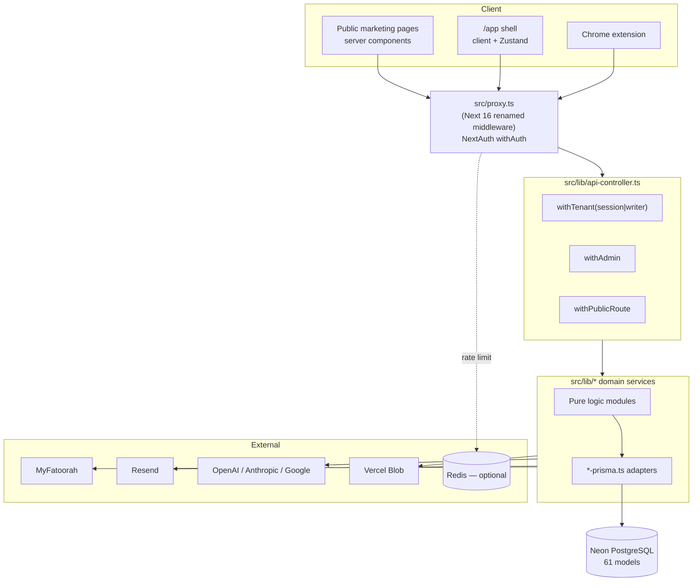

# ArabClue — Consolidated Architecture Map

Audit date: 2026-08-22. Commit: `5a3ef50` plus 23 uncommitted working-tree files.

This document is the connective tissue between subsystems. Per-file detail
(purpose, exports, importers, I/O contracts, edge cases) lives in
[`subsystems/`](./subsystems/); this file explains how those pieces compose.

---

## 1. What the system is

A single Next.js 16 (App Router, Turbopack) B2B SaaS application. Saudi and Gulf
companies use it to respond to government tenders: ingest a tender pack, analyse
compliance, qualify the bid, draft a bilingual proposal and contract, route them
through review, export a submission package, and pay by subscription.

There is exactly **one deployable service**. `mini-services/` is empty and
`examples/` is sample code; neither participates in the build.

| Dimension | Value |
| --- | --- |
| Source files (`src/`) | 772 (566 `.ts`, 201 `.tsx`, 3 `.css`) |
| Source lines | ~193,400 |
| API route files | 136 |
| Prisma models | 61 (168 `@@index`, 27 `@@unique`) |
| Prisma migrations | 20, in sync with the migration registry |
| Test files / tests | 184 files / 3,840 offline + 64 Chromium-gated |
| Default locale | Arabic (RTL); English secondary |

### Stack

Next.js 16 · React 19 · TypeScript (strict, `ignoreBuildErrors: false`) ·
Prisma 6 → PostgreSQL (Neon) · NextAuth v4 (credentials + JWT) · Zod v4 ·
Tailwind v4 + shadcn/Radix · Zustand · TanStack Query · Vercel AI SDK v7 ·
Playwright (HTML→PDF) · exceljs / pptxgenjs / jszip · Resend · MyFatoorah ·
optional Redis · bun (package manager **and** test runner).

---

## 2. Runtime topology



### Request lifecycle

1. **`src/proxy.ts`** — Next.js 16 renamed `middleware.ts` to `proxy.ts`; there is
   no `middleware.ts` in this repo. Wraps every non-public path in NextAuth
   `withAuth` and enforces, in order: unauthenticated `/app` redirect with a signed
   `return-to` cookie → `mustChangePassword` gate → `emailVerified` gate →
   `/api/admin` role gate.
2. **`src/lib/api-controller.ts`** — the single request boundary. Resolves the
   session, derives tenancy, validates input with Zod, and maps every failure
   through one bilingual `ApiFailure` contract. Route handlers are not supposed to
   build their own error bodies.
3. **Domain service** in `src/lib/`, which takes `workspaceId` as a mandatory
   argument rather than reading it from ambient state.
4. **Prisma** against Neon.

Three auth helpers matter and are not equivalent:

| Helper | Session | MFA step-up | `mustChangePassword` | Email verified | Role |
| --- | :-: | :-: | :-: | :-: | --- |
| `requireSession()` | yes | **yes** | **yes** | **yes** | — |
| `requireWriter()` | yes | yes | yes | yes | rejects `REVIEWER` |
| `requireAdmin()` | yes | yes | yes | yes | `ADMIN`/`SUPER_ADMIN` |
| `getServerSession()` *(raw)* | yes | **no** | **no** | **no** | — |

Routes calling `getServerSession` directly are genuinely weaker, not merely
stylistically inconsistent.

---

## 3. Tenancy model

Tenancy is **derived, never supplied**. `getTenantContext(userId)` reads the
active workspace from a `WorkspaceMember` row; `User.activeWorkspaceId` is treated
as a preference that must still match a real membership.

Two role systems coexist and the helpers mix them:

- **Platform role** — `User.role`: `SUPER_ADMIN`, `ADMIN`, `REVIEWER`, others.
- **Workspace role** — `WorkspaceMember.role`: `OWNER`, `ADMIN`, member.

33 of 61 models carry `workspaceId` directly; the rest are scoped transitively
through a project, proposal, or mission. 33 of 34 tenant-scoped models lead an
index with `workspaceId` (`BrandProfile` is the exception).

---

## 4. Subsystem map

| Subsystem | Entry points | Core modules | Detail |
| --- | --- | --- | --- |
| **Auth & identity** | `api/auth/**`, `proxy.ts` | `auth.ts`, `password.ts`, `mfa.ts`, `token-digest.ts`, `account-service*`, `recovery-service*` | [lib-core](./subsystems/map-lib-core.md) |
| **Tenancy & authz** | `api-controller.ts` | `workspace-context.ts`, `quotas.ts`, `guardrails.ts`, `invitation-service*` | [lib-core](./subsystems/map-lib-core.md) |
| **Domain API** | 64 routes under `api/` | contracts, proposals, documents, clauses, marketplace, collaboration | [api-domain](./subsystems/map-api-domain.md) |
| **AI agents** | `api/agents/**`, `api/platform-agent/**`, `api/ai/**` | `agents/orchestrator.ts`, `agents/platform/tools.ts`, `llm/index.ts` | [agents-ai](./subsystems/map-agents-ai.md) |
| **Document generation** | `api/proposals/[id]/download` | `bilingual-layout.tsx`, `layout-sync.ts`, `pdf/html-to-pdf.ts`, `proposal-layout-export.ts` | [documents](./subsystems/map-documents.md) |
| **Billing** | `api/billing/**`, `api/admin/billing/**` | `billing.ts`, `myfatoorah.ts`, `recurring-billing*.ts` | [lib-core](./subsystems/map-lib-core.md) |
| **Frontend** | `src/app/**`, `src/components/**` | `store.ts`, `dashboard-routes.ts`, `app-route-resolver.ts`, `use-view-router.ts` | [frontend](./subsystems/map-frontend.md) |
| **i18n & domain rules** | — | `i18n.ts`, `procurement-rules.ts`, `qualification.ts`, `rag.ts`, `analytics-collector.ts` | [lib-domain](./subsystems/map-lib-domain.md) |
| **Tests, schema, ops** | `prisma/`, `scripts/`, `.github/` | `schema.prisma`, `check-deployment-safety.mjs`, `document-quality.yml` | [tests-ops](./subsystems/map-tests-ops.md) |

---

## 5. Cross-subsystem flows

### 5.1 Tender → submission package

```
Upload (api/documents)
  → storage.ts (Vercel Blob | local fs, workspace-scoped paths)
  → document-chunks.ts (chunk, embed, persist)
  → api/agents/run
      → scheduleAgentPipeline  [wraps after() so work survives response flush]
      → orchestrator.ts: Ingestion → Compliance → Technical → Financial
                         → Drafting → Law/Contract
      → each agent: deterministic rule pass first, optional LLM enrichment second
  → GeneratedProposal (+ ProposalVersion, structuredSnapshot + hash)
  → api/reviews  → decideProposalReview (5 preconditions, one transaction)
  → api/proposals/[id]/download
      → document-export-guard (admission control)
      → proposal-layout-export → bilingual AST → bilingual-pdf → html-to-pdf
      → PDF / XLSX / PPTX / ZIP + export manifest
```

The pipeline runs with **zero LLM API keys configured** — `generateCompletion`
returns `fallback: true` and every caller substitutes deterministic output. This
is the single best design decision in the codebase and should be preserved by any
change.

### 5.2 Payment

```
api/billing/checkout → MyFatoorah hosted page
  → api/billing/callback  (user-facing return; rate limited)
  → api/billing/webhook   (authoritative; HMAC-verified, public path)
      → PaymentWebhookEvent row keyed on fingerprint  [idempotency]
      → fulfillCheckout: amount + currency verified against stored order
      → Subscription / BillingRecord
  → cron/billing-reconcile (daily 05:15) reconciles PENDING against provider
```

### 5.3 Document rendering security boundary

`pdf/html-to-pdf.ts` is the only Chromium boundary and it is hardened:
`javaScriptEnabled: false`, service workers blocked, content installed via
`setContent` on `about:blank`, and **every network request aborted**
(`page.route("**/*", route.abort("blockedbyclient"))`). SSRF and `file://` reads
are therefore closed at the renderer.

Two engines feed it. The **structured engine** validates into an immutable AST
(`bilingual-layout.tsx: parseBilingualDocument`) and accepts no raw HTML — this is
the security boundary and it holds. The **legacy engine** (`generators.ts`) builds
HTML by string concatenation and is still on the live PDF download path.

---

## 6. Testing and verification topology

`bun test` cannot reach a database or a provider by accident. The preload at
`src/lib/__tests__/support/completion-test-preload.ts` strips 19 provider
credentials, repoints `DATABASE_URL` at an unreachable port-1 loopback, and
patches `fetch` to throw on any non-loopback host.

The architecture splits each service into **pure logic** + a **`*-prisma.ts`
adapter**. The pure halves are tested exhaustively against hand-written fakes
(~40 fast-check property tests, pinned seed, 100-run floor). Every adapter is
untested — which is where the confirmed `NotificationDelivery` production bug
hid, because the test fake models a database shape that does not exist.

CI (`.github/workflows/document-quality.yml`) runs four jobs: document-quality
gate, then lint + full offline suite + production build + `bun audit --prod`,
then live Chromium PDF/visual/performance, then a Chromium/Firefox/WebKit matrix.

### Verified baseline (2026-08-22, before any change)

| Check | Result |
| --- | --- |
| `bunx tsc --noEmit` | pass, 0 errors |
| `bun run lint` | pass, 0 errors |
| `bun run test` | 3840 pass / 13 skip / 0 fail — 184 files, 91,157 assertions, 96s |
| Chromium PDF + bilingual suites | 64 pass / 0 fail |

---

## 7. The dominant architectural pattern

The single most important observation across all eight subsystems:

> **This codebase's risk is not missing safeguards. It is safeguards that exist
> but are not uniformly applied.**

In every high-severity finding, the correct implementation is already present
somewhere in the repository and a parallel call path bypasses it.

| Safeguard that exists | Bypassed by |
| --- | --- |
| `assertWorkspaceMatch` (`api/agents/run`) | autopilot route trusts `body.activeProjectId` |
| live `getPaymentStatus` verification (legacy reconcile path) | bulk path trusts client `providerResult` |
| escaping `markdownToHtml` (`lib/markdown.ts`) | hand-rolled unescaped duplicate in `proposal-builder-preview.tsx` |
| base64-embedded fonts (structured engine) | remote Google Fonts `<link>` in `generators.ts` |
| `REMOTE_FONT_REQUEST` inspector (`bilingual-pdf.ts`) | only runs on the structured path |
| `scheduleAgentPipeline` (wraps `after()`) | three `void runAgentPipeline(...)` call sites |
| `useNavigateToView` | ~50 direct `setView` calls; the hook has zero consumers |
| `logical-css-integrity` test | its `roots` array omits `marketing/`, `documents/`, `src/app` |
| URL allowlisting (`myfatoorah.ts`) | admin-set `apiBase` in `llm/index.ts` |
| `withTenant` / `requireSession` | routes calling `getServerSession` directly |
| Zod `inputSchema` on agent tools | `realtime.ts` calls `tool.execute()` directly |

The remediation strategy follows directly: **delete the bypass and route the call
site through the existing helper**, then add a guard test per category so a future
bypass fails CI instead of shipping. That is low-risk and behaviour-preserving,
which matters given a green 3,904-test baseline.
