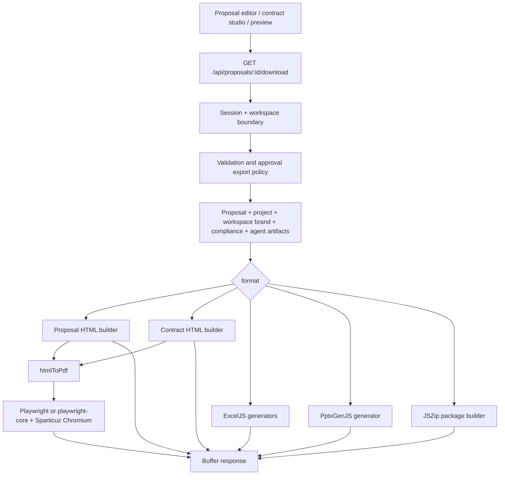
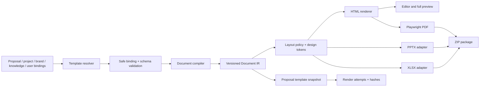
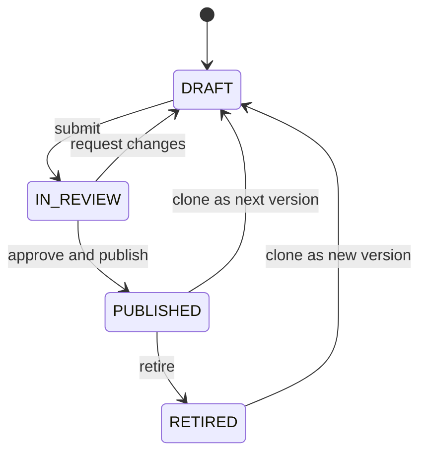

# Arabclue Document Generation Architecture

**Status:** Proposed architecture

**Date:** 2026-07-24

**Scope:** Proposals, contracts, business profiles, HTML/PDF preview, PPTX, XLSX, and ZIP packages

**Implementation status:** Design only; this document does not change the database or production runtime

## Executive summary

Arabclue already has a working document export pipeline, but it is a set of
format-specific generators rather than a reusable document system. Proposal,
contract, business-profile, spreadsheet, slide, and package exporters each own
their own structure and styling. Branding helpers are shared, and HTML is shared
with PDF, but the content model, layout rules, and bilingual rules are not.

The recommended architecture keeps the existing Next.js modular monolith,
Prisma/Postgres persistence, Playwright PDF renderer, ExcelJS, PptxGenJS, and
JSZip. It introduces a typed document intermediate representation (Document
IR), immutable versioned templates, a safe binding engine, shared layout tokens,
and channel adapters. The same compiled HTML must drive editor preview, HTML
download, and PDF generation.

The most important design decisions are:

1. Store template definitions and immutable versions, not arbitrary executable
   HTML or Handlebars-like code.
2. Represent Arabic and English as aligned semantic content pairs with stable
   keys, not as two unrelated Markdown documents.
3. Publish templates and clauses as immutable versions. Every generated
   document snapshot pins the exact versions, bindings, and layout tokens used.
4. Build one shared HTML layout path for preview and PDF, while using explicit
   token adapters for PPTX and XLSX.
5. Treat Saudi-oriented contract content as counsel-reviewed drafting material.
   The platform must not label a template or clause legally compliant solely
   because it exists in the library.

The implementation should be incremental. Existing proposals and contracts
continue to render through legacy adapters until output parity is proven.

## 1. Goals, constraints, and non-goals

### 1.1 Functional goals

- Render Arabic, English, or bilingual documents from one structured source.
- Support parallel, Arabic-first serial, English-first serial, and single-language
  layouts.
- Provide at least six reusable Saudi-oriented contract template families.
- Provide multiple professional proposal layout presets.
- Apply one universal set of page, typography, color, spacing, table, and
  accessibility standards across output channels.
- Let workspace administrators create, preview, review, publish, clone, retire,
  and assign defaults for templates.
- Preserve the template version, clause versions, bindings, content, and design
  tokens used for every generated version.
- Keep current export validation, approval, audit, and tenant boundaries.

### 1.2 Repository constraints

- The product is one Next.js 16 App Router application; no new microservice is
  justified for the first implementation.
- The dashboard is a Zustand view switcher under `/app`, not a collection of
  child routes. Template management must be added as a dashboard view.
- Prisma targets the existing remote Postgres database.
- Existing generation libraries remain in use:
  Playwright/Chromium for PDF, ExcelJS for XLSX, PptxGenJS for PPTX, and JSZip
  for packages.
- Existing proposal and contract records and download URLs must remain readable
  during migration.
- Database changes must be delivered through reviewed migrations. Do not use
  `prisma db push` or reset the shared database.

### 1.3 Non-goals

- A general-purpose desktop publishing application.
- Arbitrary user JavaScript, CSS, remote scripts, or server-side code in
  templates.
- Perfect visual identity across HTML, PDF, PPTX, and XLSX; the target is
  semantic and token parity within each format's capabilities.
- Automated legal approval or a claim that generated contracts are legal advice.
- A job queue before measured load or timeout data demonstrates that synchronous
  generation is insufficient.

## 2. Evidence-based current-state analysis

### 2.1 Source map

| Current concern | Source of truth | Current responsibility |
| --- | --- | --- |
| Export orchestration | [`src/app/api/proposals/[id]/download/route.ts`](../src/app/api/proposals/%5Bid%5D/download/route.ts) | Authentication, workspace check, validation policy, data loading, format dispatch, audit, export status |
| Proposal HTML/PDF | [`src/lib/generators.ts`](../src/lib/generators.ts) | Locale selection, proposal layout, Markdown conversion, PDF options |
| XLSX/PPTX/slides/ZIP | [`src/lib/generators.ts`](../src/lib/generators.ts) | Format-specific structure, style, metadata, package assembly |
| Contract HTML/PDF/ZIP | [`src/lib/contract-export.ts`](../src/lib/contract-export.ts) | Bilingual article layout and contract package |
| Contract parsing | [`src/lib/contract-format.ts`](../src/lib/contract-format.ts) | Regex-based article parsing and serialization |
| Shared PDF runtime | [`src/lib/pdf/html-to-pdf.ts`](../src/lib/pdf/html-to-pdf.ts) | Local/serverless browser launch, HTML loading, PDF bytes |
| Shared brand chrome | [`src/lib/letterhead.ts`](../src/lib/letterhead.ts) | Font mapping, company name, letterhead, PDF header/footer |
| Markdown rendering | [`src/lib/markdown.ts`](../src/lib/markdown.ts) | Line-oriented Markdown-to-HTML conversion and escaping |
| Proposal editor | [`src/components/dashboard/proposal-editor.tsx`](../src/components/dashboard/proposal-editor.tsx) | Markdown editing, locale choice, versions, validation, preview/export |
| Contract studio | [`src/components/dashboard/contract-studio.tsx`](../src/components/dashboard/contract-studio.tsx) | Parsed bilingual preview, editing, versions, obligations |
| Document preview | [`src/components/dashboard/document-preview-frame.tsx`](../src/components/dashboard/document-preview-frame.tsx) | Sandboxed HTML preview and PDF blob preview |
| Persistence | [`prisma/schema.prisma`](../prisma/schema.prisma) | Workspaces, brands, proposals, versions, approvals, reviews, obligations |
| Unintegrated token prototype | [`src/lib/design-tokens.ts`](../src/lib/design-tokens.ts) | Untracked token types, defaults, and CSS-variable generation |
| Unintegrated layout prototype | [`src/lib/document-layout.ts`](../src/lib/document-layout.ts) | Untracked page/header/footer helpers |
| Unintegrated typography prototype | [`src/lib/typography.ts`](../src/lib/typography.ts) | Untracked locale formatting and font helpers |
| Unintegrated token CSS | [`src/app/design-tokens.css`](../src/app/design-tokens.css) | Untracked CSS variables not imported by the active application |

This analysis describes the current working tree. It does not claim measured
runtime performance; no benchmark suite currently establishes generation
latency, throughput, or memory use.

### 2.2 Unintegrated working-tree design scaffolding

Four untracked design-system files appeared in the working tree during this
analysis: `design-tokens.ts`, `document-layout.ts`, `typography.ts`, and
`design-tokens.css`. They are relevant prototypes, but repository-wide import
search shows no active generator, component, or global stylesheet consuming
them. Their comments reference separate `part2` design notes, and they currently
overlap existing helpers in `letterhead.ts`.

They should therefore be treated as unintegrated work in progress, not as the
current production layout engine. Phase 1 must review and either adapt these
files into the proposed document-engine token boundary or supersede them. The
repository must not retain two competing font, locale-formatting, header/footer,
or token systems.

### 2.3 Current request and rendering flow



The route is the effective application service. It loads all inputs, evaluates
the export policy, chooses a generator, writes an audit record, and may change
the proposal status to `EXPORTED`. Generators return in-memory `Buffer` objects.

### 2.4 What is already strong

- Export requests enforce session and workspace membership before returning
  artifacts.
- Validation and approval policy checks occur before final export.
- Proposal HTML is reused for PDF rather than maintaining a separate PDF
  document tree.
- Contract HTML is reused for contract PDF.
- Branding helpers centralize company-name resolution, brand colors, font
  mapping, letterhead, and PDF header/footer.
- User-supplied Markdown text is escaped before the supported formatting rules
  are applied.
- Brand logos are inlined before PDF generation where possible.
- Export packages include validation reports, manifests, hashes, source
  Markdown, and contract obligations.
- Proposal content and contract content have version records.
- The UI provides HTML and PDF preview modes instead of forcing a download.

### 2.5 Current architectural limitations

#### Presentation is duplicated

`generators.ts`, `contract-export.ts`, and `business-profile.ts` each define
their own HTML shell and CSS. XLSX and PPTX define separate hard-coded color,
font, spacing, and content rules. A brand helper is shared, but a document
component or integrated layout system is not. The untracked design-token and
layout prototypes are not imported by these renderers.

#### Content and layout are coupled

Proposal Markdown is converted directly to HTML inside the proposal shell.
Contract Markdown is parsed directly into article cards. PPTX slides and XLSX
worksheets are constructed independently. There is no typed document tree that
can be validated once and rendered in several channels.

#### Preview is not always the editor's current state

The rich editor's split preview renders the unsaved Markdown locally, using the
Markdown helper and a letterhead. The full document preview fetches saved HTML
from the download route. Its request does not include the editor's unsaved
locale or content. Therefore:

- split preview is current but is not the full export shell;
- full preview matches the export shell but can lag unsaved edits;
- PDF matches saved server state and may differ from split preview.

#### PDF launch is request-scoped

`htmlToPdf` launches and closes a browser for each call. It also waits for
`networkidle` and the generated HTML references Google Fonts. This is correct
but makes font/network availability and browser startup part of every render.
Performance impact has not been benchmarked.

#### The format matrix is inconsistent

| Capability | Proposal HTML/PDF | Contract HTML/PDF | PPTX/slides | XLSX |
| --- | --- | --- | --- | --- |
| Brand colors | Yes | Yes | Yes | Primary only |
| Brand font | Yes | Yes | Mapped Office font | No cell font standard |
| Arabic/English mode | Whole-document switch | Paired articles | Mostly English with some Arabic labels | English labels; sheet view is LTR |
| Shared layout components | No | No | No | No |
| Preview/export same renderer | Full HTML preview only | Full HTML preview only | HTML slides differ from PPTX implementation | No |
| Version-pinned template | No | No | No | No |

#### Rendering is memory-bound

PDF, XLSX, PPTX, and ZIP paths materialize complete buffers. ZIP generation
also holds child artifacts while assembling the package. This is acceptable for
current unknown volume, but document-size limits and telemetry are missing.

### 2.6 Current bilingual rendering

#### Proposal path

- `GeneratedProposal.locale` is a string documented as `ar | en`.
- `resolveLocale` accepts only `ar` and `en`; every proposal export has one root
  `lang` and `dir`.
- `markdownToHtml` has no bilingual node type, alignment key, translation
  status, or mixed-direction value handling.
- Project and company names can choose Arabic fields, but proposal body content
  remains one Markdown stream.
- The slide HTML root is `lang="en"` and most labels are English even when
  Arabic text is shown as a subtitle.
- Compliance and BoQ workbooks use English worksheet and column labels and do
  not switch to a right-to-left worksheet.

#### Contract path

The law-contract path emits a custom Markdown convention:

```text
### Article N — English title | المادة N — العنوان العربي
:::en
English body
:::
:::ar
Arabic body
:::
```

`parseContractArticles` recognizes this structure with one regular expression.
The HTML renderer produces the English cell first and Arabic cell second in a
fixed 50/50 CSS grid. Each cell has explicit `lang` and `dir` attributes. The
dashboard studio also displays paired article cells and can switch to one
language.

This is a useful first bilingual model, but it has important constraints:

- Parsing depends on exact headings, separators, marker order, and newlines.
- Article bodies are plain escaped text; nested lists, tables, cross-references,
  signature blocks, and clause-level metadata are not represented.
- Pair completeness is validated after parsing rather than guaranteed by the
  authoring data model.
- Alignment exists only at article level.
- Page-break behavior applies `break-inside: avoid` to a complete article; a
  long article may not paginate gracefully.
- Fixed 50/50 columns cannot be selected per template or section.
- There is no explicit legal-language precedence field.
- Mixed-direction values such as CR numbers, URLs, dates, clause identifiers,
  and English product names inside Arabic prose are not isolated with `<bdi>`.

### 2.7 Current persistence and template-storage gap

The relevant existing models are:

| Model | Useful current fields | Gap for template architecture |
| --- | --- | --- |
| `Workspace` | Tenant identity, company names, CR/VAT | No template ownership/default relations |
| `BrandProfile` | Logo, colors, font, bilingual taglines | Multiple rows are allowed; export selects the first profile without an explicit active/default field |
| `GeneratedProposal` | Type, status, version, Markdown, locale, artifact and financial JSON strings | No template version, layout preset, bindings, structured bilingual content, or render snapshot |
| `ProposalVersion` | Proposal version, Markdown, locale, changelog | Does not pin template, clauses, bindings, or design tokens |
| `ContentLibraryItem` | Approved workspace Markdown boilerplate | Not versioned as immutable clauses; no typed variables or provenance |
| `AuditLog` | Action, resource, details, timestamp | Can record template actions but does not replace template versioning |
| `ProposalReview` / `ApprovalPolicy` | Review workflow | Can be reused, but no template publication workflow exists |

There are no models named for document templates, template versions, clauses,
layout presets, template defaults, template instances, or render attempts.
`artifactsJson` and other flexible data are stored as strings, requiring
application parsing and preventing normal JSONB queries.

## 3. Target architecture

### 3.1 Architectural style

Use a **modular document engine inside the existing Next.js application**. The
engine is a library boundary, not a new deployable service.



### 3.2 Proposed module boundary

```text
src/lib/document-engine/
  schema.ts                 Zod schemas and inferred TypeScript types
  ir.ts                     Document IR and block unions
  bind.ts                   Safe data binding and missing-value diagnostics
  bilingual.ts              Pairing, direction, precedence, locale formatting
  compile.ts                Template definition to immutable Document IR
  tokens.ts                 Universal token schema and defaults
  validate.ts               Structural, bilingual, brand, and output checks
  render-html.ts            Shared semantic HTML renderer
  render-css.ts             Screen and print CSS from tokens
  render-pptx.ts            Token-to-PptxGenJS adapter
  render-xlsx.ts            Token-to-ExcelJS adapter
  legacy/
    proposal-markdown.ts    Existing proposal adapter
    contract-markers.ts     Existing contract parser adapter
src/lib/template-catalog/
  system-templates/         Code-reviewed seed definitions
  system-clauses/           Code-reviewed seed clause families
  repository.ts             Tenant-scoped template persistence
  publishing.ts             Review, hash, publish, clone, retire
```

`html-to-pdf.ts`, `letterhead.ts`, `export-manifest.ts`, and the current output
libraries remain in place and are called by the new adapters.

### 3.3 Document IR

The IR must be content-oriented. It must not contain arbitrary HTML or runtime
functions.

```ts
type LanguageMode = "AR" | "EN" | "BILINGUAL";
type BilingualLayout = "PARALLEL" | "SERIAL_AR_FIRST" | "SERIAL_EN_FIRST";

type Localized<T> = {
  ar?: T;
  en?: T;
  precedence?: "AR" | "EN" | "EQUAL" | "UNSPECIFIED";
  translationStatus?: "MISSING" | "DRAFT" | "REVIEWED" | "APPROVED";
};

type DocumentIR = {
  schemaVersion: 1;
  documentKind:
    | "PROPOSAL"
    | "CONTRACT"
    | "BUSINESS_PROFILE"
    | "COMPLIANCE_MATRIX"
    | "BOQ";
  languageMode: LanguageMode;
  bilingualLayout?: BilingualLayout;
  metadata: {
    title: Localized<string>;
    subject?: Localized<string>;
    templateVersionId: string;
    proposalId?: string;
    proposalVersion?: number;
    generatedAt: string;
  };
  sections: DocumentSection[];
};

type DocumentSection = {
  key: string;
  role:
    | "COVER"
    | "TOC"
    | "CONTENT"
    | "SCHEDULE"
    | "APPENDIX"
    | "SIGNATURES";
  title?: Localized<string>;
  pagePolicy?: {
    breakBefore?: boolean;
    keepHeadingWithFirstBlock?: boolean;
    startOnOddPage?: boolean;
  };
  blocks: DocumentBlock[];
};

type DocumentBlock =
  | RichTextBlock
  | PairedContentBlock
  | TableBlock
  | KeyValueBlock
  | KpiBlock
  | TimelineBlock
  | CalloutBlock
  | ImageBlock
  | SignatureBlock
  | PageBreakBlock;
```

Every block has a stable `key`, semantic `role`, optional source references, and
an explicit sensitivity classification. Renderers decide presentation from
block type and tokens.

### 3.4 Safe binding model

Templates declare typed variables in JSON Schema-compatible data:

```ts
type TemplateVariable = {
  key: string;
  type:
    | "STRING"
    | "RICH_TEXT"
    | "NUMBER"
    | "MONEY"
    | "PERCENT"
    | "DATE"
    | "BOOLEAN"
    | "ENTITY"
    | "LIST";
  label: Localized<string>;
  required: boolean;
  sourcePolicy:
    | "PROJECT"
    | "WORKSPACE"
    | "BRAND"
    | "APPROVED_KNOWLEDGE"
    | "USER_ENTRY"
    | "DERIVED";
  format?: string;
  validation?: Record<string, unknown>;
};
```

Bindings use path references such as `project.title`,
`workspace.crNumber`, and `input.contractValue`. Conditions and loops are
represented as validated AST nodes with allow-listed operators. There is no
`eval`, dynamic import, arbitrary helper registration, or raw server-side
template execution.

Unknown variables are compile errors for publication and render errors for
required instance values. Optional missing values remove the owning block or
render a configured neutral state; unresolved `{{...}}` text must never reach a
final export.

### 3.5 Compile and render lifecycle

1. Resolve the permitted template version for the workspace and document kind.
2. Load its exact clause versions and design tokens.
3. Validate variable definitions, block schema, and template lifecycle state.
4. Collect values from approved sources and explicit user entry.
5. Bind values and produce diagnostics.
6. Compile a canonical, immutable Document IR.
7. Validate bilingual completeness, source policy, legal-review flags, and
   output constraints.
8. Save a template snapshot for the proposal version.
9. Render preview or requested artifact from the saved snapshot.
10. Hash the snapshot and artifact, write a render-attempt record, and include
    both in the export manifest.

Final export is blocked when required values are missing, a required bilingual
pair is incomplete, a pinned clause is no longer approved for use, or the
existing proposal validation policy blocks export.

## 4. Bilingual layout engine

### 4.1 Language semantics

Language mode and layout mode are separate:

- `AR`: Arabic content only.
- `EN`: English content only.
- `BILINGUAL + PARALLEL`: English on the physical left and Arabic on the
  physical right unless a template explicitly declares another approved policy.
- `BILINGUAL + SERIAL_AR_FIRST`: Arabic block followed by its English pair.
- `BILINGUAL + SERIAL_EN_FIRST`: English block followed by its Arabic pair.

HTML preview may additionally offer language tabs, but tabs are a viewer
control, not a persisted print layout and never hide a language in PDF.

### 4.2 Pairing and alignment

Every bilingual unit uses one semantic key:

```ts
type PairedContentBlock = {
  type: "PAIRED_CONTENT";
  key: string;
  alignmentKey: string;
  content: Localized<RichTextNode[]>;
  requiredLanguages: Array<"AR" | "EN">;
  layout?: {
    columnRatio?: [number, number];
    serialOnNarrowScreen?: boolean;
  };
  sourceRefs?: Array<{
    documentId: string;
    sectionRef?: string;
    pageRef?: string;
  }>;
};
```

The editor highlights both members of a pair together. Validation reports
missing, stale, or unreviewed translations by `alignmentKey`. Reordering moves
the pair as a unit.

### 4.3 Direction and mixed content

- Apply `lang` and `dir` at the smallest meaningful block.
- Use CSS logical properties (`margin-inline-start`, `border-inline-end`) rather
  than left/right properties for content styling.
- Wrap injected names, identifiers, dates, URLs, emails, model numbers, and
  amounts in `<bdi dir="auto">`.
- Apply `unicode-bidi: isolate` to variable values.
- Format dates, numbers, and money with an explicit locale and currency; do not
  infer currency from the interface locale.
- Keep digits as a template option (`latn` or Arabic-Indic), because tender
  requirements can differ.
- Mirror directional icons and process arrows only when their meaning is
  directional. Logos, charts with chronological axes, signatures, and data
  values are not automatically mirrored.

### 4.4 Parallel print layout and pagination

Parallel output is rendered as a sequence of paired grid rows, not two
independent full-height columns:

```html
<section class="pair" data-alignment-key="scope.1">
  <div class="pair-en" lang="en" dir="ltr">...</div>
  <div class="pair-ar" lang="ar" dir="rtl">...</div>
</section>
```

This keeps corresponding clauses close without unreliable scroll-ratio logic.
The compiler segments large rich-text bodies at paragraph, list-item, and table
row boundaries. Each segment retains the same alignment key plus a fragment
number.

Print rules:

- keep a section heading with its first content fragment;
- keep short callouts, captions, and signatures together;
- allow long paired content to split at compiler-created boundaries;
- repeat table headers after page breaks;
- never apply `break-inside: avoid` to an unbounded article;
- insert an explicit continuation label when a paired clause crosses a page;
- use a serial layout when the minimum readable column width cannot be
  maintained on the selected paper size.

### 4.5 Screen behavior

- Desktop preview defaults to the template's persisted layout.
- Narrow screens switch parallel pairs to serial display without changing the
  persisted print choice.
- Hovering or focusing one pair highlights its counterpart.
- The editor can filter Arabic, English, or both.
- Scroll position is anchored by `alignmentKey`; ratio-based dual-column scroll
  synchronization is not required.
- Screen preview uses the same rendered HTML and CSS token compiler as PDF, with
  only viewer controls layered around it.

### 4.6 Bilingual validation

Publication and export checks include:

- required language present for every required block;
- headings and body pairs have matching keys;
- translation review status meets the template's threshold;
- no repeated or missing article/section numbers;
- all cross-references resolve in both languages;
- all variables render in both languages where a localized label/value is
  required;
- legal precedence is explicitly shown when not `EQUAL`;
- no direction-control characters or unsafe markup are present in user input.

## 5. Contract template system

### 5.1 Governance

Templates are drafting frameworks, not legal determinations. Every system
contract template carries:

- jurisdiction and intended-use metadata;
- language precedence;
- counsel-review requirement;
- source/provenance records with retrieval and review dates;
- applicability notes instead of a single unqualified `mandatory` flag;
- last legal review date and reviewer identity;
- a visible disclaimer in preview and export;
- an expiry/review-by policy that can warn or block publication.

Only a reviewed, published, immutable version can be used for a final contract
export. Workspaces may clone a system template, but a clone becomes a separate
workspace-owned family and does not silently inherit later changes.

### 5.2 Initial template catalog

The initial catalog contains seven families, exceeding the five-template
requirement.

| Key | English / Arabic | Primary use | Core sections | Important optional modules and review focus |
| --- | --- | --- | --- | --- |
| `it-services-v1` | IT Services Agreement / اتفاقية خدمات تقنية المعلومات | Implementation, integration, managed services | Parties, definitions, scope, deliverables, governance, acceptance, service levels, change control, IP, confidentiality, liability, term, termination, disputes, signatures | Data processing, hosting, security schedule, source-code escrow; verify tender SLA and IP position |
| `goods-supply-v1` | Goods Supply Agreement / عقد توريد | Equipment and product supply | Parties, specifications, quantities, price schedule, delivery, inspection, acceptance, title/risk, warranty, defects, termination, signatures | Incoterms, import/customs, spare parts, performance security; verify tender delivery and penalty language |
| `professional-services-v1` | Professional Services Agreement / اتفاقية خدمات استشارية | Consulting and advisory engagements | Scope, team, milestones, dependencies, client duties, acceptance, fees schedule, confidentiality, work product, conflicts, termination | Time-and-materials or milestone schedule; verify professional licensing and deliverable ownership |
| `nda-v1` | Mutual/Unilateral NDA / اتفاقية عدم الإفصاح | Pre-tender, partner, and vendor information sharing | Parties, purpose, definition, exclusions, permitted use, recipients, required disclosure, security, return/destruction, term, remedies, signatures | Mutual vs unilateral, personal data, cross-border disclosure; verify scope and survival period |
| `subcontract-v1` | Subcontractor Agreement / اتفاقية مقاول من الباطن | Prime/subcontractor delivery | Prime reference, subcontract scope, flow-down register, schedule, acceptance, reporting, compliance, personnel, payment, indemnity, termination, handover | Named flow-down clauses, insurance, bonding, site rules; verify that prime obligations are actually available |
| `framework-calloff-v1` | Framework and Call-Off Agreement / اتفاقية إطارية وأوامر شراء | Recurring services or supplies | Framework scope, ordering procedure, precedence, pricing schedule, call-off form, service levels, governance, caps, term, exit | Minimum commitment, exclusivity, indexation, multiple suppliers; verify each call-off authority |
| `saas-data-v1` | SaaS Subscription and Data Schedule / اشتراك برمجيات وملحق بيانات | Cloud software subscriptions | Subscription, users, acceptable use, service levels, support, security, data roles, confidentiality, fees, IP, suspension, exit/export, signatures | Data-processing schedule, subprocessors, residency/transfer, business continuity; verify actual hosting and security evidence |

No seeded clause should contain tender-specific amounts, penalty percentages,
service levels, dates, or legal conclusions. Those values come from tender
evidence or explicit user entry and remain subject to validation.

### 5.3 Section, clause, and variable composition

A contract template version contains:

- ordered structural sections;
- typed variable definitions;
- pinned clause-version bindings;
- conditional inclusion rules;
- output layout and language policy;
- review policy;
- signature and schedule definitions.

A clause is a reusable family with immutable versions. A binding places a
specific clause version at a specific section key and may declare a safe
condition such as `input.includesPersonalData == true`.

Clause content is structured rich text with bilingual pairs. Provenance is
metadata, not visible legal certainty:

```ts
type ClauseProvenance = {
  jurisdiction: string;
  sources: Array<{
    title: string;
    officialUrl?: string;
    retrievedAt: string;
    sectionRef?: string;
  }>;
  applicability: "GENERAL" | "TENDER_SPECIFIC" | "COUNSEL_DECISION";
  legalReview: {
    status: "UNREVIEWED" | "REVIEWED" | "APPROVED" | "REJECTED";
    reviewedAt?: string;
    reviewerId?: string;
    reviewBy?: string;
    notes?: string;
  };
};
```

### 5.4 Template lifecycle



- Draft versions are editable with optimistic locking.
- Submission freezes editing except for a reviewer-requested return to draft.
- Publication computes a canonical content hash and makes the version immutable.
- Editing a published template creates the next draft version.
- Retirement prevents new instances but never breaks existing pinned snapshots.
- System-template updates never mutate workspace clones.

## 6. Enhanced proposal layouts

### 6.1 Shared proposal information architecture

Proposal templates compose from these modules:

1. Branded cover and tender reference.
2. Letter of submission.
3. Document control and approval table.
4. Executive summary.
5. Understanding of requirements.
6. Compliance and traceability summary.
7. Technical solution and architecture.
8. Delivery methodology and work plan.
9. Governance, risk, quality, and change control.
10. Team and approved evidence.
11. Relevant experience and case studies.
12. Service levels and support.
13. Local-content and Saudization response based on sourced tender facts.
14. Commercial/BoQ handoff without AI-created pricing.
15. Assumptions, dependencies, exclusions, and deviations.
16. Appendices, evidence index, and validation notice.

Modules are included by document kind and tender evidence. Missing evidence is
shown as a diagnostic, not filled with invented content.

### 6.2 Initial layout presets

| Key | Intended use | Visual character | Distinct layout behavior |
| --- | --- | --- | --- |
| `government-formal` | Conservative public-sector submission | Restrained brand band, dense metadata, numbered headings, minimal decoration | A4 portrait, strong document-control table, explicit references, evidence-first appendices |
| `executive-impact` | Leadership and steering review | Larger summaries, KPI cards, concise diagrams, generous whitespace | Executive summary and value outcomes lead; detailed evidence moves to appendix |
| `technical-deep-dive` | Architecture and engineering evaluation | Diagram canvases, decision tables, implementation detail | Landscape inserts allowed for wide diagrams and matrices; numbered technical subsections |
| `compliance-evidence` | Requirement-heavy tender response | Traceability rails, status callouts, source references | Requirement IDs visible in section margins; compliance tables and evidence register dominate |
| `bilingual-parallel` | Formal Arabic-English submission | Equal language weight, neutral grid, explicit precedence | Parallel paired blocks where readable; serial layout for wide tables and detailed diagrams |
| `compact-addendum` | Clarification, deviation, or change submission | Minimal cover, high information density | Short-form control page, change summary, affected clauses, approvals, attachments |

### 6.3 Proposal visual rules

- Cover titles use project and bidder names, never the platform name as author.
- Decorative color never communicates status by itself.
- KPI cards show source, as-of date, and `not available` instead of defaulting to
  a favorable value.
- Requirement and evidence references remain selectable text in PDF.
- Diagrams have a text alternative or accompanying explanation.
- Tables identify repeated headers and units.
- Wide tables switch to landscape pages or appendix sheets; they do not shrink
  below the minimum type size.
- Content modules declare `screen`, `print`, `pptx`, and `xlsx` support so an
  unsupported block fails validation or uses an explicit fallback.

## 7. Universal layout standards

### 7.1 Canonical design tokens

Templates reference semantic tokens and may override only allowed values:

```ts
type DocumentDesignTokens = {
  page: {
    size: "A4" | "LETTER";
    orientation: "PORTRAIT" | "LANDSCAPE";
    marginTopMm: number;
    marginBottomMm: number;
    marginInsideMm: number;
    marginOutsideMm: number;
  };
  color: {
    brandPrimary: string;
    brandSecondary: string;
    brandAccent: string;
    text: string;
    mutedText: string;
    line: string;
    surface: string;
    success: string;
    warning: string;
    danger: string;
  };
  type: {
    arabicFamily: string;
    latinFamily: string;
    basePt: number;
    smallPt: number;
    h1Pt: number;
    h2Pt: number;
    h3Pt: number;
    arabicLineHeight: number;
    latinLineHeight: number;
  };
  spacing: {
    baselineMm: number;
    sectionGapMm: number;
    blockGapMm: number;
    cellPaddingMm: number;
  };
  component: {
    radiusMm: number;
    borderWidthPt: number;
    headerVariant: string;
    footerVariant: string;
    tableVariant: string;
  };
};
```

Token values are validated against readable bounds. Brand colors are accepted
only after contrast checks and are mapped to the closest supported use in Office
formats.

### 7.2 Page and grid

- Default paper: A4 portrait.
- Default body grid: 12 columns; bilingual parallel uses 6 + 6 with a divider.
- Default print margins: 16–20 mm, with reserved header/footer space.
- Use landscape only for declared wide sections, not the whole proposal by
  default.
- Major sections may start on a new page; minor headings stay with the first
  body block.
- Page numbers, document title, bidder, version, confidentiality, and tender
  reference use named header/footer slots.

### 7.3 Typography

- Bundle approved WOFF2 font assets with the application or render package so
  PDF generation is not dependent on a third-party font request.
- Arabic and Latin font families must have comparable weight and x-height.
- Body minimum: 10 pt for print; target 11–12 pt.
- Table minimum: 8.5 pt, with landscape/appendix fallback before further
  shrinking.
- Arabic line height is independently configurable and generally larger than
  Latin line height.
- Use tabular numerals for financial columns and identifiers.
- Never fake Arabic italics; use weight or color hierarchy.

### 7.4 Color and accessibility

- Text/background contrast must meet WCAG AA for digital preview.
- Core content remains understandable in grayscale print.
- Status uses icon/text/label in addition to color.
- Focus order follows DOM order and language controls have accessible names.
- Exported HTML has one `h1`, ordered headings, semantic tables, captions,
  `lang`, and `dir`.
- Images require localized alt text unless explicitly decorative.

### 7.5 Tables, figures, and callouts

- Repeat `<thead>` in printed multi-page tables.
- Keep units in headers, not repeated ambiguously in cells.
- Numeric cells are direction-isolated and aligned by meaning.
- Bilingual narrow tables render as two sequential localized tables unless each
  column remains readable.
- Figures have stable IDs, localized captions, source metadata, and
  cross-reference labels.
- Warnings, assumptions, exclusions, and legal notices use separate semantic
  callout roles.

### 7.6 Output parity contract

Parity means:

- same template version and snapshot hash;
- same section order and identifiers;
- same user-entered values and source references;
- same brand token meanings;
- same validation and disclaimer state.

It does not mean pixel equality across HTML/PDF, PPTX, and XLSX. Each adapter
publishes a capability matrix. A template cannot be published for a channel
when it contains a required unsupported block.

## 8. Database design

### 8.1 Storage principles

- Keep searchable lifecycle, tenancy, ownership, and version fields relational.
- Store validated template definitions, variable schemas, design tokens,
  bindings, and compiled snapshots in Prisma `Json` fields backed by Postgres
  JSONB.
- Store large binary assets in the existing storage abstraction; persist path,
  content type, size, and checksum in Postgres.
- Never mutate a published template or clause version.
- Every tenant-owned row carries `workspaceId` or derives tenant ownership
  through a required parent.
- Use application-level tenant checks consistent with existing routes.

### 8.2 Proposed models

The following is an implementation-oriented schema outline. Relation back-fields
must also be added to `Workspace`, `User`, and `GeneratedProposal`.

```prisma
enum TemplateScope {
  SYSTEM
  WORKSPACE
}

enum TemplateLifecycle {
  DRAFT
  IN_REVIEW
  PUBLISHED
  RETIRED
}

enum DocumentKind {
  PROPOSAL
  CONTRACT
  BUSINESS_PROFILE
  COMPLIANCE_MATRIX
  BOQ
}

enum DocumentLanguageMode {
  AR
  EN
  BILINGUAL
}

enum RenderFormat {
  HTML
  PDF
  PPTX
  XLSX
  ZIP
}

enum RenderStatus {
  QUEUED
  RUNNING
  SUCCEEDED
  FAILED
}

model DocumentTemplate {
  id           String        @id @default(cuid())
  scope        TemplateScope
  ownerKey     String        // "SYSTEM" or workspace id
  workspaceId  String?
  slug         String
  documentKind DocumentKind
  nameJson     Json
  summaryJson  Json?
  active       Boolean       @default(true)
  createdById  String
  createdAt    DateTime      @default(now())
  updatedAt    DateTime      @updatedAt

  workspace    Workspace?    @relation(fields: [workspaceId], references: [id], onDelete: Cascade)
  createdBy    User          @relation(fields: [createdById], references: [id])
  versions     DocumentTemplateVersion[]
  defaults     WorkspaceTemplateDefault[]

  @@unique([ownerKey, slug])
  @@index([workspaceId, documentKind, active])
  @@index([scope, documentKind, active])
}

model DocumentTemplateVersion {
  id                 String             @id @default(cuid())
  templateId         String
  version            Int
  lifecycle          TemplateLifecycle @default(DRAFT)
  languageMode       DocumentLanguageMode
  schemaVersion      Int                @default(1)
  definitionJson     Json
  variablesSchemaJson Json
  designTokensJson   Json
  reviewPolicyJson   Json?
  contentHash        String?
  lockVersion        Int                @default(0)
  createdById        String
  publishedById      String?
  createdAt          DateTime           @default(now())
  updatedAt          DateTime           @updatedAt
  publishedAt        DateTime?
  retiredAt          DateTime?

  template           DocumentTemplate  @relation(fields: [templateId], references: [id], onDelete: Cascade)
  createdBy          User              @relation("TemplateVersionCreator", fields: [createdById], references: [id])
  publishedBy        User?             @relation("TemplateVersionPublisher", fields: [publishedById], references: [id])
  clauseBindings     TemplateClauseBinding[]
  defaults           WorkspaceTemplateDefault[]
  snapshots          ProposalTemplateSnapshot[]

  @@unique([templateId, version])
  @@index([templateId, lifecycle])
  @@index([lifecycle, publishedAt])
}

model ContractClause {
  id           String        @id @default(cuid())
  scope        TemplateScope
  ownerKey     String
  workspaceId  String?
  slug         String
  category     String
  nameJson     Json
  active       Boolean       @default(true)
  createdById  String
  createdAt    DateTime      @default(now())
  updatedAt    DateTime      @updatedAt

  workspace    Workspace?    @relation(fields: [workspaceId], references: [id], onDelete: Cascade)
  createdBy    User          @relation(fields: [createdById], references: [id])
  versions     ContractClauseVersion[]

  @@unique([ownerKey, slug])
  @@index([workspaceId, category, active])
}

model ContractClauseVersion {
  id                   String             @id @default(cuid())
  clauseId             String
  version              Int
  lifecycle            TemplateLifecycle @default(DRAFT)
  contentJson          Json
  variablesSchemaJson  Json
  provenanceJson       Json
  contentHash          String?
  createdById          String
  publishedById        String?
  createdAt            DateTime           @default(now())
  updatedAt            DateTime           @updatedAt
  publishedAt          DateTime?
  retiredAt            DateTime?

  clause               ContractClause     @relation(fields: [clauseId], references: [id], onDelete: Cascade)
  createdBy            User               @relation("ClauseVersionCreator", fields: [createdById], references: [id])
  publishedBy          User?              @relation("ClauseVersionPublisher", fields: [publishedById], references: [id])
  templateBindings     TemplateClauseBinding[]

  @@unique([clauseId, version])
  @@index([clauseId, lifecycle])
}

model TemplateClauseBinding {
  id                String @id @default(cuid())
  templateVersionId String
  clauseVersionId   String
  sectionKey        String
  sortOrder         Int
  required          Boolean @default(false)
  conditionJson     Json?
  overridesJson     Json?

  templateVersion   DocumentTemplateVersion @relation(fields: [templateVersionId], references: [id], onDelete: Cascade)
  clauseVersion     ContractClauseVersion    @relation(fields: [clauseVersionId], references: [id])

  @@unique([templateVersionId, sectionKey, clauseVersionId])
  @@index([templateVersionId, sortOrder])
}

model WorkspaceTemplateDefault {
  id                String @id @default(cuid())
  workspaceId       String
  templateId        String
  templateVersionId String
  documentKind      DocumentKind
  languageMode      DocumentLanguageMode
  createdAt         DateTime @default(now())
  updatedAt         DateTime @updatedAt

  workspace         Workspace               @relation(fields: [workspaceId], references: [id], onDelete: Cascade)
  template          DocumentTemplate        @relation(fields: [templateId], references: [id])
  templateVersion   DocumentTemplateVersion @relation(fields: [templateVersionId], references: [id])

  @@unique([workspaceId, documentKind, languageMode])
  @@index([templateVersionId])
}

model ProposalTemplateSnapshot {
  id                String @id @default(cuid())
  proposalId        String
  proposalVersion   Int
  templateVersionId String
  languageMode      DocumentLanguageMode
  bindingsJson      Json
  documentJson      Json
  designTokensJson  Json
  diagnosticsJson   Json?
  contentHash       String
  createdById       String
  createdAt         DateTime @default(now())

  proposal          GeneratedProposal      @relation(fields: [proposalId], references: [id], onDelete: Cascade)
  templateVersion   DocumentTemplateVersion @relation(fields: [templateVersionId], references: [id])
  createdBy         User                   @relation(fields: [createdById], references: [id])
  renders           DocumentRender[]

  @@unique([proposalId, proposalVersion])
  @@index([templateVersionId])
  @@index([proposalId, createdAt])
}

model DocumentRender {
  id             String       @id @default(cuid())
  workspaceId    String
  snapshotId     String
  format         RenderFormat
  status         RenderStatus @default(QUEUED)
  attempt        Int          @default(1)
  storagePath    String?
  checksum       String?
  sizeBytes      Int?
  durationMs     Int?
  rendererVersion String
  errorCode      String?
  errorMessage   String?
  createdAt      DateTime     @default(now())
  completedAt    DateTime?

  workspace      Workspace               @relation(fields: [workspaceId], references: [id], onDelete: Cascade)
  snapshot       ProposalTemplateSnapshot @relation(fields: [snapshotId], references: [id], onDelete: Cascade)

  @@unique([snapshotId, format, attempt])
  @@index([workspaceId, createdAt])
  @@index([status, createdAt])
}
```

### 8.3 Existing model adjustments

- Add explicit active/default semantics to `BrandProfile`, preferably a unique
  workspace default enforced transactionally or through a partial unique index.
- Add `languageMode` and nullable `activeTemplateVersionId` to
  `GeneratedProposal` for efficient lists while retaining `locale` during
  compatibility.
- Keep `contentMd` as the legacy/editing representation until the structured
  editor is ready.
- Keep `ProposalVersion`; create exactly one `ProposalTemplateSnapshot` for each
  rendered proposal version.
- Convert only new structured fields to Prisma `Json`. Existing JSON strings can
  be migrated separately to reduce rollout risk.

### 8.4 Migration and backfill

1. Add new enums and tables without changing current export behavior.
2. Seed system template families and clauses as drafts.
3. Publish only after schema, security, output, and counsel review.
4. Seed `legacy-proposal-v1` and `legacy-contract-bilingual-v1` adapters.
5. Backfill a snapshot when an existing proposal is first previewed or exported,
   rather than eagerly rewriting all history.
6. Dual-write new proposal versions to Markdown plus a template snapshot.
7. Switch preview first, then HTML, then PDF, then packages behind workspace
   feature flags.
8. Remove legacy-only paths only after parity fixtures and rollback windows pass.

## 9. Template management UI

### 9.1 Navigation

Add `"templates"` to `DashboardView`, the sidebar, translations, and
`VIEW_REGISTRY`. Do not create `/app/templates`; the current dashboard architecture
uses a client-side view switcher. Place Templates after Documents or inside
Settings based on product-owner preference. The recommendation is a dedicated
Templates view because templates are a daily document-production asset.

### 9.2 Information architecture

```text
Templates
├── Catalog
│   ├── System templates
│   ├── Workspace templates
│   ├── Proposal layouts
│   └── Contract templates
├── Clause library
├── Draft reviews
├── Workspace defaults
└── Usage and render health
```

### 9.3 Catalog screen

Filters:

- document kind;
- language mode;
- system/workspace ownership;
- draft/in review/published/retired;
- review freshness;
- default/not default.

Each card or row shows localized name, owner, latest published version, draft
version, languages, last review, usage count derived from snapshots, default
status, and warnings. Primary actions are Preview, Use, Clone, Edit draft,
Submit review, Publish, Set default, and Retire, filtered by permission and
lifecycle.

### 9.4 Template editor

```text
┌──────────────────────────────────────────────────────────────────────┐
│ Name · kind · version · lifecycle · validation · Save · Submit      │
├──────────────┬──────────────────────────────────────┬────────────────┤
│ Structure    │ Bilingual canvas                     │ Inspector      │
│              │                                      │                │
│ Cover        │ Arabic / English paired content      │ Variable       │
│ Summary      │ table, callout, clause, timeline     │ Source policy  │
│ Scope        │ drag blocks; move pair as one        │ Visibility     │
│ Deliverables │                                      │ Page policy    │
│ Signatures   │                                      │ Review status  │
├──────────────┴──────────────────────────────────────┴────────────────┤
│ Diagnostics: missing variable · untranslated pair · contrast · etc. │
└──────────────────────────────────────────────────────────────────────┘
```

Editor tabs:

- **Structure:** sections, order, required state, page policy.
- **Content:** Arabic and English paired rich text.
- **Variables:** types, source policy, validation, sample values.
- **Clauses:** search and pin published clause versions.
- **Layout:** approved tokens and preset selection.
- **Rules:** safe inclusion conditions and supported output channels.
- **Preview:** screen, A4 print, PDF, and sample-data profiles.
- **History:** diffs, reviews, publication, retirement, and audit events.

Preview sample values are isolated fixtures; the browser must not insert another
workspace's production data into a template preview.

### 9.5 Review and publishing UX

- A sticky diagnostics panel separates errors from warnings.
- Submit for review requires a changelog.
- Review shows structural, content, variable, clause-version, and design-token
  diffs.
- Publisher confirms supported channels and a generated preview pack.
- Publication is idempotent and protected by `lockVersion`.
- A published version has no Edit action; only Clone as next version.
- Retire requires a reason and shows affected defaults, but never edits existing
  snapshots.

### 9.6 Permissions

| Action | Workspace MEMBER | Workspace ADMIN/OWNER | Authorized reviewer/publisher |
| --- | --- | --- | --- |
| View/use published templates | Yes | Yes | Yes |
| Create personal/workspace draft | Optional policy | Yes | Yes |
| Edit draft | Own draft if allowed | Yes | Yes |
| Submit for review | If allowed | Yes | Yes |
| Approve legal content | No | No by default | Yes |
| Publish/retire workspace template | No | Yes after required reviews | Yes according to policy |
| Modify system template | No | No | Platform release process only |
| Set workspace default | No | Yes | Yes |

The implementation should reuse existing membership and approval concepts rather
than infer publication authority from global `User.role` alone.

## 10. API design

All endpoints use existing session and tenant helpers, Zod validation, explicit
workspace derivation, and audit logging.

| Method and path | Purpose |
| --- | --- |
| `GET /api/templates` | Tenant-scoped catalog with filters |
| `POST /api/templates` | Create workspace template family or clone |
| `GET /api/templates/:id` | Family, versions, permissions, usage summary |
| `POST /api/templates/:id/versions` | Create next draft from a pinned version |
| `PATCH /api/templates/:id/versions/:version` | Optimistic draft update |
| `POST /api/templates/:id/versions/:version/validate` | Structural and channel validation |
| `POST /api/templates/:id/versions/:version/preview` | Render fixture or authorized instance preview |
| `POST /api/templates/:id/versions/:version/submit` | Submit review |
| `POST /api/templates/:id/versions/:version/publish` | Idempotent immutable publication |
| `POST /api/templates/:id/versions/:version/retire` | Prevent new use |
| `GET /api/clauses` | Tenant-scoped clause catalog |
| `POST /api/clauses/:id/versions` | Create clause draft version |
| `POST /api/template-defaults` | Set a workspace default atomically |
| `POST /api/proposals/:id/template` | Apply a published version and create a new proposal version |

Preview accepts only a template version ID, allowed layout overrides, and a
named fixture or authorized proposal ID. It does not accept executable template
source. Publish revalidates from the database inside a transaction rather than
trusting client diagnostics.

## 11. Security, reliability, and operations

### 11.1 Threat controls

| Threat | Required control |
| --- | --- |
| Stored XSS/template injection | Structured IR, allow-listed rich-text nodes, escaping at renderer boundary, no raw scripts/styles |
| Server-side template execution | Validated AST conditions and formatters; no `eval` or arbitrary helpers |
| Cross-tenant template access | Workspace derived from session; every query scopes owner or permitted system template |
| Asset URL exfiltration/SSRF | Approved storage paths or allow-listed asset fetcher; inline trusted PDF assets |
| Formula injection in XLSX | Escape values beginning with formula control characters unless explicitly numeric/formula typed |
| Path traversal in packages | Fixed artifact names and existing safe filename/ZIP helpers |
| Stale legal source | Review-by metadata, warnings, publication policy, immutable provenance |
| PII in telemetry | Log IDs, timings, sizes, and error codes; never log full bindings or document content |

### 11.2 Failure modes

| Failure | User impact | Behavior and mitigation |
| --- | --- | --- |
| Required variable missing | Incomplete document | Block final export and focus the variable in the editor |
| Arabic/English pair missing | Misleading bilingual output | Block when required; allow explicit single-language mode only |
| Font unavailable | Layout drift/glyph failure | Bundle approved fonts; fail validation when glyph coverage is missing |
| Chromium unavailable | PDF unavailable | Keep HTML preview; return stable error code; preserve current 503 behavior |
| Oversized document | Timeout or memory pressure | Enforce input/page/asset limits; surface diagnostics; add async rendering only if measured |
| Published template changed | Non-reproducible output | Prohibit mutation and render from snapshot |
| Clause review expires | Compliance risk | Warn draft users; policy may block new final exports without invalidating history |
| PPTX/XLSX unsupported block | Missing content | Use declared fallback or block that channel at publication |
| Render succeeds but audit fails | Untracked artifact | Treat final export as failed unless snapshot and render record commit succeeds |
| Concurrent template edits | Lost update | `lockVersion` optimistic concurrency and visible conflict resolution |

### 11.3 Observability

Record structured metrics by renderer version, template version, document kind,
language mode, format, status, page/section count, bytes, and duration:

- compile duration;
- preview duration;
- browser launch and PDF duration;
- artifact size;
- render success/failure code;
- missing-variable count;
- bilingual diagnostic count;
- publish validation failures;
- template usage.

Do not claim service-level performance until a baseline exists.

### 11.4 Proposed acceptance targets

These are implementation targets to be measured with fixed bilingual fixtures,
not current performance claims:

- Template compile: under 500 ms p95 for a 100-section fixture in the CI
  environment.
- Saved HTML preview: visible within 2 seconds p95 in the test deployment for a
  40-page fixture.
- PDF: completes within 15 seconds p95 for the same fixture in the documented
  deployment profile.
- Publication: atomic, idempotent, and produces one immutable hash.
- Reproducibility: same snapshot plus renderer version produces the same
  semantic HTML tree and stable content hash.
- Tenant isolation: cross-workspace reads and writes fail in integration tests.
- Accessibility: no serious automated accessibility violations in template
  catalog, editor shell, or HTML preview fixtures.

## 12. Architecture decisions

### ADR-001: Keep the document engine in the modular monolith

**Status:** Proposed

**Decision:** Implement the engine as modules and route handlers in the existing
Next.js application.

**Alternatives:** A dedicated rendering service; client-only rendering.

**Trade-off:** This minimizes deployment and operational complexity and reuses
current auth/data access. Heavy PDF rendering remains in the web runtime. Extract
a rendering service only after telemetry shows isolation or scaling is needed.

### ADR-002: Use typed Document IR instead of raw HTML templates

**Status:** Proposed

**Decision:** Persist validated structured definitions and compile them to a
typed IR.

**Alternatives:** Handlebars/Liquid strings; React components for every
template; storing complete user HTML.

**Trade-off:** IR requires more initial engineering and migrations, but enables
safe binding, bilingual validation, output adapters, versioning, and
capability checks. Raw template strings are faster to prototype but expand the
injection and compatibility surface.

### ADR-003: Publish immutable template and clause versions

**Status:** Proposed

**Decision:** Published versions cannot be edited. Documents pin versions and a
compiled snapshot.

**Alternatives:** Mutable templates with change history; copy complete template
JSON into every proposal without normalized catalog records.

**Trade-off:** Immutability adds records and publishing workflow, but gives
reproducibility and defensible audit history.

### ADR-004: Use one HTML renderer for full preview and PDF

**Status:** Proposed

**Decision:** Editor full preview, HTML export, and PDF input use the same saved
snapshot and renderer.

**Alternatives:** Separate React preview and string-built PDF; PDF-only preview.

**Trade-off:** Shared HTML sharply reduces drift. The editor may still use a
lightweight instant draft preview, clearly labeled as draft, while the full
preview remains authoritative.

### ADR-005: Use JSONB for validated definitions and relational lifecycle data

**Status:** Proposed

**Decision:** Store schema-flexible IR-related documents as Prisma `Json`, while
keeping ownership, lifecycle, version, review, and foreign keys relational.

**Alternatives:** Fully normalized block/variable tables; JSON strings; external
document database.

**Trade-off:** JSONB avoids a very large polymorphic schema and supports atomic
snapshot storage. It requires strict application validation and is less
convenient for deep relational reporting.

### ADR-006: Bundle document fonts

**Status:** Proposed

**Decision:** Package approved Arabic and Latin fonts for deterministic export.

**Alternatives:** Continue loading Google Fonts at render time; use only system
fonts.

**Trade-off:** Bundled fonts increase deployment assets and require license
tracking, but remove a network dependency and improve glyph/layout consistency.

## 13. Implementation roadmap

### Phase 0: Baseline and fixtures

**Deliverables**

- Capture representative current proposal, contract, business-profile, PPTX,
  XLSX, and ZIP fixtures in Arabic and English.
- Add a bilingual long-clause fixture, wide-table fixture, mixed-direction
  fixture, missing-variable fixture, and unsafe-input fixture.
- Add generation timing and artifact-size telemetry without logging content.
- Record current preview/PDF differences as tests.

**Gate**

- Existing `bun run lint`, `bun run test`, and `bun run build` pass.
- Fixture inputs are scrubbed of secrets and production PII.

### Phase 1: IR, tokens, and HTML renderer

**Deliverables**

- Add `src/lib/document-engine` schemas, compiler, validator, tokens, bilingual
  helpers, and semantic HTML/CSS renderer.
- Reconcile the untracked `design-tokens.ts`, `document-layout.ts`,
  `typography.ts`, and `design-tokens.css` prototypes; reuse validated pieces
  and remove duplicate token/font/layout authorities.
- Bundle approved fonts and define licensing metadata.
- Add legacy adapters for proposal Markdown and contract markers.
- Render new HTML behind a disabled feature flag.

**Gate**

- Unit tests cover every block type, escape boundary, bidi value, pagination
  hint, and missing-value rule.
- Snapshot tests prove stable semantic HTML for fixtures.

### Phase 2: Template persistence and publishing

**Deliverables**

- Add reviewed Prisma migration for template, clause, default, snapshot, and
  render models.
- Add repository and publishing services with tenant scoping, hashing,
  optimistic locking, and lifecycle transitions.
- Seed system template and clause drafts.
- Add legacy template versions and on-demand backfill.

**Gate**

- Migration is tested against an isolated/branch database, not the shared
  production data path.
- Published rows reject mutation in service tests.
- Cross-tenant and permission tests pass.

### Phase 3: Bilingual contracts

**Deliverables**

- Implement paired structured contract sections, clause binding, signatures,
  schedules, cross-references, and legal-review metadata.
- Seed and review the seven template families.
- Adapt contract studio to pair-aware editing and diagnostics.
- Switch contract HTML preview first, then PDF and ZIP.

**Gate**

- Long articles paginate without clipped content.
- Required pair, precedence, provenance, review freshness, and source rules pass.
- Authorized counsel/product stakeholders approve seeded text before
  publication.

### Phase 4: Proposal layouts and channel adapters

**Deliverables**

- Implement the six proposal presets.
- Route proposal full preview and PDF through the shared renderer.
- Add PPTX and XLSX token adapters and capability validation.
- Add landscape-section, compliance-evidence, and appendix behavior.

**Gate**

- Saved full preview and PDF use the same snapshot.
- PPTX/XLSX contain the same identifiers, values, sources, and brand semantics.
- No AI-created pricing appears in BoQ output.

### Phase 5: Template management UI

**Deliverables**

- Add the Templates dashboard view, catalog, editor, clause library, review
  queue, defaults, history, and preview.
- Add APIs, audit actions, optimistic conflicts, localized copy, loading/error
  states, and permission gates.

**Gate**

- OWNER/ADMIN/MEMBER and reviewer scenarios pass end-to-end tests.
- Keyboard navigation, RTL layout, mobile layout, and accessibility checks pass.
- Publishing cannot bypass server-side validation.

### Phase 6: Controlled rollout

**Deliverables**

- Feature flags per workspace and document kind.
- Shadow-render legacy and new HTML for selected fixtures/workspaces.
- Diff semantic structure, diagnostics, page count, and artifact size.
- Roll out preview, then HTML, PDF, packages, PPTX/XLSX in that order.
- Publish rollback runbook and dashboards.

**Gate**

- Error, latency, and output-diff thresholds are agreed and met.
- Rollback to legacy adapters is tested.
- Legacy removal has a separate approved change after the observation window.

### Phase 7: Scale only from evidence

Potential follow-up work, triggered by telemetry:

- cache compiled immutable template versions;
- cache or reuse safe renderer resources;
- stream or externally store large artifacts;
- move long renders to durable asynchronous jobs;
- introduce per-workspace render quotas and backpressure;
- extract a rendering service if browser resource isolation is required.

## 14. Test strategy

### Unit

- template and token schemas;
- binding source policy and formatters;
- bilingual pairing and precedence;
- direction isolation and escaping;
- lifecycle state transitions and canonical hashes;
- renderer capability checks;
- pagination segmentation;
- formula-injection protection.

### Integration

- tenant-scoped template CRUD;
- publication transaction and optimistic locking;
- proposal snapshot creation;
- preview and download from the same snapshot;
- PDF error behavior;
- render records and manifest hashes;
- legacy proposal and contract compatibility.

### Golden and visual

- semantic HTML snapshots;
- PDF page screenshots for Arabic, English, parallel bilingual, tables,
  signatures, long clauses, and landscape inserts;
- text extraction to verify both languages and references;
- PPTX XML and rendered-slide checks;
- XLSX workbook metadata, RTL view, localized labels, formats, and formulas.

### End to end

- create draft → add bilingual pair → validate → submit → approve → publish;
- clone system template → customize → set default → generate proposal;
- retire default and select replacement;
- edit proposal → save version → preview → approve → export package;
- deny cross-workspace template and snapshot access;
- recover from PDF failure without losing HTML preview or proposal state.

## 15. Risks and mitigations

| Risk | Mitigation |
| --- | --- |
| Scope expands into a full page designer | Constrain editor to approved semantic blocks and tokens |
| Legal content is mistaken for legal approval | Visible status, provenance, review-by date, counsel gate, disclaimers |
| Structured IR slows initial delivery | Legacy adapters and phased migration |
| HTML improves while Office formats drift | Capability matrix, token adapters, shared snapshot, parity tests |
| JSON definitions become ungoverned blobs | Zod schema versioning, canonical hashing, migration functions |
| Remote shared database is changed unsafely | Reviewed migrations tested in isolation; no `db push`/reset |
| Long PDF renders exceed platform limits | Baseline, limits, telemetry, then async/service extraction only if needed |
| Existing uncommitted generation work is overwritten | Implement in additive modules and small integration patches |

## 16. Stakeholder decisions required before implementation

1. Which role or named reviewers may approve and publish contract clauses?
2. Is Arabic legally controlling, English controlling, equal, or document-specific
   for each initial contract family?
3. Which fonts are approved and licensed for server-side embedding?
4. Which system templates require counsel review before the first seed publish?
5. Should Templates be a top-level dashboard view or a Settings subsection?
6. What document/page/asset limits are acceptable for synchronous export?
7. How long should generated artifact bytes and render records be retained?
8. Which two proposal presets and which two contract families should be the
   first production rollout cohort?

## 17. Definition of done

The architecture is implemented when a workspace administrator can select or
publish an authorized versioned template, generate a proposal or contract with
typed bindings, inspect Arabic and English pair diagnostics, preview the exact
saved render, obtain HTML/PDF and supported Office artifacts from the same
snapshot, and later prove which immutable template, clauses, inputs, renderer,
and hashes produced that output.

All of this must preserve tenant isolation, existing approval and export gates,
human-authority notices, and a tested rollback path to the legacy generators.

## References

### Repository evidence

- [`prisma/schema.prisma`](../prisma/schema.prisma)
- [`src/app/api/proposals/[id]/download/route.ts`](../src/app/api/proposals/%5Bid%5D/download/route.ts)
- [`src/lib/generators.ts`](../src/lib/generators.ts)
- [`src/lib/contract-export.ts`](../src/lib/contract-export.ts)
- [`src/lib/contract-format.ts`](../src/lib/contract-format.ts)
- [`src/lib/pdf/html-to-pdf.ts`](../src/lib/pdf/html-to-pdf.ts)
- [`src/lib/letterhead.ts`](../src/lib/letterhead.ts)
- [`src/lib/markdown.ts`](../src/lib/markdown.ts)
- [`src/components/dashboard/proposal-editor.tsx`](../src/components/dashboard/proposal-editor.tsx)
- [`src/components/dashboard/contract-studio.tsx`](../src/components/dashboard/contract-studio.tsx)
- [`src/components/dashboard/document-preview-frame.tsx`](../src/components/dashboard/document-preview-frame.tsx)
- [`src/lib/store.ts`](../src/lib/store.ts)

### External implementation references

- [Prisma PostgreSQL connector and JSON/JSONB mapping](https://www.prisma.io/docs/orm/core-concepts/supported-databases/postgresql)
- [Prisma compound unique constraints](https://docs.prisma.io/docs/orm/prisma-client/special-fields-and-types/working-with-composite-ids-and-constraints)
- [Neon architecture overview](https://neon.com/docs/introduction/architecture-overview)
