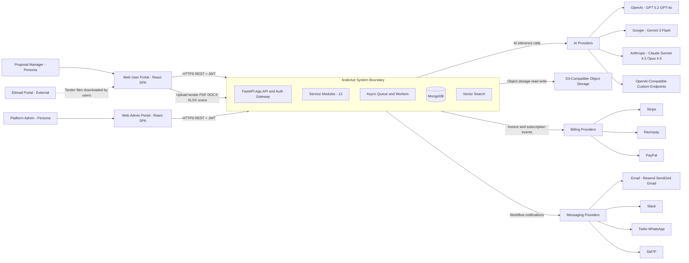
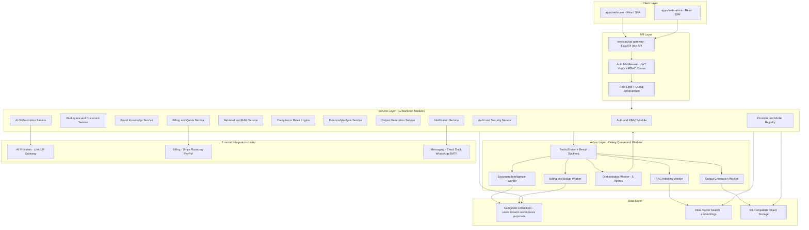
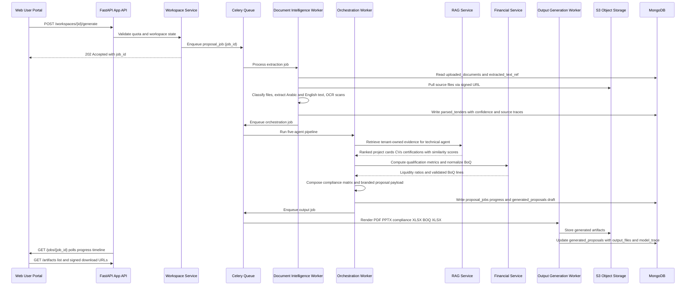

# Arabclue — Architecture Overview & Master Blueprint Index

| Field | Value |
|---|---|
| **Title** | Arabclue Platform — Architecture Overview and Master Blueprint Index |
| **Status** | Draft |
| **Version** | 0.1.0 |
| **Date** | 2026-08-01 |
| **Owner** | Platform Architecture Team (principal product & solutions architect) |
| **Scope** | V1 web-only, multi-tenant B2B SaaS, deterministic five-agent proposal generation from Saudi Etimad tender documents |

## Reading Map

This document is the **master index** for the Arabclue engineering implementation blueprint. It defines the system context, layered architecture, repository structure, technology mapping, architecture decisions, requirements coverage, open-question defaults, and shared glossary. Detailed designs live in the four sibling documents produced in parallel with this one.

| Document | File | Description |
|---|---|---|
| 1. Backend Services & Data Layer | `01-backend-services-and-data-layer.md` | Service responsibilities, MongoDB collection schemas, multi-tenant isolation at API/DB/storage layers, S3-compatible object storage, vector search strategy, and the worker job catalog. |
| 2. API Contracts & Multi-Agent Engine | `02-api-contracts-and-multiagent-engine.md` | REST API contracts with payloads, the five-agent orchestration design, versioned compliance packs, prompt templates, the financial formula library, and drafting guardrails. |
| 3. Frontend & Artifact Pipeline | `03-frontend-and-artifact-pipeline.md` | User portal and admin portal screen maps, the enterprise design system, and the artifact generation pipeline (PDF, PPTX, compliance XLSX, BOQ XLSX, ZIP) with download endpoints. |
| 4. Security, Billing & Operations | `04-security-billing-and-operations.md` | Security and governance model, billing integrations, notifications, the Phase 1–7 implementation breakdown, production operations, and full open-question resolutions. |

---

## 1. Executive Summary

Arabclue is a web-based, multi-tenant B2B SaaS platform that converts Saudi Etimad tender documents into branded, submission-ready proposal artifacts. It serves private-sector bid teams, internal proposal managers, external consultants, and platform administrators. Users upload Etimad tender files, configure company branding, credentials, project history, and reusable knowledge assets; the platform then parses the tender, runs a **controlled deterministic multi-agent workflow**, and produces a technical proposal PDF, proposal slides, a compliance matrix spreadsheet, a financial BoQ spreadsheet, and a downloadable ZIP bundle. The core value proposition is trust: every generated statement is traceable to extracted tender text or tenant-owned evidence, and every model decision is logged for audit.

The generation pipeline is intentionally **deterministic and governed**. Five agents operate in sequence — (1) ingestion and parser, (2) compliance and regulatory, (3) technical and solution architect, (4) financial and qualification, and (5) proposal drafting — each bounded by hard rules, versioned rule packs, immutable formula libraries, and citation metadata. A RAG service retrieves only tenant-owned experience assets (project cards, CVs, certifications, capability statements) and feeds evidence-linked methodology content into the drafter. Financial logic computes qualification metrics such as the quick liquidity ratio and normalizes BoQ line items against schema validation. The output generator renders the final artifacts and packages them into a ZIP with signed download URLs.

Architecture at a glance: a **service-oriented monorepo** with two React + TypeScript applications (user portal and admin portal) behind a FastAPI application API that acts as the gateway; domain logic split into twelve backend modules; Celery-backed FastAPI workers for document intelligence, RAG indexing, AI orchestration, output generation, and billing; MongoDB as the system of record plus MongoDB vector search for semantic retrieval; and S3-compatible object storage for source documents and generated artifacts. External integrations are abstracted behind provider interfaces — AI (OpenAI, Google, Anthropic, OpenAI-compatible custom), billing (Stripe, Razorpay, PayPal), and messaging (Resend/SendGrid/Gmail, Slack, Twilio WhatsApp). The blueprint is phased across seven implementation phases, from foundation to hardening.

---

## 2. Requirements Summary

### 2.1 Functional Requirements

| ID | Requirement | Blueprint Section Pointer |
|---|---|---|
| FR-01 | Secure multi-tenant authentication and RBAC (JWT + refresh flow, roles, permissions) | `04-security-billing-and-operations.md` §Security & Governance; `01-backend-services-and-data-layer.md` §Auth & RBAC Module |
| FR-02 | Drag-and-drop tender workspaces with per-workspace status, assignment, and tender reference | `01-backend-services-and-data-layer.md` §Workspace & Document Service; `03-frontend-and-artifact-pipeline.md` §User Portal |
| FR-03 | Brand setup and knowledge hub (logo, colors, company overview, team CVs, project cards, company profile assets) | `01-backend-services-and-data-layer.md` §Brand & Knowledge Service; `03-frontend-and-artifact-pipeline.md` §Brand Configurator |
| FR-04 | Vectorization and retrieval of historical company experience (tenant-scoped RAG) | `01-backend-services-and-data-layer.md` §Vector Search & RAG; `02-api-contracts-and-multiagent-engine.md` §RAG Contract |
| FR-05 | Five-agent deterministic workflow: ingestion, compliance, technical/solution, financial, drafting | `02-api-contracts-and-multiagent-engine.md` §Multi-Agent Orchestration |
| FR-06 | Compliance matrix generation against tender requirements and configured Saudi regulatory rules | `02-api-contracts-and-multiagent-engine.md` §Compliance Packs & Rules Engine |
| FR-07 | Financial qualification calculations (quick liquidity ratio, financial statements) and BoQ processing | `02-api-contracts-and-multiagent-engine.md` §Financial Formula Library & BoQ Normalization |
| FR-08 | Proposal artifact generation: technical proposal PDF, slides, compliance spreadsheet, financial BoQ spreadsheet, downloadable ZIP | `03-frontend-and-artifact-pipeline.md` §Artifact Pipeline |
| FR-09 | Admin panel: AI provider/model configuration, OpenAI-compatible setup with auto-fetch model listing, encrypted env/credentials, billing packages, quotas, usage metering, audit trail, security controls, notifications, workflow updates | `03-frontend-and-artifact-pipeline.md` §Admin Portal; `04-security-billing-and-operations.md` §Billing & Admin Ops |
| FR-10 | Billing via Stripe, Razorpay, PayPal with subscriptions, quotas, usage metering | `04-security-billing-and-operations.md` §Billing Integrations |
| FR-11 | Notifications via email (Resend/SendGrid/Gmail), optional Slack and Twilio WhatsApp | `04-security-billing-and-operations.md` §Notifications |

### 2.2 Non-Functional Requirements

| ID | Requirement | Blueprint Section Pointer |
|---|---|---|
| NFR-01 | Multi-tenant isolation at API, database, and object storage layers | `01-backend-services-and-data-layer.md` §Multi-Tenant Isolation |
| NFR-02 | Security: RBAC, encrypted secret management, malware scanning, file-type validation, signed artifact URLs, rate limiting, quota enforcement, PII-aware logging | `04-security-billing-and-operations.md` §Security & Governance |
| NFR-03 | Auditability: immutable audit logs for config changes, logins, uploads, generations, billing actions | `04-security-billing-and-operations.md` §Audit Trail |
| NFR-04 | Provenance: human-readable provenance metadata on generated sections, citation and source tracing per extracted field | `02-api-contracts-and-multiagent-engine.md` §Provenance Model |
| NFR-05 | Bilingual: Arabic-first document support and English admin usability; Arabic (RTL) and English text extraction | `03-frontend-and-artifact-pipeline.md` §Design System; `01-backend-services-and-data-layer.md` §Document Intelligence |
| NFR-06 | Performance: queue-based background jobs for long-running generation; generation progress timeline | `01-backend-services-and-data-layer.md` §Worker Job Catalog; `03-frontend-and-artifact-pipeline.md` §Generation Panel |
| NFR-07 | Rate limiting and quota enforcement across tenants and users | `04-security-billing-and-operations.md` §Quotas & Rate Limiting |
| NFR-08 | Reliability: retry and idempotency controls, observability, backup/restore, deployment pipelines | `04-security-billing-and-operations.md` §Phase 7 & Production Ops |

---

## 3. Personas and Permission Domains

| Persona | Description | Feature Domains | Default Permissions |
|---|---|---|---|
| **Bid Team Member** | Engineer, estimator, or coordinator preparing tender responses within a tenant | Workspaces (view/edit assigned), document upload, generation status, artifact downloads, brand/knowledge read | `workspace:read`, `workspace:update`, `document:upload`, `generation:trigger`, `artifact:download`, `knowledge:read` |
| **Proposal Manager** | Owns the proposal lifecycle, reviews outputs, manages workspace assignments | All bid-team permissions plus workspace creation, generation orchestration, review checkpoint, brand profile manage, knowledge hub manage, team assignment | `workspace:create`, `generation:manage`, `brand:write`, `knowledge:write`, `review:approve` |
| **External Consultant** | Third-party consultant preparing submissions for one or more tenants | Scoped workspace access (assigned only), upload, generation, downloads; no access to billing or admin | Same as bid team member but strictly scoped to assigned workspaces |
| **Tenant Admin** | Manages the tenant: users, roles, branding, subscriptions, quotas, security settings for their tenant | User management, role assignment, brand ownership, subscription/billing view, quota view, audit view (tenant scope) | `user:manage`, `role:assign`, `subscription:read`, `audit:read`, `security:read` |
| **Platform Admin** | Operates the platform: AI providers, encrypted env settings, billing packages, global quotas, RBAC, audit logs | Admin panel: providers/models, env secrets, packages, usage/cost dashboards, global RBAC, full audit logs, notifications config | `admin:*` (provider:write, env:write, package:manage, usage:read, audit:read-all) |

Permission checks are enforced server-side from JWT RBAC claims; the UI only renders actions the current role permits (`03-frontend-and-artifact-pipeline.md` §Admin Portal, `04-security-billing-and-operations.md` §RBAC Model).

---

## 4. System Context Diagram



The two SPA clients, external AI/billing/messaging providers, Etimad (as the source of tender files the user downloads and uploads), and S3-compatible storage surround the Arabclue system boundary. All browser traffic enters through the FastAPI app API, which terminates TLS, authenticates JWTs, enforces RBAC and rate limits, and fans out to service modules and the async worker layer.

---

## 5. High-Level Architecture Diagram



### 5.1 One-Click Generation Pipeline (End-to-End Data Flow)



---

## 6. Repository Structure (Monorepo)

Service-oriented monorepo managed with **bun workspaces** (apps and packages) and **uv workspaces** (FastAPI services), sharing TypeScript packages and Python packages respectively. FastAPI services share Python packages via uv workspace member references (editable installs); TypeScript apps share packages via workspace protocol dependencies.

```
arabclue-platform/
├── apps/
│   ├── web-user/                  # React + TS user portal: workspace dashboard, upload zone, brand setup, knowledge hub, generation status, download center
│   └── web-admin/                 # React + TS admin panel: providers/models, env secrets, packages, usage/cost, audit, RBAC
├── services/
│   ├── api-gateway/               # FastAPI app API: routing, auth middleware, RBAC, rate limiting, quota checks, job submission
│   ├── ai-orchestrator/           # Five-agent deterministic orchestration, prompts, rulesets, provider routing (runs in workers)
│   ├── document-intelligence/     # Parser pipeline: PDF/DOCX/XLSX/PPTX/OCR, tender classification, normalization, extraction traceability
│   ├── output-generator/          # PDF/PPTX/XLSX rendering, ZIP packaging, artifact metadata and signed URL issuance
│   └── billing/                   # Stripe/Razorpay/PayPal, subscriptions, usage metering, invoice reconciliation, quota enforcement
├── packages/
│   ├── ui/                        # Shared React component library and design tokens (Arabic-first RTL, enterprise styling)
│   ├── shared-types/              # Cross-app TypeScript types: API DTOs, job status, artifact manifests, RBAC permission sets
│   ├── rulesets/                  # Versioned deterministic rule packs: Saudi procurement law, NCA ECC-1:2018, CCC-1:2020, PDPL, Local Content, NORA, financial formulas
│   ├── prompts/                   # Versioned prompt templates with hard rules and guardrails for the five agents
│   ├── auth/                      # Shared auth primitives: JWT verify/refresh rotation, RBAC claim decoding, tenant scoping helpers
│   └── logging/                   # Structured logging, PII-aware redaction, audit event emission helpers
├── infra/
│   ├── deployment/                # Dockerfiles, docker-compose, K8s manifests, CI/CD pipelines, env templates
│   ├── monitoring/                # Prometheus/Grafana dashboards, OpenTelemetry, alert rules, log aggregation
│   └── storage/                   # S3-compatible storage provisioning (MinIO/cloud), bucket policies, lifecycle rules
└── plans/
    └── arabclue-blueprint/        # This 4-part blueprint (00 is this file; 01–04 are the sibling documents)
```

**Package sharing note:** FastAPI services are thin deployables that import shared logic from `packages/rulesets`, `packages/prompts`, `packages/auth`, and `packages/logging` as editable workspace dependencies (uv). The api-gateway owns HTTP concerns only; the ai-orchestrator, document-intelligence, and output-generator services run as Celery workers without public HTTP surfaces. Full module boundaries are defined in `01-backend-services-and-data-layer.md` §Service Responsibilities.

---

## 7. Tech Stack Mapping Table

| Spec Technology | Recommended Implementation | Rationale |
|---|---|---|
| React + TypeScript frontend | React 19 + TypeScript 5.x (strict), Vite, TanStack Query, Zustand, Tailwind CSS | Mature ecosystem for two SPAs; shared UI via `packages/ui`; bilingual RTL support with logical CSS |
| FastAPI backend | FastAPI + Pydantic v2 + Uvicorn + SQLAlchemy-free (motor/pymongo async) | Async-native, typed contracts via Pydantic, automatic OpenAPI docs, fits MongoDB document model |
| MongoDB database | MongoDB 7.0 (Atlas or self-managed in KSA region) via motor (async) + Beanie ODM | Spec mandates MongoDB; flexible schema suits parsed tender graphs, embeddings, and audit documents |
| FastAPI workers queue-based background jobs | Celery 5 + Redis broker/result backend, Flower for monitoring | Mature distributed task queue; task idempotency keys and retries; long-running document and generation jobs stay off the API process |
| S3-compatible object storage | AWS S3 SDK (boto3) targeting S3, MinIO, or any S3-compatible store; presigned URLs | One SDK across providers; presigned URLs give time-boxed artifact access without exposing storage credentials |
| MongoDB vector indexing (or dedicated collection) | Atlas Vector Search (HNSW index on `embeddings` collection) with fallback to dedicated collection + cosine scan for self-hosted | Spec permits either; Atlas Vector Search chosen for managed quality and scale; fallback strategy documented in `01-backend-services-and-data-layer.md` §Vector Search |
| JWT + refresh token + RBAC claims | PyJWT (RS256), access token 15 min, rotating refresh token with jti denylist; `roles` and `tenant_id` claims | Short-lived access tokens reduce blast radius; rotation + reuse detection closes refresh theft; RBAC claims avoid per-request DB lookups |
| PDF parsing | PyMuPDF (fitz) + pdfplumber | PyMuPDF for fast layout/text extraction; pdfplumber for tables; combined Arabic and English extraction |
| DOCX/XLSX/PPTX ingestion | python-docx, openpyxl, python-pptx | De facto standard libraries; openpyxl also reused for artifact generation |
| OCR for Arabic + English | Tesseract 5 with ara/eng traineddata + arabic-reshaper/python-bidi preprocessing; PaddleOCR as enhancement path | Tesseract handles Arabic RTL reshaping; PaddleOCR improves accuracy on scanned tenders where needed (documented in Phase 2) |
| PDF rendering engine | WeasyPrint (HTML/CSS) + ReportLab; arabic-reshaper for RTL text shaping | WeasyPrint produces high-end branded corporate styling from templates; ReportLab for precise tables |
| PPTX generation library | python-pptx | Native PPTX authoring for technical proposal slides |
| XLSX generation library | openpyxl | Compliance matrix and financial BoQ spreadsheets with styling, validations, and formulas |
| Billing — Stripe, Razorpay, PayPal | Official SDKs: `stripe`, `razorpay`, `paypalrestsdk`; idempotent webhook ingestion | Provider abstraction in billing service; webhook idempotency and reconciliation per provider |
| Email — Resend / SendGrid / Gmail | Resend SDK primary, SendGrid fallback, SMTP (`smtplib`) for Gmail/SMTP relay | Unified notification service with provider preference chain |
| Slack | `slack_sdk` (WebClient + Incoming Webhooks) | Optional workflow updates to tenant Slack channels |
| Twilio WhatsApp | `twilio` SDK (WhatsApp Business API) | Optional WhatsApp notifications for generation completion and review checkpoints |
| AI abstraction layer | LiteLLM gateway as the model router over OpenAI/Google/Anthropic/OpenAI-compatible endpoints + provider-agnostic `ProviderEngine` interface | One SDK for GPT 5.2, GPT-4o, Gemini 3 Flash, Claude Sonnet 4.5, Claude Opus 4.5, and custom OpenAI-compatible providers; native model discovery (`/models`) for admin auto-fetch; fallback chains |
| Model discovery for OpenAI-compatible providers | LiteLLM `model_list` sync + `/v1/models` introspection endpoint | Auto-fetch model listing in the admin panel per spec FR-09 |

Full library versions, installation notes, and license considerations are enumerated in `01-backend-services-and-data-layer.md` §Technology Dependencies.

---

## 8. Key Architectural Decisions (ADRs)

# ADR-001: API Monolith with Modular Service Packages over Per-Domain Microservices

## Status
Accepted

## Context
The spec suggests a service-oriented structure (`services/api-gateway`, `ai-orchestrator`, `document-intelligence`, `output-generator`, `billing`) and lists twelve backend modules. A small platform team must deliver seven phases across a strict React/FastAPI/MongoDB stack. Full per-domain microservices would add network hops, service-to-service auth, distributed tracing, and deployment complexity disproportionate to V1 needs.

## Decision
Deploy one FastAPI application (the api-gateway) that imports the twelve modules as in-repo Python packages, with compute-heavy work (parsing, RAG indexing, orchestration, rendering, billing reconciliation) executed by Celery workers in separate processes. The monorepo preserves the service-oriented directory shape (`services/…`) as deployable entrypoints, not independent HTTP services. The `ai-orchestrator`, `document-intelligence`, and `output-generator` services expose worker entrypoints, not public HTTP APIs.

## Alternatives Considered
- **Per-domain microservices** — clean scaling and team ownership, but heavy operational cost for V1 team size.
- **Single Lambda-style functions** — simpler ops but poor fit for long-running document parsing and generation jobs.
- **Modular monolith with sync-only calls** — no async path for long jobs; rejected because generation is inherently asynchronous.

## Consequences
- Positive: one deployable API surface, shared auth middleware, lower latency between modules, simpler CI/CD.
- Negative: modules cannot scale independently at runtime; a CPU spike in one module affects the API process — mitigated by moving heavy work to workers.
- Trade-off: operational simplicity and V1 velocity are prioritized over independent horizontal scaling, which remains possible later by splitting worker entrypoints.

# ADR-002: MongoDB as the Primary Datastore

## Status
Accepted

## Context
The stack mandates MongoDB. The domain mixes transactional entities (users, tenants, subscriptions, workspaces), document-shaped data (parsed tender graphs, extracted text, compliance matrices, proposal payloads), and append-only audit/usage streams. A relational model would force heavy joins across heterogeneous tender structures; MongoDB's document model fits the parsed-tender and proposal-payload shapes directly.

## Decision
Use MongoDB 7.0 as the single system of record with the core collections enumerated in the spec: `users`, `tenants`, `roles`, `subscriptions`, `usage_records`, `workspaces`, `uploaded_documents`, `parsed_tenders`, `brand_assets`, `knowledge_assets`, `embeddings`, `proposal_jobs`, `generated_proposals`, `compliance_rulesets`, `ai_providers`, `ai_models`, `env_secrets`, `billing_packages`, `invoices`, `audit_logs`, `notifications`. Use indexes on `tenant_id` for every tenant-scoped collection and TTL indexes for expiring tokens and notifications.

## Alternatives Considered
- **PostgreSQL (per AGENTS.md convention in this repo)** — excellent relational fit but the spec fixes MongoDB; also the tender graph and proposal payloads are naturally document-shaped.
- **Dual-store (SQL + Mongo)** — added sync complexity for marginal benefit in V1.

## Consequences
- Positive: flexible schema for heterogeneous tenders, native vector search path, JSON-native API contracts.
- Negative: cross-entity transactions require multi-document transactions and careful schema discipline; referential integrity is application-enforced.
- Trade-off: schema flexibility and operational simplicity over relational constraints and complex query joining.

# ADR-003: Atlas Vector Search as Primary Vector Strategy with Dedicated-Collection Fallback

## Status
Accepted

## Context
The spec permits either MongoDB Atlas Vector Search or a dedicated collection strategy. RAG must retrieve tenant-owned assets (project cards, CVs, certifications, parsed tender fragments) with similarity thresholds, ranking logs, and strict tenant isolation.

## Decision
Use Atlas Vector Search (HNSW index on the `embeddings` collection with `tenant_id` pre-filtering) in managed deployments. Provide a deterministic fallback: a dedicated `embeddings` collection storing vectors plus metadata, with cosine similarity computed in application code for self-hosted/on-prem KSA deployments lacking Atlas. The retrieval contract, chunking policy, embedding model, and threshold defaults are shared across both paths.

## Alternatives Considered
- **Dedicated vector DB (Pinecone/Qdrant/Milvus)** — strong search, but adds a new datastore and breaks the single-datastore operational model.
- **Dedicated MongoDB collection with brute-force scan only** — simplest, but degrades at scale and lacks ANN indexing.

## Consequences
- Positive: single datastore, tenant pre-filtering at query time, managed indexing quality; fallback preserves the self-hosted KSA deployment option.
- Negative: Atlas Vector Search is Atlas-only; the fallback path has higher CPU cost per query — acceptable at V1 scale.
- Trade-off: managed-search quality and ops simplicity are prioritized; the fallback keeps the spec's optionality open.

# ADR-004: Celery with Redis for FastAPI Background Workers

## Status
Accepted

## Context
Document parsing, OCR, RAG indexing, the five-agent pipeline, artifact rendering, and billing reconciliation are long-running and must not block the API. The stack requires "FastAPI workers with queue-based background jobs."

## Decision
Use Celery 5 with a Redis broker and result backend, running dedicated queues: `document-intel`, `rag-index`, `orchestration`, `output-gen`, `billing`. Jobs carry idempotency keys; retries use exponential backoff with max retries per job class. Generation progress is written to `proposal_jobs` so the UI polls a timeline. Flower provides monitoring.

## Alternatives Considered
- **ARQ** — lightweight, Redis-native, but smaller ecosystem for retries/monitoring.
- **Dramatiq** — good, but Celery's maturity and tooling win for a spec-mandated worker stack.
- **Inline async background tasks** — rejected: process restarts lose jobs and no cross-worker scaling.

## Consequences
- Positive: mature retries, routing, and monitoring; jobs survive API restarts; queues scale independently.
- Negative: Redis is an additional operational dependency; Celery configuration and dead-letter handling add surface.
- Trade-off: operational robustness and maturity over minimalism.

# ADR-005: AI Provider Abstraction via LiteLLM Gateway plus Custom ProviderEngine Interface

## Status
Accepted

## Context
The spec requires an AI abstraction layer supporting GPT 5.2, GPT-4o, Gemini 3 Flash, Claude Sonnet 4.5, Claude Opus 4.5, and OpenAI-compatible custom providers with model discovery, per-model parameter controls (temperature, max tokens, confidence threshold, fallback chain), and usage/cost metering.

## Decision
Wrap provider calls in a `ProviderEngine` Python interface (single method `complete(model_ref, messages, params)`) implemented over LiteLLM for the standard providers, with a dedicated implementation for OpenAI-compatible endpoints that calls `/v1/models` for auto-discovery. The `ai_providers` and `ai_models` collections store provider credentials (encrypted), base URLs, parameter defaults, and fallback chains. All calls emit structured usage events to `usage_records` for cost and quota metering.

## Alternatives Considered
- **Per-provider SDKs directly** — more control but N SDK integrations and no unified fallback/metadata.
- **OpenRouter-only** — single API, but the spec demands direct OpenAI/Google/Anthropic and custom OpenAI-compatible support with model discovery.

## Consequences
- Positive: one interface for the deterministic pipeline, uniform metering, admin-managed model routing, easy provider addition.
- Negative: LiteLLM adds a dependency layer; provider API drift must be monitored by version-pinning the gateway.
- Trade-off: unified abstraction and admin flexibility over direct-SDK control.

# ADR-006: S3-Compatible Object Storage with Presigned Signed URLs

## Status
Accepted

## Context
Uploaded tender files and generated artifacts (PDF, PPTX, XLSX, ZIP) must be stored durably, tenant-isolated, and accessed without exposing storage credentials. The spec requires signed URLs for artifact access and malware scanning on uploads.

## Decision
Store all objects in S3-compatible storage (MinIO for self-hosted, cloud S3-compatible service for managed) under tenant-scoped prefixes (`tenants/{tenant_id}/…`). The API issues short-lived presigned URLs for upload and download; artifact URLs expire after a configurable window. Uploads are scanned (ClamAV) and file-type-validated before ingestion; a metadata record in `uploaded_documents` stores `storage_key` and `checksum`.

## Alternatives Considered
- **MongoDB GridFS for files** — keeps one datastore but poor fit for large PDFs and artifact streaming.
- **Proxy-all-downloads through API** — simpler signing but doubles bandwidth and API load.

## Consequences
- Positive: cheap storage, direct browser-to-storage transfer, tenant isolation via key prefixes, time-boxed access.
- Negative: presigned URL expiry must be coordinated with UI download flows; bucket lifecycle policies must be configured.
- Trade-off: storage efficiency and scale over single-datastore simplicity.

# ADR-007: JWT Access Tokens with Rotating Refresh Tokens and RBAC Claims

## Status
Accepted

## Context
The spec mandates JWT + refresh token flow with RBAC claims. Sessions must support logout, revocation on tenant change, and MFA. Long-lived tokens would be a security liability; per-request role lookups would add DB load.

## Decision
RS256-signed access tokens (15-minute TTL) carrying `sub`, `tenant_id`, and `roles` claims; opaque rotating refresh tokens (30-day TTL) stored hashed in MongoDB with a `jti`; rotation on each refresh with reuse detection (immediate revocation on detected reuse). MFA (TOTP) enforced when `mfa_enabled`. The auth middleware validates signature, tenant claim, and role permissions against the route's required permission set.

## Alternatives Considered
- **Session cookies only** — simpler revocation but not JWT-based as spec requires.
- **Long-lived access tokens** — fewer refreshes but larger theft window.
- **Stateless-only JWTs** — no revocation path for logout/tenant change.

## Consequences
- Positive: short-lived surface, strong revocation, role checks without DB hits, spec-compliant.
- Negative: refresh-rotation logic and denylist bookkeeping add implementation care.
- Trade-off: security and revocation control over stateless simplicity.

# ADR-008: Auto-Finalize without Mandatory Legal Review

## Status
Accepted

## Context
The spec explicitly chooses the path where outputs can auto-finalize without a mandatory legal review step. Compliance statements may involve uncertain legal interpretation that must be flagged, yet the pipeline must still complete.

## Decision
Generated proposals auto-finalize into the artifact pipeline by default. Every compliance statement and generated claim carries a review metadata flag (`legal_interpretation_uncertain`, `evidence_gap`, `needs_human_review`) embedded in the intermediate JSON and surfaced in the UI review checkpoint, but none of these flags block finalization. A proposal manager may optionally enable a hard gate per workspace.

## Alternatives Considered
- **Mandatory legal review gate** — safer but contradicts the chosen posture and slows the deterministic workflow.
- **No review metadata** — faster but loses trust and auditability.

## Consequences
- Positive: meets the chosen fast-path posture; flags preserve auditability and let tenants enforce their own gates.
- Negative: risk of auto-published uncertain interpretations; mitigated by prominent flags and provenance.
- Trade-off: speed and the spec's chosen posture over unconditional human verification.

# ADR-009: Encryption of Secrets at Rest with KMS-Managed Envelope Keys

## Status
Accepted

## Context
The admin panel manages encrypted environment settings and credentials (AI provider API keys, billing keys, SMTP creds). Secrets stored in `env_secrets` must not be recoverable by database compromise alone, and must be tenant-scoped where applicable.

## Decision
Store only encrypted values in `env_secrets`: each secret is encrypted with a per-secret data key (AES-256-GCM) using envelope encryption where the master key lives in the cloud KMS (or a KMS-compatible hardware/software module for self-hosted KSA deployments). Master keys never enter MongoDB. Decryption occurs only inside the services that need the credential, and audit events record every decryption.

## Alternatives Considered
- **Plaintext in env vars / DB** — rejected, violates the encrypted-secret-management requirement.
- **Application-level static key** — simpler but a single-key compromise decrypts everything.

## Consequences
- Positive: DB compromise does not reveal keys; rotation possible per secret; audit trail of access.
- Negative: KMS dependency and per-decrypt latency; key management must be documented for self-hosted.
- Trade-off: strong at-rest protection over operational simplicity.

# ADR-010: Bilingual UX Phasing — Arabic-First Workspace, English-First Admin, Full Toggle in Phase 7

## Status
Accepted

## Context
Open question (1) asks whether V1 ships a fully bilingual end-user UI or Arabic-for-workspace + English-for-admin only. The document pipeline must be Arabic-first (RTL, Arabic heading detection, Arabic OCR), while administrators are typically English-literate.

## Decision
V1 ships an **Arabic-first user workspace** (default RTL with an English toggle on the user portal) and an **English-first admin panel** (default LTR with an Arabic toggle). The shared i18n framework and design tokens (RTL/LTR logical properties) are built in Phase 1 so the full bilingual toggle becomes a configuration exercise in Phase 7, not a rewrite. Document processing is fully bilingual (Arabic + English extraction) from Phase 2 regardless of UI language.

## Alternatives Considered
- **Full bilingual everywhere in V1** — doubles translation and QA scope across the entire surface in V1.
- **English-only V1** — fails the Arabic-first user-facing requirement.

## Consequences
- Positive: Arabic-first user experience from day one, English admin efficiency, deferred-but-cheap full bilingual toggle.
- Negative: some user-portal screens are English-only until Phase 7; documented in the open-questions register.
- Trade-off: V1 delivery focus over immediate full-surface bilingualism, with the architecture preserving the path.

---

## 9. Requirements Coverage Traceability Matrix

| Spec Requirement | Blueprint Document | Section |
|---|---|---|
| Multi-tenant authentication and RBAC | `01-backend-services-and-data-layer.md` / `04-security-billing-and-operations.md` | §Auth & RBAC Module; §Security & Governance; ADR-001/ADR-007 in this file |
| Drag-and-drop tender workspaces | `01-backend-services-and-data-layer.md` / `03-frontend-and-artifact-pipeline.md` | §Workspace & Document Service; §User Portal Workspace UI |
| Brand setup (logo, colors, company overview) | `01-backend-services-and-data-layer.md` / `03-frontend-and-artifact-pipeline.md` | §Brand & Knowledge Service; §Brand Configurator |
| Knowledge hub (CVs, project cards, assets) | `01-backend-services-and-data-layer.md` / `03-frontend-and-artifact-pipeline.md` | §Brand & Knowledge Service; §Knowledge Asset Viewer |
| Vectorization and RAG retrieval | `01-backend-services-and-data-layer.md` / `02-api-contracts-and-multiagent-engine.md` | §Vector Search & RAG; §RAG Contract; ADR-003 |
| Five-agent deterministic workflow | `02-api-contracts-and-multiagent-engine.md` | §Multi-Agent Orchestration (agents 1–5) |
| Compliance matrix and Saudi regulatory rules | `02-api-contracts-and-multiagent-engine.md` | §Compliance Packs & Rules Engine (ECC-1:2018, CCC-1:2020, PDPL, Local Content, NORA) |
| Financial qualification and BoQ processing | `02-api-contracts-and-multiagent-engine.md` | §Financial Formula Library & BoQ Normalization (quick liquidity ratio) |
| Proposal artifacts (PDF, PPTX, XLSX, ZIP) | `03-frontend-and-artifact-pipeline.md` | §Artifact Pipeline; ADR-006 |
| Admin panel (providers, models, env secrets, packages, quotas, usage, audit, RBAC, notifications) | `03-frontend-and-artifact-pipeline.md` / `04-security-billing-and-operations.md` | §Admin Portal; §Billing & Admin Ops; ADR-005/ADR-009 |
| Billing (Stripe, Razorpay, PayPal) | `04-security-billing-and-operations.md` | §Billing Integrations |
| Notifications (email, Slack, WhatsApp) | `04-security-billing-and-operations.md` | §Notifications |
| Security and governance (isolation, audit, secrets, malware scan, signed URLs, rate limiting, quotas, PII logging) | `04-security-billing-and-operations.md` | §Security & Governance; ADR-006/ADR-009 |
| Provenance and citation metadata | `02-api-contracts-and-multiagent-engine.md` | §Provenance Model; §Drafting Guardrails |
| Bilingual Arabic-first + English handling | `03-frontend-and-artifact-pipeline.md` / `01-backend-services-and-data-layer.md` | §Design System; §Document Intelligence; ADR-010 |
| Queue-based background jobs | `01-backend-services-and-data-layer.md` | §Worker Job Catalog; ADR-004 |
| Implementation phases 1–7 | `04-security-billing-and-operations.md` | §Phases 1–7 Breakdown |
| Production deployment and DR | `04-security-billing-and-operations.md` | §Production Operations |

---

## 10. Open Questions Register

The master spec records five open questions. This blueprint assumes the recommended defaults below; full resolutions and rollback paths are elaborated in `04-security-billing-and-operations.md` §Open-Question Resolutions.

| # | Open Question | Recommended Default (Blueprint Assumption) | Elaboration |
|---|---|---|---|
| 1 | Full bilingual end-user UI in V1 or Arabic-for-workspace + English-for-admin only? | Arabic-first user workspace (RTL default with English toggle) + English-first admin panel (LTR default with Arabic toggle); full bilingual toggle enabled by design in Phase 7 | ADR-010; `03-frontend-and-artifact-pipeline.md` §Design System |
| 2 | SSO in V1 for enterprise tenants? | No SSO in V1; email/password with MFA; SAML/OIDC SSO evaluated and added in Phase 7 for enterprise tenants | `04-security-billing-and-operations.md` §Security & Governance |
| 3 | Internal review screen before final ZIP packaging even if legal review is not mandatory? | Yes — a lightweight review checkpoint with flagged statements (uncertain legal interpretation, evidence gaps) precedes ZIP packaging; it does not block auto-finalization unless a workspace opts into a hard gate | ADR-008; `03-frontend-and-artifact-pipeline.md` §Download Center |
| 4 | Preferred production deployment target: self-hosted KSA cloud, managed cloud inside KSA, or hybrid? | Managed cloud inside KSA as the primary target (KSA-region cloud with regional data residency); self-hosted KSA cloud supported as a deployment variant because the stack is containerized; hybrid reserved for later | `04-security-billing-and-operations.md` §Production Operations |
| 5 | Local-content scoring advisory only, or does it influence financial recommendation outputs? | Advisory only in V1: Local Content scoring is surfaced as scored guidance in the compliance matrix and financial summary without altering BoQ totals or financial recommendations; configurable to influence scoring weights in later phases | `02-api-contracts-and-multiagent-engine.md` §Compliance Packs & Rules Engine |

---

## 11. Glossary

| Term | Definition |
|---|---|
| **Etimad** | Saudi government e-procurement portal from which tender announcements, conditions, and annexes are downloaded; the source of tender documents ingested by Arabclue. |
| **BoQ** | Bill of Quantities — the spreadsheet-style schedule of work items, quantities, and rates that the financial agent parses, normalizes, validates, and re-emits. |
| **RAG** | Retrieval-Augmented Generation — retrieving tenant-owned evidence (project cards, CVs, certifications, parsed tender fragments) and grounding generated text in it. |
| **NCA ECC-1:2018** | National Cybersecurity Authority Essential Cybersecurity Controls, first version (2018) — the compliance pack Arabclue maps controls against. |
| **NCA CCC-1:2020** | NCA Critical Systems Cybersecurity Controls (2020) — the compliance pack for critical-infrastructure-adjacent tenders. |
| **PDPL** | Saudi Personal Data Protection Law — data residency, privacy, and processing rules encoded as a compliance and rules pack. |
| **NORA** | National Open Data and Digital Architecture reference framework; Arabclue applies NORA principles (Cloud First, Zero Trust, Secure by Design) as a compliance mapping pack. |
| **Local Content** | Saudi local-content preference policy (10% preference guidance) scored as advisory guidance in compliance outputs. |
| **OCR** | Optical Character Recognition — converting scanned tender images into machine-readable Arabic and English text. |
| **Compliance Pack** | A versioned, hardcoded ruleset (legal library, controls mapping, policy pack) evaluated deterministically by the compliance agent. |
| **Provenance** | Traceable origin metadata — every extracted field, compliance statement, and drafted claim cites its source (extracted tender text or tenant evidence). |
| **Tenant** | An isolated customer organization (company) with its own users, workspaces, brands, knowledge assets, subscriptions, and data boundaries. |
| **Artifact** | A generated deliverable file: technical proposal PDF, proposal slides PPTX, compliance matrix XLSX, financial BoQ XLSX, or the combined ZIP bundle. |
| **Quick Liquidity Ratio** | Cash and cash equivalents plus accounts receivable divided by current liabilities; a mandatory computed qualification metric. |
| **RBAC** | Role-Based Access Control — permission grants carried in JWT claims and enforced per route. |
| **JWT** | JSON Web Token — signed, short-lived access token used with a rotating refresh token flow. |
| **SLA** | Service Level Agreement — tender-imposed performance and penalty terms that the ingestion agent extracts as contract terms. |
| **Tender Graph** | The normalized structured JSON produced by the ingestion agent: scope, evaluation criteria, deliverables, contract terms, SLAs, deadlines, and qualification requirements. |
| **Provider Engine** | The AI abstraction interface through which all five agents call configured model providers with parameter controls and fallback chains. |
