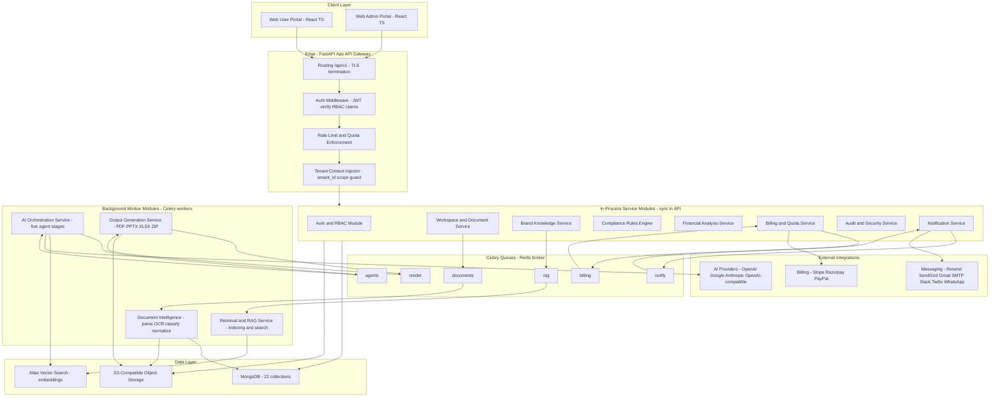
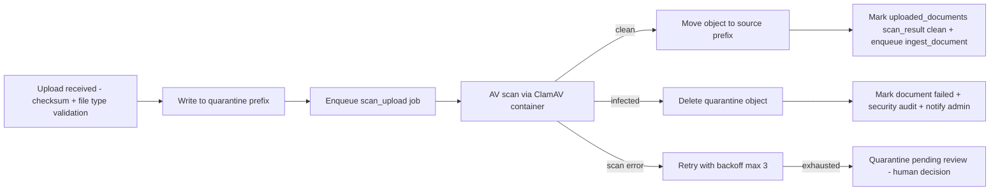
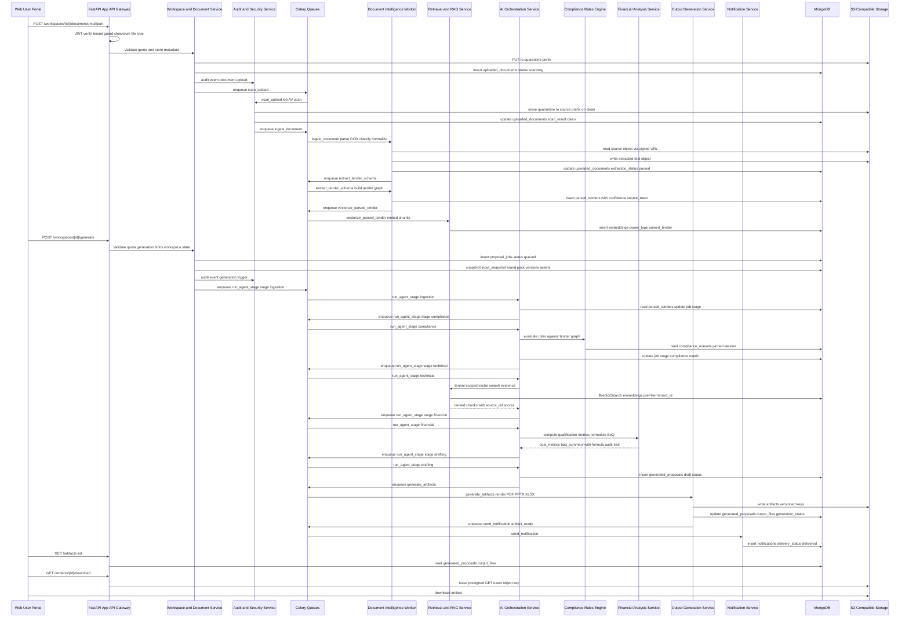

# Arabclue — Backend Services & Data Layer Blueprint

| Field | Value |
|---|---|
| **Title** | Arabclue Platform — Backend Service Responsibilities, MongoDB Data Layer, Multi-Tenant Isolation, Object Storage, Vector Search & Worker Job Catalog |
| **Status** | Draft |
| **Version** | 0.3.0 |
| **Date** | 2026-08-01 |
| **Owner** | Platform Architecture Team (principal product & solutions architect) |
| **Scope** | V1 web-only, multi-tenant B2B SaaS with a deterministic five-agent proposal generation workflow over Saudi Etimad tender documents. This document covers backend service responsibilities, the MongoDB data layer (22 collections), multi-tenant isolation at API/database/object-storage/RAG layers, S3-compatible object storage layout, MongoDB vector search strategy, and the Celery worker job catalog. |

**Scope note.** The REST API surface is specified in `02-api-contracts-and-multiagent-engine.md` (full `/api/v1` contracts, five-agent orchestration design, versioned rules/prompt engine, and AI provider abstraction). The artifact rendering pipeline and download UX are specified in `03-frontend-and-artifact-pipeline.md`. Security governance, billing integrations, notifications, phased delivery, and production operations live in `04-security-billing-and-operations.md`. This document intentionally does not duplicate those; it references them by section where relevant and stays focused on service boundaries, data shapes, isolation, storage, retrieval, and background work.

**Conventions used throughout this document** (consistent with `02-api-contracts-and-multiagent-engine.md` §1): ULID identifiers for all public resources; ISO 8601 UTC timestamps with microsecond precision (`created_at`); money as integers in minor units (SAR halalas); ratios as decimal strings; `X-Correlation-Id` on every request and job; `tenant_id` present on every tenant-scoped document.

---

## 1. Backend Service Architecture

The backend is a **service-oriented monolith-plus-workers** deployment: one FastAPI application API acts as the gateway and hosts the synchronous in-process service modules; Celery workers (same codebase, separate process roles) host the long-running document intelligence, RAG indexing, AI orchestration, and output rendering work. MongoDB is the system of record (22 collections) plus the vector index; S3-compatible object storage holds source documents and generated artifacts; Redis is the Celery broker and result backend, and also backs rate-limit counters.

### 1.1 Layered Architecture Diagram



### 1.2 In-Process vs Background Split

| Service | Runs in | Reason |
|---|---|---|
| Auth & RBAC (`S1`) | API process | Sub-millisecond token verification, session rotation needed on every request |
| Workspace & Document (`S2`) | API process for CRUD + metadata; enqueues parsing to workers | Upload ack must be synchronous; heavy parse work is async |
| Brand Knowledge (`S3`) | API process for CRUD; enqueues vectorization to workers | Metadata CRUD is fast; embedding generation is async |
| AI Orchestration (`S4`) | Background worker | Multi-stage LLM pipeline runs minutes-long |
| Retrieval & RAG (`S5`) | Background worker for indexing; thin query helper usable in-process | Indexing is heavy; semantic queries are fast reads |
| Compliance Rules Engine (`S6`) | API process (rule evaluation) | Rules are compiled in-memory; evaluation is deterministic and fast |
| Financial Analysis (`S7`) | API process for formula library + validation helpers; agent stage runs in worker | Formula engine is pure computation; heavy runs happen inside orchestration |
| Output Generation (`S8`) | Background worker | PDF/PPTX/XLSX rendering is CPU/IO heavy |
| Billing & Quota (`S9`) | API process for quota checks + metering hooks; billing worker settles | Quota must fail fast on request path; invoice settlement is async |
| Audit & Security (`S10`) | API process (append-only writes), plus malware-scan orchestration | Audit writes are synchronous and cheap; scanning is delegated to workers |
| Notification (`S11`) | API process for enqueue; worker for delivery | Provider calls are async to keep request latency low |
| Provider & Model Registry (part of `S4` per master spec; shown as `S12` in `00-architecture-overview.md` §5) | API process for admin CRUD; `sync_provider_models` in worker | Registry CRUD is fast; model discovery calls remote endpoints |

---

## 2. Service Responsibility Spec

Each service below is a module in the monorepo (see `00-architecture-overview.md` §6 for the repository layout). "Owned collections" means the service is the **only** writer for those collections (other services may read). Key entry points reference paths defined fully in `02-api-contracts-and-multiagent-engine.md` §2.

### 2.1 API Gateway / App API (FastAPI)

**Responsibilities**
- Route all `/api/v1` traffic, terminate TLS, verify Bearer JWTs, enforce RBAC claims, inject tenant context, and apply rate limiting (see `04-security-billing-and-operations.md` §Quotas & Rate Limiting).
- Own the request/response envelopes: RFC 7807 errors, list envelope, `X-Correlation-Id` propagation, `Idempotency-Key` handling for job-creating POSTs.
- Coordinate the in-process services; reject cross-tenant access via the tenant-scoping guard (§8.1).
- Serve `/health` and `/ready` liveness/readiness probes.
- PII-aware logging policy at the gateway edge (never log tokens, password hashes, secret values, or document text — see `04-security-billing-and-operations.md` §Logging).

**Owned collections**
- None (stateless). Owns the rate-limit counters in Redis, not MongoDB.

**Consumed APIs / external systems**
- All service modules in-process; Redis for rate-limit counters.

**Key entry points**
- `GET /health`, `GET /ready`; every path in `02-api-contracts-and-multiagent-engine.md` §2 flows through the gateway middleware chain.

**Data it produces**
- None persisted beyond audit events emitted via the Audit service (`S10`).

**Failure modes and mitigations**
- Token verification outage → fail closed with `401`; cache public keys from the auth service and use a short cache TTL.
- Rate-limit store (Redis) down → fail-open policy per `04-security-billing-and-operations.md` (return `503` for mutating endpoints, allow reads) with alerting.
- Misrouted tenant headers → the tenant guard compares `X-Tenant-Id` to JWT `tenant_id` and rejects mismatches before any service call.

### 2.2 Auth and RBAC Module

**Responsibilities**
- Register/login/refresh/logout with JWT access tokens (short-lived, e.g. 15 min) and rotating refresh tokens (e.g. 30 days, single-use, hashed at rest).
- Resolve role → flattened permissions at login and embed `roles[]`, `permissions[]`, `workspace_scopes[]`, `mfa_enabled` in the token (claims format in `02-api-contracts-and-multiagent-engine.md` §1.2).
- Enforce MFA flag; support TOTP enrollment and challenge during login when `mfa_enabled` is true.
- Manage users, roles, and permissions CRUD (invite-based registration in production — see `04-security-billing-and-operations.md` §Security & Governance).
- Session revocation: refresh-token rotation with reuse detection (revoke family on reuse), access-token denylist with short TTL in Redis.
- Workspace-level scoping for external-consultant accounts via `workspace_scopes[]`.

**Owned collections**
- `users`, `roles`, `permissions` (writes); reads `tenants` for tenant metadata and `subscriptions` for active-status gating of logins (optional).

**Consumed APIs / external systems**
- TOTP secret generation (own crypto, no external call); optional email invite delivery via Notification service (`S11`).

**Key entry points**
- `POST /auth/register`, `POST /auth/login`, `POST /auth/refresh`, `POST /auth/logout`, `GET /auth/me`; `GET/POST/PATCH/DELETE /users...`; `GET/POST/PATCH/DELETE /roles...`; `GET /permissions`.

**Data it produces**
- `users` documents (hashed password with argon2id, never plaintext), `roles` documents, `permissions` catalog seeds; refresh-token hashes in `users.refresh_token_family`; audit events for login/logout/role changes.

**Failure modes and mitigations**
- Refresh token reuse → rotate family, revoke all sessions, alert security, require re-login with MFA.
- Role permission drift → permissions are re-resolved on login; a background consistency job reconciles token claims with current role definitions.
- Brute force → per-user+tenant exponential backoff and CAPTCHA threshold in gateway (`04-security-billing-and-operations.md` §Security).

### 2.3 Workspace and Document Service

**Responsibilities**
- Workspace CRUD: `workspaces` per tenant with `tender_reference`, status lifecycle (`draft → collecting_documents → parsing → generating → completed → archived`), brand profile binding, assignment of users.
- Drag-and-drop upload: accept multipart uploads, compute SHA-256 checksum client- and server-side, validate file type against the allowed extension/MIME allowlist, reject > size cap, and reject duplicates (checksum + workspace).
- Enqueue `scan_upload` (malware) then `ingest_document` (parse/OCR/classify/normalize); track `extraction_status` on `uploaded_documents` (`uploaded → scanning → parsed → schema_extracted → failed`).
- Detect document class (`tender_rfp, tender_sow, tender_specs, tender_evaluation, tender_boq, qualification_docs, financial_statements, company_profile, other`) and expose parse status to the UI.
- Coordinate source-file storage keys and quarantine→scan→finalize flow with object storage (§6).
- Workspace deletion = soft-archive; cascades to documents/proposals by setting archived flags.

**Owned collections**
- `workspaces`, `uploaded_documents` (writes); reads `users` (assignment), `brand_assets` (brand_profile_id resolution).

**Consumed APIs / external systems**
- S3-compatible object storage (PUT source files, presigned upload URLs); Redis via Celery (`documents` queue); Notification service for upload-complete/parse-failed events.

**Key entry points**
- `POST /workspaces`, `GET/PATCH/DELETE /workspaces...`, `POST /workspaces/{id}/documents`, `GET /workspaces/{id}/documents`, `GET /documents/{document_id}`.

**Data it produces**
- `workspaces` and `uploaded_documents` documents; source objects in storage under `source/` prefix; audit events (upload, checksum mismatch, file-type rejection).

**Failure modes and mitigations**
- Oversized or disallowed file → reject at API with typed error before any storage write.
- Checksum mismatch after upload → quarantine object, mark document failed, notify user, allow re-upload.
- Parser crash → `extraction_status = failed` with `error_code`; retry policy on `ingest_document` (max 3 attempts, exponential backoff), then dead-letter with human review.
- Duplicate upload → idempotent by `workspace_id + file_name + checksum` unique index; return existing document.

### 2.4 Brand Knowledge Service

**Responsibilities**
- Brand profile CRUD per tenant: name, tagline, legal/CR details, colors, fonts, logo objects, letterhead, signature; produce a compiled `brand_context` snapshot used by the drafter.
- Knowledge asset management: company profile documents, certifications, capability statements, policies, and generic methodology content; per-asset approval workflow (`draft → pending_approval → approved → rejected`) before eligibility for retrieval.
- CVs and project cards: structured records (name, title, credentials, project name, client, value, dates, role, outcomes) that feed capability statements and the technical agent.
- Enqueue `vectorize_knowledge_asset` on every approved asset create/update; invalidate or re-embed on delete/revoke.
- Asset eligibility gating: only `approved` assets with `is_active` are retrievable (§5).

**Owned collections**
- `brand_assets`, `knowledge_assets` (writes); reads `embeddings` (invalidation), `users` (approver).

**Consumed APIs / external systems**
- S3 object storage for asset binaries; Celery `rag` queue; Notification service for approval requests.

**Key entry points**
- `GET/PUT /brand/profile`, `POST /brand/assets`, `GET/PATCH/DELETE /knowledge/assets...`, `POST /knowledge/assets/{id}/approve`, `GET /knowledge/assets/{id}/usage`.

**Data it produces**
- `brand_assets` and `knowledge_assets` documents; `embeddings` documents via the RAG worker; compiled brand context snapshots consumed by orchestration.

**Failure modes and mitigations**
- Asset updated mid-generation → versioning: proposal jobs pin the `brand_profile_id` + asset snapshot at trigger time; generation is immune to later edits.
- Embedding job fails → asset stays `approved` but flagged `embedding_status = pending`; retrieval degrades to keyword fallback; re-run on next asset touch.
- Oversized logo/asset → validate dimensions and bytes at upload; downscale server-side.

### 2.5 AI Orchestration Service

**Responsibilities**
- Own the deterministic five-agent pipeline state machine: `ingestion/parser → compliance/regulatory → technical/solution architect → financial/qualification → proposal drafting` (design and provenance model in `02-api-contracts-and-multiagent-engine.md` §3).
- Persist `proposal_jobs` with stage-level status, progress timeline, per-stage inputs/outputs JSON refs, and model trace.
- Own the **Provider & Model Registry**: `ai_providers`, `ai_models`, `env_secrets` management (admin CRUD, encrypted secret refs, automatic model discovery via `sync_provider_models`).
- Provider abstraction: normalize OpenAI, Google Gemini, Anthropic Claude, and OpenAI-compatible custom providers behind one interface with model discovery, cost/usage capture, and per-stage model routing (see `02-api-contracts-and-multiagent-engine.md` §5).
- Enforce deterministic controls: agent outputs must be valid intermediate JSON with provenance; schema validation per stage; confidence scoring; guardrail checks before drafting.
- Enqueue `run_agent_stage` jobs per stage; chain completion into the next stage; compute `cost_metrics` per job.
- Deterministic fallback logic when providers are unconfigured (local drafting fallback per AGENTS.md).

**Owned collections**
- `proposal_jobs`, `ai_providers`, `ai_models`, `env_secrets` (writes); reads `parsed_tenders`, `compliance_rulesets`, `brand_assets`, `knowledge_assets`, `generated_proposals` (snapshot read), `subscriptions` (quota gates).

**Consumed APIs / external systems**
- AI providers (via abstraction layer); Retrieval & RAG service for evidence; Compliance engine and Financial service for stage helpers; Celery `agents` queue.

**Key entry points**
- `POST /workspaces/{id}/generate` (creates job, enqueues `run_agent_stage`), `GET /jobs/{job_id}` (progress), `POST /jobs/{job_id}/cancel`; admin: `GET/POST/PATCH/DELETE /admin/providers`, `GET /admin/providers/{id}/models` (discovery), `GET/POST/PATCH /admin/env-secrets`.

**Data it produces**
- `proposal_jobs` (state machine), intermediate stage JSON under job `stages[].output_ref` (stored in `generated_proposals.stage_snapshots` or object storage), `ai_models` discovery cache, `usage_records` rows for token/cost metering.

**Failure modes and mitigations**
- Provider outage mid-stage → per-stage retry with backoff (max 3) then fail the stage and mark job `failed` with a resumable checkpoint (`resume_from_stage`).
- Model returns invalid JSON → schema validation retry with corrective prompt (bounded, then fail closed).
- Stage output rejected by guardrails → stage fails with `guardrail_failure` reason; proposal job goes to `needs_review` instead of silent fallback.
- Quota exceeded mid-job → pause pipeline, mark job `quota_blocked`, notify tenant admin (`04-security-billing-and-operations.md` §Quotas).

### 2.6 Retrieval and RAG Service

**Responsibilities**
- Vectorize approved knowledge assets and parsed tender fragments into the `embeddings` collection (chunking, embedding generation, chunk index metadata).
- Tenant-scoped semantic retrieval: every `$vectorSearch` is pre-filtered by `tenant_id` and optional category; enforce a similarity threshold and return ranked chunks with scores.
- Evidence-linked retrieval: every returned chunk carries `owner_type`, `owner_id`, `source_ref` (document id + page/paragraph), so drafting can cite exactly.
- Ranking and logging: persist retrieval runs with query, topK, threshold, scores, and which chunks were used by which agent stage (ranking log in `proposal_jobs`).
- Fallback: keyword/BM25-style search over chunk text when vector search is unavailable (dedicated-collection kNN fallback per spec — §5.4).
- Invalidation: delete/disable embeddings for revoked assets; re-index on version bump.

**Owned collections**
- `embeddings` (writes); reads `knowledge_assets`, `parsed_tenders`, `uploaded_documents` (source refs).

**Consumed APIs / external systems**
- Embedding model via the AI abstraction layer (default `text-embedding-3-small`, 1536-d, configurable via env — §5.2); MongoDB Atlas Vector Search index; Celery `rag` queue.

**Key entry points**
- Job handlers `vectorize_knowledge_asset` and `vectorize_parsed_tender`; internal query helper invoked by orchestration stage 3 (technical agent).

**Data it produces**
- `embeddings` documents (chunks + vectors + metadata); retrieval ranking logs; `knowledge_assets.embedding_status` updates.

**Failure modes and mitigations**
- Embedding provider down → queue retries; assets remain retrievable via keyword fallback; flag `embedding_status = pending`.
- Empty/misleading retrieval (all scores below threshold) → return `no_evidence` marker to the agent, which must draft with explicit "no tenant evidence found" language rather than hallucinating.
- Vector index unavailable → kNN fallback collection scan with the same threshold semantics (§5.4).

### 2.7 Compliance Rules Engine

**Responsibilities**
- Load and compile **versioned compliance packs** (`compliance_rulesets`) — e.g. Saudi procurement law, NCA data-protection, PDPL, local content, NORA guidance — pinned by version at generation time.
- Evaluate the parsed tender graph against rule packs to produce the compliance matrix: requirement → rule → verdict (`compliant | partial | non_compliant | uncertain | not_applicable`) → source citation → confidence.
- Flag **uncertain legal interpretations**: rules that require judgment set `interpretation_flag = uncertain` with rationale, never silently resolved.
- Store source citations per matrix row (tender text location + rule id + rule version).
- Deterministic rule evaluation first; LLM assistance only for mapping free-text requirements to rules, always recording provenance (see `02-api-contracts-and-multiagent-engine.md` §4).

**Owned collections**
- `compliance_rulesets` (writes, versioned packs); writes compliance matrix into `generated_proposals.compliance_summary`.

**Consumed APIs / external systems**
- None external (pure rules + parsed tender input); reads `parsed_tenders`.

**Key entry points**
- `GET /admin/compliance/packs`, `POST /admin/compliance/packs` (upload new pack version), `POST /admin/compliance/packs/{id}/activate`, `GET /workspaces/{id}/compliance-matrix` (trigger evaluation), `GET /compliance/packs/{version}/rules`.

**Data it produces**
- `compliance_rulesets` pack documents + embedded rules; compliance matrix JSON snapshotted into `generated_proposals`.

**Failure modes and mitigations**
- Pack version removed after activation → keep packs immutable; activation creates a new version record, never mutates the old one (so historical generations stay pinned).
- Rule conflict (two rules disagree) → resolved by pack priority ordering, recorded as `conflict_resolution` in the matrix; never silent.
- Missing rule coverage → matrix row marked `not_covered` so reviewers see gaps.

### 2.8 Financial Analysis Service

**Responsibilities**
- Compute qualification metrics from parsed financial statements: quick liquidity ratio `(current assets − inventory) / current liabilities`, current ratio, debt-to-equity, revenue sufficiency, and configurable thresholds.
- BoQ processing: normalize BoQ line items to a validated spreadsheet schema; apply the **immutable formula library** (versioned, see `02-api-contracts-and-multiagent-engine.md` §7); validate totals, units, and currency.
- Maintain an audit trail **per computed metric**: formula id, formula version, inputs (with source refs), output, and timestamp — stored with `boq_summary` and `cost_metrics`.
- Local-content scoring is **advisory only** in V1 and does not alter financial qualification outputs (per `04-security-billing-and-operations.md` §Open Questions).
- Spreadsheet schema validation before any financial XLSX is rendered.

**Owned collections**
- None exclusively (pure computation); writes `generated_proposals.cost_metrics` and `boq_summary`; reads `parsed_tenders`, `compliance_rulesets` (formula packs).

**Consumed APIs / external systems**
- Formula library compiled in-process; reads extraction outputs from `parsed_tenders`.

**Key entry points**
- `POST /workspaces/{id}/financial/analyze` (synchronous analysis), `GET /workspaces/{id}/financial/metrics`, `GET /workspaces/{id}/boq/validation-report`; job handlers called from agent stage 4.

**Data it produces**
- `cost_metrics` (per-metric audit trail), `boq_summary` (normalized line items + validation results) on `generated_proposals`.

**Failure modes and mitigations**
- Financial statement fields missing → metric computed with `available_inputs` list; missing mandatory inputs produce `not_computable` status with reason, never a fabricated number.
- BoQ schema violation → validation report lists each offending row with field-level error codes; render is blocked until resolved or explicitly overridden.
- Formula library bug → formulas are immutable and versioned; a fix ships as a new formula version, and old proposals keep the pinned version with provenance.

### 2.9 Output Generation Service

**Responsibilities**
- Render the artifact set from the finalized proposal payload: technical proposal **PDF** (bilingual, branded), **PPTX** slides, **compliance XLSX**, **financial BoQ XLSX**, and the downloadable **ZIP** bundle (pipeline details in `03-frontend-and-artifact-pipeline.md` §Artifact Pipeline).
- Write artifacts to object storage under `artifacts/` with proposal-version keys; register `output_files` on `generated_proposals`.
- Generate **signed download URLs** (presigned GET) with short expiry; never issue directory-level signatures (§6).
- Bilingual rendering: Arabic RTL + English fonts embedded; deterministic layout per `03-frontend-and-artifact-pipeline.md` §Design System.
- ZIP packaging includes a `manifest.json` with artifact checksums and generation metadata.

**Owned collections**
- None exclusively; writes `generated_proposals.output_files`; reads the full proposal payload from `generated_proposals` and templates from object storage.

**Consumed APIs / external systems**
- S3-compatible storage (PUT artifacts, presigned GETs); rendering libraries (Playwright/weasyprint for PDF, python-pptx, openpyxl) — no external SaaS for rendering.

**Key entry points**
- Job handler `generate_artifacts` (called after final agent stage); `render_compliance_xlsx`, `render_boq_xlsx` as granular jobs; `GET /artifacts`, `GET /artifacts/{artifact_id}/download` (signed URL issuance).

**Data it produces**
- Artifact objects in storage; `output_files` entries with `storage_key`, `content_type`, `size_bytes`, `sha256`; ZIP `manifest.json`.

**Failure modes and mitigations**
- Render crash mid-PDF → job retries idempotently (artifacts are written with versioned keys; partial files overwritten on retry).
- Font/bidi rendering issues → deterministic render tests in CI; unsupported glyph detection at render time returns a typed error.
- Disk pressure on render workers → workers write directly to S3 via multipart upload, no local persistence of final artifacts.
- Signed URL expiry mid-download → client receives `410` and re-requests a fresh signed URL from `GET /artifacts/{id}/download`.

### 2.10 Billing and Quota Service

**Responsibilities**
- Subscription lifecycle: activate/pause/cancel/upgrade; map `billing_packages` to `subscriptions` with `quota_limits`, `token_limits`, `generation_limits`.
- Quota enforcement on the request path: document uploads, vectorizations, generation triggers, and artifact downloads decrement meters; reject with `429/403` and `Retry-After` when exhausted (see `04-security-billing-and-operations.md` §Quotas & Rate Limiting).
- Usage metering: append `usage_records` per action with `meter_type` (`storage_gb_hours | ai_tokens | generations | document_uploads`), amounts, and unit prices at time of use.
- Billing provider integrations: Stripe / Razorpay / PayPal webhook handling, invoice creation, payment reconciliation, and dunning reminders (full flow in `04-security-billing-and-operations.md` §Billing Integrations).
- `bill_tenant` worker: settle periodic invoices from accumulated usage, emit `invoices`, and apply proration on package changes.

**Owned collections**
- `subscriptions`, `usage_records`, `billing_packages`, `invoices` (writes); reads `tenants` (billing contact), `users` (admin contact).

**Consumed APIs / external systems**
- Stripe, Razorpay, PayPal webhooks/APIs; Celery `billing` queue; Notification service for invoice/limit alerts.

**Key entry points**
- `POST /billing/checkout`, `POST /billing/webhooks/{provider}`, `GET /billing/subscription`, `GET /billing/invoices`, `GET /billing/usage`, `GET /admin/packages`, `POST /admin/packages`; middleware hook `quota.check` on mutating endpoints.

**Data it produces**
- `subscriptions`, `usage_records`, `invoices`, `billing_packages` documents; audit events for every billing action.

**Failure modes and mitigations**
- Webhook replay → idempotent by `event_id` unique index on `invoices`/usage settlement; duplicate events ignored.
- Provider outage during checkout → subscription stays `pending`; webhook reconciliation job retries with backoff.
- Quota counter drift → usage metering is append-only; reconciliation job recomputes from `usage_records` monthly.
- Over-limit generation mid-run → job paused (`quota_blocked`) and resumed on package upgrade.

### 2.11 Audit and Security Service

**Responsibilities**
- Append-only, **immutable** audit log: writes `audit_logs` with actor, action, tenant, target, before/after deltas (config changes, logins, uploads, generations, billing actions, admin ops). No update/delete API; collection write access restricted to this service.
- Encrypted secret management: encrypt API keys and environment values before storing in `env_secrets` (envelope encryption, KMS-backed DEK, see `04-security-billing-and-operations.md` §Secrets); `ai_providers.api_key_ref` never contains raw keys (§4.13 example).
- Malware scanning orchestration: `scan_upload` job runs AV on quarantined objects; pass → move to `source/`; fail → delete + alert (flow in §6).
- File-type validation policy enforcement on uploads (allowlist, magic-byte check, size cap).
- PII-aware logging policy enforcement; token/secret redaction in all log sinks.
- Security event correlation: failed logins, refresh-token reuse, suspicious download patterns → `audit_logs` entries + notification to tenant/platform admins.

**Owned collections**
- `audit_logs`, `env_secrets` (writes); reads `users`, `tenants` for actor resolution.

**Consumed APIs / external systems**
- KMS for envelope encryption; antivirus service (ClamAV container or managed AV API); Celery `documents` queue (scan jobs).

**Key entry points**
- `GET /admin/audit-logs` (platform admin, full scope), `GET /audit-logs` (tenant admin, scoped), `POST /admin/env-secrets` (upsert encrypted), `GET /admin/env-secrets/{key}` (exists-check only, values never returned); internal `audit.record(...)` helper used by all services.

**Data it produces**
- `audit_logs` entries (hash-chained for tamper evidence), `env_secrets` ciphertext documents.

**Failure modes and mitigations**
- Audit write failure → non-blocking by default (fire-and-forget with retry buffer) but `audit:read` gaps alerting; security-critical events (login, secret change) block on write with timeout.
- KMS unavailable → fail closed for new secret writes; reads from cache with explicit TTL and alert.
- AV engine false positive → quarantine + manual review queue; admin can whitelist by sha256 after review.
- Tamper attempt on audit_logs → hash chain (prev_hash) makes any edit detectable; verified by nightly integrity job.

### 2.12 Notification Service

**Responsibilities**
- Fan-out notifications to channels: email (Resend / SendGrid / Gmail SMTP), Slack webhook, Twilio WhatsApp; per-tenant channel preferences.
- Template rendering with bilingual (Arabic/English) templates; per-user locale selection.
- Deduplication and rate caps per channel; retry with backoff on provider failure.
- In-app notification records stored in `notifications` with `read_at` tracking.
- Used by: parse completion/failure, generation stage progress, artifact ready, quota warnings, invoice events, security alerts.

**Owned collections**
- `notifications` (writes); reads `users` (contact + locale), `workspaces` (context refs).

**Consumed APIs / external systems**
- Resend/SendGrid/Gmail (email), Slack webhooks, Twilio WhatsApp; Celery `notify` queue.

**Key entry points**
- Internal helper `notify.send(tenant_id, recipient, template, payload)` used by all services; admin endpoints `GET/PUT /admin/notification-settings`; `GET /notifications`, `POST /notifications/{id}/read`.

**Data it produces**
- `notifications` documents with `delivery_status` (`queued | delivered | failed | suppressed`), `channel_refs` (provider message ids), and retry state.

**Failure modes and mitigations**
- Provider outage → exponential backoff (max 5), then `failed` with alert; critical (invoice, security) notifications escalate to a secondary channel.
- Duplicate delivery → idempotency key = `type + recipient + correlation_id`; unique index prevents double-send.
- Channel rate cap exceeded → batch into digest for low-priority types.
- Unsubscribe/bounce handling → per-recipient suppression list honored before enqueue.

---

## 3. MongoDB Data Model

MongoDB is the system of record. Conventions:
- **Collection naming**: snake_case, plural.
- **IDs**: ULID strings (`01J...`), generated client-side (see `02-api-contracts-and-multiagent-engine.md` §9).
- **Timestamps**: `created_at`, `updated_at` on every document; `deleted_at` for soft deletes where noted.
- **Tenant scoping**: every tenant-owned document carries `tenant_id` (except global/admin collections: `permissions`, `ai_providers`, `ai_models`, `env_secrets`, `billing_packages` — these are platform-global and admin-scoped instead).
- **Schema versioning**: every document carries `schema_version` (integer, starts at 1) — see §10.

### 3.1 Collection Groups

| Group | Collections |
|---|---|
| Identity & Tenancy | `users`, `tenants`, `roles`, `permissions` |
| Workspace & Documents | `workspaces`, `uploaded_documents`, `parsed_tenders` |
| Brand & Knowledge | `brand_assets`, `knowledge_assets` |
| Orchestration & Proposals | `embeddings`, `proposal_jobs`, `generated_proposals` |
| Compliance & Financial Rules | `compliance_rulesets` |
| AI Providers | `ai_providers`, `ai_models`, `env_secrets` |
| Billing & Quota | `subscriptions`, `usage_records`, `billing_packages`, `invoices` |
| Security & Observability | `audit_logs`, `notifications` |

### 3.2 Identity & Tenancy

#### `users`

| Field | Type | Required | Description |
|---|---|---|---|
| `_id` | string (ULID) | yes | User id |
| `tenant_id` | string (ULID) | yes | Owning tenant |
| `name` | string | yes | Full name |
| `email` | string | yes | Login email, unique per tenant (lowercased) |
| `hashed_password` | string | yes | Argon2id hash; never plaintext |
| `roles` | array[string] | yes | Role ids resolved at login |
| `status` | string enum | yes | `active \| invited \| suspended \| deactivated` |
| `mfa_enabled` | bool | yes | TOTP enrolled flag |
| `mfa_secret_enc` | string | no | Encrypted TOTP secret (only if enabled) |
| `workspace_scopes` | array[string] | no | Restricted workspace ids (external consultants); empty = no restriction |
| `last_login_at` | datetime | no | Last successful login |
| `failed_login_count` | int | yes | Brute-force counter (default 0) |
| `refresh_token_family` | object | no | `{ family_id, current_hash, prev_hash, rotated_at }` for rotation/reuse detection |
| `locale` | string enum | yes | `ar \| en` for notifications |
| `created_at` / `updated_at` | datetime | yes | Timestamps |
| `schema_version` | int | yes | Document schema version (default 1) |

**Indexes**: `{tenant_id: 1, email: 1}` unique; `{tenant_id: 1, status: 1}`; `{email: 1}` (login lookup across tenants); `{tenant_id: 1, last_login_at: -1}`.

**Document example**

```json
{
  "_id": "01J8XKZ9Q7H4M2K9V0P3T8X5WA",
  "tenant_id": "01J8XKZ9Q7H4M2K9V0P3T8X5WC",
  "name": "Sarah Al-Qahtani",
  "email": "sarah@bidco.example",
  "hashed_password": "$argon2id$v=19$m=65536,t=3,p=4$...",
  "roles": ["01J8XKZ9Q7H4M2K9V0P3T8X5WF"],
  "status": "active",
  "mfa_enabled": true,
  "mfa_secret_enc": "v1:aws:kms:enc:abc123==",
  "workspace_scopes": [],
  "last_login_at": "2026-08-01T10:22:33.123456Z",
  "failed_login_count": 0,
  "refresh_token_family": {
    "family_id": "01J8XKZ9Q7H4M2K9V0P3T8X5WG",
    "current_hash": "sha256:deadbeef...",
    "prev_hash": null,
    "rotated_at": "2026-08-01T10:22:33.123456Z"
  },
  "locale": "ar",
  "created_at": "2026-07-20T08:00:00.000000Z",
  "updated_at": "2026-08-01T10:22:33.123456Z",
  "schema_version": 1
}
```

#### `tenants`

| Field | Type | Required | Description |
|---|---|---|---|
| `_id` | string (ULID) | yes | Tenant id (becomes the JWT `tenant_id` claim) |
| `name` | string | yes | Company/tenant display name |
| `slug` | string | yes | URL-safe unique slug |
| `status` | string enum | yes | `active \| suspended \| trial \| closed` |
| `tier` | string enum | yes | `free \| starter \| professional \| enterprise` |
| `billing_contact` | object | yes | `{ user_id, email, phone }` |
| `default_locale` | string enum | yes | `ar \| en` |
| `settings` | object | yes | Tenant config flags (e.g. `auto_finalize`, `review_required`) |
| `brand_profile_id` | string (ULID) | no | Default brand profile |
| `created_at` / `updated_at` | datetime | yes | Timestamps |
| `schema_version` | int | yes | Schema version |

**Indexes**: `{slug: 1}` unique; `{status: 1}`; `{billing_contact.user_id: 1}`.

**Document example**

```json
{
  "_id": "01J8XKZ9Q7H4M2K9V0P3T8X5WC",
  "name": "BidCo Contracting Co.",
  "slug": "bidco",
  "status": "active",
  "tier": "professional",
  "billing_contact": {
    "user_id": "01J8XKZ9Q7H4M2K9V0P3T8X5WA",
    "email": "billing@bidco.example",
    "phone": "+966501234567"
  },
  "default_locale": "ar",
  "settings": {
    "auto_finalize": true,
    "review_required": false,
    "malware_scan_enabled": true
  },
  "brand_profile_id": "01J8XKZ9Q7H4M2K9V0P3T8X5WH",
  "created_at": "2026-07-01T08:00:00.000000Z",
  "updated_at": "2026-07-28T09:15:00.000000Z",
  "schema_version": 1
}
```

#### `roles`

| Field | Type | Required | Description |
|---|---|---|---|
| `_id` | string (ULID) | yes | Role id |
| `tenant_id` | string (ULID) | yes | Owning tenant (platform roles use reserved tenant `platform`) |
| `name` | string | yes | Role name (e.g. `proposal_manager`) |
| `description` | string | no | Human-readable description |
| `permissions` | array[string] | yes | Flattened permission codes |
| `is_system` | bool | yes | System roles are immutable (`true`) |
| `created_at` / `updated_at` | datetime | yes | Timestamps |
| `schema_version` | int | yes | Schema version |

**Indexes**: `{tenant_id: 1, name: 1}` unique; `{tenant_id: 1}`.

**Document example**

```json
{
  "_id": "01J8XKZ9Q7H4M2K9V0P3T8X5WF",
  "tenant_id": "01J8XKZ9Q7H4M2K9V0P3T8X5WC",
  "name": "proposal_manager",
  "description": "Owns proposal lifecycle and review",
  "permissions": ["workspace:create", "workspace:read", "workspace:update", "document:upload", "generation:trigger", "generation:manage", "artifact:download", "knowledge:read", "knowledge:write", "brand:write", "review:approve"],
  "is_system": true,
  "created_at": "2026-07-01T08:00:00.000000Z",
  "updated_at": "2026-07-01T08:00:00.000000Z",
  "schema_version": 1
}
```

#### `permissions`

| Field | Type | Required | Description |
|---|---|---|---|
| `_id` | string (ULID) | yes | Permission id |
| `code` | string | yes | Canonical permission code, e.g. `workspace:read` |
| `domain` | string enum | yes | `workspace \| document \| generation \| knowledge \| brand \| billing \| admin \| audit \| security` |
| `description` | string | no | Description |
| `is_assignable` | bool | yes | Whether tenant admins may assign it (vs platform-only) |
| `created_at` | datetime | yes | Timestamp |
| `schema_version` | int | yes | Schema version |

**Indexes**: `{code: 1}` unique.

**Document example**

```json
{
  "_id": "01J8XKZ9Q7H4M2K9V0P3T8X5XJ",
  "code": "generation:trigger",
  "domain": "generation",
  "description": "Trigger proposal generation for a workspace",
  "is_assignable": true,
  "created_at": "2026-07-01T08:00:00.000000Z",
  "schema_version": 1
}
```

### 3.3 Workspace & Documents

#### `workspaces`

| Field | Type | Required | Description |
|---|---|---|---|
| `_id` | string (ULID) | yes | Workspace id |
| `tenant_id` | string (ULID) | yes | Owning tenant |
| `name` | string | yes | Workspace/tender name |
| `tender_reference` | string | yes | Etimad tender reference number |
| `status` | string enum | yes | `draft \| collecting_documents \| parsing \| generating \| completed \| archived` |
| `brand_profile_id` | string (ULID) | no | Brand profile used for this proposal |
| `created_by` | string (ULID) | yes | Creating user |
| `assigned_users` | array[string] | yes | User ids with access (ULIDs) |
| `due_date` | datetime | no | Tender submission deadline |
| `tender_metadata` | object | no | `{ issuing_entity, sector, estimated_value_minor, currency }` |
| `archived_at` | datetime | no | Soft-delete marker |
| `created_at` / `updated_at` | datetime | yes | Timestamps |
| `schema_version` | int | yes | Schema version |

**Indexes**: `{tenant_id: 1, created_at: -1}`; `{tenant_id: 1, status: 1}`; `{tenant_id: 1, tender_reference: 1}`; `{assigned_users: 1, tenant_id: 1}` (membership lookup).

**Document example**

```json
{
  "_id": "01J8XKZ9Q7H4M2K9V0P3T8X5WD",
  "tenant_id": "01J8XKZ9Q7H4M2K9V0P3T8X5WC",
  "name": "MOF Cloud Services RFP 1448",
  "tender_reference": "T-2026-0042",
  "status": "collecting_documents",
  "brand_profile_id": "01J8XKZ9Q7H4M2K9V0P3T8X5WH",
  "created_by": "01J8XKZ9Q7H4M2K9V0P3T8X5WA",
  "assigned_users": ["01J8XKZ9Q7H4M2K9V0P3T8X5WA", "01J8XKZ9Q7H4M2K9V0P3T8X5WK"],
  "due_date": "2026-09-15T23:59:59.000000Z",
  "tender_metadata": {
    "issuing_entity": "Ministry of Finance",
    "sector": "cloud_services",
    "estimated_value_minor": 2500000000,
    "currency": "SAR"
  },
  "archived_at": null,
  "created_at": "2026-08-01T09:00:00.000000Z",
  "updated_at": "2026-08-01T09:00:00.000000Z",
  "schema_version": 1
}
```

#### `uploaded_documents`

| Field | Type | Required | Description |
|---|---|---|---|
| `_id` | string (ULID) | yes | Document id |
| `workspace_id` | string (ULID) | yes | Owning workspace |
| `tenant_id` | string (ULID) | yes | Owning tenant |
| `file_name` | string | yes | Original file name |
| `file_type` | string enum | yes | `pdf \| docx \| xlsx \| pptx \| png \| jpg \| tiff` |
| `detected_doc_class` | string enum | yes | `tender_rfp \| tender_sow \| tender_specs \| tender_evaluation \| tender_boq \| qualification_docs \| financial_statements \| company_profile \| other` |
| `storage_key` | string | yes | Object storage key (§6) |
| `checksum` | string | yes | SHA-256 hex of the stored bytes |
| `size_bytes` | int | yes | File size |
| `mime_type` | string | yes | Validated MIME type |
| `extraction_status` | string enum | yes | `uploaded \| scanning \| parsed \| schema_extracted \| failed` |
| `extracted_text_ref` | string | no | Storage key or object ref of normalized extracted text |
| `language` | string enum | no | Detected primary language `ar \| en \| mixed` |
| `page_count` | int | no | Page count (PDF/OCR) |
| `error_code` | string | no | Failure reason when `extraction_status = failed` |
| `scan_result` | string enum | no | `clean \| infected \| skipped` (from malware scan) |
| `created_at` / `updated_at` | datetime | yes | Timestamps |
| `schema_version` | int | yes | Schema version |

**Indexes**: `{tenant_id: 1, workspace_id: 1, file_name: 1}` unique; `{tenant_id: 1, workspace_id: 1, created_at: -1}`; `{checksum: 1, tenant_id: 1}` (dedup); `{extraction_status: 1}` (worker sweep).

**Document example**

```json
{
  "_id": "01J8XKZ9Q7H4M2K9V0P3T8X5XM",
  "workspace_id": "01J8XKZ9Q7H4M2K9V0P3T8X5WD",
  "tenant_id": "01J8XKZ9Q7H4M2K9V0P3T8X5WC",
  "file_name": "RFP-Cloud-Services-1448.pdf",
  "file_type": "pdf",
  "detected_doc_class": "tender_rfp",
  "storage_key": "s3://arabclue-prod/01J8XKZ9Q7H4M2K9V0P3T8X5WC/source/01J8XKZ9Q7H4M2K9V0P3T8X5WD/01J8XKZ9Q7H4M2K9V0P3T8X5XM/RFP-Cloud-Services-1448.pdf",
  "checksum": "9f86d081884c7d659a2feaa0c55ad015a3bf4f1b2b0b822cd15d6c15b0f00a08",
  "size_bytes": 2458000,
  "mime_type": "application/pdf",
  "extraction_status": "parsed",
  "extracted_text_ref": "s3://arabclue-prod/01J8XKZ9Q7H4M2K9V0P3T8X5WC/text/01J8XKZ9Q7H4M2K9V0P3T8X5WD/01J8XKZ9Q7H4M2K9V0P3T8X5XM/extracted.json",
  "language": "ar",
  "page_count": 64,
  "error_code": null,
  "scan_result": "clean",
  "created_at": "2026-08-01T09:05:00.000000Z",
  "updated_at": "2026-08-01T09:12:00.000000Z",
  "schema_version": 1
}
```

#### `parsed_tenders`

The normalized tender knowledge graph extracted from all workspace documents. Every field carries per-field `confidence` and `source_trace` provenance.

| Field | Type | Required | Description |
|---|---|---|---|
| `_id` | string (ULID) | yes | Parsed tender id |
| `workspace_id` | string (ULID) | yes | Owning workspace |
| `tenant_id` | string (ULID) | yes | Owning tenant |
| `version` | int | yes | Parser output version (increments on re-parse) |
| `parser_version` | string | yes | Parser software version |
| `language` | string enum | yes | `ar \| en \| mixed` |
| `scope_of_work` | array[object] | yes | `[{ clause_id, heading, text, confidence, source_trace }]` |
| `evaluation_criteria` | array[object] | yes | Weighted criteria `[{ criterion_id, name, weight_pct, min_score, confidence, source_trace }]` |
| `deliverables` | array[object] | yes | `[{ deliverable_id, description, deadline, acceptance_criteria, confidence, source_trace }]` |
| `contract_terms` | array[object] | yes | `[{ term_id, category, summary, confidence, source_trace }]` |
| `sla_penalties` | array[object] | yes | `[{ penalty_id, condition, penalty_value, confidence, source_trace }]` |
| `deadlines` | array[object] | yes | `[{ deadline_id, event, datetime, confidence, source_trace }]` |
| `qualification_requirements` | array[object] | yes | `[{ req_id, category, requirement, confidence, source_trace }]` |
| `boq_lines` | array[object] | no | Normalized BoQ lines `[{ line_id, item, unit, qty, unit_price_minor, confidence, source_trace }]` |
| `financial_statements` | object | no | Extracted metrics `{ current_assets_minor, inventory_minor, current_liabilities_minor, ... }` with per-field confidence |
| `extraction_trace` | array[object] | yes | Full per-field trace `[{ field, value, source_doc_id, page, paragraph, method, confidence }]` |
| `created_at` / `updated_at` | datetime | yes | Timestamps |
| `schema_version` | int | yes | Schema version |

**Indexes**: `{tenant_id: 1, workspace_id: 1}` unique (latest version) + `{tenant_id: 1, workspace_id: 1, version: 1}`; `{tenant_id: 1, created_at: -1}`.

**Document example**

```json
{
  "_id": "01J8XKZ9Q7H4M2K9V0P3T8X5XN",
  "workspace_id": "01J8XKZ9Q7H4M2K9V0P3T8X5WD",
  "tenant_id": "01J8XKZ9Q7H4M2K9V0P3T8X5WC",
  "version": 1,
  "parser_version": "parser-2026.08.1",
  "language": "ar",
  "scope_of_work": [
    {
      "clause_id": "sow-01",
      "heading": "نطاق العمل",
      "text": "تقديم خدمات سحابية متكاملة لمدة ثلاث سنوات...",
      "confidence": 0.94,
      "source_trace": { "document_id": "01J8XKZ9Q7H4M2K9V0P3T8X5XM", "page": 12, "paragraph": 3, "method": "heading_detection+llm_verify" }
    }
  ],
  "evaluation_criteria": [
    {
      "criterion_id": "eval-01",
      "name": "Technical Solution Quality",
      "weight_pct": 40,
      "min_score": 70,
      "confidence": 0.91,
      "source_trace": { "document_id": "01J8XKZ9Q7H4M2K9V0P3T8X5XM", "page": 18, "paragraph": 1, "method": "table_extraction" }
    }
  ],
  "deliverables": [
    {
      "deliverable_id": "del-01",
      "description": "Cloud migration plan",
      "deadline": "2027-01-31",
      "acceptance_criteria": "Approved by steering committee",
      "confidence": 0.88,
      "source_trace": { "document_id": "01J8XKZ9Q7H4M2K9V0P3T8X5XM", "page": 30, "paragraph": 5, "method": "section_mapping" }
    }
  ],
  "contract_terms": [
    {
      "term_id": "ct-01",
      "category": "payment",
      "summary": "Monthly invoicing with 10% retention",
      "confidence": 0.9,
      "source_trace": { "document_id": "01J8XKZ9Q7H4M2K9V0P3T8X5XM", "page": 41, "paragraph": 2, "method": "clause_classifier" }
    }
  ],
  "sla_penalties": [
    {
      "penalty_id": "pen-01",
      "condition": "Uptime below 99.5% monthly",
      "penalty_value": "0.5% of monthly fee",
      "confidence": 0.87,
      "source_trace": { "document_id": "01J8XKZ9Q7H4M2K9V0P3T8X5XM", "page": 45, "paragraph": 1, "method": "clause_classifier" }
    }
  ],
  "deadlines": [
    {
      "deadline_id": "dl-01",
      "event": "Bid submission",
      "datetime": "2026-09-15T23:59:59Z",
      "confidence": 0.96,
      "source_trace": { "document_id": "01J8XKZ9Q7H4M2K9V0P3T8X5XM", "page": 2, "paragraph": 1, "method": "date_extractor" }
    }
  ],
  "qualification_requirements": [
    {
      "req_id": "qr-01",
      "category": "financial",
      "requirement": "Minimum quick liquidity ratio of 1.2",
      "confidence": 0.93,
      "source_trace": { "document_id": "01J8XKZ9Q7H4M2K9V0P3T8X5XQ", "page": 7, "paragraph": 2, "method": "requirement_extractor" }
    }
  ],
  "boq_lines": [
    {
      "line_id": "boq-01",
      "item": "Managed cloud VM - small",
      "unit": "unit/month",
      "qty": 120,
      "unit_price_minor": 4500000,
      "confidence": 0.95,
      "source_trace": { "document_id": "01J8XKZ9Q7H4M2K9V0P3T8X5XR", "page": 3, "paragraph": 1, "method": "boq_normalizer" }
    }
  ],
  "financial_statements": {
    "current_assets_minor": 12000000000,
    "inventory_minor": 2000000000,
    "current_liabilities_minor": 7500000000,
    "confidence": { "current_assets_minor": 0.97, "inventory_minor": 0.96, "current_liabilities_minor": 0.97 }
  },
  "extraction_trace": [
    { "field": "scope_of_work.sow-01", "value": "...", "source_doc_id": "01J8XKZ9Q7H4M2K9V0P3T8X5XM", "page": 12, "paragraph": 3, "method": "heading_detection+llm_verify", "confidence": 0.94 }
  ],
  "created_at": "2026-08-01T09:20:00.000000Z",
  "updated_at": "2026-08-01T09:20:00.000000Z",
  "schema_version": 1
}
```

### 3.4 Brand & Knowledge

#### `brand_assets`

| Field | Type | Required | Description |
|---|---|---|---|
| `_id` | string (ULID) | yes | Asset id |
| `tenant_id` | string (ULID) | yes | Owning tenant |
| `asset_type` | string enum | yes | `logo \| letterhead \| font \| signature \| color_palette \| company_profile_pdf` |
| `name` | string | yes | Asset name |
| `storage_key` | string | yes | Object storage key |
| `checksum` | string | yes | SHA-256 |
| `mime_type` | string | yes | Validated MIME |
| `metadata` | object | no | `{ width_px, height_px, font_family, hex_colors[] }` as applicable |
| `is_active` | bool | yes | Active flag used by renderer |
| `created_at` / `updated_at` | datetime | yes | Timestamps |
| `schema_version` | int | yes | Schema version |

**Indexes**: `{tenant_id: 1, asset_type: 1, is_active: 1}`; `{tenant_id: 1, name: 1}`.

**Document example**

```json
{
  "_id": "01J8XKZ9Q7H4M2K9V0P3T8X5HS",
  "tenant_id": "01J8XKZ9Q7H4M2K9V0P3T8X5WC",
  "asset_type": "logo",
  "name": "BidCo primary logo",
  "storage_key": "s3://arabclue-prod/01J8XKZ9Q7H4M2K9V0P3T8X5WC/brand/01J8XKZ9Q7H4M2K9V0P3T8X5HS/logo.png",
  "checksum": "a1b2c3...",
  "mime_type": "image/png",
  "metadata": { "width_px": 1200, "height_px": 400 },
  "is_active": true,
  "created_at": "2026-07-15T10:00:00.000000Z",
  "updated_at": "2026-07-15T10:00:00.000000Z",
  "schema_version": 1
}
```

#### `knowledge_assets`

| Field | Type | Required | Description |
|---|---|---|---|
| `_id` | string (ULID) | yes | Asset id |
| `tenant_id` | string (ULID) | yes | Owning tenant |
| `asset_type` | string enum | yes | `company_profile \| certification \| capability_statement \| policy \| methodology \| cv \| project_card` |
| `title` | string | yes | Asset title |
| `category` | string | no | Free-form category used in retrieval pre-filter |
| `storage_key` | string | no | Binary source (CVs, certifications, PDFs) |
| `structured_data` | object | no | For `cv` and `project_card`: `{ name, title, credentials[], project_name, client, value_minor, start_date, end_date, role, outcomes[] }` |
| `approval_status` | string enum | yes | `draft \| pending_approval \| approved \| rejected` |
| `is_active` | bool | yes | Only `approved + is_active` assets are retrievable |
| `embedding_status` | string enum | yes | `pending \| indexed \| failed` |
| `version` | int | yes | Content version (bumps on edit, triggers re-embed) |
| `approved_by` / `approved_at` | string / datetime | no | Approval audit |
| `created_at` / `updated_at` | datetime | yes | Timestamps |
| `schema_version` | int | yes | Schema version |

**Indexes**: `{tenant_id: 1, approval_status: 1, is_active: 1}`; `{tenant_id: 1, category: 1}`; `{tenant_id: 1, asset_type: 1}`.

**Document example**

```json
{
  "_id": "01J8XKZ9Q7H4M2K9V0P3T8X5HT",
  "tenant_id": "01J8XKZ9Q7H4M2K9V0P3T8X5WC",
  "asset_type": "project_card",
  "title": "Saudi National Bank - Data Center Migration",
  "category": "data_center",
  "storage_key": null,
  "structured_data": {
    "project_name": "Data Center Migration",
    "client": "Saudi National Bank",
    "value_minor": 18000000000,
    "start_date": "2023-03-01",
    "end_date": "2024-08-31",
    "role": "Prime contractor",
    "outcomes": ["Migrated 240 servers with zero downtime", "Achieved 99.99% availability"]
  },
  "approval_status": "approved",
  "is_active": true,
  "embedding_status": "indexed",
  "version": 2,
  "approved_by": "01J8XKZ9Q7H4M2K9V0P3T8X5WA",
  "approved_at": "2026-07-22T11:00:00.000000Z",
  "created_at": "2026-07-21T09:00:00.000000Z",
  "updated_at": "2026-07-22T11:05:00.000000Z",
  "schema_version": 1
}
```

### 3.5 Orchestration & Proposals

#### `embeddings`

Chunked vector store — one document per text chunk (see §5.3 for shape and index definition). Vector field note: `embedding` is a dense float array matching the embedding model dimensionality (default 1536).

| Field | Type | Required | Description |
|---|---|---|---|
| `_id` | string (ULID) | yes | Chunk id |
| `tenant_id` | string (ULID) | yes | Owning tenant (mandatory preFilter) |
| `owner_type` | string enum | yes | `knowledge_asset \| parsed_tender` |
| `owner_id` | string (ULID) | yes | Parent document id |
| `chunk_index` | int | yes | Ordinal chunk position in the parent |
| `chunk_text` | string | yes | Normalized chunk text (bilingual) |
| `embedding` | array[float] | yes | Dense vector, `numDimensions` per index (§5.2) |
| `category` | string | no | Inherited category from knowledge asset (preFilter) |
| `source_ref` | object | yes | `{ document_id, page, paragraph, heading }` for citation |
| `language` | string enum | yes | `ar \| en \| mixed` |
| `created_at` | datetime | yes | Timestamp |
| `schema_version` | int | yes | Schema version |

**Indexes**: Atlas Search `vector` index (§5.3) + `{tenant_id: 1, owner_type: 1, owner_id: 1}`; `{owner_id: 1, chunk_index: 1}` unique.

**Document example**

```json
{
  "_id": "01J8XKZ9Q7H4M2K9V0P3T8X5HU",
  "tenant_id": "01J8XKZ9Q7H4M2K9V0P3T8X5WC",
  "owner_type": "knowledge_asset",
  "owner_id": "01J8XKZ9Q7H4M2K9V0P3T8X5HT",
  "chunk_index": 3,
  "chunk_text": "Managed migration of 240 physical and virtual servers to a tier-3 data center with zero business disruption...",
  "embedding": [0.0123, -0.0456, 0.0789],
  "category": "data_center",
  "source_ref": { "document_id": "01J8XKZ9Q7H4M2K9V0P3T8X5HT", "page": 4, "paragraph": 2, "heading": "Project Outcomes" },
  "language": "en",
  "created_at": "2026-07-22T11:06:00.000000Z",
  "schema_version": 1
}
```

#### `proposal_jobs`

The orchestration job with its stage state machine. Each `stages[]` entry records stage status, provenance, model trace, and retrieval usage.

| Field | Type | Required | Description |
|---|---|---|---|
| `_id` | string (ULID) | yes | Job id |
| `workspace_id` | string (ULID) | yes | Owning workspace |
| `tenant_id` | string (ULID) | yes | Owning tenant |
| `triggered_by` | string (ULID) | yes | User id |
| `status` | string enum | yes | `queued \| running \| completed \| failed \| cancelled \| quota_blocked \| needs_review` |
| `current_stage` | string enum | yes | `ingestion \| compliance \| technical \| financial \| drafting \| render \| done` |
| `stages` | array[object] | yes | Per-stage records (below) |
| `input_snapshot` | object | yes | Pinned inputs: `{ parsed_tender_id, brand_profile_id, compliance_pack_version, formula_library_version, assets_snapshot[] }` |
| `retry_count` | int | yes | Total retries across stages |
| `resume_from_stage` | string | no | Resume checkpoint after failure |
| `correlation_id` | string | yes | `X-Correlation-Id` propagated through the chain |
| `created_at` / `updated_at` | datetime | yes | Timestamps |
| `schema_version` | int | yes | Schema version |

Per-stage object (`stages[]`):

| Field | Type | Required | Description |
|---|---|---|---|
| `stage` | string enum | yes | `ingestion \| compliance \| technical \| financial \| drafting` |
| `status` | string enum | yes | `pending \| running \| completed \| failed \| skipped` |
| `started_at` / `finished_at` | datetime | no | Timing |
| `output_ref` | string | no | Storage/JSON ref to stage intermediate output |
| `model_trace` | object | no | `{ model_id, provider_id, prompt_version, tokens_in, tokens_out, cost_minor }` |
| `retrieval_used` | array[object] | no | `[{ query, top_k, threshold, results: [{ chunk_id, score }] }]` ranking log |
| `error` | object | no | `{ code, message, retry_count }` on failure |

**Indexes**: `{tenant_id: 1, workspace_id: 1, created_at: -1}`; `{status: 1, updated_at: 1}` (worker sweep); `{correlation_id: 1}` unique.

**Document example**

```json
{
  "_id": "01J8XKZ9Q7H4M2K9V0P3T8X5HV",
  "workspace_id": "01J8XKZ9Q7H4M2K9V0P3T8X5WD",
  "tenant_id": "01J8XKZ9Q7H4M2K9V0P3T8X5WC",
  "triggered_by": "01J8XKZ9Q7H4M2K9V0P3T8X5WA",
  "status": "running",
  "current_stage": "financial",
  "stages": [
    {
      "stage": "ingestion",
      "status": "completed",
      "started_at": "2026-08-01T09:30:00.000000Z",
      "finished_at": "2026-08-01T09:30:12.000000Z",
      "output_ref": "s3://arabclue-prod/01J8XKZ9Q7H4M2K9V0P3T8X5WC/stage-output/01J8XKZ9Q7H4M2K9V0P3T8X5HV/ingestion.json",
      "model_trace": null,
      "retrieval_used": [],
      "error": null
    },
    {
      "stage": "compliance",
      "status": "completed",
      "started_at": "2026-08-01T09:30:12.000000Z",
      "finished_at": "2026-08-01T09:31:40.000000Z",
      "output_ref": "s3://arabclue-prod/01J8XKZ9Q7H4M2K9V0P3T8X5WC/stage-output/01J8XKZ9Q7H4M2K9V0P3T8X5HV/compliance.json",
      "model_trace": { "model_id": "01J8XKZ9Q7H4M2K9V0P3T8X5HW", "provider_id": "01J8XKZ9Q7H4M2K9V0P3T8X5HX", "prompt_version": "compliance-v3", "tokens_in": 8200, "tokens_out": 1400, "cost_minor": 35000 },
      "retrieval_used": [],
      "error": null
    },
    {
      "stage": "technical",
      "status": "completed",
      "started_at": "2026-08-01T09:31:40.000000Z",
      "finished_at": "2026-08-01T09:35:10.000000Z",
      "output_ref": "s3://arabclue-prod/01J8XKZ9Q7H4M2K9V0P3T8X5WC/stage-output/01J8XKZ9Q7H4M2K9V0P3T8X5HV/technical.json",
      "model_trace": { "model_id": "01J8XKZ9Q7H4M2K9V0P3T8X5HW", "provider_id": "01J8XKZ9Q7H4M2K9V0P3T8X5HX", "prompt_version": "technical-v4", "tokens_in": 15000, "tokens_out": 4200, "cost_minor": 95000 },
      "retrieval_used": [
        {
          "query": "data center migration experience",
          "top_k": 8,
          "threshold": 0.72,
          "results": [{ "chunk_id": "01J8XKZ9Q7H4M2K9V0P3T8X5HU", "score": 0.881 }]
        }
      ],
      "error": null
    },
    {
      "stage": "financial",
      "status": "running",
      "started_at": "2026-08-01T09:35:10.000000Z",
      "finished_at": null,
      "output_ref": null,
      "model_trace": null,
      "retrieval_used": [],
      "error": null
    },
    {
      "stage": "drafting",
      "status": "pending",
      "started_at": null,
      "finished_at": null,
      "output_ref": null,
      "model_trace": null,
      "retrieval_used": [],
      "error": null
    }
  ],
  "input_snapshot": {
    "parsed_tender_id": "01J8XKZ9Q7H4M2K9V0P3T8X5XN",
    "brand_profile_id": "01J8XKZ9Q7H4M2K9V0P3T8X5WH",
    "compliance_pack_version": "saudi-procurement-2026.07",
    "formula_library_version": "fin-lib-2026.07",
    "assets_snapshot": ["01J8XKZ9Q7H4M2K9V0P3T8X5HT"]
  },
  "retry_count": 0,
  "resume_from_stage": null,
  "correlation_id": "01J8XKZ9Q7H4M2K9V0P3T8X5HZ",
  "created_at": "2026-08-01T09:29:55.000000Z",
  "updated_at": "2026-08-01T09:35:12.000000Z",
  "schema_version": 1
}
```

#### `generated_proposals`

The finalized proposal payload with output files, compliance summary, BoQ summary, cost metrics, and the full model trace. **This document is the immutable snapshot** for the workspace's proposal version — historical generations never change (see §10).

| Field | Type | Required | Description |
|---|---|---|---|
| `_id` | string (ULID) | yes | Proposal id |
| `workspace_id` | string (ULID) | yes | Owning workspace |
| `tenant_id` | string (ULID) | yes | Owning tenant |
| `proposal_version` | int | yes | Version within the workspace (starts at 1) |
| `job_id` | string (ULID) | yes | Creating `proposal_jobs` id |
| `generation_status` | string enum | yes | `draft \| rendering \| completed \| failed \| superseded` |
| `output_files` | array[object] | yes | `[{ artifact_type, storage_key, content_type, size_bytes, sha256 }]` |
| `compliance_summary` | object | yes | `{ pack_version, matrix_ref, rows_total, compliant, partial, non_compliant, uncertain, not_covered }` + citations ref |
| `boq_summary` | object | yes | `{ formula_lib_version, lines_total, total_minor, currency, validation: { passed, warnings, errors[] } }` |
| `cost_metrics` | array[object] | yes | Per-metric audit trail `[{ metric, formula_id, formula_version, inputs[], output, computed_at }]` |
| `model_trace` | array[object] | yes | Aggregated per-stage traces `[{ stage, model_id, provider_id, prompt_version, tokens_in, tokens_out, cost_minor }]` |
| `payload_snapshot` | object | yes | Full rendered content payload (immutable) |
| `superseded_by` | string (ULID) | no | Next version id when regenerated |
| `created_at` / `updated_at` | datetime | yes | Timestamps |
| `schema_version` | int | yes | Schema version |

**Indexes**: `{tenant_id: 1, workspace_id: 1, proposal_version: 1}` unique; `{tenant_id: 1, workspace_id: 1, created_at: -1}`; `{job_id: 1}` unique.

**Document example**

```json
{
  "_id": "01J8XKZ9Q7H4M2K9V0P3T8X5IA",
  "workspace_id": "01J8XKZ9Q7H4M2K9V0P3T8X5WD",
  "tenant_id": "01J8XKZ9Q7H4M2K9V0P3T8X5WC",
  "proposal_version": 1,
  "job_id": "01J8XKZ9Q7H4M2K9V0P3T8X5HV",
  "generation_status": "completed",
  "output_files": [
    { "artifact_type": "proposal_pdf", "storage_key": "s3://arabclue-prod/01J8XKZ9Q7H4M2K9V0P3T8X5WC/artifacts/01J8XKZ9Q7H4M2K9V0P3T8X5WD/v1/proposal.pdf", "content_type": "application/pdf", "size_bytes": 4210000, "sha256": "abcd..." },
    { "artifact_type": "slides_pptx", "storage_key": "s3://arabclue-prod/01J8XKZ9Q7H4M2K9V0P3T8X5WC/artifacts/01J8XKZ9Q7H4M2K9V0P3T8X5WD/v1/slides.pptx", "content_type": "application/vnd.openxmlformats-officedocument.presentationml.presentation", "size_bytes": 890000, "sha256": "ef01..." },
    { "artifact_type": "compliance_xlsx", "storage_key": "s3://arabclue-prod/01J8XKZ9Q7H4M2K9V0P3T8X5WC/artifacts/01J8XKZ9Q7H4M2K9V0P3T8X5WD/v1/compliance.xlsx", "content_type": "application/vnd.openxmlformats-officedocument.spreadsheetml.sheet", "size_bytes": 210000, "sha256": "2345..." },
    { "artifact_type": "boq_xlsx", "storage_key": "s3://arabclue-prod/01J8XKZ9Q7H4M2K9V0P3T8X5WC/artifacts/01J8XKZ9Q7H4M2K9V0P3T8X5WD/v1/boq.xlsx", "content_type": "application/vnd.openxmlformats-officedocument.spreadsheetml.sheet", "size_bytes": 150000, "sha256": "6789..." },
    { "artifact_type": "zip", "storage_key": "s3://arabclue-prod/01J8XKZ9Q7H4M2K9V0P3T8X5WC/artifacts/01J8XKZ9Q7H4M2K9V0P3T8X5WD/v1/bundle.zip", "content_type": "application/zip", "size_bytes": 5210000, "sha256": "0abc..." }
  ],
  "compliance_summary": {
    "pack_version": "saudi-procurement-2026.07",
    "matrix_ref": "s3://arabclue-prod/01J8XKZ9Q7H4M2K9V0P3T8X5WC/stage-output/01J8XKZ9Q7H4M2K9V0P3T8X5HV/compliance.json",
    "rows_total": 48,
    "compliant": 31,
    "partial": 9,
    "non_compliant": 2,
    "uncertain": 4,
    "not_covered": 2
  },
  "boq_summary": {
    "formula_lib_version": "fin-lib-2026.07",
    "lines_total": 87,
    "total_minor": 2485000000,
    "currency": "SAR",
    "validation": { "passed": true, "warnings": 3, "errors": [] }
  },
  "cost_metrics": [
    {
      "metric": "quick_liquidity_ratio",
      "formula_id": "fin-qlr-01",
      "formula_version": "fin-lib-2026.07",
      "inputs": { "current_assets_minor": 12000000000, "inventory_minor": 2000000000, "current_liabilities_minor": 7500000000 },
      "output": "1.333333",
      "computed_at": "2026-08-01T09:38:00.000000Z"
    }
  ],
  "model_trace": [
    { "stage": "compliance", "model_id": "01J8XKZ9Q7H4M2K9V0P3T8X5HW", "provider_id": "01J8XKZ9Q7H4M2K9V0P3T8X5HX", "prompt_version": "compliance-v3", "tokens_in": 8200, "tokens_out": 1400, "cost_minor": 35000 }
  ],
  "payload_snapshot": {},
  "superseded_by": null,
  "created_at": "2026-08-01T09:45:00.000000Z",
  "updated_at": "2026-08-01T09:45:00.000000Z",
  "schema_version": 1
}
```

### 3.6 Compliance & Financial Rules

#### `compliance_rulesets`

Versioned, immutable compliance packs + the pinned formula library metadata.

| Field | Type | Required | Description |
|---|---|---|---|
| `_id` | string (ULID) | yes | Ruleset id |
| `pack_name` | string | yes | e.g. `saudi-procurement`, `nca-pdpl`, `local-content`, `nora` |
| `pack_version` | string | yes | Semver-like version, e.g. `2026.07.1` — pinned by proposals |
| `status` | string enum | yes | `draft \| active \| retired` |
| `rules` | array[object] | yes | `[{ rule_id, section, condition, verdict, priority, description, source_ref, interpretation_required }]` |
| `formula_library` | array[object] | no | `[{ formula_id, name, expression, params[], version, immutable }]` |
| `activation_date` | datetime | no | When pack became `active` |
| `created_by` | string (ULID) | yes | Platform admin |
| `created_at` / `updated_at` | datetime | yes | Timestamps |
| `schema_version` | int | yes | Schema version |

**Indexes**: `{pack_name: 1, pack_version: 1}` unique; `{status: 1, pack_name: 1}`.

**Document example**

```json
{
  "_id": "01J8XKZ9Q7H4M2K9V0P3T8X5IB",
  "pack_name": "saudi-procurement",
  "pack_version": "2026.07.1",
  "status": "active",
  "rules": [
    {
      "rule_id": "sp-221",
      "section": "qualification",
      "condition": "bidder must hold valid commercial registration for the tendered activity",
      "verdict": "compliant",
      "priority": 1,
      "description": "CR validity and activity match",
      "source_ref": "Saudi Government Tenders Law Art. 22",
      "interpretation_required": false
    },
    {
      "rule_id": "sp-245",
      "section": "financial",
      "condition": "bidder quick liquidity ratio must meet tender threshold",
      "verdict": "uncertain",
      "priority": 2,
      "description": "Threshold interpretation depends on tender annex",
      "source_ref": "Saudi Government Tenders Law Art. 24",
      "interpretation_required": true
    }
  ],
  "formula_library": [
    {
      "formula_id": "fin-qlr-01",
      "name": "quick_liquidity_ratio",
      "expression": "(current_assets - inventory) / current_liabilities",
      "params": ["current_assets_minor", "inventory_minor", "current_liabilities_minor"],
      "version": "fin-lib-2026.07",
      "immutable": true
    }
  ],
  "activation_date": "2026-07-01T00:00:00.000000Z",
  "created_by": "01J8XKZ9Q7H4M2K9V0P3T8X5IC",
  "created_at": "2026-06-25T12:00:00.000000Z",
  "updated_at": "2026-07-01T00:00:00.000000Z",
  "schema_version": 1
}
```

### 3.7 AI Providers

#### `ai_providers`

Platform-global. **Never stores raw keys** — only `api_key_ref` into `env_secrets`.

| Field | Type | Required | Description |
|---|---|---|---|
| `_id` | string (ULID) | yes | Provider id |
| `provider_type` | string enum | yes | `openai \| google \| anthropic \| openai_compatible` |
| `name` | string | yes | Display name |
| `base_url` | string | no | Custom endpoint (openai_compatible) |
| `api_key_ref` | string | yes | Reference into `env_secrets` (`env_key`), never the raw key |
| `model_discovery_enabled` | bool | yes | Auto-fetch model list on `sync_provider_models` |
| `status` | string enum | yes | `enabled \| disabled \| error` |
| `default_models` | object | no | Default routing `{ embed, draft, compliance, technical, financial }` |
| `created_at` / `updated_at` | datetime | yes | Timestamps |
| `schema_version` | int | yes | Schema version |

**Indexes**: `{provider_type: 1, name: 1}` unique; `{status: 1}`.

**Document example**

```json
{
  "_id": "01J8XKZ9Q7H4M2K9V0P3T8X5HX",
  "provider_type": "openai_compatible",
  "name": "Internal vLLM Gateway",
  "base_url": "https://llm.internal.example/v1",
  "api_key_ref": "env.vllm_api_key",
  "model_discovery_enabled": true,
  "status": "enabled",
  "default_models": { "embed": "text-embedding-3-small", "draft": "arabclue-drafter-70b", "compliance": "arabclue-drafter-70b", "technical": "arabclue-drafter-70b", "financial": "arabclue-drafter-70b" },
  "created_at": "2026-07-10T09:00:00.000000Z",
  "updated_at": "2026-07-30T14:00:00.000000Z",
  "schema_version": 1
}
```

#### `ai_models`

Discovered/catalogued models per provider (cache of `GET /models` for OpenAI-compatible endpoints).

| Field | Type | Required | Description |
|---|---|---|---|
| `_id` | string (ULID) | yes | Model id |
| `provider_id` | string (ULID) | yes | Owning provider |
| `model_name` | string | yes | Provider model id |
| `capabilities` | array[string enum] | yes | `chat \| embed \| vision \| json_mode` |
| `context_window` | int | no | Context tokens |
| `is_default` | bool | yes | Default for a stage |
| `discovered_at` | datetime | yes | Last discovery timestamp |
| `status` | string enum | yes | `available \| deprecated` |
| `created_at` / `updated_at` | datetime | yes | Timestamps |
| `schema_version` | int | yes | Schema version |

**Indexes**: `{provider_id: 1, model_name: 1}` unique; `{provider_id: 1, status: 1, capabilities: 1}`.

**Document example**

```json
{
  "_id": "01J8XKZ9Q7H4M2K9V0P3T8X5HW",
  "provider_id": "01J8XKZ9Q7H4M2K9V0P3T8X5HX",
  "model_name": "arabclue-drafter-70b",
  "capabilities": ["chat", "json_mode"],
  "context_window": 65536,
  "is_default": true,
  "discovered_at": "2026-07-30T14:00:00.000000Z",
  "status": "available",
  "created_at": "2026-07-30T14:00:00.000000Z",
  "updated_at": "2026-07-30T14:00:00.000000Z",
  "schema_version": 1
}
```

#### `env_secrets`

Encrypted environment settings — **ciphertext only**, envelope-encrypted with KMS.

| Field | Type | Required | Description |
|---|---|---|---|
| `_id` | string (ULID) | yes | Secret id |
| `env_key` | string | yes | Logical key name (e.g. `vllm_api_key`, `STRIPE_SECRET_KEY`) |
| `encrypted_value` | string | yes | Base64 ciphertext (envelope encryption) |
| `kms_key_id` | string | yes | Key id used for the DEK |
| `scope` | string enum | yes | `platform \| tenant` (tenant secrets carry `tenant_id`) |
| `tenant_id` | string (ULID) | no | Present only when `scope = tenant` |
| `rotated_at` | datetime | no | Last rotation |
| `created_at` / `updated_at` | datetime | yes | Timestamps |
| `schema_version` | int | yes | Schema version |

**Indexes**: `{scope: 1, tenant_id: 1, env_key: 1}` unique.

**Document example**

```json
{
  "_id": "01J8XKZ9Q7H4M2K9V0P3T8X5ID",
  "env_key": "vllm_api_key",
  "encrypted_value": "v1:aws:kms:ABC...base64ciphertext...",
  "kms_key_id": "arn:aws:kms:me-south-1:123456789012:key/arabclue-secrets",
  "scope": "platform",
  "tenant_id": null,
  "rotated_at": "2026-07-30T14:00:00.000000Z",
  "created_at": "2026-07-10T09:00:00.000000Z",
  "updated_at": "2026-07-30T14:00:00.000000Z",
  "schema_version": 1
}
```

### 3.8 Billing & Quota

#### `subscriptions`

| Field | Type | Required | Description |
|---|---|---|---|
| `_id` | string (ULID) | yes | Subscription id |
| `tenant_id` | string (ULID) | yes | Owning tenant |
| `plan_name` | string | yes | Package name (from `billing_packages`) |
| `billing_provider` | string enum | yes | `stripe \| razorpay \| paypal \| manual` |
| `billing_cycle` | string enum | yes | `monthly \| annual` |
| `quota_limits` | object | yes | `{ documents_per_month, generations_per_month, storage_gb, seats }` |
| `token_limits` | object | yes | `{ ai_tokens_per_month, embed_tokens_per_month }` |
| `generation_limits` | object | yes | `{ total_generations, concurrent_jobs }` |
| `active_status` | string enum | yes | `active \| trialing \| past_due \| paused \| cancelled` |
| `provider_sub_id` | string | no | Billing provider subscription id |
| `current_period_start` / `current_period_end` | datetime | yes | Metering period window |
| `created_at` / `updated_at` | datetime | yes | Timestamps |
| `schema_version` | int | yes | Schema version |

**Indexes**: `{tenant_id: 1}` unique; `{active_status: 1, current_period_end: 1}` (renewal sweep); `{provider_sub_id: 1}`.

**Document example**

```json
{
  "_id": "01J8XKZ9Q7H4M2K9V0P3T8X5IE",
  "tenant_id": "01J8XKZ9Q7H4M2K9V0P3T8X5WC",
  "plan_name": "professional",
  "billing_provider": "stripe",
  "billing_cycle": "monthly",
  "quota_limits": { "documents_per_month": 200, "generations_per_month": 25, "storage_gb": 50, "seats": 10 },
  "token_limits": { "ai_tokens_per_month": 10000000, "embed_tokens_per_month": 2000000 },
  "generation_limits": { "total_generations": 25, "concurrent_jobs": 3 },
  "active_status": "active",
  "provider_sub_id": "sub_01J8XKZ9Q7H4M2K9V0P3T8X5IF",
  "current_period_start": "2026-08-01T00:00:00.000000Z",
  "current_period_end": "2026-09-01T00:00:00.000000Z",
  "created_at": "2026-08-01T00:00:00.000000Z",
  "updated_at": "2026-08-01T00:00:00.000000Z",
  "schema_version": 1
}
```

#### `usage_records`

Append-only metering rows.

| Field | Type | Required | Description |
|---|---|---|---|
| `_id` | string (ULID) | yes | Record id |
| `tenant_id` | string (ULID) | yes | Owning tenant |
| `user_id` | string (ULID) | yes | Acting user |
| `meter_type` | string enum | yes | `storage_gb_hours \| ai_tokens \| document_uploads \| generations \| embeddings` |
| `action` | string | yes | e.g. `generation:complete`, `document:upload` |
| `quantity` | decimal | yes | Metered amount |
| `unit` | string | yes | `tokens \| bytes \| count \| gb_hours` |
| `unit_price_minor` | int | no | Price per unit at time of use (minor units) |
| `line_total_minor` | int | no | `quantity × unit_price_minor` |
| `job_id` | string (ULID) | no | Linking job (generations) |
| `period_start` | datetime | yes | Billing period window |
| `created_at` | datetime | yes | Timestamp (immutable) |
| `schema_version` | int | yes | Schema version |

**Indexes**: `{tenant_id: 1, period_start: 1, meter_type: 1}`; `{job_id: 1}` unique (idempotency per job); `{created_at: 1}` (TTL candidates).

**Document example**

```json
{
  "_id": "01J8XKZ9Q7H4M2K9V0P3T8X5IG",
  "tenant_id": "01J8XKZ9Q7H4M2K9V0P3T8X5WC",
  "user_id": "01J8XKZ9Q7H4M2K9V0P3T8X5WA",
  "meter_type": "ai_tokens",
  "action": "generation:stage_complete",
  "quantity": 13400,
  "unit": "tokens",
  "unit_price_minor": 25,
  "line_total_minor": 335000,
  "job_id": "01J8XKZ9Q7H4M2K9V0P3T8X5HV",
  "period_start": "2026-08-01T00:00:00.000000Z",
  "created_at": "2026-08-01T09:40:00.000000Z",
  "schema_version": 1
}
```

#### `billing_packages`

| Field | Type | Required | Description |
|---|---|---|---|
| `_id` | string (ULID) | yes | Package id |
| `code` | string | yes | Package code (`free \| starter \| professional \| enterprise`) |
| `name` | string | yes | Display name |
| `price_minor` | int | yes | List price per cycle (minor units) |
| `currency` | string | yes | `SAR \| USD` etc. |
| `billing_cycle` | string enum | yes | `monthly \| annual` |
| `quota_limits` | object | yes | Same shape as `subscriptions.quota_limits` |
| `token_limits` | object | yes | Same shape as `subscriptions.token_limits` |
| `generation_limits` | object | yes | Same shape as `subscriptions.generation_limits` |
| `is_active` | bool | yes | Sellable flag |
| `created_at` / `updated_at` | datetime | yes | Timestamps |
| `schema_version` | int | yes | Schema version |

**Indexes**: `{code: 1, billing_cycle: 1}` unique; `{is_active: 1}`.

**Document example**

```json
{
  "_id": "01J8XKZ9Q7H4M2K9V0P3T8X5IH",
  "code": "professional",
  "name": "Professional",
  "price_minor": 299000,
  "currency": "SAR",
  "billing_cycle": "monthly",
  "quota_limits": { "documents_per_month": 200, "generations_per_month": 25, "storage_gb": 50, "seats": 10 },
  "token_limits": { "ai_tokens_per_month": 10000000, "embed_tokens_per_month": 2000000 },
  "generation_limits": { "total_generations": 25, "concurrent_jobs": 3 },
  "is_active": true,
  "created_at": "2026-06-01T00:00:00.000000Z",
  "updated_at": "2026-07-01T00:00:00.000000Z",
  "schema_version": 1
}
```

#### `invoices`

| Field | Type | Required | Description |
|---|---|---|---|
| `_id` | string (ULID) | yes | Invoice id |
| `tenant_id` | string (ULID) | yes | Owning tenant |
| `invoice_number` | string | yes | Sequential per tenant |
| `billing_provider` | string enum | yes | `stripe \| razorpay \| paypal \| manual` |
| `provider_invoice_id` | string | no | Provider reference |
| `period_start` / `period_end` | datetime | yes | Billed window |
| `items` | array[object] | yes | `[{ description, meter_type, quantity, unit_price_minor, line_total_minor }]` |
| `subtotal_minor` | int | yes | Sum of items |
| `tax_minor` | int | yes | VAT (15% default configurable) |
| `total_minor` | int | yes | Total due |
| `currency` | string | yes | ISO code |
| `status` | string enum | yes | `draft \| issued \| paid \| overdue \| void` |
| `payment_due_at` | datetime | yes | Due date |
| `paid_at` | datetime | no | Paid timestamp |
| `provider_event_id` | string | no | Webhook event id (idempotency) |
| `created_at` / `updated_at` | datetime | yes | Timestamps |
| `schema_version` | int | yes | Schema version |

**Indexes**: `{tenant_id: 1, invoice_number: 1}` unique; `{provider_event_id: 1}` unique (webhook idempotency); `{status: 1, payment_due_at: 1}` (dunning sweep); `{tenant_id: 1, created_at: -1}`.

**Document example**

```json
{
  "_id": "01J8XKZ9Q7H4M2K9V0P3T8X5II",
  "tenant_id": "01J8XKZ9Q7H4M2K9V0P3T8X5WC",
  "invoice_number": "INV-2026-0004",
  "billing_provider": "stripe",
  "provider_invoice_id": "in_01J8XKZ9Q7H4M2K9V0P3T8X5IJ",
  "period_start": "2026-08-01T00:00:00.000000Z",
  "period_end": "2026-09-01T00:00:00.000000Z",
  "items": [
    { "description": "Professional plan - monthly", "meter_type": "subscription", "quantity": 1, "unit_price_minor": 299000, "line_total_minor": 299000 },
    { "description": "Overage AI tokens", "meter_type": "ai_tokens", "quantity": 320000, "unit_price_minor": 25, "line_total_minor": 800000 }
  ],
  "subtotal_minor": 1099000,
  "tax_minor": 164850,
  "total_minor": 1263850,
  "currency": "SAR",
  "status": "issued",
  "payment_due_at": "2026-09-05T00:00:00.000000Z",
  "paid_at": null,
  "provider_event_id": "evt_01J8XKZ9Q7H4M2K9V0P3T8X5IK",
  "created_at": "2026-09-01T01:00:00.000000Z",
  "updated_at": "2026-09-01T01:00:00.000000Z",
  "schema_version": 1
}
```

### 3.9 Security & Observability

#### `audit_logs`

Immutable, append-only. No update/delete API. Hash-chained (`prev_hash`) for tamper evidence.

| Field | Type | Required | Description |
|---|---|---|---|
| `_id` | string (ULID) | yes | Event id |
| `tenant_id` | string (ULID) | yes | Owning tenant (`platform` for global events) |
| `actor_user_id` | string (ULID) | no | Acting user (null for system events) |
| `actor_type` | string enum | yes | `user \| system \| admin \| billing_provider` |
| `action` | string | yes | e.g. `auth.login`, `document.upload`, `generation.trigger`, `config.change`, `billing.invoice` |
| `category` | string enum | yes | `auth \| config \| upload \| generation \| billing \| security \| admin` |
| `target` | object | no | `{ collection, document_id, workspace_id }` |
| `before` / `after` | object | no | Field-level deltas for config changes |
| `ip_address` | string | no | Source IP |
| `user_agent` | string | no | Client UA |
| `correlation_id` | string | yes | Request/job correlation |
| `prev_hash` | string | yes | Hash of previous log document (chain) |
| `hash` | string | yes | `sha256(prev_hash + payload)` |
| `created_at` | datetime | yes | Timestamp (immutable) |
| `schema_version` | int | yes | Schema version |

**Indexes**: `{tenant_id: 1, created_at: -1}`; `{tenant_id: 1, category: 1, created_at: -1}`; `{actor_user_id: 1, created_at: -1}`; `{correlation_id: 1}`.

**Document example**

```json
{
  "_id": "01J8XKZ9Q7H4M2K9V0P3T8X5IL",
  "tenant_id": "01J8XKZ9Q7H4M2K9V0P3T8X5WC",
  "actor_user_id": "01J8XKZ9Q7H4M2K9V0P3T8X5WA",
  "actor_type": "user",
  "action": "generation.trigger",
  "category": "generation",
  "target": { "collection": "proposal_jobs", "document_id": "01J8XKZ9Q7H4M2K9V0P3T8X5HV", "workspace_id": "01J8XKZ9Q7H4M2K9V0P3T8X5WD" },
  "before": null,
  "after": { "status": "queued" },
  "ip_address": "185.107.10.20",
  "user_agent": "Mozilla/5.0 ...",
  "correlation_id": "01J8XKZ9Q7H4M2K9V0P3T8X5HZ",
  "prev_hash": "sha256:3f2a...",
  "hash": "sha256:9c1b...",
  "created_at": "2026-08-01T09:29:55.000000Z",
  "schema_version": 1
}
```

#### `notifications`

| Field | Type | Required | Description |
|---|---|---|---|
| `_id` | string (ULID) | yes | Notification id |
| `tenant_id` | string (ULID) | yes | Owning tenant |
| `recipient_user_id` | string (ULID) | yes | Recipient |
| `type` | string enum | yes | `parse_complete \| parse_failed \| generation_progress \| artifact_ready \| quota_warning \| invoice \| security_alert \| approval_request` |
| `channel` | string enum | yes | `in_app \| email \| slack \| whatsapp` |
| `title` / `body` | string | yes | Bilingual template output |
| `locale` | string enum | yes | `ar \| en` |
| `payload` | object | no | Context refs `{ workspace_id, job_id, artifact_id, url }` |
| `delivery_status` | string enum | yes | `queued \| delivered \| failed \| suppressed` |
| `channel_refs` | object | no | `{ email_message_id, slack_ts, whatsapp_sid }` |
| `idempotency_key` | string | yes | `type + recipient + correlation_id` unique |
| `read_at` | datetime | no | In-app read marker |
| `created_at` / `updated_at` | datetime | yes | Timestamps |
| `schema_version` | int | yes | Schema version |

**Indexes**: `{tenant_id: 1, recipient_user_id: 1, created_at: -1}`; `{idempotency_key: 1}` unique; `{delivery_status: 1, updated_at: 1}` (retry sweep); TTL index on `created_at` (retention 90 days).

**Document example**

```json
{
  "_id": "01J8XKZ9Q7H4M2K9V0P3T8X5IM",
  "tenant_id": "01J8XKZ9Q7H4M2K9V0P3T8X5WC",
  "recipient_user_id": "01J8XKZ9Q7H4M2K9V0P3T8X5WA",
  "type": "artifact_ready",
  "channel": "email",
  "title": "Proposal bundle ready",
  "body": "Your proposal artifacts for T-2026-0042 are ready for download.",
  "locale": "ar",
  "payload": { "workspace_id": "01J8XKZ9Q7H4M2K9V0P3T8X5WD", "job_id": "01J8XKZ9Q7H4M2K9V0P3T8X5HV", "artifact_id": "01J8XKZ9Q7H4M2K9V0P3T8X5IA" },
  "delivery_status": "delivered",
  "channel_refs": { "email_message_id": "<b12c3d...@resend.dev>" },
  "idempotency_key": "artifact_ready:01J8XKZ9Q7H4M2K9V0P3T8X5WA:01J8XKZ9Q7H4M2K9V0P3T8X5HZ",
  "read_at": null,
  "created_at": "2026-08-01T09:46:00.000000Z",
  "updated_at": "2026-08-01T09:46:02.000000Z",
  "schema_version": 1
}
```

### 3.10 Index Strategy

| Collection | Indexes (fields → type) | Purpose |
|---|---|---|
| `users` | `{tenant_id:1, email:1}` **unique**; `{email:1}`; `{tenant_id:1, status:1}`; `{tenant_id:1, last_login_at:-1}` | Per-tenant login identity; cross-tenant email lookup; admin filters |
| `tenants` | `{slug:1}` **unique**; `{status:1}`; `{billing_contact.user_id:1}` | Tenant resolution; status sweeps |
| `roles` | `{tenant_id:1, name:1}` **unique**; `{tenant_id:1}` | Role CRUD, claim resolution |
| `permissions` | `{code:1}` **unique** | Permission catalog lookup |
| `subscriptions` | `{tenant_id:1}` **unique**; `{active_status:1, current_period_end:1}`; `{provider_sub_id:1}` | Quota reads; renewal sweep; provider sync |
| `usage_records` | `{tenant_id:1, period_start:1, meter_type:1}`; `{job_id:1}` **unique**; `{created_at:1}` | Meter aggregation; idempotency; TTL candidates |
| `workspaces` | `{tenant_id:1, created_at:-1}`; `{tenant_id:1, status:1}`; `{tenant_id:1, tender_reference:1}`; `{assigned_users:1, tenant_id:1}` | Tenant lists; membership scoping |
| `uploaded_documents` | `{tenant_id:1, workspace_id:1, file_name:1}` **unique**; `{tenant_id:1, workspace_id:1, created_at:-1}`; `{checksum:1, tenant_id:1}`; `{extraction_status:1}` | Dedup; worker sweeps |
| `parsed_tenders` | `{tenant_id:1, workspace_id:1}` + `{tenant_id:1, workspace_id:1, version:1}`; `{tenant_id:1, created_at:-1}` | Latest + versioned reads |
| `brand_assets` | `{tenant_id:1, asset_type:1, is_active:1}`; `{tenant_id:1, name:1}` | Renderer lookups |
| `knowledge_assets` | `{tenant_id:1, approval_status:1, is_active:1}`; `{tenant_id:1, category:1}`; `{tenant_id:1, asset_type:1}` | Retrieval eligibility pre-filter |
| `embeddings` | Atlas **vector** index (§5.3); `{tenant_id:1, owner_type:1, owner_id:1}`; `{owner_id:1, chunk_index:1}` **unique** | Vector search; invalidation by owner |
| `proposal_jobs` | `{tenant_id:1, workspace_id:1, created_at:-1}`; `{status:1, updated_at:1}`; `{correlation_id:1}` **unique** | Progress UI; worker sweeps; tracing |
| `generated_proposals` | `{tenant_id:1, workspace_id:1, proposal_version:1}` **unique**; `{tenant_id:1, workspace_id:1, created_at:-1}`; `{job_id:1}` **unique** | Version history; download center |
| `compliance_rulesets` | `{pack_name:1, pack_version:1}` **unique**; `{status:1, pack_name:1}` | Version pinning; activation |
| `ai_providers` | `{provider_type:1, name:1}` **unique**; `{status:1}` | Admin registry |
| `ai_models` | `{provider_id:1, model_name:1}` **unique**; `{provider_id:1, status:1, capabilities:1}` | Discovery cache; routing |
| `env_secrets` | `{scope:1, tenant_id:1, env_key:1}` **unique** | Secret resolution |
| `billing_packages` | `{code:1, billing_cycle:1}` **unique**; `{is_active:1}` | Checkout catalog |
| `invoices` | `{tenant_id:1, invoice_number:1}` **unique**; `{provider_event_id:1}` **unique**; `{status:1, payment_due_at:1}`; `{tenant_id:1, created_at:-1}` | Webhook idempotency; dunning |
| `audit_logs` | `{tenant_id:1, created_at:-1}`; `{tenant_id:1, category:1, created_at:-1}`; `{actor_user_id:1, created_at:-1}`; `{correlation_id:1}` | Tenant audit browsing; correlation |
| `notifications` | `{tenant_id:1, recipient_user_id:1, created_at:-1}`; `{idempotency_key:1}` **unique**; `{delivery_status:1, updated_at:1}` | Inbox; dedup; retry sweep |

**Compound tenant-scoped index rule.** Every tenant-owned collection gets at least `{tenant_id:1, <sort_or_filter>:...}`; list endpoints sort by `created_at` descending so `{tenant_id:1, created_at:-1}` is the default list shape.

### 3.11 TTL and Retention Policy

| Collection | TTL index | Window | Notes |
|---|---|---|---|
| `notifications` | `{created_at:1}` TTL | 90 days | In-app + channel records expire; audit remains |
| `usage_records` | `{created_at:1}` TTL | 24 months | Meter detail retained for reconciliation; aggregates archived to object storage |
| `audit_logs` | none (no TTL) | 7 years (warm), then archive | Warm retention in MongoDB with capped growth; cold archive to S3 + nightly integrity verification |
| `refresh_token_family` (embedded in `users`) | no TTL | lifecycle-bound | Rotation windows enforced in code |
| `embeddings` | none | lifetime of owning asset | Removed on asset delete/revoke |
| `proposal_jobs` | none | lifetime of workspace | Historical provenance is a product requirement |
| `generated_proposals` | none | immutable, permanent | Snapshots must never expire |
| `workspaces` (soft-deleted) | `{archived_at:1}` TTL | 180 days after archive | Hard purge after grace window; cascades via worker |
| `stage-output` objects (S3) | S3 lifecycle | 30 days | Intermediate JSON is copied into snapshots first |
| `quarantine/` objects (S3) | S3 lifecycle | 7 days | Failed scans are purged automatically |

Warm/cold audit split follows `04-security-billing-and-operations.md` §Audit Trail. All TTL expirations are logged with `audit_logs` entries when they affect tenant-visible data.

---

## 4. Vector Search Design

### 4.1 Strategy

MongoDB Atlas Vector Search (`vector` index type) over a dedicated `embeddings` collection. Two owner types share the collection, distinguished by `owner_type`:

- `knowledge_asset` — chunks of approved tenant knowledge (company profile, certifications, capability statements, CVs, project cards) that seed the technical agent's evidence.
- `parsed_tender` — chunks of normalized tender text that support requirement-level retrieval (used by compliance and drafting stages for citation fidelity).

Embeddings are **never shared across tenants**: every query pre-filters on `tenant_id`, and tenant isolation is additionally enforced by app-level scoping (no cross-tenant index or collection sharing — see §8).

### 4.2 Embedding Model and Dimensionality

| Setting | Value |
|---|---|
| Default model | `text-embedding-3-small` (via configured provider abstraction) |
| Default dimensionality | 1536 (`numDimensions`) |
| Configurability | `EMBEDDING_MODEL` / `EMBEDDING_DIMENSIONS` env vars; `ai_models` registry may override per tenant |
| Normalization | Cosine similarity; vectors normalized before insert |
| Chunking | Hybrid: fixed window 800 tokens with 100-token overlap + heading-aware splits for Arabic/English section headings; per-chunk `language` tag |
| Batching | 128 chunks per embedding call; usage metered to `usage_records` (`embed_tokens`) |

If a custom embedding model is selected, `numDimensions` in the index must match the model's output size; the RAG service validates dimension parity at startup and on discovery refresh.

### 4.3 `embeddings` Collection Shape

Document shape (field table in §3.5):

```
{
  _id, tenant_id, owner_type, owner_id, chunk_index, chunk_text,
  embedding: float[1536], category, source_ref { document_id, page, paragraph, heading },
  language, created_at, schema_version
}
```

### 4.4 Vector Index Definition (Atlas Search)

```json
{
  "collectionName": "embeddings",
  "database": "arabclue",
  "name": "embeddings_vector",
  "type": "vectorSearch",
  "fields": [
    {
      "type": "vector",
      "path": "embedding",
      "numDimensions": 1536,
      "similarity": "cosine"
    },
    {
      "type": "filter",
      "path": "tenant_id"
    },
    {
      "type": "filter",
      "path": "owner_type"
    },
    {
      "type": "filter",
      "path": "category"
    },
    {
      "type": "filter",
      "path": "language"
    }
  ]
}
```

Index is created per-environment via an idempotent migration job (creation is declarative; re-running updates metadata only). If `EMBEDDING_DIMENSIONS` differs, the migration re-creates the index — blocked while a re-embed job is pending.

### 4.5 Search Query Flow

Tenant-scoped `$vectorSearch` with `preFilter`, `topK`, and a cosine similarity threshold enforced **after** ranking (minScore semantics):

```json
{
  "$vectorSearch": {
    "index": "embeddings_vector",
    "path": "embedding",
    "queryVector": [0.01, -0.02, 0.03],
    "numCandidates": 100,
    "limit": 10,
    "filter": {
      "tenant_id": "01J8XKZ9Q7H4M2K9V0P3T8X5WC",
      "owner_type": "knowledge_asset",
      "category": "data_center"
    }
  }
}
```

Pipeline: `$vectorSearch` → `$match` on `score >= minScore` (e.g. 0.72, configurable per tenant/plan) → `$sort` by score desc → project `chunk_text`, `source_ref`, `score` → return to caller. `numCandidates` is set to `10 × limit` for recall headroom.

**Retrieval flow diagram**

```mermaid
flowchart LR
    A["Agent stage query - technical drafter"] --> B["Tenant scope - tenant_id from job context"]
    B --> C["Vector search - embeddings_vector index"]
    C --> D["Threshold filter - minScore 0.72"]
    D --> E["Rank by cosine score desc"]
    E --> F["TopK evidence refs - source_ref document page paragraph"]
    F --> G["Append ranking log to proposal_jobs"]
    G --> H["Return evidence to agent"]
    H --> I["No evidence above threshold?"]
    I -->|yes| J["no_evidence marker - agent drafts explicit no-evidence language"]
    I -->|no| F
```



### 4.6 Fallback Strategy (No Atlas Vector Search)

If Atlas Vector Search is unavailable (self-managed MongoDB, outage, or index not yet built), the RAG service falls back to a **dedicated-collection kNN search** on the same `embeddings` data, permitted by the master spec:

- `knn_search` collection: `{ _id, tenant_id, owner_type, owner_id, chunk_index, chunk_text, vector_binary (float32 packed), category, source_ref, language }` with compound indexes `{tenant_id:1, owner_type:1, category:1}`.
- kNN implementation: cosine similarity computed via `$function`/server-side scan over the tenant-filtered candidate set (bounded to `numCandidates`), identical `minScore` threshold and ranking semantics.
- Behavior parity: same response shape (chunk refs + scores + source_ref), same ranking log, same `no_evidence` handling.
- Operational note: this path is **non-default** and flagged in metrics (`rag.engine = atlas | knn_fallback`); alerting triggers when fallback is active longer than a threshold.

---

## 5. Object Storage Design

S3-compatible object storage (AWS S3 or S3-compatible like MinIO/Ceph). One production bucket per environment to simplify lifecycle policy; isolation is by **key prefix**, not by bucket (bucket-per-tenant is rejected for operational cost — see `00-architecture-overview.md` §ADRs).

### 5.1 Bucket and Key Layout

Bucket: `arabclue-prod` (per environment: `arabclue-dev`, `arabclue-staging`, `arabclue-prod`).

| Prefix | Contents | Retention | Access pattern |
|---|---|---|---|
| `{tenant_id}/source/{workspace_id}/{doc_id}/{filename}` | Uploaded source documents (post-scan) | Tenant lifecycle (delete on workspace archive + grace) | Presigned PUT on upload; workers GET; never listed broadly |
| `{tenant_id}/quarantine/{workspace_id}/{doc_id}/{filename}` | Uploads awaiting malware scan | 7 days (lifecycle purge) | Scan worker GET; moved to `source/` on clean; deleted on fail |
| `{tenant_id}/text/{workspace_id}/{doc_id}/extracted.json` | Normalized extracted text per document | Tenant lifecycle | RAG/parse workers read; regenerated on re-parse |
| `{tenant_id}/brand/{asset_id}/{filename}` | Brand assets (logos, letterheads, fonts) | Tenant lifecycle | Renderer reads; admin uploads |
| `{tenant_id}/knowledge/{asset_id}/{filename}` | Knowledge asset binaries (CVs, certs, PDFs) | Tenant lifecycle | RAG workers read on re-embed |
| `{tenant_id}/stage-output/{job_id}/{stage}.json` | Intermediate agent JSON with provenance | 30 days (copied into snapshots first) | Orchestration workers read/write |
| `{tenant_id}/artifacts/{workspace_id}/{proposal_version}/{artifact_type}` | Final artifacts: `proposal.pdf`, `slides.pptx`, `compliance.xlsx`, `boq.xlsx`, `bundle.zip` | Immutable, tenant lifecycle | Presigned GET downloads |
| `{tenant_id}/archives/...` | Cold audit/usage aggregates | Long-term (7y) | Rare read; platform admin |

### 5.2 Lifecycle Rules

| Rule | Scope | Action |
|---|---|---|
| Quarantine purge | `*/quarantine/*` | Expire objects after 7 days |
| Stage-output cleanup | `*/stage-output/*` | Expire objects after 30 days |
| Archived workspace purge | `{tenant_id}/*` for archived tenants | Expire 180 days after `archived_at` (coordinated with `workspaces` TTL) |
| Source/text/brand/knowledge | `*/source/*`, `*/text/*`, `*/brand/*`, `*/knowledge/*` | No automatic expiry; deleted explicitly by workspace deletion flow |
| Artifacts | `*/artifacts/*` | No automatic expiry; immutable until workspace archive |

### 5.3 Presigned URLs

| Operation | Method | Expiry | Notes |
|---|---|---|---|
| Upload (source, brand, knowledge) | `PUT` presigned | 15 minutes | Issued by `POST /workspaces/{id}/documents` / asset endpoints after checksum + type validation; key pinned to the exact object |
| Download (artifact) | `GET` presigned | 30 minutes | Issued by `GET /artifacts/{artifact_id}/download`; **scoped to the exact object key** — never a directory prefix |
| Worker read (source/text) | `GET` presigned (server-side) | 10 minutes | Issued by workers with service credentials; never returned to browsers |

Policy rule: **never sign directory prefixes.** Every signature targets one exact key; a leaked signature leaks one object at most. All presigning uses the service identity's S3 credentials, never user credentials.

### 5.4 Encryption

- Server-side encryption: SSE-S3 or SSE-KMS for all objects (default SSE-KMS with per-environment key; `kms_key_id` recorded in `env_secrets` metadata).
- Client-side checksums: SHA-256 computed at upload (client) and re-verified server-side; stored on `uploaded_documents.checksum`.
- Artifact integrity: `sha256` per artifact in `generated_proposals.output_files` and in the ZIP `manifest.json`.

### 5.5 Malware Scan Flow (scan-before-finalize)



Flow details:
- Quarantine write happens with the same presigned-key pattern but under `quarantine/` so no `source/` object exists pre-scan.
- The move to `source/` is a copy + conditional delete (idempotent; re-runs are safe).
- On failure the object is deleted, `uploaded_documents.extraction_status = failed` with `error_code = malware_detected`, a `security_alert` notification fires, and an `audit_logs` entry records the event.

### 5.6 Bucket Policy Isolation Notes

- Default deny-all bucket policy; access only via presigned URLs or the service identity (worker IAM role / service account) with `s3:GetObject`/`s3:PutObject`/`s3:DeleteObject` restricted to the app's key-space.
- No public-read ACLs anywhere; `public/downloads/` in the repo is a legacy static folder and is not part of the object storage design.
- Cross-tenant access is impossible at the policy level because keys are tenant-prefixed and signatures are object-scoped; the application additionally enforces tenant checks before issuing URLs (§8.3).

---

## 6. Worker and Job Catalog

Celery workers with a Redis broker, per-queue concurrency, and at-least-once delivery. Every handler is idempotent (job status guard + unique index) and propagates `correlation_id` into MongoDB documents and log lines.

| Job name | Queue | Service | Input | Output | Retry policy | Idempotency notes |
|---|---|---|---|---|---|---|
| `scan_upload` | `documents` | Audit & Security | `{ document_id, quarantine_key }` | Move to `source/` or delete; scan_result | max 3, exp backoff 30s/2m/5m | Conditional move (copy + delete-if-exists); re-run safe |
| `ingest_document` | `documents` | Document Intelligence (`S12`) | `{ document_id, storage_key, file_type }` | `uploaded_documents.extracted_text_ref` + normalized text object | max 3, exp backoff 1m/5m/15m; DLQ on 4th | Status guard `extraction_status = parsed`; re-run only from `failed` |
| `extract_tender_schema` | `documents` | Document Intelligence (`S12`) | `{ workspace_id, parsed_text_refs[] }` | `parsed_tenders` document with confidence + source traces | max 3, exp backoff 1m/5m/15m | `parsed_tenders.version` unique per workspace; re-parse bumps version, never duplicates |
| `vectorize_knowledge_asset` | `rag` | Retrieval & RAG | `{ asset_id, version }` | `embeddings` chunks for the asset; `embedding_status = indexed` | max 5, exp backoff 1m/2m/4m/8m/16m | Deletes prior chunks for `owner_id` then inserts (transactional); unique `{owner_id, chunk_index}` |
| `vectorize_parsed_tender` | `rag` | Retrieval & RAG | `{ parsed_tender_id, version }` | `embeddings` chunks for tender fragments | max 5, same backoff | Same delete-then-insert idempotency |
| `run_agent_stage` | `agents` | AI Orchestration | `{ job_id, stage, resume_from_stage? }` | Stage JSON + `proposal_jobs.stages[]` update; enqueues next stage | max 3 per stage, exp backoff 30s/2m/10m; stage fail = job `failed` with checkpoint | Status guard per stage (`pending → running → completed`); re-enqueue only when stage is `pending` or `failed` |
| `generate_artifacts` | `render` | Output Generation | `{ proposal_id, job_id }` | Artifact objects + `output_files` + ZIP manifest | max 3, exp backoff 1m/5m/15m | Versioned keys; partial artifacts overwritten; `generation_status` guard |
| `render_compliance_xlsx` | `render` | Output Generation | `{ proposal_id, matrix_ref }` | `compliance.xlsx` object | max 3, same backoff | Versioned key; re-run overwrites same key |
| `render_boq_xlsx` | `render` | Output Generation | `{ proposal_id, boq_summary_ref }` | `boq.xlsx` object | max 3, same backoff | Versioned key; re-run overwrites same key |
| `send_notification` | `notify` | Notification | `{ notification_id, channel }` | `delivery_status = delivered \| failed` + `channel_refs` | max 5, exp backoff 1m/2m/4m/8m/16m; critical types escalate channel | Unique `idempotency_key` index prevents double-send |
| `bill_tenant` | `billing` | Billing & Quota | `{ tenant_id, period_start }` | `invoices` document; `usage_records` settled | max 3, exp backoff 1h/6h/24h | Unique `provider_event_id`/invoice_number; re-run computes same totals from append-only usage |
| `sync_provider_models` | `agents` | AI Orchestration (Provider Registry) | `{ provider_id }` | `ai_models` refresh; provider status `enabled \| error` | max 3, exp backoff 1m/5m/15m | Upsert by `{provider_id, model_name}`; discovery timestamp overwritten |
| `purge_archived_workspace` | `documents` | Workspace & Document | `{ workspace_id }` | Hard-delete storage + collections after grace | 1 attempt; supervised | Re-entrant by `workspaces.archived_at` check; dry-run first |
| `reconcile_usage` | `billing` | Billing & Quota | `{ tenant_id, period_start }` | Corrected meters + audit entry | max 2, exp backoff 1h/6h | Read-only recompute from `usage_records`; writes only corrections |

### 6.1 Concurrency Hints

| Queue | Worker processes | Notes |
|---|---|---|
| `documents` | 4 | CPU-bound parse/OCR; keep page memory bounded |
| `rag` | 4 | Embedding batching; parallel-safe due to delete-then-insert |
| `agents` | 4 (limited by `generation_limits.concurrent_jobs`) | LLM latency-bound; per-tenant concurrency cap enforced by quota service |
| `render` | 4 | Memory-heavy (PDF/bidi); one render per worker slot |
| `notify` | 2 | Provider rate caps; low concurrency avoids 429s |
| `billing` | 1 | Serialized settlement; avoids double-billing races |

### 6.2 Dead-Letter Policy, Delivery Semantics, Correlation

- **Dead-letter queue**: a dedicated `dlq` queue with a `dlq_reason` header (`max_retries_exceeded | poison_message | unhandled_exception`). A supervisor job drains the DLQ, records `proposal_jobs`/`uploaded_documents`/`notifications` failure state, writes an `audit_logs` entry, and pages the platform admin for jobs with tenant-visible impact.
- **At-least-once delivery**: every handler must be idempotent — the patterns above (status guards, unique indexes, delete-then-insert, conditional moves) make re-delivery safe. Celery acks late (task acknowledged only after success) so a worker crash re-queues the task.
- **Correlation-id propagation**: the gateway generates `X-Correlation-Id` (ULID); it is stored on `proposal_jobs.correlation_id` and stamped on every job message, worker log line, MongoDB write (via `audit_logs.correlation_id`), and outbound notification. The job chain (`run_agent_stage → generate_artifacts → send_notification`) carries the same id so an end-to-end trace is a single filter.

---

## 7. Multi-Tenant Isolation Implementation

Isolation is enforced at four layers; defense-in-depth means a failure at one layer cannot leak tenant data.

### 7.1 API Layer

- **Tenant resolution**: the JWT carries `tenant_id` (issued by Auth & RBAC at login, `02-api-contracts-and-multiagent-engine.md` §1.2). The `X-Tenant-Id` header, when present, must equal the JWT `tenant_id`; platform admins may pass another tenant id **only** with admin-scoped tokens.
- **Middleware**: `TenantContextMiddleware` resolves the tenant from the verified token, injects a request-scoped `TenantContext` (FastAPI `request.state.tenant`), and rejects mismatches with `403` before any service call.
- **Query guard**: every repository/DAO method requires a tenant filter; a `TenantScopeGuard` assertion fails tests and raises a runtime error if a query is constructed without `tenant_id` (no "query all then filter in memory" patterns allowed).
- **Rate limiting and quota**: applied per tenant + per user at the gateway (see `04-security-billing-and-operations.md` §Quotas & Rate Limiting).

Illustrative middleware sketch (not production code — see `02-api-contracts-and-multiagent-engine.md` §1 for the real contract):

```python
# Illustrative tenant-scoping guard pattern (not production code)
from fastapi import Request, HTTPException

class TenantContext:
    def __init__(self, tenant_id: str, roles: list[str], permissions: list[str],
                 workspace_scopes: list[str] | None):
        self.tenant_id = tenant_id
        self.roles = roles
        self.permissions = permissions
        self.workspace_scopes = workspace_scopes

async def tenant_guard_middleware(request: Request, call_next):
    claims = await verify_jwt(request)          # raises 401 if invalid/expired
    header_tenant = request.headers.get("X-Tenant-Id")
    if header_tenant and header_tenant != claims["tenant_id"]:
        raise HTTPException(status_code=403, detail="Tenant mismatch")
    request.state.tenant = TenantContext(
        tenant_id=claims["tenant_id"],
        roles=claims.get("roles", []),
        permissions=claims.get("permissions", []),
        workspace_scopes=claims.get("workspace_scopes"),
    )
    return await call_next(request)

def tenant_scoped_query(model, request: Request, **filters):
    # Every DAO read/write MUST pass through here; tenant_id is always injected
    return model.find({"tenant_id": request.state.tenant.tenant_id, **filters})
```

### 7.2 Database Layer

- `tenant_id` is present on **every tenant-owned document** (all collections except global admin collections `permissions`, `ai_providers`, `ai_models`, `env_secrets`, `billing_packages`).
- Composite indexes lead with `tenant_id` so all tenant-scoped queries use index prefixes (§3.10).
- **Application-enforced scoping is the chosen model**: one shared MongoDB cluster, one codebase, tenant isolation enforced by the query guard above. MongoDB user-per-tenant was evaluated and rejected — N tenants × connection pools would exceed connection limits and complicate pooling; app-level scoping with the guard + tests gives equivalent isolation for V1 with far lower operational cost (ADR recorded in `00-architecture-overview.md` §ADRs).
- Defense: repository-layer integration tests assert cross-tenant reads return nothing; a CI scan bans `collection.find({})` patterns outside the admin service.

### 7.3 Object Storage Layer

- Tenant-segmented key prefixes: `{tenant_id}/...` for all object classes (§5.1).
- Presigned URLs are issued **only for exact object keys** belonging to the requesting tenant's workspace/artifact; the artifact service verifies `artifact.tenant_id == token.tenant_id` before signing.
- **Never sign directory prefixes**; `s3:ListBucket` is not granted to any user-facing role.
- Lifecycle rules are prefix-scoped, so cross-tenant purge mistakes are structurally impossible.

### 7.4 RAG Layer

- Every vector search injects `tenant_id` into the `preFilter` — a query without it is rejected by the query builder.
- `embeddings` chunks are owned by exactly one tenant; chunk deletion on asset revoke is tenant-scoped.
- Retrieval ranking logs (`proposal_jobs.stages[].retrieval_used`) store only chunk ids + scores within the same job/tenant, never cross-tenant references.
- The kNN fallback path applies the identical tenant filter before computing similarity.

---

## 8. Data Flow Trace

One end-to-end sequence from upload to signed download. Each hop shows the touching service and collection.



---

## 9. Schema Versioning and Migration Strategy

### 9.1 MongoDB Document Versioning

- Every collection document carries `schema_version` (int, default 1). Writers bump it only when the shape changes; readers tolerate `schema_version <= N` via version-aware serializers.
- **Additive migrations only** in V1: new fields are optional or have defaults; no destructive renames mid-release. A rename is modeled as "add new field + backfill + dual-write + later read-switch."
- **Migration jobs** run as Celery jobs (queue `documents` or a dedicated `migration` queue) with a migration registry (`migrations` collection or constant table): `{ migration_id, collection, schema_version_to, status, started_at, finished_at, processed, total }`.
- **Backfill strategy**: batched cursors (1000 docs), `$set` on missing fields only, idempotent (`migration_id` recorded per document in `migration_marks` to resume after crash).
- **No-downtime**: forward-compatible readers (old code reads new docs by ignoring unknown fields; new code reads old docs by applying defaults), then deployment order: ship readers → ship writers → backfill → verify.

### 9.2 Compliance Pack and Formula Version Pinning

- `compliance_rulesets` are **immutable once activated**: activating `saudi-procurement 2026.07.1` writes a new document; editing creates a new version and retires the old. No in-place mutation.
- Every `proposal_jobs.input_snapshot` pins `compliance_pack_version` and `formula_library_version`; `generated_proposals.compliance_summary.pack_version` and `boq_summary.formula_lib_version` carry the same pins so the exact rule/formula semantics behind any historical output are recoverable.

### 9.3 `parsed_tenders` Evolution Without Breaking History

- Re-parsing a workspace **bumps `parsed_tenders.version`** (new document) rather than mutating the previous one; generation always reads the latest version at trigger time and snapshots its id in `input_snapshot.parsed_tender_id`.
- `generated_proposals.payload_snapshot` is the **immutable snapshot** of the drafted content: later schema changes to `parsed_tenders` or agent output never alter shipped proposals. Historical proposals can be re-exported byte-for-byte from `output_files` + `payload_snapshot` even if the source schema has evolved.
- If a structural field is added to `parsed_tenders`, the parser emits `schema_version` on the new version; consumers (compliance, financial, drafting) use version-aware mappers with explicit "unknown field → not_covered/uncertain" behavior — never a silent default that fabricates content.

---

## 10. Cross-References

| Topic | Reference |
|---|---|
| REST API contracts, payloads, agent orchestration, rules/prompt engine, provider abstraction | `02-api-contracts-and-multiagent-engine.md` |
| Artifact generation pipeline, download endpoints, screen maps, design system | `03-frontend-and-artifact-pipeline.md` |
| Security governance, secrets, malware, RBAC depth, billing integrations, notifications, phases, production ops, open-question resolutions | `04-security-billing-and-operations.md` |
| Master index, ADRs, repository structure, personas, tech-stack mapping | `00-architecture-overview.md` |
