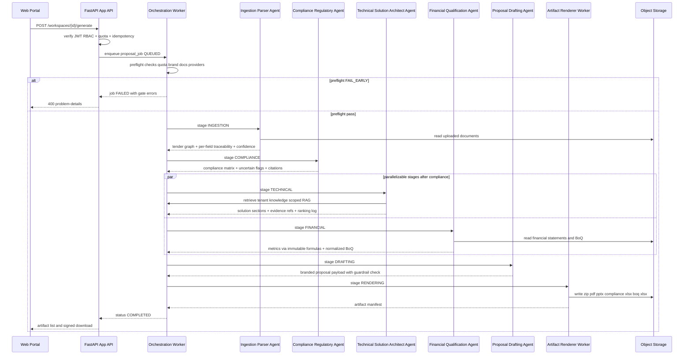
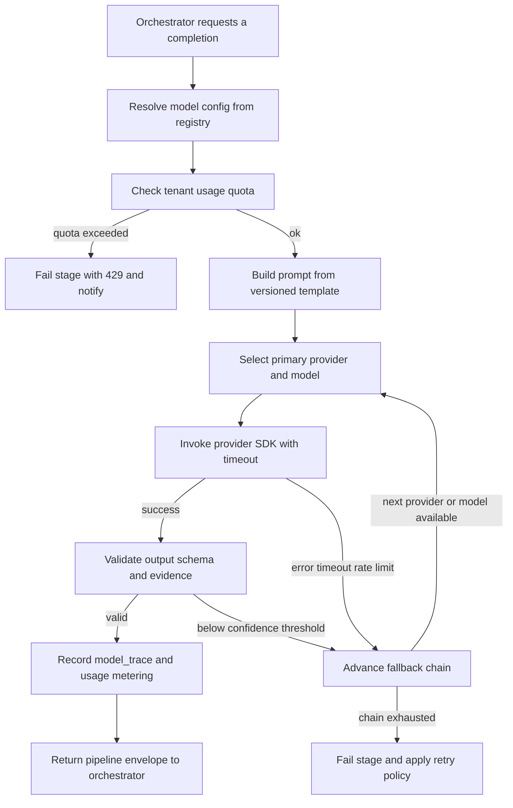

# Arabclue — API Contracts & Multi-Agent Engine Blueprint

| Field | Value |
|---|---|
| **Title** | Arabclue Platform — API Contracts, Multi-Agent Orchestration, Rules/Prompt Engine & AI Provider Abstraction |
| **Status** | Draft |
| **Version** | 0.2.0 |
| **Date** | 2026-08-01 |
| **Owner** | Platform Architecture Team (principal product & solutions architect) |
| **Scope** | V1 web-only, multi-tenant B2B SaaS. This document defines the complete `/api/v1` REST surface (auth, workspaces, documents, brand, knowledge, generation, providers, compliance, financial, artifacts, admin), the deterministic five-agent orchestration engine with its state machine and provenance model, the versioned rules/prompt engine (Saudi procurement law, NCA packs, PDPL, local content, NORA, financial formulas, drafting guardrails), and the AI provider abstraction layer (OpenAI, Google, Anthropic, OpenAI-compatible custom). Sibling documents: `00-architecture-overview.md` (index), `01-backend-services-and-data-layer.md` (services, MongoDB schemas, vector search, worker job catalog), `03-frontend-and-artifact-pipeline.md` (screen maps, artifact pipeline, download UX), `04-security-billing-and-operations.md` (security, billing, notifications, phases, open questions). |

**Open questions** (resolved in `04-security-billing-and-operations.md` §Open Questions — summarized here only): bilingual UX phasing (Arabic-first V1 with English admin), SSO in V1 (out of scope, deferred), internal review screen before final ZIP (optional checkpoint, auto-finalize is the V1 default), deployment target (Vercel functions + managed MongoDB), and local-content scoring advisory vs influencing financial outputs (advisory in V1, does not alter financial qualification outputs).

---

## 1. API Design Conventions

All endpoints hang off the versioned base URL. JSON is the only request/response body format except for multipart uploads and binary downloads.

| Convention | Value |
|---|---|
| Base URL | `https://api.arabclue.com/api/v1` (all paths below are relative to this) |
| Body format | `application/json`; uploads use `multipart/form-data`; downloads return the artifact's content type |
| Auth | Bearer JWT access token for every protected endpoint: `Authorization: Bearer <access_token>` |
| Response envelope | **Plain JSON** — no wrapping `{data: ...}` envelope; resources are returned directly. The only standard envelopes are the error envelope (RFC 7807) and the list envelope |
| List envelope | `{ "items": [...], "total": <int>, "page": <int>, "page_size": <int> }` |
| Error envelope | RFC 7807 problem details: `type, title, status, detail, instance, errors[]` |
| Pagination | Query params `page` (1-based, default 1) and `page_size` (default 20, max 100). Header `X-Total-Count` mirrors `total` for convenience |
| Idempotency | `Idempotency-Key: <uuid>` required on job-creating POSTs (`/generate`, `/vectorize`, financial analysis, compliance matrix). Replayed key returns the original response; mismatch with a different payload returns `409` |
| Correlation | `X-Correlation-Id` — server generates if absent, echoes in every response header and every log line for a request/job |
| Tenant context | `X-Tenant-Id` header must match the JWT `tenant_id` claim. Regular users cannot override; platform admins may pass a different tenant id only with explicit admin-scoped tokens |
| Rate limiting | `X-RateLimit-Limit`, `X-RateLimit-Remaining`, `X-RateLimit-Reset`, and `Retry-After` on `429` responses. Applied per tenant and per user (`04-security-billing-and-operations.md` §Quotas & Rate Limiting) |
| Currency | Money amounts are integers in **minor units** (SAR halalas / USD cents). Ratios are decimal strings with up to 6 decimal places |
| Timestamps | ISO 8601 UTC with `Z` suffix and microsecond precision, e.g. `2026-08-01T12:00:00.123456Z` |
| IDs | **ULID** (26-char Crockford base32) for all public resource identifiers — sortable, collision-safe across distributed workers, safe in URLs. See §9 |

### 1.1 Error Model (RFC 7807)

| Field | Type | Description |
|---|---|---|
| `type` | string | URI identifying the error class, e.g. `https://api.arabclue.com/problems/validation` |
| `title` | string | Short human-readable summary |
| `status` | int | HTTP status code |
| `detail` | string | Human-readable explanation |
| `instance` | string | `X-Correlation-Id` of the failed request (or job id for async failures) |
| `errors[]` | array | Optional field-level errors: `{ "field": "...", "code": "...", "message": "..." }` |

```json
{
  "type": "https://api.arabclue.com/problems/validation",
  "title": "Validation failed",
  "status": 422,
  "detail": "Request body failed schema validation.",
  "instance": "01J8XKZ9Q7H4M2K9V0P3T8X5WA",
  "errors": [
    { "field": "file_type", "code": "invalid_enum_value", "message": "file_type must be one of tender_rfp, tender_sow, tender_specs, tender_evaluation, tender_boq, qualification_docs, financial_statements, company_profile, other" },
    { "field": "checksum", "code": "invalid_sha256", "message": "checksum must be a lowercase sha256 hex string" }
  ]
}
```

### 1.2 RBAC Claims in the JWT

Access tokens carry the following claims (verified by the API gateway auth middleware on every request; UI only renders what the current role permits, see `03-frontend-and-artifact-pipeline.md` §Admin Portal):

```json
{
  "iss": "https://auth.arabclue.com",
  "aud": "arabclue-api",
  "sub": "01J8XKZ9Q7H4M2K9V0P3T8X5WA",
  "jti": "01J8XKZ9Q7H4M2K9V0P3T8X5WB",
  "iat": 1783000000,
  "exp": 1783000900,
  "token_type": "access",
  "tenant_id": "01J8XKZ9Q7H4M2K9V0P3T8X5WC",
  "roles": ["proposal_manager"],
  "permissions": ["workspace:create", "workspace:read", "document:upload", "generation:trigger", "generation:read", "artifact:download", "knowledge:read", "brand:write", "review:approve"],
  "workspace_scopes": ["01J8XKZ9Q7H4M2K9V0P3T8X5WD", "01J8XKZ9Q7H4M2K9V0P3T8X5WE"]
}
```

- `tenant_id` — the owning tenant; every tenant-scoped query is filtered by this claim server-side (never by client-supplied parameters alone).
- `roles[]` — role ids for the user in the tenant.
- `permissions[]` — flattened, effective permission strings (role membership resolved at login; see `01-backend-services-and-data-layer.md` §Auth & RBAC Module).
- `workspace_scopes[]` — for external-consultant-style accounts, the explicit workspace ids the user may touch; empty means no workspace restriction (normal tenant member).

---

## 2. API Contract Catalog

Auth levels: **Public** = no token; **User** = any authenticated tenant member; **Workspace role** = User + workspace membership/scope check (read vs write resolved from permissions); **TenantAdmin** = tenant-scoped admin; **PlatformAdmin** = cross-tenant platform operator.

| Module | Method | Path | Auth | Description |
|---|---|---|---|---|
| Health | GET | `/health` | Public | Liveness probe returning service + dependency status |
| Auth | POST | `/auth/register` | Public | Create tenant + initial admin user (invite-based in prod, see `04` §Security) |
| Auth | POST | `/auth/login` | Public | Exchange credentials for access + refresh tokens, returns user + tenant context |
| Auth | POST | `/auth/refresh` | Public | Rotate refresh token, return new token pair |
| Auth | POST | `/auth/logout` | User | Revoke refresh token, blacklist access token |
| Auth | GET | `/auth/me` | User | Current user profile, tenant, roles, permissions |
| Users | GET | `/users` | TenantAdmin | List tenant users |
| Users | POST | `/users` | TenantAdmin | Invite/create tenant user |
| Users | GET | `/users/{id}` | User | Get user (self always allowed) |
| Users | PATCH | `/users/{id}` | User | Update own profile fields; admin may update role/status |
| Users | DELETE | `/users/{id}` | TenantAdmin | Deactivate user (soft delete) |
| Roles | GET | `/roles` | TenantAdmin | List tenant roles |
| Roles | POST | `/roles` | TenantAdmin | Create custom role with permission set |
| Roles | GET | `/roles/{id}` | TenantAdmin | Get role detail |
| Roles | PATCH | `/roles/{id}` | TenantAdmin | Update role name/permissions |
| Roles | DELETE | `/roles/{id}` | TenantAdmin | Delete role (prevented if assigned) |
| Permissions | GET | `/permissions` | TenantAdmin | Catalog of all assignable permissions |
| Permissions | PUT | `/roles/{id}/permissions` | TenantAdmin | Replace permission set on a role |
| Workspaces | POST | `/workspaces` | Workspace role (manager) | Create tender workspace |
| Workspaces | GET | `/workspaces` | User | List workspaces (scoped by membership/tenant) |
| Workspaces | GET | `/workspaces/{id}` | Workspace role (read) | Workspace detail with documents and members summary |
| Workspaces | PATCH | `/workspaces/{id}` | Workspace role (manager) | Update workspace fields, assignment, due date |
| Workspaces | DELETE | `/workspaces/{id}` | Workspace role (owner) | Archive workspace and its artifacts |
| Documents | POST | `/workspaces/{id}/documents` | Workspace role (write) | Multipart upload with `file_type` validation + sha256 checksum |
| Documents | GET | `/workspaces/{id}/documents` | Workspace role (read) | List workspace documents with parse status |
| Documents | GET | `/documents/{document_id}` | Workspace role (read) | Single document detail incl. parser output summary |
| Documents | DELETE | `/workspaces/{id}/documents/{document_id}` | Workspace role (write) | Remove document |
| Brand | POST | `/brand-profiles` | User (`brand:write`) | Create brand profile (colors, fonts, letterhead) |
| Brand | GET | `/brand-profiles` | User | List tenant brand profiles |
| Brand | GET | `/brand-profiles/{id}` | User | Brand profile detail |
| Brand | PATCH | `/brand-profiles/{id}` | User (`brand:write`) | Update brand profile |
| Brand | POST | `/brand-profiles/{id}/assets` | User (`brand:write`) | Upload brand asset (logo, letterhead, signature) |
| Knowledge | POST | `/knowledge-assets` | User (`knowledge:write`) | Multipart upload of knowledge asset (project card, CV, certification…) |
| Knowledge | GET | `/knowledge-assets` | User | List tenant knowledge assets |
| Knowledge | GET | `/knowledge-assets/{id}` | User | Asset detail incl. vectorization status, chunk count |
| Knowledge | DELETE | `/knowledge-assets/{id}` | User (`knowledge:write`) | Remove asset and its vectors |
| Knowledge | POST | `/knowledge-assets/{id}/vectorize` | User (`knowledge:write`) | Trigger chunking + embedding (idempotent) |
| Knowledge | GET | `/knowledge/search` | User | Semantic search, tenant-scoped, similarity threshold |
| Generation | POST | `/workspaces/{id}/generate` | Workspace role (write) | One-click generation trigger; returns `proposal_job` |
| Generation | GET | `/workspaces/{id}/generation/{job_id}` | Workspace role (read) | Job status with stage-by-stage progress |
| Generation | GET | `/workspaces/{id}/generations` | Workspace role (read) | List generation jobs for workspace |
| Generation | POST | `/workspaces/{id}/generation/{job_id}/cancel` | Workspace role (manager) | Request cancellation of a queued/running job |
| Generation | POST | `/generate/webhook` | Signed callback | Optional async completion callback (HMAC-signed) |
| Providers | POST | `/providers` | PlatformAdmin | Create AI provider (key write-once, encrypted) |
| Providers | GET | `/providers` | PlatformAdmin | List providers |
| Providers | GET | `/providers/{id}` | PlatformAdmin | Provider detail (no raw key) |
| Providers | PATCH | `/providers/{id}` | PlatformAdmin | Update provider (enabled, base_url, defaults) |
| Providers | DELETE | `/providers/{id}` | PlatformAdmin | Delete provider (prevented if referenced by jobs) |
| Providers | GET | `/providers/{id}/models` | PlatformAdmin | Auto-fetch model listing from provider (`?refresh=true` triggers background discovery) |
| Providers | POST | `/providers/{id}/test` | PlatformAdmin | Test connection + optional small completion |
| Providers | PATCH | `/providers/{id}/models/{model_id}` | PlatformAdmin | Patch model params: temperature, max_tokens, confidence_threshold, fallback chain, enable |
| Usage | GET | `/usage` | TenantAdmin | Tenant usage summary (tokens, cost estimate, per-model) |
| Compliance | POST | `/compliance/{workspace_id}/matrix` | Workspace role (write) | Build compliance matrix job |
| Compliance | GET | `/compliance/{workspace_id}/matrix` | Workspace role (read) | Latest compliance matrix with pack versions |
| Financial | POST | `/financial/{workspace_id}/analysis` | Workspace role (write) | Financial qualification analysis job |
| Financial | GET | `/financial/{workspace_id}/analysis` | Workspace role (read) | Latest financial analysis with computed metrics |
| Financial | POST | `/financial/boq/validate` | Workspace role (write) | BoQ sheet validation + normalization job |
| Financial | GET | `/financial/boq/validate/{job_id}` | Workspace role (read) | BoQ validation result: normalized lines + issues |
| Artifacts | GET | `/artifacts/{workspace_id}` | Workspace role (read) | List generated artifacts for workspace |
| Artifacts | GET | `/artifacts/{workspace_id}/{artifact_id}/download` | Workspace role (read) | Signed-URL download (ZIP, PDF, PPTX, compliance XLSX, BOQ XLSX) |
| Admin Secrets | POST | `/admin/env-secrets` | PlatformAdmin | Create encrypted env secret (write-only value) |
| Admin Secrets | GET | `/admin/env-secrets` | PlatformAdmin | List secret keys + metadata only (never values) |
| Admin Secrets | GET | `/admin/env-secrets/{key}` | PlatformAdmin | Secret metadata (value redacted) |
| Admin Secrets | PUT | `/admin/env-secrets/{key}` | PlatformAdmin | Rotate secret value |
| Admin Secrets | DELETE | `/admin/env-secrets/{key}` | PlatformAdmin | Delete secret |
| Billing | GET | `/admin/billing-packages` | PlatformAdmin | List billing packages (public marketing snapshot lives in `04` §Billing) |
| Billing | POST | `/admin/billing-packages` | PlatformAdmin | Create billing package (quotas, price minor units) |
| Billing | PUT | `/admin/billing-packages/{id}` | PlatformAdmin | Update billing package |
| Billing | DELETE | `/admin/billing-packages/{id}` | PlatformAdmin | Deactivate billing package |
| Usage | GET | `/admin/usage-metrics` | PlatformAdmin | Cross-tenant usage metrics |
| Cost | GET | `/admin/cost-metrics` | PlatformAdmin | Cross-tenant AI cost estimates by provider/model |
| Audit | GET | `/admin/audit-logs` | PlatformAdmin | Immutable audit log query (filterable, paginated) |
| Quotas | POST | `/admin/quotas/adjust` | PlatformAdmin | Adjust tenant quota (delta, reason, expiry) |
| Notifications | GET | `/notifications` | User | List notifications for current user |
| Notifications | PATCH | `/notifications/{id}` | User | Mark read / acknowledge |
| Notifications | PATCH | `/notifications/preferences` | User | Channel preferences (email, Slack, WhatsApp) |

---

## 3. Detailed API Contracts

Format per endpoint: contract summary table, request example, response example, error cases. Status codes used: `200` OK, `201` Created, `202` Accepted (async job), `204` No Content, `400` Bad Request, `401` Unauthenticated, `403` Forbidden, `404` Not Found, `409` Conflict, `413` Payload Too Large, `422` Validation/Unprocessable, `429` Rate Limited/Quota Exceeded.

### 3.1 Authentication

#### POST /auth/register

**Auth:** Public. Creates a new tenant, the tenant's initial admin user, and returns tokens directly (production flow is invite-based; see `04-security-billing-and-operations.md` §Security & Governance).

**Body:**

```json
{
  "email": "bid.lead@acme.sa",
  "password": "S3cure!Passw0rd42",
  "full_name": "Sara Alharbi",
  "phone": "+966501234567",
  "company_name": "Acme Solutions Co.",
  "company_cr": "1010123456",
  "locale": "ar",
  "accept_terms": true
}
```

**Response 201:**

```json
{
  "user": {
    "id": "01J8XKZ9Q7H4M2K9V0P3T8X5WA",
    "email": "bid.lead@acme.sa",
    "full_name": "Sara Alharbi",
    "locale": "ar",
    "status": "active",
    "email_verified": false,
    "created_at": "2026-08-01T12:00:00.123456Z"
  },
  "tenant": {
    "id": "01J8XKZ9Q7H4M2K9V0P3T8X5WC",
    "name": "Acme Solutions Co.",
    "plan": "trial",
    "default_brand_profile_id": null
  },
  "tokens": {
    "access_token": "eyJhbGciOi...",
    "refresh_token": "eyJhbGciOi...",
    "expires_in": 900,
    "token_type": "bearer"
  }
}
```

| Status | Case |
|---|---|
| 201 | Tenant + user created, tokens issued |
| 400 | Malformed body (e.g. missing `accept_terms`) |
| 409 | Email or company CR already registered |
| 422 | Schema validation (password policy, email format) |
| 429 | IP/email rate limit |

#### POST /auth/login

**Auth:** Public.

**Body:**

```json
{ "email": "bid.lead@acme.sa", "password": "S3cure!Passw0rd42" }
```

**Response 200** — access + refresh tokens plus full user, tenant, and RBAC context (the client stores nothing else):

```json
{
  "user": {
    "id": "01J8XKZ9Q7H4M2K9V0P3T8X5WA",
    "email": "bid.lead@acme.sa",
    "full_name": "Sara Alharbi",
    "locale": "ar",
    "status": "active"
  },
  "tenant": {
    "id": "01J8XKZ9Q7H4M2K9V0P3T8X5WC",
    "name": "Acme Solutions Co.",
    "plan": "trial",
    "quotas": {
      "documents_per_month": 20,
      "generations_per_month": 5,
      "ai_tokens_per_month": 2000000,
      "storage_bytes": 10737418240
    }
  },
  "roles": ["tenant_admin", "proposal_manager"],
  "permissions": ["workspace:create", "workspace:read", "document:upload", "generation:trigger", "generation:read", "artifact:download", "knowledge:read", "brand:write", "user:manage", "audit:read"],
  "tokens": {
    "access_token": "eyJhbGciOi...",
    "refresh_token": "eyJhbGciOi...",
    "expires_in": 900,
    "token_type": "bearer"
  }
}
```

| Status | Case |
|---|---|
| 200 | Success |
| 401 | Invalid credentials or disabled account |
| 422 | Schema validation |
| 429 | Rate limited (login attempts) |

#### POST /auth/refresh

**Auth:** Public (requires valid refresh token in body). **Rotation:** the returned refresh token is new; the presented token is revoked immediately (reuse of a rotated token → `401` with `refresh_token_revoked` detail).

**Body:**

```json
{ "refresh_token": "eyJhbGciOi..." }
```

**Response 200:**

```json
{
  "access_token": "eyJhbGciOi...",
  "refresh_token": "eyJhbGciOi...",
  "expires_in": 900,
  "token_type": "bearer"
}
```

| Status | Case |
|---|---|
| 200 | New token pair issued, old refresh token rotated |
| 401 | Expired, revoked, or replayed refresh token |
| 422 | Missing/malformed token |

#### POST /auth/logout

**Auth:** User (Bearer access token). Revokes the presented refresh token and blacklists the access token until natural expiry.

**Body:**

```json
{ "refresh_token": "eyJhbGciOi..." }
```

**Response 204** — no body.

| Status | Case |
|---|---|
| 204 | Logged out, refresh token revoked |
| 401 | Invalid access token |
| 422 | Missing refresh token |

#### GET /auth/me

**Auth:** User.

**Response 200:**

```json
{
  "user": {
    "id": "01J8XKZ9Q7H4M2K9V0P3T8X5WA",
    "email": "bid.lead@acme.sa",
    "full_name": "Sara Alharbi",
    "phone": "+966501234567",
    "locale": "ar",
    "status": "active",
    "email_verified": true,
    "created_at": "2026-08-01T12:00:00.123456Z"
  },
  "tenant": {
    "id": "01J8XKZ9Q7H4M2K9V0P3T8X5WC",
    "name": "Acme Solutions Co.",
    "plan": "trial"
  },
  "roles": ["tenant_admin", "proposal_manager"],
  "permissions": ["workspace:create", "workspace:read", "document:upload", "generation:trigger", "generation:read", "artifact:download", "knowledge:read", "brand:write", "user:manage", "audit:read"],
  "workspace_scopes": []
}
```

| Status | Case |
|---|---|
| 200 | Current identity |
| 401 | Missing/invalid token |

### 3.2 Workspaces & Documents

#### POST /workspaces

**Auth:** Workspace role (manager, permission `workspace:create`).

**Body:**

```json
{
  "name": "MoC Cloud Services RFP 1448",
  "tender_reference": "RFP-2026-00123",
  "source": "etimad",
  "description": "Cloud infrastructure and managed services for Ministry of Communications",
  "due_date": "2026-09-15T16:00:00.000000Z",
  "assigned_user_ids": ["01J8XKZ9Q7H4M2K9V0P3T8X5WF"],
  "locale": "ar",
  "currency": "SAR"
}
```

**Response 201:**

```json
{
  "id": "01J8XKZ9Q7H4M2K9V0P3T8X5WD",
  "tenant_id": "01J8XKZ9Q7H4M2K9V0P3T8X5WC",
  "name": "MoC Cloud Services RFP 1448",
  "tender_reference": "RFP-2026-00123",
  "source": "etimad",
  "status": "draft",
  "locale": "ar",
  "currency": "SAR",
  "due_date": "2026-09-15T16:00:00.000000Z",
  "document_count": 0,
  "brand_profile_id": null,
  "created_by": "01J8XKZ9Q7H4M2K9V0P3T8X5WA",
  "created_at": "2026-08-01T12:05:00.000000Z",
  "updated_at": "2026-08-01T12:05:00.000000Z"
}
```

| Status | Case |
|---|---|
| 201 | Workspace created |
| 400 | Bad body (e.g. unknown `source`) |
| 403 | Missing `workspace:create` permission |
| 422 | Schema validation (missing name, bad currency, overdue due_date) |
| 429 | Workspace creation rate limit |

#### GET /workspaces

**Auth:** User. Query: `page`, `page_size`, `status` (`draft|active|archived`), `q` (name/tender reference substring), `assigned_to_me=true`.

**Response 200:**

```json
{
  "items": [
    {
      "id": "01J8XKZ9Q7H4M2K9V0P3T8X5WD",
      "name": "MoC Cloud Services RFP 1448",
      "tender_reference": "RFP-2026-00123",
      "status": "active",
      "due_date": "2026-09-15T16:00:00.000000Z",
      "document_count": 4,
      "last_generation_status": "COMPLETED",
      "updated_at": "2026-08-01T12:30:00.000000Z"
    }
  ],
  "total": 1,
  "page": 1,
  "page_size": 20
}
```

| Status | Case |
|---|---|
| 200 | List (empty `items` allowed) |
| 401 | Unauthenticated |

#### GET /workspaces/{id}

**Auth:** Workspace role (read). Returns detail plus member and document summary.

**Response 200:**

```json
{
  "id": "01J8XKZ9Q7H4M2K9V0P3T8X5WD",
  "tenant_id": "01J8XKZ9Q7H4M2K9V0P3T8X5WC",
  "name": "MoC Cloud Services RFP 1448",
  "tender_reference": "RFP-2026-00123",
  "status": "active",
  "due_date": "2026-09-15T16:00:00.000000Z",
  "documents": [
    { "id": "01J8XKZ9Q7H4M2K9V0P3T8X5WG", "file_type": "tender_rfp", "title": "RFP-2026-00123.pdf", "status": "parsed", "lang": "ar", "pages": 64, "checksum": "sha256:..." }
  ],
  "members": [ { "user_id": "01J8XKZ9Q7H4M2K9V0P3T8X5WA", "role": "manager" } ],
  "brand_profile_id": "01J8XKZ9Q7H4M2K9V0P3T8X5WH",
  "created_by": "01J8XKZ9Q7H4M2K9V0P3T8X5WA",
  "created_at": "2026-08-01T12:05:00.000000Z",
  "updated_at": "2026-08-01T12:30:00.000000Z"
}
```

| Status | Case |
|---|---|
| 200 | Workspace detail |
| 403 | User not a member of this workspace (or outside `workspace_scopes`) |
| 404 | Workspace not found |

#### POST /workspaces/{id}/documents

**Auth:** Workspace role (write, permission `document:upload`). `multipart/form-data`. `file_type` is validated against the closed enum; the client-computed `checksum` (lowercase sha256 of the raw bytes) is verified server-side before storage.

| Form field | Type | Description |
|---|---|---|
| `file` | binary | The uploaded tender document |
| `file_type` | string enum | `tender_rfp` \| `tender_sow` \| `tender_specs` \| `tender_evaluation` \| `tender_boq` \| `qualification_docs` \| `financial_statements` \| `company_profile` \| `other` |
| `title` | string | Optional display title (defaults to filename) |
| `language_hint` | string | `ar` \| `en` \| `mixed` (optional; parser also auto-detects) |
| `checksum` | string | sha256 hex of the uploaded bytes |

**Response 201:**

```json
{
  "id": "01J8XKZ9Q7H4M2K9V0P3T8X5WG",
  "workspace_id": "01J8XKZ9Q7H4M2K9V0P3T8X5WD",
  "file_type": "tender_rfp",
  "title": "RFP-2026-00123.pdf",
  "original_filename": "RFP-2026-00123.pdf",
  "storage_key": "tenants/01J8XKZ9Q7H4M2K9V0P3T8X5WC/workspaces/01J8XKZ9Q7H4M2K9V0P3T8X5WD/documents/01J8XKZ9Q7H4M2K9V0P3T8X5WG.pdf",
  "size_bytes": 4821910,
  "checksum": "sha256:9f86d081884c7d659a2feaa0c55ad015a3bf4f1b2b0b822cd15d6c15b0f00a08",
  "status": "uploaded",
  "parser_status": null,
  "uploaded_by": "01J8XKZ9Q7H4M2K9V0P3T8X5WA",
  "created_at": "2026-08-01T12:32:00.000000Z"
}
```

The upload is queued to the Document Intelligence worker (`01-backend-services-and-data-layer.md` §Worker Job Catalog); `status` transitions `uploaded → processing → parsed | failed`, surfaced on `GET /documents/{id}`.

| Status | Case |
|---|---|
| 201 | Stored, parse job queued |
| 400 | Bad multipart body / unsupported file extension |
| 403 | Missing `document:upload` permission |
| 404 | Workspace not found |
| 413 | File exceeds `MAX_UPLOAD_BYTES` (default 100 MB) |
| 422 | Invalid `file_type` or checksum mismatch |
| 429 | Upload quota exceeded for the period |

#### GET /workspaces/{id}/documents

**Auth:** Workspace role (read).

**Response 200:**

```json
{
  "items": [
    {
      "id": "01J8XKZ9Q7H4M2K9V0P3T8X5WG",
      "file_type": "tender_rfp",
      "title": "RFP-2026-00123.pdf",
      "status": "parsed",
      "lang": "ar",
      "pages": 64,
      "size_bytes": 4821910,
      "checksum": "sha256:9f86...",
      "parse_confidence": 0.94,
      "parsed_at": "2026-08-01T12:35:00.000000Z"
    }
  ],
  "total": 1,
  "page": 1,
  "page_size": 20
}
```

| Status | Case |
|---|---|
| 200 | Document list |
| 403 | Not a workspace member |
| 404 | Workspace not found |

#### POST /workspaces/{id}/generate

**Auth:** Workspace role (write, permission `generation:trigger`). Header `Idempotency-Key` **required**. Triggers the deterministic five-agent workflow (§4). Returns the `proposal_job` immediately.

**Body:**

```json
{
  "include_technical": true,
  "include_compliance": true,
  "include_financial": true,
  "include_boq": true,
  "brand_profile_id": "01J8XKZ9Q7H4M2K9V0P3T8X5WH",
  "gate_policy": "PROCEED_WITH_WARNINGS",
  "model_preferences": {
    "temperature": 0.2,
    "max_tokens": 4096,
    "confidence_threshold": 0.7
  },
  "fallback_chain": [
    { "provider_id": "01J8XKZ9Q7H4M2K9V0P3T8X5WJ", "model_id": "claude-sonnet-4.5" },
    { "provider_id": "01J8XKZ9Q7H4M2K9V0P3T8X5WK", "model_id": "gpt-4o" }
  ],
  "notification": { "on_complete": "email", "webhook_url": null }
}
```

**Response 202:**

```json
{
  "job_id": "01J8XKZ9Q7H4M2K9V0P3T8X5WL",
  "workspace_id": "01J8XKZ9Q7H4M2K9V0P3T8X5WD",
  "status": "QUEUED",
  "current_stage": null,
  "stage_progress": [
    { "stage": "INGESTION", "status": "PENDING" },
    { "stage": "COMPLIANCE", "status": "PENDING" },
    { "stage": "TECHNICAL", "status": "PENDING" },
    { "stage": "FINANCIAL", "status": "PENDING" },
    { "stage": "DRAFTING", "status": "PENDING" },
    { "stage": "RENDERING", "status": "PENDING" }
  ],
  "polling_url": "/api/v1/workspaces/01J8XKZ9Q7H4M2K9V0P3T8X5WD/generation/01J8XKZ9Q7H4M2K9V0P3T8X5WL",
  "created_at": "2026-08-01T12:40:00.000000Z"
}
```

| Status | Case |
|---|---|
| 202 | Job queued (idempotent replay returns 200 with original job) |
| 400 | Preflight FAIL_EARLY (see §4.4) with structured gate errors |
| 403 | Missing `generation:trigger` permission |
| 404 | Workspace not found |
| 409 | `Idempotency-Key` reused with a different payload |
| 422 | Schema validation / no parsed tender documents |
| 429 | Generation quota exhausted for the billing period |

#### GET /workspaces/{id}/generation/{job_id}

**Auth:** Workspace role (read, permission `generation:read`). Polled by the client; the response carries stage-by-stage progress, gate policy, warnings, and model trace.

**Response 200 (mid-flight example):**

```json
{
  "job_id": "01J8XKZ9Q7H4M2K9V0P3T8X5WL",
  "workspace_id": "01J8XKZ9Q7H4M2K9V0P3T8X5WD",
  "status": "COMPLIANCE",
  "current_stage": "COMPLIANCE",
  "gate_policy": "PROCEED_WITH_WARNINGS",
  "stage_progress": [
    { "stage": "INGESTION", "status": "COMPLETED", "confidence": 0.94, "started_at": "2026-08-01T12:40:05.000000Z", "completed_at": "2026-08-01T12:40:18.400000Z", "duration_ms": 13400 },
    { "stage": "COMPLIANCE", "status": "RUNNING", "progress_pct": 45, "started_at": "2026-08-01T12:40:19.000000Z", "completed_at": null, "duration_ms": 3800 },
    { "stage": "TECHNICAL", "status": "PENDING" },
    { "stage": "FINANCIAL", "status": "PENDING" },
    { "stage": "DRAFTING", "status": "PENDING" },
    { "stage": "RENDERING", "status": "PENDING" }
  ],
  "warnings": [
    { "stage": "COMPLIANCE", "code": "UNCERTAIN_INTERPRETATION", "message": "NCA classification of service scope is ambiguous; flagged for review, output auto-finalizes." }
  ],
  "model_trace": [
    { "stage": "COMPLIANCE", "provider_id": "01J8XKZ9Q7H4M2K9V0P3T8X5WJ", "model_id": "claude-sonnet-4.5", "attempt": 1, "tokens_in": 12400, "tokens_out": 3500, "cost_estimate_minor_usd": 125, "latency_ms": 8400, "status": "ok" }
  ],
  "created_at": "2026-08-01T12:40:00.000000Z",
  "updated_at": "2026-08-01T12:40:23.000000Z"
}
```

| Status | Case |
|---|---|
| 200 | Job status (final states include `artifact_ids` and `error` when failed) |
| 403 | Not a member of the workspace |
| 404 | Job or workspace not found |

### 3.3 Brand & Knowledge

#### POST /brand-profiles

**Auth:** User (permission `brand:write`).

**Body:**

```json
{
  "name": "Acme Corporate Brand 2026",
  "company_name_ar": "شركة أكاديمية الحلول",
  "company_name_en": "Acme Solutions Co.",
  "logo_asset_id": null,
  "colors": { "primary": "#0B3D91", "secondary": "#F2A900", "accent": "#1B75BC" },
  "fonts": { "arabic": "IBM Plex Sans Arabic", "latin": "Inter" },
  "letterhead": { "header_enabled": true, "footer_enabled": true },
  "default_sections": ["project_understanding", "methodology", "team", "implementation_plan", "compliance_statement"]
}
```

**Response 201:**

```json
{
  "id": "01J8XKZ9Q7H4M2K9V0P3T8X5WH",
  "tenant_id": "01J8XKZ9Q7H4M2K9V0P3T8X5WC",
  "name": "Acme Corporate Brand 2026",
  "company_name_ar": "شركة أكاديمية الحلول",
  "company_name_en": "Acme Solutions Co.",
  "colors": { "primary": "#0B3D91", "secondary": "#F2A900", "accent": "#1B75BC" },
  "fonts": { "arabic": "IBM Plex Sans Arabic", "latin": "Inter" },
  "is_default": false,
  "created_at": "2026-08-01T12:10:00.000000Z",
  "updated_at": "2026-08-01T12:10:00.000000Z"
}
```

| Status | Case |
|---|---|
| 201 | Brand profile created |
| 403 | Missing `brand:write` |
| 422 | Schema validation (invalid hex color, missing names) |

#### POST /brand-profiles/{id}/assets

**Auth:** User (permission `brand:write`). Multipart: `file`, `asset_type` (`logo` \| `letterhead` \| `footer` \| `signature` \| `sample_document`), `title`. SVG logos are validated against the brand policy (`src/lib/brand-policy.ts` equivalent server-side check).

**Response 201:**

```json
{
  "id": "01J8XKZ9Q7H4M2K9V0P3T8X5WM",
  "brand_profile_id": "01J8XKZ9Q7H4M2K9V0P3T8X5WH",
  "asset_type": "logo",
  "title": "Acme logo",
  "storage_key": "tenants/.../brand/01J8XKZ9Q7H4M2K9V0P3T8X5WM.svg",
  "size_bytes": 18420,
  "content_type": "image/svg+xml",
  "created_at": "2026-08-01T12:11:00.000000Z"
}
```

| Status | Case |
|---|---|
| 201 | Asset stored |
| 403 | Missing permission or not owner of profile |
| 404 | Brand profile not found |
| 422 | Invalid asset_type / disallowed format |
| 429 | Storage quota exceeded |

#### POST /knowledge-assets

**Auth:** User (permission `knowledge:write`). Multipart: `file`, `asset_type` (`project_card` \| `resume` \| `certification` \| `capability_statement` \| `case_study` \| `credential` \| `company_profile`), `title`, `description`, `tags[]`, `language_hint`.

**Response 201:**

```json
{
  "id": "01J8XKZ9Q7H4M2K9V0P3T8X5WN",
  "tenant_id": "01J8XKZ9Q7H4M2K9V0P3T8X5WC",
  "asset_type": "project_card",
  "title": "MoH Data Platform Implementation 2024",
  "description": "Completed EMR data platform for MoH — 18 month delivery",
  "tags": ["health", "data-platform", "cloud"],
  "status": "uploaded",
  "vectorization_status": null,
  "storage_key": "tenants/.../knowledge/01J8XKZ9Q7H4M2K9V0P3T8X5WN.pdf",
  "size_bytes": 220411,
  "checksum": "sha256:...",
  "created_by": "01J8XKZ9Q7H4M2K9V0P3T8X5WA",
  "created_at": "2026-08-01T12:15:00.000000Z"
}
```

| Status | Case |
|---|---|
| 201 | Asset stored |
| 403 | Missing `knowledge:write` |
| 422 | Invalid asset_type / unsupported file type |
| 429 | Storage quota exceeded |

#### POST /knowledge-assets/{id}/vectorize

**Auth:** User (permission `knowledge:write`). Idempotent — re-vectorizing replaces the previous chunk set for the asset.

**Body:**

```json
{ "chunk_size": 600, "chunk_overlap": 100, "embedding_model": "default" }
```

**Response 202:**

```json
{
  "job_id": "01J8XKZ9Q7H4M2K9V0P3T8X5WP",
  "asset_id": "01J8XKZ9Q7H4M2K9V0P3T8X5WN",
  "status": "QUEUED",
  "embedding_model": "text-embedding-3-small",
  "created_at": "2026-08-01T12:16:00.000000Z"
}
```

Progress is polled via `GET /knowledge-assets/{id}`, which reports `vectorization_status` (`queued|indexing|ready|failed`), `chunk_count`, and `indexed_at`.

| Status | Case |
|---|---|
| 202 | Vectorization queued |
| 403 | Missing permission or asset belongs to another tenant |
| 404 | Asset not found |
| 409 | Asset still being ingested |
| 422 | Asset type not vectorizable (e.g. unknown binary) |

#### GET /knowledge/search

**Auth:** User (permission `knowledge:read`). Semantic search **strictly scoped to the calling tenant's vectors** — `tenant_id` always comes from the JWT and can never be overridden by query params. Query params: `q`, `similarity_threshold` (float 0–1, default 0.55), `limit` (default 10, max 50), `asset_type` (optional filter), `offset`.

**Response 200:**

```json
{
  "items": [
    {
      "asset_id": "01J8XKZ9Q7H4M2K9V0P3T8X5WN",
      "chunk_id": "01J8XKZ9Q7H4M2K9V0P3T8X5WQ",
      "score": 0.83,
      "asset_type": "project_card",
      "title": "MoH Data Platform Implementation 2024",
      "snippet": "Delivered a national health data platform on government cloud, achieving NCA ECC-1 alignment and 99.95% availability over 18 months...",
      "evidence_ref": { "kind": "knowledge", "asset_id": "01J8XKZ9Q7H4M2K9V0P3T8X5WN", "chunk_id": "01J8XKZ9Q7H4M2K9V0P3T8X5WQ", "score": 0.83 }
    }
  ],
  "query": "cloud data platform NCA",
  "threshold": 0.55,
  "total": 1
}
```

Ranking logs for audit are written per query (§4.6).

| Status | Case |
|---|---|
| 200 | Results (empty allowed) |
| 403 | Missing `knowledge:read` |
| 422 | Missing `q` or threshold out of range |

### 3.4 AI Providers, Models & Usage

#### POST /providers

**Auth:** PlatformAdmin. The raw `api_key` is **write-once**: accepted at creation, encrypted with KMS before storage, and never returned. Pre-stored secrets may be referenced via `api_key_ref` (see `04-security-billing-and-operations.md` §Security).

**Body:**

```json
{
  "name": "Acme OpenAI-Compatible Gateway",
  "provider_type": "openai_compatible",
  "base_url": "https://openai.acme.example.com/v1",
  "api_key": "sk-write-once-...",
  "enabled": true,
  "default_model_id": null,
  "config": { "api_version": "2026-02-01", "timeout_seconds": 60, "max_retries": 2 }
}
```

**Response 201:**

```json
{
  "provider_id": "01J8XKZ9Q7H4M2K9V0P3T8X5WJ",
  "name": "Acme OpenAI-Compatible Gateway",
  "provider_type": "openai_compatible",
  "base_url": "https://openai.acme.example.com/v1",
  "api_key_ref": "enc:providers/01J8XKZ9Q7H4M2K9V0P3T8X5WJ/api_key",
  "enabled": true,
  "default_model_id": null,
  "model_count": 0,
  "created_at": "2026-08-01T13:00:00.000000Z",
  "updated_at": "2026-08-01T13:00:00.000000Z"
}
```

| Status | Case |
|---|---|
| 201 | Provider created, key encrypted |
| 400 | Invalid `provider_type` or missing base_url for `openai_compatible` |
| 403 | Requires `provider:write` |
| 409 | Provider with same base_url already exists |
| 422 | Schema validation |

#### GET /providers

**Auth:** PlatformAdmin. Paginated list envelope; response items are provider records without any key material.

#### GET /providers/{id}/models

**Auth:** PlatformAdmin. Auto model discovery. With no query params it returns the cached discovered listing; with `?refresh=true` it enqueues a background fetch of `GET {base_url}/models` (OpenAI-compatible) or the native catalog for OpenAI/Google/Anthropic and returns `202`.

**Response 200:**

```json
{
  "provider_id": "01J8XKZ9Q7H4M2K9V0P3T8X5WJ",
  "discovered_at": "2026-08-01T13:05:00.000000Z",
  "items": [
    {
      "model_id": "01J8XKZ9Q7H4M2K9V0P3T8X5WR",
      "provider_id": "01J8XKZ9Q7H4M2K9V0P3T8X5WJ",
      "name": "gpt-5.2",
      "context_window": 400000,
      "max_output_tokens": 16384,
      "supports_vision": true,
      "input_cost_per_1k": 250,
      "output_cost_per_1k": 1000,
      "is_discovered": true,
      "enabled": false,
      "capabilities": ["chat", "vision", "structured_output", "function_calling"]
    }
  ],
  "total": 1
}
```

Costs are integers in minor units of USD (milli-cents per 1k tokens) — the platform's admin cost model; per-provider pricing sheets live in the provider registry (`01-backend-services-and-data-layer.md` §Provider & Model Registry).

| Status | Case |
|---|---|
| 200 | Cached model listing |
| 202 | Background discovery queued (`?refresh=true`) |
| 401/403 | Unauthenticated / not PlatformAdmin |
| 404 | Provider not found |
| 502 | Provider `/models` unreachable (discovery failure recorded, previous listing kept) |

#### POST /providers/{id}/test

**Auth:** PlatformAdmin. Sends a minimal ping completion to validate credentials, base_url, and model availability.

**Body:**

```json
{ "model_id": "01J8XKZ9Q7H4M2K9V0P3T8X5WR", "message": "ping" }
```

**Response 200:**

```json
{
  "success": true,
  "provider_id": "01J8XKZ9Q7H4M2K9V0P3T8X5WJ",
  "model_id": "01J8XKZ9Q7H4M2K9V0P3T8X5WR",
  "latency_ms": 420,
  "response_preview": "pong",
  "tested_at": "2026-08-01T13:10:00.000000Z"
}
```

| Status | Case |
|---|---|
| 200 | Connection verified (or `success:false` with `error` detail) |
| 403 | Not PlatformAdmin |
| 404 | Provider or model not found |
| 502 | Provider endpoint unreachable / auth rejected |

#### PATCH /providers/{id}/models/{model_id}

**Auth:** PlatformAdmin. Patch parameter controls used by the AI gateway.

**Body:**

```json
{
  "enabled": true,
  "temperature": 0.2,
  "max_tokens": 4096,
  "confidence_threshold": 0.7,
  "fallback_chain": [
    { "provider_id": "01J8XKZ9Q7H4M2K9V0P3T8X5WJ", "model_id": "claude-sonnet-4.5" },
    { "provider_id": "01J8XKZ9Q7H4M2K9V0P3T8X5WK", "model_id": "gpt-4o" }
  ],
  "default_for_provider": true
}
```

**Response 200** — updated model record (same shape as in discovery listing, with `enabled`, `temperature`, `max_tokens`, `confidence_threshold`, `fallback_chain`).

| Status | Case |
|---|---|
| 200 | Model updated |
| 403 | Not PlatformAdmin |
| 404 | Model not found |
| 422 | temperature outside 0–1, max_tokens > context_window, threshold outside 0–1 |

#### GET /usage

**Auth:** TenantAdmin. Tenant-scoped usage summary. Query: `period` (`day|week|month`, default `month`), `group_by` (`day|model`).

**Response 200:**

```json
{
  "tenant_id": "01J8XKZ9Q7H4M2K9V0P3T8X5WC",
  "period": "month",
  "totals": {
    "tokens_in": 12300000,
    "tokens_out": 4200000,
    "cost_estimate_minor_usd": 1234500,
    "generations": 12
  },
  "by_model": [
    { "model_id": "claude-sonnet-4.5", "tokens_in": 8200000, "tokens_out": 2900000, "cost_estimate_minor_usd": 800000 }
  ]
}
```

| Status | Case |
|---|---|
| 200 | Usage summary |
| 403 | Requires `usage:read` |

### 3.5 Compliance & Financial

#### POST /compliance/{workspace_id}/matrix

**Auth:** Workspace role (write, permission `generation:manage`). Requires a completed ingestion for the workspace. Optionally pins pack versions (snapshots; default = latest stable per pack).

**Body:**

```json
{
  "pack_versions": {
    "saudi-procurement-law": "1.4.0",
    "nca-ecc1-2018": "1.2.0",
    "nca-ccc1-2020": "1.2.0",
    "pdpl": "1.1.0",
    "local-content": "1.0.0",
    "nora": "1.0.0"
  },
  "include_review_flags": true,
  "output_style": "tender_order"
}
```

**Response 202:**

```json
{
  "matrix_job_id": "01J8XKZ9Q7H4M2K9V0P3T8X5WS",
  "workspace_id": "01J8XKZ9Q7H4M2K9V0P3T8X5WD",
  "status": "QUEUED",
  "polling_url": "/api/v1/compliance/01J8XKZ9Q7H4M2K9V0P3T8X5WD/matrix",
  "created_at": "2026-08-01T13:20:00.000000Z"
}
```

| Status | Case |
|---|---|
| 202 | Matrix build queued |
| 403 | Missing permission |
| 404 | Workspace not found |
| 422 | No parsed documents in workspace |
| 429 | Quota exceeded |

#### GET /compliance/{workspace_id}/matrix

**Auth:** Workspace role (read). Returns the latest matrix (or `404` if none/in-flight).

**Response 200:**

```json
{
  "workspace_id": "01J8XKZ9Q7H4M2K9V0P3T8X5WD",
  "matrix_job_id": "01J8XKZ9Q7H4M2K9V0P3T8X5WS",
  "pack_versions": {
    "saudi-procurement-law": "1.4.0",
    "nca-ecc1-2018": "1.2.0",
    "nca-ccc1-2020": "1.2.0",
    "pdpl": "1.1.0",
    "local-content": "1.0.0",
    "nora": "1.0.0"
  },
  "generated_at": "2026-08-01T13:25:00.000000Z",
  "summary": { "total_requirements": 48, "compliant_with_evidence": 31, "partially_compliant": 9, "not_addressed": 5, "not_applicable": 2, "uncertain_interpretation": 1 },
  "items": [
    {
      "requirement_ref": "R-014",
      "requirement_text": "توفير خدمة سحابية معتمدة لدى الهيئة الوطنية للأمن السيبراني",
      "requirement_source": { "doc_id": "01J8XKZ9Q7H4M2K9V0P3T8X5WG", "chunk_id": "01J8XKZ9Q7H4M2K9V0P3T8X5WT", "page": 12, "span_start": 400, "span_end": 520, "lang": "ar" },
      "category": "technical_requirement",
      "matched_rules": [ { "rule_id": "NCA-ECC1-2018-4.1", "pack": "nca-ecc1-2018", "code": "CRYPTO-01" } ],
      "outcome": "uncertain_interpretation",
      "status": "PROCEED_WITH_WARNINGS",
      "citation": "NCA ECC-1:2018 §4.1 Cryptographic Controls",
      "severity": "MANDATORY",
      "confidence": 0.61,
      "evidence_refs": [
        { "kind": "tender_text", "doc_id": "01J8XKZ9Q7H4M2K9V0P3T8X5WG", "chunk_id": "01J8XKZ9Q7H4M2K9V0P3T8X5WT", "page": 12, "span_start": 400, "span_end": 520, "lang": "ar" }
      ],
      "review_flagged": true,
      "review_note": "Interpretation of the term معتمدة requires confirmation of the classification tier. Flagged for human review metadata; output auto-finalizes per V1 policy.",
      "pack_version": "1.2.0"
    }
  ]
}
```

| Status | Case |
|---|---|
| 200 | Latest matrix |
| 404 | No matrix yet (or workspace not found) |
| 403 | Not a workspace member |

#### POST /financial/{workspace_id}/analysis

**Auth:** Workspace role (write, permission `generation:manage`). Requires an uploaded `financial_statements` document (or tenant credential asset) that has been parsed.

**Body:**

```json
{
  "financial_statements_doc_id": "01J8XKZ9Q7H4M2K9V0P3T8X5WU",
  "currency": "SAR",
  "fiscal_year": 2025,
  "required_metrics": ["QUICK_LIQUIDITY_RATIO", "CURRENT_RATIO", "DEBT_TO_EQUITY", "NET_WORTH", "PROFIT_MARGIN", "BID_CAPACITY"]
}
```

**Response 202:**

```json
{
  "analysis_job_id": "01J8XKZ9Q7H4M2K9V0P3T8X5WV",
  "workspace_id": "01J8XKZ9Q7H4M2K9V0P3T8X5WD",
  "status": "QUEUED",
  "polling_url": "/api/v1/financial/01J8XKZ9Q7H4M2K9V0P3T8X5WD/analysis",
  "created_at": "2026-08-01T13:30:00.000000Z"
}
```

| Status | Case |
|---|---|
| 202 | Analysis queued |
| 403 | Missing permission |
| 404 | Workspace or statements document not found |
| 422 | Statements not parsed / currency unsupported |
| 429 | Quota exceeded |

`GET /financial/{workspace_id}/analysis` returns the computed metrics (shape shown in §5.4 formula example).

#### POST /financial/boq/validate

**Auth:** Workspace role (write, permission `generation:manage`). Validates and normalizes a BoQ sheet. The job produces normalized line items and a validation summary (§5.5).

**Body:**

```json
{
  "workspace_id": "01J8XKZ9Q7H4M2K9V0P3T8X5WD",
  "boq_document_id": "01J8XKZ9Q7H4M2K9V0P3T8X5WX",
  "currency_hint": "SAR",
  "vat_rate_hint": 0.15
}
```

**Response 202:**

```json
{
  "job_id": "01J8XKZ9Q7H4M2K9V0P3T8X5WY",
  "workspace_id": "01J8XKZ9Q7H4M2K9V0P3T8X5WD",
  "status": "QUEUED",
  "polling_url": "/api/v1/financial/boq/validate/01J8XKZ9Q7H4M2K9V0P3T8X5WY",
  "created_at": "2026-08-01T13:35:00.000000Z"
}
```

| Status | Case |
|---|---|
| 202 | Validation queued |
| 403 | Missing permission |
| 404 | BoQ document not found |
| 422 | Not a spreadsheet file / not parsed |
| 429 | Quota exceeded |

`GET /financial/boq/validate/{job_id}` returns the completed result (§5.5 normalized BoQ example).

### 3.6 Artifacts & Download

#### GET /artifacts/{workspace_id}

**Auth:** Workspace role (read).

**Response 200:**

```json
{
  "items": [
    { "artifact_id": "01J8XKZ9Q7H4M2K9V0P3T8X5WZ", "workspace_id": "01J8XKZ9Q7H4M2K9V0P3T8X5WD", "job_id": "01J8XKZ9Q7H4M2K9V0P3T8X5WL", "kind": "proposal_zip", "title": "Acme_MoC_Cloud_2026.zip", "content_type": "application/zip", "size_bytes": 18420422, "status": "ready", "created_at": "2026-08-01T14:10:00.000000Z" },
    { "artifact_id": "01J8XKZ9Q7H4M2K9V0P3T8X5XA", "kind": "proposal_pdf", "title": "Acme_MoC_Cloud_2026_Technical_Proposal.pdf", "content_type": "application/pdf", "size_bytes": 8420331, "status": "ready", "created_at": "2026-08-01T14:09:00.000000Z" },
    { "artifact_id": "01J8XKZ9Q7H4M2K9V0P3T8X5XB", "kind": "slides_pptx", "title": "Acme_MoC_Cloud_2026_Presentation.pptx", "content_type": "application/vnd.openxmlformats-officedocument.presentationml.presentation", "size_bytes": 4912033, "status": "ready", "created_at": "2026-08-01T14:09:00.000000Z" },
    { "artifact_id": "01J8XKZ9Q7H4M2K9V0P3T8X5XC", "kind": "compliance_xlsx", "title": "Compliance_Matrix_MoC_Cloud_2026.xlsx", "content_type": "application/vnd.openxmlformats-officedocument.spreadsheetml.sheet", "size_bytes": 112033, "status": "ready", "created_at": "2026-08-01T14:08:00.000000Z" },
    { "artifact_id": "01J8XKZ9Q7H4M2K9V0P3T8X5XD", "kind": "boq_xlsx", "title": "BOQ_MoC_Cloud_2026.xlsx", "content_type": "application/vnd.openxmlformats-officedocument.spreadsheetml.sheet", "size_bytes": 94211, "status": "ready", "created_at": "2026-08-01T14:08:00.000000Z" }
  ],
  "total": 5
}
```

Artifact kinds: `proposal_zip`, `proposal_pdf`, `slides_pptx`, `compliance_xlsx`, `boq_xlsx`. Rendering details live in `03-frontend-and-artifact-pipeline.md` §Artifact Pipeline.

| Status | Case |
|---|---|
| 200 | Artifact list |
| 403 | Not a workspace member |
| 404 | Workspace not found |

#### GET /artifacts/{workspace_id}/{artifact_id}/download

**Auth:** Workspace role (read). **Signed-URL download flow:** the API verifies membership + artifact ownership, then returns a short-lived presigned URL to S3-compatible storage. The client follows the URL directly (or receives a `302` redirect). URLs expire after 15 minutes and are single-purpose (GET only).

**Response 200 (preferred — explicit URL):**

```json
{
  "artifact_id": "01J8XKZ9Q7H4M2K9V0P3T8X5XA",
  "title": "Acme_MoC_Cloud_2026_Technical_Proposal.pdf",
  "download_url": "https://cdn.arabclue.com/tenants/.../artifacts/01J8XKZ9Q7H4M2K9V0P3T8X5XA.pdf?X-Amz-...&X-Amz-Signature=...",
  "expires_at": "2026-08-01T14:30:00.000000Z",
  "method": "GET",
  "content_type": "application/pdf"
}
```

**Alternative:** `302 Found` with `Location: <presigned-url>` — choose one per deployment; the JSON form is the documented default.

| Status | Case |
|---|---|
| 200 | Presigned URL issued |
| 302 | Redirect variant |
| 403 | Not a workspace member |
| 404 | Artifact not found / not ready |
| 410 | Artifact expired or purged |

### 3.7 Admin Panel Contracts

All admin endpoints require PlatformAdmin (`admin:*` permissions) unless noted.

#### POST /admin/env-secrets

**Body:**

```json
{
  "key": "SMTP_PASSWORD",
  "value": "write-only-value",
  "scope": "global",
  "description": "SMTP relay password",
  "encrypted": true
}
```

**Response 201** — the value is **never returned**:

```json
{
  "key": "SMTP_PASSWORD",
  "scope": "global",
  "description": "SMTP relay password",
  "encrypted": true,
  "value_redacted": "••••••••",
  "created_at": "2026-08-01T15:00:00.000000Z",
  "updated_at": "2026-08-01T15:00:00.000000Z"
}
```

| Status | Case |
|---|---|
| 201 | Secret encrypted and stored |
| 403 | Not PlatformAdmin |
| 409 | Key already exists (use PUT) |
| 422 | Missing key/value |

`GET /admin/env-secrets` returns keys + metadata only (never values). `PUT /admin/env-secrets/{key}` rotates the value (write-only). `DELETE /admin/env-secrets/{key}` removes it. The secrets are managed via the encrypted env settings service (`04-security-billing-and-operations.md` §Security).

#### POST /admin/billing-packages

**Body:**

```json
{
  "name": "Growth",
  "price_minor": 149900,
  "currency": "SAR",
  "billing_cycle": "monthly",
  "quotas": {
    "documents_per_month": 100,
    "knowledge_assets": 500,
    "workspaces": 25,
    "generations_per_month": 40,
    "ai_tokens_per_month": 20000000,
    "storage_bytes": 107374182400
  },
  "features": ["artifacts", "boq", "compliance", "api_access", "priority_queue"],
  "is_active": true
}
```

**Response 201** — package object with `id`, plus a per-tenant override mechanism via `/admin/quotas/adjust`.

| Status | Case |
|---|---|
| 201 | Package created |
| 403 | Not PlatformAdmin |
| 422 | price_minor < 0, quotas missing keys |
| 409 | Active package with same name exists |

`PUT /admin/billing-packages/{id}` and `DELETE /admin/billing-packages/{id}` (soft deactivate) follow the same contract. Billing provider sync (Stripe/Razorpay/PayPal) is covered in `04-security-billing-and-operations.md` §Billing Integrations.

#### GET /admin/usage-metrics

**Auth:** PlatformAdmin. Query: `period` (`7d|30d|90d`), `group_by` (`day|model|tenant`).

**Response 200:**

```json
{
  "period": "30d",
  "totals": { "tenants_active": 42, "total_generations": 310, "total_tokens_in": 124000000, "total_tokens_out": 41000000, "errors": 7 },
  "quota_utilization": { "p50_pct": 34, "p90_pct": 87, "exceeded_tenants": 3 },
  "by_day": [ { "date": "2026-08-01", "generations": 12, "tokens_in": 4100000 } ]
}
```

#### GET /admin/cost-metrics

**Auth:** PlatformAdmin. Query: `period`.

**Response 200:**

```json
{
  "period": "30d",
  "total_cost_estimate_minor_usd": 14800000,
  "by_provider": [ { "provider_id": "01J8XKZ9Q7H4M2K9V0P3T8X5WJ", "cost_estimate_minor_usd": 6200000 } ],
  "by_model": [ { "model_id": "claude-sonnet-4.5", "cost_estimate_minor_usd": 4900000 } ],
  "top_tenants": [ { "tenant_id": "01J8XKZ9Q7H4M2K9V0P3T8X5WC", "cost_estimate_minor_usd": 3100000 } ]
}
```

#### GET /admin/audit-logs

**Auth:** PlatformAdmin (`audit:read-all`). Query: `actor_id`, `action`, `entity_type`, `entity_id`, `tenant_id`, `from`, `to`, `page`, `page_size`. Entries are immutable — the API never offers update/delete.

**Response 200:**

```json
{
  "items": [
    {
      "id": "01J8XKZ9Q7H4M2K9V0P3T8X5XE",
      "ts": "2026-08-01T13:40:00.000000Z",
      "tenant_id": "01J8XKZ9Q7H4M2K9V0P3T8X5WC",
      "actor_id": "01J8XKZ9Q7H4M2K9V0P3T8X5WA",
      "actor_role": "tenant_admin",
      "action": "generation.triggered",
      "entity_type": "proposal_job",
      "entity_id": "01J8XKZ9Q7H4M2K9V0P3T8X5WL",
      "metadata_hash": "sha256:...",
      "ip": "203.0.113.10",
      "user_agent": "Mozilla/5.0 ..."
    }
  ],
  "total": 1,
  "page": 1,
  "page_size": 20
}
```

Audit topics covered by the audit service (`01-backend-services-and-data-layer.md` §Audit & Security Service): logins, config changes, uploads, generations, billing actions.

#### POST /admin/quotas/adjust

**Auth:** PlatformAdmin. Adjusts a tenant's quota (delta semantics, with reason recorded in audit).

**Body:**

```json
{
  "tenant_id": "01J8XKZ9Q7H4M2K9V0P3T8X5WC",
  "quota_name": "generations_per_month",
  "delta": 10,
  "reason": "Customer success approved trial extension",
  "expires_at": "2026-09-01T00:00:00.000000Z"
}
```

**Response 200:**

```json
{
  "tenant_id": "01J8XKZ9Q7H4M2K9V0P3T8X5WC",
  "quotas": { "documents_per_month": 20, "generations_per_month": 15, "ai_tokens_per_month": 2000000, "storage_bytes": 10737418240 },
  "updated_at": "2026-08-01T15:20:00.000000Z"
}
```

| Status | Case |
|---|---|
| 200 | Quota adjusted (audited) |
| 403 | Not PlatformAdmin |
| 404 | Tenant not found |
| 422 | Unknown `quota_name` or invalid delta |

### 3.8 Async Completion: Polling vs Webhook

**Primary model: polling.** Every async trigger returns a `polling_url`; clients poll `GET .../generation/{job_id}` (recommended interval 5 s for stages in progress, 30 s idle). This is the documented default and requires no extra configuration.

**Optional webhook.** Tenants may register `webhook_url` in the generate payload or in tenant settings. On terminal success/failure the platform POSTs to it:

**POST /generate/webhook** (outbound callback from platform, signature header `X-Arabclue-Signature: sha256=<hmac>` over the raw body with the tenant's webhook secret):

```json
{
  "job_id": "01J8XKZ9Q7H4M2K9V0P3T8X5WL",
  "workspace_id": "01J8XKZ9Q7H4M2K9V0P3T8X5WD",
  "status": "COMPLETED",
  "artifact_ids": ["01J8XKZ9Q7H4M2K9V0P3T8X5WZ", "01J8XKZ9Q7H4M2K9V0P3T8X5XA"],
  "error": null,
  "completed_at": "2026-08-01T14:10:00.000000Z"
}
```

Webhook deliveries are retried with exponential backoff (3 attempts) and logged; delivery failures never alter job state.

---

## 4. Multi-Agent Orchestration Design

The orchestration engine is **deterministic and governed**: five agents run in a defined pipeline, each bounded by hard rules, versioned packs, and citation metadata. Every generated statement is traceable to extracted tender text or tenant-owned evidence. Details of the worker topology (Celery queues, worker names) are in `01-backend-services-and-data-layer.md` §Worker Job Catalog; the artifact renderer side is in `03-frontend-and-artifact-pipeline.md` §Artifact Pipeline.

### 4.1 The Five Agents (Responsibilities & Deterministic Controls)

| # | Agent | Stage | Responsibilities | Deterministic controls |
|---|---|---|---|---|
| 1 | **Ingestion and Parser Agent** | `INGESTION` | Classify uploaded files by type (RFP, SOW, specs, evaluation criteria, BoQ, qualification, financial statements, company profile); extract Arabic and English text from PDF, DOCX, XLSX, and scanned files (OCR); identify scope of work, evaluation criteria, deliverables, contract terms, SLA penalties, deadlines, qualification requirements; normalize into a tender graph / structured JSON | File-type classification rules; Arabic and English section heading detection; tender schema validation; confidence scoring per extracted field; extraction traceability per field (`doc_id` + chunk + page + span) |
| 2 | **Compliance and Regulatory Agent** | `COMPLIANCE` | Build a requirement-by-requirement compliance matrix; cross-check extracted requirements against configured Saudi procurement/control libraries; apply hardcoded policy packs: Saudi Government Tenders and Procurement Law, NCA ECC-1:2018, NCA CCC-1:2020, PDPL residency requirements where applicable, Local Content 10% preference guidance, NORA principle mapping (Cloud First, Zero Trust, Secure by Design) | Versioned compliance packs rule engine; source citation stored per compliance statement; uncertain-legal-interpretation flagging for review metadata even when the output auto-finalizes |
| 3 | **Technical and Solution Architect Agent** | `TECHNICAL` | Retrieve relevant project cards, resumes, certifications, and company capabilities from the tenant knowledge hub; match tender needs to prior experience; generate project understanding, delivery methodology, architecture narrative, staffing approach, and implementation plan sections | Retrieval constrained to tenant-owned assets only; similarity thresholds; ranking logs; section-by-section evidence references |
| 4 | **Financial and Qualification Agent** | `FINANCIAL` | Parse qualification criteria and financial statements; compute required metrics including quick liquidity ratio `(cash_and_equivalents + accounts_receivable) / current_liabilities`; process BoQ sheets and normalize line items; validate currency, totals, taxes, required attachments | Immutable formula library; spreadsheet parser with schema validation; audit trail per computed metric |
| 5 | **Proposal Drafting Agent** | `DRAFTING` | Merge outputs from all prior agents; produce branded technical proposal content and structured proposal sections; include Vision 2030 alignment where supported by tender context and company capability evidence; generate final machine-renderable proposal payloads for PDF, PPTX, and XLSX creation | Prompt templates with hard rules; no unsupported claims unless backed by uploaded tenant evidence or extracted tender text; citation and provenance metadata embedded in intermediate JSON |

### 4.2 Orchestrator State Machine

**Stage enum:**

```
QUEUED, INGESTION, COMPLIANCE, TECHNICAL, FINANCIAL, DRAFTING, RENDERING, COMPLETED, FAILED, CANCELED
```

**Allowed transitions:**

| From | To | Condition |
|---|---|---|
| QUEUED | INGESTION | Preflight passes (§4.4) |
| QUEUED | FAILED | Preflight FAIL_EARLY gate fails |
| QUEUED | CANCELED | User cancellation before start |
| INGESTION | COMPLIANCE | Ingestion envelope `COMPLETED` and confidence ≥ threshold |
| INGESTION | FAILED | Retries exhausted or poison message |
| COMPLIANCE | TECHNICAL | Compliance envelope `COMPLETED` (fan-out) |
| COMPLIANCE | FINANCIAL | Compliance envelope `COMPLETED` (fan-out — TECHNICAL and FINANCIAL are parallelizable) |
| TECHNICAL | DRAFTING | Technical completed **and** FINANCIAL already completed |
| FINANCIAL | DRAFTING | Financial completed **and** TECHNICAL already completed |
| DRAFTING | RENDERING | Drafting payload validated against guardrails (§5.6) |
| RENDERING | COMPLETED | All artifacts written + manifest committed |
| RENDERING | FAILED | Renderer errors after retries (partial-output salvage, §4.5) |
| DRAFTING | FAILED | Guardrail hard-block after retries |
| TECHNICAL / FINANCIAL / COMPLIANCE / INGESTION | FAILED | Retry budget exhausted |
| ANY (non-terminal) | CANCELED | `POST .../generation/{job_id}/cancel` honored at the next checkpoint |
| FAILED | QUEUED | Manual/auto requeue with new attempt (retry budget tracked separately) |

Terminal states: `COMPLETED`, `FAILED`, `CANCELED`.

**Persisted `proposal_jobs` document shape** (MongoDB collection `proposal_jobs`, tenant-isolated via `tenant_id` index; see `01-backend-services-and-data-layer.md` §Data Layer):

```json
{
  "job_id": "01J8XKZ9Q7H4M2K9V0P3T8X5WL",
  "workspace_id": "01J8XKZ9Q7H4M2K9V0P3T8X5WD",
  "tenant_id": "01J8XKZ9Q7H4M2K9V0P3T8X5WC",
  "status": "COMPLIANCE",
  "current_stage": "COMPLIANCE",
  "idempotency_key": "8f14e45f-ceea-4678-9f1c-8d2a9a3f4c11",
  "gate_policy": "PROCEED_WITH_WARNINGS",
  "preflight": {
    "checks": [
      { "check": "quota", "ok": true },
      { "check": "parsed_tender_doc", "ok": true, "doc_id": "01J8XKZ9Q7H4M2K9V0P3T8X5WG" },
      { "check": "brand_profile", "ok": true, "warning": "Using default brand" },
      { "check": "knowledge_assets", "ok": true },
      { "check": "enabled_provider", "ok": true, "provider_id": "01J8XKZ9Q7H4M2K9V0P3T8X5WJ" }
    ]
  },
  "stage_results": {
    "INGESTION": {
      "agent_id": "ingestion_parser",
      "agent_version": "1.3.1",
      "status": "COMPLETED",
      "confidence": 0.94,
      "output_ref": "tenants/.../tender_graphs/01J8XKZ9Q7H4M2K9V0P3T8X5WG.json",
      "evidence_refs": [],
      "warnings": [],
      "model_used": null,
      "tokens_used": { "in": 0, "out": 0 },
      "duration_ms": 13400,
      "started_at": "2026-08-01T12:40:05.000000Z",
      "completed_at": "2026-08-01T12:40:18.400000Z"
    },
    "COMPLIANCE": {
      "agent_id": "compliance_regulatory",
      "agent_version": "1.2.0",
      "status": "RUNNING",
      "confidence": null,
      "output_ref": null,
      "evidence_refs": [],
      "warnings": [],
      "model_used": { "provider_id": "01J8XKZ9Q7H4M2K9V0P3T8X5WJ", "model_id": "claude-sonnet-4.5", "temperature": 0.2 },
      "tokens_used": { "in": 12400, "out": 3500 },
      "duration_ms": 3800,
      "started_at": "2026-08-01T12:40:19.000000Z",
      "completed_at": null
    }
  },
  "model_trace": [
    { "stage": "COMPLIANCE", "provider_id": "01J8XKZ9Q7H4M2K9V0P3T8X5WJ", "model_id": "claude-sonnet-4.5", "attempt": 1, "tokens_in": 12400, "tokens_out": 3500, "cost_estimate_minor_usd": 125, "latency_ms": 8400, "status": "ok" }
  ],
  "artifacts": [],
  "retry_count": 0,
  "timestamps": { "created_at": "2026-08-01T12:40:00.000000Z", "updated_at": "2026-08-01T12:40:23.000000Z", "completed_at": null },
  "version": "proposal_jobs.v1"
}
```

### 4.3 Pipeline Contract (Intermediate JSON Envelope)

Every agent emits and persists exactly one envelope — this is the **provenance metadata embedded in intermediate JSON**. The envelope is immutable once written and stored at the `output_ref` object key plus mirrored in `stage_results`.

```json
{
  "agent_id": "compliance_regulatory",
  "agent_version": "1.2.0",
  "status": "COMPLETED",
  "output": {
    "matrix_ref": "tenants/.../compliance/matrix_01J8XKZ9Q7H4M2K9V0P3T8X5WS.json",
    "summary": { "total_requirements": 48, "compliant_with_evidence": 31 }
  },
  "confidence": 0.87,
  "sources": [
    { "doc_id": "01J8XKZ9Q7H4M2K9V0P3T8X5WG", "chunk_id": "01J8XKZ9Q7H4M2K9V0P3T8X5WT", "page": 12, "lang": "ar" }
  ],
  "evidence_refs": [
    "ev:tender_text:01J8XKZ9Q7H4M2K9V0P3T8X5WG:01J8XKZ9Q7H4M2K9V0P3T8X5WT:400-520",
    "ev:knowledge:01J8XKZ9Q7H4M2K9V0P3T8X5WN:01J8XKZ9Q7H4M2K9V0P3T8X5WQ:0.83"
  ],
  "warnings": [
    { "code": "UNCERTAIN_INTERPRETATION", "message": "NCA classification of service scope is ambiguous; flagged for review, output auto-finalizes." }
  ],
  "model_used": { "provider_id": "01J8XKZ9Q7H4M2K9V0P3T8X5WJ", "model_id": "claude-sonnet-4.5", "temperature": 0.2, "confidence_threshold": 0.7 },
  "tokens_used": { "in": 12400, "out": 3500 },
  "duration_ms": 8400
}
```

| Field | Description |
|---|---|
| `agent_id` | Canonical agent identifier (`ingestion_parser`, `compliance_regulatory`, `technical_solution_architect`, `financial_qualification`, `proposal_drafting`) |
| `agent_version` | Version of the agent code + rules it executed |
| `status` | `RUNNING` \| `COMPLETED` \| `FAILED` \| `SKIPPED` |
| `output` | Stage-specific structured output (or `output_ref` object key for large payloads) |
| `confidence` | Stage confidence 0–1 (ingestion field confidence, compliance match confidence, RAG retrieval score) |
| `sources` | Documents/chunks read by this stage |
| `evidence_refs` | Canonical evidence identifiers backing every claim this stage emitted |
| `warnings` | Non-blocking warnings (uncertain interpretations, missing optional assets) |
| `model_used` | Provider + model + parameter controls actually invoked (null for deterministic-only stages) |
| `tokens_used` | Token accounting for metering |
| `duration_ms` | Wall time for the stage |

### 4.4 Stage Orchestration Sequence



### 4.5 Preflight and Gate Conditions

| Check | Pass condition | On failure |
|---|---|---|
| Quota / token balance | Tenant has remaining generation quota and AI token allowance | **FAIL_EARLY** → `429` problem-details with quota detail |
| Parsed tender document | ≥ 1 document with `parser_status = parsed` | **FAIL_EARLY** → `422` (no parsed documents) |
| Enabled provider/model | ≥ 1 enabled provider with ≥ 1 enabled model | **FAIL_EARLY** → `400` provider unavailable |
| Brand profile | Exists, or fallback default brand is enabled | Pass with warning → **PROCEED_WITH_WARNINGS** |
| Knowledge assets | ≥ 1 vectorized knowledge asset | Pass with warning → **PROCEED_WITH_WARNINGS** (RAG returns empty, drafter uses tender-only evidence) |
| Compliance uncertainty | N/A (post-hoc) | Flags set `review_flagged=true` but job **auto-finalizes** (V1 assumption, `04` §Open Questions) |

**Gate policy semantics:** `FAIL_EARLY` halts the job immediately at preflight; `PROCEED_WITH_WARNINGS` records warnings on the job and continues, and is the default for optional-input checks. `gate_policy` is request-scoped per generation (`POST .../generate`) and also stored on the job for audit.

### 4.6 Retry, Idempotency, and Failure Policy

| Concern | Policy |
|---|---|
| Per-stage retry budget | `INGESTION` 2, `COMPLIANCE` 2, `TECHNICAL` 1, `FINANCIAL` 1, `DRAFTING` 2, `RENDERING` 3 attempts |
| Backoff | Exponential `5s × 2^attempt` plus ±20% jitter, per stage |
| Poison handling | Stage that exhausts retries → job `FAILED`; error payload (stage, attempt, exception class, trace hash) copied to `proposal_jobs_dlq` dead-letter collection with correlation id |
| Idempotency | `Idempotency-Key` header on `/generate` is hashed and stored with the job; a replay with the same key returns the original job (`200`), a different payload with a used key returns `409` |
| Partial-output salvage | Completed `stage_results` are never discarded on later-stage failure; a rerun (new attempt on the same workspace) reuses the completed ingestion graph and compliance matrix via `output_ref` instead of re-executing |
| Cancellation | `POST /workspaces/{id}/generation/{job_id}/cancel` is honored at stage checkpoints; in-flight LLM calls are cancelled via provider abort signals; artifacts already written remain |
| Completion notification | Email by default; optional webhook (§3.8) and optional Slack/WhatsApp channels per `04-security-billing-and-operations.md` §Notifications |

### 4.7 Evidence and Citation Model

Every claim emitted by agents 2–5 carries `evidence_refs`. Canonical evidence identifier syntax:

```
ev:tender_text:<doc_id>:<chunk_id>:<span_start>-<span_end>
ev:knowledge:<asset_id>:<chunk_id>:<score>
ev:formula:<formula_id>:<version>:<metric_instance_id>
ev:rule:<rule_id>:<pack_version>
```

| Ref kind | Resolves to | Stored where |
|---|---|---|
| `tender_text` | Extracted text span: `doc_id`, `chunk_id`, `page`, `span_start`, `span_end`, `lang`, truncated exact text | `document_chunks` collection + `tender_graph` fields with per-field `source` traceability |
| `knowledge` | Tenant knowledge chunk: `asset_id`, `chunk_id`, retrieval `score`, `asset_type` | `knowledge_chunks` vector collection |
| `formula` | Financial metric instance: `formula_id`, version, params, computed value | `financial_analyses` collection (per metric audit trail) |
| `rule` | Compliance rule match: `rule_id`, `pack_version`, citation | Compliance matrix items |

**Ranking logs:** every RAG query writes a `rag_ranking_logs` record — `query`, `tenant_id`, `threshold`, `top_k`, results with scores, `retrieval_ms`, embedding model, `created_at` — retained for audit (see `01-backend-services-and-data-layer.md` §Vector Search & RAG). Retrieval is hard-constrained to `tenant_id = JWT.tenant_id`; a query that matches no vectors above the threshold yields an empty result set, never a cross-tenant leak.

---

## 5. Rules and Prompt Engine

The rules engine is **hardcoded, versioned, and immutable per proposal**: every generated proposal snapshots the exact pack versions it was evaluated against, so history can never be silently re-scored by newer packs.

### 5.1 Versioned Packs Catalog

| Pack ID | Name | Version | Activation scope | Content source |
|---|---|---|---|---|
| `saudi-procurement-law` | Saudi Government Tenders and Procurement Law rule library | 1.4.0 | global | Hardcoded policy pack derived from the Saudi Government Tenders and Procurement Law and its implementing regulations; file `rules/packs/saudi_procurement_law/v1_4_0.json` |
| `nca-ecc1-2018` | NCA ECC-1:2018 controls mapping pack | 1.2.0 | global | NCA Essential Cybersecurity Controls 1:2018 publication; `rules/packs/nca_ecc1_2018/v1_2_0.json` |
| `nca-ccc1-2020` | NCA CCC-1:2020 controls mapping pack | 1.2.0 | global | NCA Critical Cybersecurity Controls 1:2020 publication; `rules/packs/nca_ccc1_2020/v1_2_0.json` |
| `pdpl` | PDPL data residency and privacy rules | 1.1.0 | global (tenant-config where applicable) | Saudi Personal Data Protection Law and implementing regulations; `rules/packs/pdpl/v1_1_0.json` |
| `local-content` | Local Content 10% preference rule pack | 1.0.0 | global (advisory) | Ministry of Industry and Mineral Resources / Local Content and Government Procurement Authority guidance. **Advisory**: informs narrative, does not alter financial outputs (open question resolved in `04`) |
| `nora` | NORA principle mapping pack | 1.0.0 | global | National Digital Transformation Unit NORA principles: Cloud First, Zero Trust, Secure by Design; `rules/packs/nora/v1_0_0.json` |
| `financial-formulas` | Immutable financial formula library | 1.0.0 | global | Arabclue financial engineering team; version-locked and immutable (§5.4) |
| `drafting-guardrails` | Proposal drafting guardrails | 1.1.0 | global | Arabclue drafting policy (§5.6) |

Packs ship with the platform build (no runtime mutation). Tenant-level activation toggles (e.g., PDPL applicability) are configuration, not pack edits.

### 5.2 Compliance Rules Engine

**Rule record shape:**

```json
{
  "rule_id": "NCA-ECC1-2018-4.1",
  "pack": "nca-ecc1-2018",
  "pack_version": "1.2.0",
  "code": "CRYPTO-01",
  "condition": "requirement.category == 'technical_requirement' AND (scope_contains('cloud') OR scope_contains('managed_services')) AND controls.cryptography == 'required'",
  "applies_to": "technical_requirement|evaluation_criterion|contract_term",
  "outcome": "mandatory_control|preference|flag_uncertain",
  "citations": [
    "NCA ECC-1:2018 §4.1 Cryptographic Controls",
    "https://nca.gov.sa/en/publications/essential-cybersecurity-controls-2018"
  ],
  "severity": "MANDATORY|RECOMMENDED|ADVISORY|INFORMATIONAL",
  "effective_from": "2019-01-01",
  "immutable": true
}
```

**Evaluation flow:**

```
requirement (tender graph node)
  → extract features (category, keywords, entities, clause spans)
  → rule matcher: deterministic pattern/condition engine (primary)
       + optional LLM assist for clause classification ONLY (bounded by confidence_threshold)
  → matched rule(s) → outcome + citation(s)
  → compliance matrix item (requirement_ref, outcome, citation, severity, confidence,
       evidence_refs, review_flagged, pack_version)
```

- **Version pinning semantics:** at job start the orchestrator resolves each pack to a pinned version (default latest stable) and stores `pack_versions` on the `proposal_job` and the matrix. Evaluations only ever run against the pinned versions; later pack releases never retroactively change a generated matrix.
- **Uncertain interpretation flagging:** when the matcher (or LLM assist below the confidence threshold) cannot deterministically map a requirement — e.g., an ambiguous NCA classification — the item gets `outcome = uncertain_interpretation`, `review_flagged = true`, and a human-readable `review_note`. Per V1 assumptions the output still auto-finalizes; the flag travels as review metadata into the compliance XLSX and the artifact manifest (`03-frontend-and-artifact-pipeline.md` §Compliance Spreadsheet).

### 5.3 Rule Trigger Determinism

The rule engine is deterministic for all `mandatory_control` outcomes: `condition` expressions are evaluated by a sandboxed expression interpreter over the normalized tender graph. LLM assistance is permitted only for feature extraction and clause classification, and its output is discarded unless it confirms a deterministic match above `confidence_threshold`. This guarantees two identical workspaces + pack versions produce identical matrices.

### 5.4 Financial Formula Library

**Formula record shape** (immutable; the expression, params schema, and validation rules are compile-time constants):

```json
{
  "formula_id": "QUICK_LIQUIDITY_RATIO",
  "name": "Quick Liquidity Ratio",
  "expression": "(cash_and_equivalents + accounts_receivable) / current_liabilities",
  "params_schema": {
    "type": "object",
    "required": ["cash_and_equivalents", "accounts_receivable", "current_liabilities"],
    "properties": {
      "cash_and_equivalents": { "type": "integer", "minimum": 0, "description": "Minor units of reporting currency" },
      "accounts_receivable": { "type": "integer", "minimum": 0, "description": "Minor units of reporting currency" },
      "current_liabilities": { "type": "integer", "exclusiveMinimum": 0, "description": "Minor units of reporting currency" }
    }
  },
  "validation_rules": ["current_liabilities > 0", "all params >= 0", "currency consistent across params"],
  "unit": "ratio",
  "description": "Measures short-term liquidity: cash and equivalents plus accounts receivable divided by current liabilities.",
  "version": "1.0.0",
  "immutable": true
}
```

**Qualification formulas included in `financial-formulas` v1.0.0:**

| formula_id | Name | Expression | Unit |
|---|---|---|---|
| `QUICK_LIQUIDITY_RATIO` | Quick Liquidity Ratio | `(cash_and_equivalents + accounts_receivable) / current_liabilities` | ratio |
| `CURRENT_RATIO` | Current Ratio | `current_assets / current_liabilities` | ratio |
| `DEBT_TO_EQUITY` | Debt-to-Equity Ratio | `total_liabilities / total_equity` | ratio |
| `NET_WORTH` | Net Worth | `total_assets - total_liabilities` | currency minor units |
| `PROFIT_MARGIN` | Net Profit Margin | `net_profit / revenue` | ratio (percent) |
| `BID_CAPACITY` | Bid Capacity | `net_worth * bid_capacity_factor` where `bid_capacity_factor` is read from qualification criteria | currency minor units |

**Quick liquidity ratio — computed example** (SAR, minor units; all inputs trace to `financial_statements` spans):

```json
{
  "metric_instance_id": "01J8XKZ9Q7H4M2K9V0P3T8X5XF",
  "formula_id": "QUICK_LIQUIDITY_RATIO",
  "formula_version": "1.0.0",
  "name": "Quick Liquidity Ratio",
  "params": {
    "cash_and_equivalents": 284000000,
    "accounts_receivable": 193000000,
    "current_liabilities": 336000000
  },
  "value": "1.419643",
  "unit": "ratio",
  "passed_qualification": true,
  "source_refs": [
    "ev:tender_text:01J8XKZ9Q7H4M2K9V0P3T8X5WU:01J8XKZ9Q7H4M2K9V0P3T8X5XG:100-240",
    "ev:tender_text:01J8XKZ9Q7H4M2K9V0P3T8X5WU:01J8XKZ9Q7H4M2K9V0P3T8X5XH:241-390"
  ],
  "computed_at": "2026-08-01T13:31:00.000000Z",
  "audit_trail": { "engine": "financial_qualification", "version": "1.2.0", "params_schema_version": "1.0.0" }
}
```

`(284,000,000 + 193,000,000) / 336,000,000 = 477,000,000 / 336,000,000 = 1.419643` (SAR halalas; value serialized as a decimal string to 6 places). Every computed metric writes an audit trail record with params, formula version, engine version, and source spans — the "audit trail per computed metric" deterministic control.

### 5.5 BoQ Normalization

**Normalization rules (deterministic, applied by the spreadsheet parser):**

1. **Currency detection:** detect `SAR`/`USD` from currency symbols, ISO codes, and column headers; mixed currencies are flagged per line (`currency_consistent=false`), never silently converted. Default follows workspace `currency`.
2. **Line total validation:** `unit_price × quantity` must equal `line_total` within tolerance (0.5% or 1 currency unit, whichever is larger); mismatches become warnings on the line.
3. **VAT/tax handling:** standard VAT 15%; lines marked VAT-exempt keep `vat_applicable=false`; gross = net + VAT where applicable.
4. **Totals cross-check:** sum of line totals must reconcile with the sheet's stated totals row; discrepancies surface as a job-level issue.
5. **Unit-of-measure normalization:** aliases normalize to canonical UoM (`month`→`month`, `each`/`وحدة`→`each`, `m2`→`square_meter`, `service`→`service`) with a mapping table; unknown UoM emits a warning and preserves the raw value.
6. **Schema validation:** missing item code, description, quantity ≤ 0, or unit price < 0 → line marked invalid with `issues[]`.

**Normalized BoQ line item JSON shape:**

```json
{
  "line_id": "L-001",
  "item_code": "SVC-001",
  "description_ar": "خدمة استضافة سحابية معتمدة",
  "description_en": "Certified cloud hosting service",
  "unit": "service_month",
  "quantity": 12,
  "unit_price": 5000000,
  "currency": "SAR",
  "line_total": 60000000,
  "vat_applicable": true,
  "line_total_vat": 9000000,
  "line_total_gross": 69000000,
  "validation": {
    "total_match": true,
    "currency_consistent": true,
    "uom_normalized": true,
    "issues": []
  }
}
```

All money values are minor units (SAR halalas). The validation job response (§3.5) aggregates lines, computes `total_net`, `total_vat`, `total_gross`, and lists issues with line references.

### 5.6 Drafting Guardrails

**Hard rules (enforced by the drafting agent's prompt template AND a post-hoc validator):**

1. **No unsupported claims** — every factual statement must map to at least one `evidence_ref` (extracted tender text or tenant knowledge chunk above the similarity threshold).
2. **No invented certifications** — certifications may only be referenced if they exist as tenant knowledge assets with `asset_type = certification` and an `evidence_ref` with score ≥ threshold.
3. **No invented project references** — project references may only come from tenant `project_card` assets retrieved by the technical agent (ranked, logged); never fabricated from model priors.
4. **No fabricated compliance statements** — compliance statements may only be derived from compliance matrix items; a requirement with `outcome = not_addressed` may be described as unaddressed, never as satisfied.
5. **Vision 2030 alignment** may be included **only** when supported by both tender context (extracted text mentions Vision 2030 / national programs) and company capability evidence.
6. **Traceability** — every generated section carries a citation block (evidence refs + human-readable source description) embedded in the intermediate JSON and rendered as provenance metadata in the artifacts (`00-architecture-overview.md` NFR-04).

**Guardrail evaluation flow:**

```
drafted section (from LLM)
  → claim extractor (deterministic: sentences, claims, named entities)
  → claim checker per rule class (evidence lookup, certification registry, project card registry, matrix lookup)
  → pass: emit with citations
  → fail, recoverable: downgrade claim to generic capability language + record warning
  → fail, hard: drop the claim entirely and record a drafting warning; invented certifications/references are always hard-blocked
  → all violations appended to envelope warnings and audit log
```

Violations never silently leak into the final payload — the post-hoc validator re-checks the machine-renderable payload before `RENDERING`.

### 5.7 Prompt Template Catalog

All templates live in `rules/prompts/` and are versioned. System prompts embed the guardrails and deterministic instructions; user prompt builders inject the structured intermediate JSON (§4.3) and Jinja2-style variables.

| template_id | version | Purpose | Hard rules enforced | Variables |
|---|---|---|---|---|
| `ingestion.extraction_prompt.v1` | 1.0.0 | Guide OCR/text extraction and section classification for Arabic/English tenders | Section heading detection list, field traceability, confidence scoring | `{{chunk_text}}`, `{{file_type}}`, `{{heading_dict_ar}}`, `{{heading_dict_en}}` |
| `compliance.rule_assist_prompt.v1` | 1.0.0 | LLM assist for clause classification and feature extraction only | Outcome decided by rules engine; output discarded below threshold | `{{requirement_json}}`, `{{pack_context}}`, `{{confidence_threshold}}` |
| `technical.retrieval_query_builder.v1` | 1.0.0 | Build tenant-scoped RAG queries from tender needs | Tenant-only, threshold, no prompt injection from documents | `{{tender_scope}}`, `{{evaluation_criteria}}` |
| `technical.section_writer.v1` | 1.0.0 | Write solution sections (understanding, methodology, architecture, staffing, implementation plan) | Evidence per section, ranking-log citations | `{{tender_graph}}`, `{{retrieval_results}}`, `{{brand_profile}}` |
| `financial.statement_reader.v1` | 1.0.0 | Extract financial statement figures for formula inputs | Formula params schema, source spans per input | `{{statement_text}}`, `{{required_metrics}}`, `{{currency}}` |
| `financial.boq_cleaner.v1` | 1.0.0 | Assist ambiguous BoQ cell interpretation | Schema validation always authoritative | `{{boq_rows}}`, `{{uom_map}}` |
| `drafting.system_prompt.v1` | 1.1.0 | Drafting agent system prompt (verbatim below) | Guardrails 1–6 | See template below |
| `drafting.section_writer.v1` | 1.1.0 | Write branded proposal sections with citations | Claim-evidence pairing, section citation blocks | `{{tender_summary}}`, `{{technical_sections}}`, `{{compliance_items}}`, `{{financial_metrics}}`, `{{brand_profile}}` |
| `drafting.exec_summary.v1` | 1.1.0 | Executive summary (bilingual AR/EN) | No new claims beyond evidence set | `{{proposal_outline}}`, `{{key_evidence}}`, `{{locale}}` |
| `drafting.slide_payload.v1` | 1.1.0 | Structured slide deck payload for PPTX renderer | Section→slide mapping, citation footers | `{{proposal_payload}}`, `{{brand_profile}}`, `{{locale}}` |
| `rendering.layout_prompt.v1` | 1.0.0 | Layout decisions for PDF renderer (bilingual RTL/LTR) | Design-system tokens, print standards | `{{proposal_payload}}`, `{{design_tokens}}`, `{{print_standards}}` |

**Verbatim drafting agent system prompt (`drafting.system_prompt.v1`):**

```text
You are the Proposal Drafting Agent inside the Arabclue deterministic proposal engine.
You merge the outputs of four upstream agents (ingestion, compliance, technical,
financial) into a branded, submission-ready technical proposal payload.

HARD RULES - violations are blocked by the post-hoc validator, do not attempt them:
1. NO unsupported claims. Every factual statement MUST reference at least one
   evidence_ref: extracted tender text (ev:tender_text:...) or a tenant knowledge
   chunk (ev:knowledge:...) that cleared the similarity threshold. If a claim has
   no evidence, rewrite it as generic capability language or drop it.
2. NO invented certifications. Only certifications that exist as tenant knowledge
   assets with asset_type=certification may be mentioned, and only with their
   evidence_ref. Never invent a certificate, number, or issuer.
3. NO invented project references. Only project references retrieved by the
   technical agent from tenant project_cards, with their evidence_refs and scores.
   Never invent clients, contract values, dates, or outcomes.
4. NO fabricated compliance statements. Compliance statements must be derived
   strictly from the compliance matrix items provided. A requirement marked
   not_addressed must never be described as satisfied. Carry forward
   review_flagged items as review metadata, never as resolved facts.
5. Vision 2030 alignment may appear ONLY where BOTH the tender context explicitly
   references Vision 2030 or its programs AND company capability evidence exists.
   Otherwise omit it.
6. Traceability: every section you emit MUST carry a citation block listing its
   evidence_refs and human-readable source descriptions. Embed provenance
   metadata in the intermediate JSON exactly as specified.

INPUT CONTEXT (structured intermediate JSON, already validated upstream):
- {{tender_summary}}         # normalized tender graph summary with evidence refs
- {{compliance_matrix}}      # requirement items with outcomes, citations, flags
- {{technical_sections}}     # solution sections with per-section evidence refs
- {{financial_metrics}}      # computed metrics with formula versions and sources
- {{brand_profile}}          # company names AR/EN, colors, fonts, letterhead config
- {{locale}}                 # ar | en | mixed output directive
- {{vision2030_evidence}}    # evidence refs supporting Vision 2030 alignment, or empty

OUTPUT SCHEMA (machine-renderable proposal payload):
{
  "sections": [
    {
      "id": "string",
      "title_ar": "string",
      "title_en": "string",
      "body_ar": "string",
      "body_en": "string",
      "citation_block": { "evidence_refs": ["ev:..."], "sources": [{"title": "string", "ref": "string"}] }
    }
  ],
  "compliance_statement": { "summary": "string", "items_referenced": ["R-..."] },
  "vision2030_section": { "included": false, "evidence_refs": [] },
  "provenance": { "agent_id": "proposal_drafting", "template_version": "1.1.0" }
}

Never add fields to the output schema. Never emit text you cannot cite.
```

---

## 6. AI Provider Abstraction Layer

A single LLM gateway abstracts OpenAI (GPT 5.2, GPT-4o), Google (Gemini 3 Flash), Anthropic (Claude Sonnet 4.5, Claude Opus 4.5), and OpenAI-compatible custom providers with automatic model discovery. The gateway is the only component that talks to external model APIs; agents call it through the provider registry (`01-backend-services-and-data-layer.md` §Provider & Model Registry).

### 6.1 Provider Record

```json
{
  "provider_id": "01J8XKZ9Q7H4M2K9V0P3T8X5WJ",
  "tenant_id": null,
  "name": "Acme OpenAI-Compatible Gateway",
  "provider_type": "openai|google|anthropic|openai_compatible|custom",
  "base_url": "https://openai.acme.example.com/v1",
  "api_key_ref": "enc:providers/01J8XKZ9Q7H4M2K9V0P3T8X5WJ/api_key",
  "enabled": true,
  "default_model_id": "01J8XKZ9Q7H4M2K9V0P3T8X5WR",
  "fallback_chain": [
    { "provider_id": "01J8XKZ9Q7H4M2K9V0P3T8X5WK", "model_id": "gpt-4o" }
  ],
  "created_at": "2026-08-01T13:00:00.000000Z",
  "updated_at": "2026-08-01T13:00:00.000000Z"
}
```

`tenant_id` is `null` for platform-global providers; tenant-specific bring-your-own-key providers (open question in `04` §Open Questions) scope the record to one tenant. **`api_key_ref` is an encrypted secret reference — the raw key never appears in any record, response, or log.**

### 6.2 Model Record

```json
{
  "model_id": "01J8XKZ9Q7H4M2K9V0P3T8X5WR",
  "provider_id": "01J8XKZ9Q7H4M2K9V0P3T8X5WJ",
  "name": "gpt-5.2",
  "context_window": 400000,
  "max_output_tokens": 16384,
  "supports_vision": true,
  "input_cost_per_1k": 250,
  "output_cost_per_1k": 1000,
  "is_discovered": true,
  "enabled": false,
  "temperature": 0.2,
  "confidence_threshold": 0.7,
  "fallback_chain": [],
  "capabilities": ["chat", "vision", "structured_output", "function_calling"]
}
```

Costs are integers in minor units of USD (milli-cents per 1k tokens); native catalogs for OpenAI/Google/Anthropic ship with the registry, and `is_discovered=true` marks models fetched live from an OpenAI-compatible endpoint.

### 6.3 Model Discovery Flow

1. PlatformAdmin creates an OpenAI-compatible provider via `POST /providers` (base_url + write-once api_key).
2. PlatformAdmin calls `GET /providers/{id}/models?refresh=true` → the gateway fetches `GET {base_url}/models` with the stored key.
3. Each returned model id is upserted into the model registry with `is_discovered=true`, sensible defaults (context_window heuristic, max_output_tokens from capabilities), and pricing left unset (`null`) until an admin fills it.
4. Discovery results are cached; a failed refresh (502) keeps the previous listing and records the failure.
5. Admins enable discovered models and patch parameter controls via `PATCH /providers/{id}/models/{model_id}`.

### 6.4 Test-Connection Flow

`POST /providers/{id}/test` sends a minimal chat completion (`{"message": "ping"}`) with a 10 s timeout. Response reports `latency_ms`, `response_preview`, or a structured `error` (`auth_failed`, `timeout`, `model_not_found`, `network_error`). Tests never count against tenant usage quotas (flagged `is_test=true` in usage records).

### 6.5 Parameter Controls

| Control | Scope | Default | Notes |
|---|---|---|---|
| `temperature` | per model | 0.2 (drafting), 0.0 (compliance/financial assists) | 0–1; drafting lower = more deterministic |
| `max_tokens` | per model | min(4096, context_window) | capped by `max_output_tokens` |
| `confidence_threshold` | per model | 0.7 | Used by evidence gating: LLM assist outputs below threshold are discarded or flagged `uncertain_interpretation` |
| `fallback_chain` | per provider/model or per job | provider default | Ordered list of `{provider_id, model_id}` used on failure |

### 6.6 Provider Call Flow with Fallback



### 6.7 Usage Metering

Every gateway call records a `usage_record`: `tenant_id`, `provider_id`, `model_id`, `job_id`, `stage`, `tokens_in`, `tokens_out`, `cost_estimate_minor_usd` (computed from model pricing tables, fallback to provider list pricing), `is_test`, `latency_ms`, `ts`. Aggregation feeds:

- `GET /usage` — per-tenant dashboard (tokens, cost estimate, generations).
- `GET /admin/usage-metrics` and `GET /admin/cost-metrics` — cross-tenant operations dashboards.
- Quota enforcement — tokens consumed decrement the tenant's `ai_tokens_per_month` allowance in real time.

---

## 7. Request/Response Trace Example (End-to-End)

One worked flow tying the API contracts to the orchestration engine. Abbreviated JSON at each step.

**Step 1 — Create workspace** `POST /api/v1/workspaces`

```json
{ "name": "MoC Cloud RFP 1448", "source": "etimad", "tender_reference": "RFP-2026-00123", "locale": "ar", "currency": "SAR" }
```

```json
{ "id": "ws_01J8XKZ9Q7H4M2K9V0P3T8X5WD", "status": "draft", "document_count": 0, "created_at": "2026-08-01T12:05:00.000000Z" }
```

**Step 2 — Upload tender document** `POST /api/v1/workspaces/ws_01J8XKZ9Q7H4M2K9V0P3T8X5WD/documents` (multipart: `file`, `file_type=tender_rfp`, `checksum=sha256:...`)

```json
{ "id": "doc_01J8XKZ9Q7H4M2K9V0P3T8X5WG", "file_type": "tender_rfp", "status": "uploaded", "checksum": "sha256:9f86...", "created_at": "2026-08-01T12:32:00.000000Z" }
```

*(Parser runs; after ~20 s `GET /documents/doc_...` reports `status: parsed`, `parse_confidence: 0.94`, `lang: ar`.)*

**Step 3 — Trigger generation** `POST /api/v1/workspaces/ws_01J8XKZ9Q7H4M2K9V0P3T8X5WD/generate` with `Idempotency-Key: 8f14e45f-...`

```json
{ "include_technical": true, "include_compliance": true, "include_financial": true, "include_boq": true, "gate_policy": "PROCEED_WITH_WARNINGS" }
```

```json
{ "job_id": "job_01J8XKZ9Q7H4M2K9V0P3T8X5WL", "status": "QUEUED", "current_stage": null, "polling_url": "/api/v1/workspaces/ws_.../generation/job_...", "created_at": "2026-08-01T12:40:00.000000Z" }
```

**Step 4 — Poll generation status** `GET /api/v1/workspaces/ws_.../generation/job_...` (abbreviated across three polls)

```json
{ "status": "INGESTION", "current_stage": "INGESTION", "stage_progress": [ { "stage": "INGESTION", "status": "RUNNING", "progress_pct": 60 } ] }
```

```json
{ "status": "COMPLIANCE", "current_stage": "COMPLIANCE", "stage_progress": [ { "stage": "INGESTION", "status": "COMPLETED", "confidence": 0.94 }, { "stage": "COMPLIANCE", "status": "RUNNING", "progress_pct": 45 } ], "warnings": [ { "code": "UNCERTAIN_INTERPRETATION", "message": "NCA classification flagged for review." } ] }
```

```json
{ "status": "COMPLETED", "current_stage": null, "stage_progress": [ { "stage": "INGESTION", "status": "COMPLETED" }, { "stage": "COMPLIANCE", "status": "COMPLETED" }, { "stage": "TECHNICAL", "status": "COMPLETED" }, { "stage": "FINANCIAL", "status": "COMPLETED" }, { "stage": "DRAFTING", "status": "COMPLETED" }, { "stage": "RENDERING", "status": "COMPLETED" } ], "artifact_ids": ["art_01J8XKZ9Q7H4M2K9V0P3T8X5WZ", "art_01J8XKZ9Q7H4M2K9V0P3T8X5XA", "art_01J8XKZ9Q7H4M2K9V0P3T8X5XB", "art_01J8XKZ9Q7H4M2K9V0P3T8X5XC", "art_01J8XKZ9Q7H4M2K9V0P3T8X5XD"] }
```

**Step 5 — List artifacts** `GET /api/v1/artifacts/ws_...`

```json
{ "items": [ { "artifact_id": "art_01J8XKZ9Q7H4M2K9V0P3T8X5WZ", "kind": "proposal_zip", "title": "Acme_MoC_Cloud_2026.zip", "status": "ready" }, { "artifact_id": "art_01J8XKZ9Q7H4M2K9V0P3T8X5XA", "kind": "proposal_pdf", "status": "ready" }, { "artifact_id": "art_01J8XKZ9Q7H4M2K9V0P3T8X5XB", "kind": "slides_pptx", "status": "ready" }, { "artifact_id": "art_01J8XKZ9Q7H4M2K9V0P3T8X5XC", "kind": "compliance_xlsx", "status": "ready" }, { "artifact_id": "art_01J8XKZ9Q7H4M2K9V0P3T8X5XD", "kind": "boq_xlsx", "status": "ready" } ], "total": 5 }
```

**Step 6 — Download (signed URL)** `GET /api/v1/artifacts/ws_.../art_.../download`

```json
{ "artifact_id": "art_01J8XKZ9Q7H4M2K9V0P3T8X5WZ", "download_url": "https://cdn.arabclue.com/.../proposal_zip?X-Amz-Signature=...", "expires_at": "2026-08-01T14:30:00.000000Z", "method": "GET" }
```

---

## 8. Conventions and Consistency Notes

| Concern | Decision |
|---|---|
| Field naming | `snake_case` everywhere in JSON, query params, and form fields |
| Timestamps | ISO 8601 UTC with `Z` and microsecond precision; never local time |
| IDs | **ULID** (26-char Crockford base32) for all public identifiers (`job_id`, `workspace_id`, `doc_id`, `artifact_id`, `provider_id`, `model_id`, `rule_id`-adjacent instance ids). Sortable and collision-safe across distributed workers; stored as strings in MongoDB (`_id` may remain ObjectId internally, but every externally exposed id is a ULID) |
| Currency | Money in **minor units** (SAR halalas / USD cents) as integers; ratios and percentages as decimal strings with up to 6 places. Never float. Enforced by the immutable formula library params schemas |
| Percentages | Decimal fraction strings (`"0.15"` for VAT), formatted at presentation |
| List responses | `{ items, total, page, page_size }` envelope; `X-Total-Count` header mirrors `total` |
| Errors | RFC 7807 problem details with `errors[]` for field-level detail |
| Enums | Closed string enums (e.g. `file_type`, `provider_type`, `asset_type`, `stage`); invalid values → `422` |

**Anti-patterns to avoid:**

- Never return raw API keys or secrets — providers expose `api_key_ref` only; env secrets return `value_redacted` only.
- Never return full `env_secrets` values or decrypted credentials in any response, log, or audit record.
- No endpoint without tenant scoping — every tenant-scoped read/write must filter by `JWT.tenant_id` (or workspace membership derived from it); client-supplied tenant ids are never trusted.
- No unbounded lists — every collection endpoint is paginated; search endpoints enforce `limit` caps.
- No silently non-atomic uploads — documents require `file_type` + checksum validation before storage, and parse status is explicit.
- No non-deterministic financial/compliance output — formulas and mandatory-rule outcomes are engine-computed; LLM assistance is bounded by `confidence_threshold` and never overrides a deterministic match.
- No fabricated provenance — an `evidence_ref` that cannot resolve to a stored chunk/span fails validation at the drafting gate.

---

## 9. Cross-References

| Topic | Pointer |
|---|---|
| Backend service modules, MongoDB schemas, tenant isolation, vector search | `01-backend-services-and-data-layer.md` |
| Artifact rendering pipeline, download UX, screen maps, brand configurator | `03-frontend-and-artifact-pipeline.md` |
| Security & governance, RBAC model, quotas & rate limiting, billing integrations, notifications, phases 1–7, open questions | `04-security-billing-and-operations.md` |
| Master index, ADRs, repo structure, requirements matrix | `00-architecture-overview.md` |
