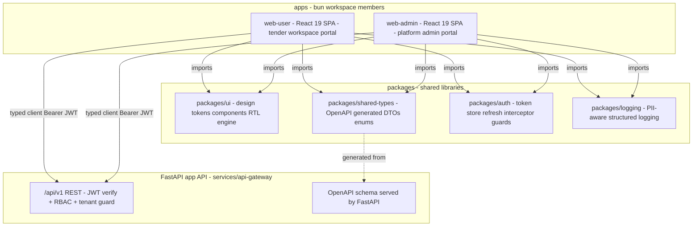
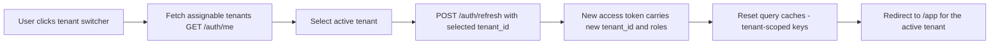
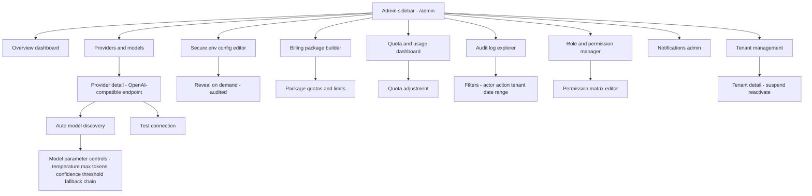
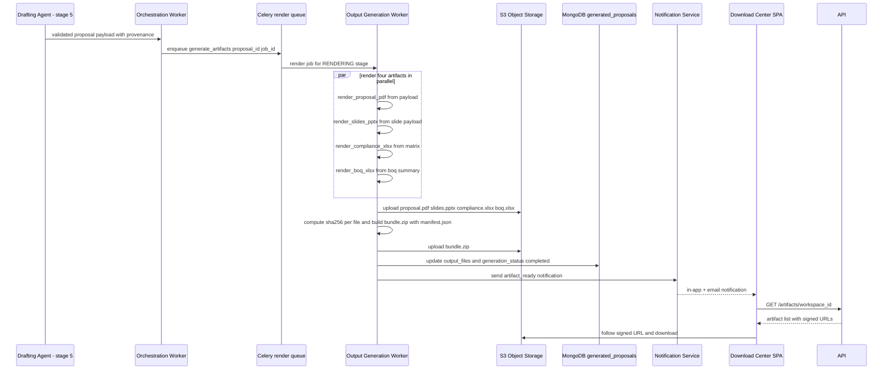

# Arabclue — Frontend Applications, Design System & Artifact Generation Pipeline Blueprint

| Field | Value |
|---|---|
| **Title** | Arabclue Platform — Web User Portal, Web Admin Portal, Enterprise Design System & Artifact Generation Pipeline (PDF / PPTX / XLSX / ZIP) |
| **Status** | Draft |
| **Version** | 0.4.0 |
| **Date** | 2026-08-01 |
| **Owner** | Platform Architecture Team (principal product & solutions architect) |
| **Scope** | V1 web-only, multi-tenant B2B SaaS. This document covers the two React frontend applications (`apps/web-user` and `apps/web-admin`), the shared design system (`packages/ui`) with Arabic-first bilingual/RTL theming, the complete screen maps for both portals, the state/data-flow strategy, and the artifact generation pipeline (technical proposal JSON schema → PDF renderer, PPTX renderer, compliance XLSX, financial BoQ XLSX, ZIP packaging, and download endpoints). |

**Scope note.** The REST API surface, payloads, and five-agent orchestration contracts are specified in `02-api-contracts-and-multiagent-engine.md` (full `/api/v1` contracts, orchestration state machine, evidence model, rules/prompt engine, AI provider abstraction). Object storage layout, presigned URL mechanics, and the worker job catalog are specified in `01-backend-services-and-data-layer.md`. Security governance, billing integrations, notifications, phased delivery (Phases 1–7), and open-question resolutions live in `04-security-billing-and-operations.md`. This document intentionally does not duplicate those; it references them by section and stays focused on the two React apps, the design system, the screen maps, and the rendering pipeline that turns the drafting agent's machine-renderable proposal payload into downloadable artifacts.

**Conventions inherited from the sibling documents** (consistent with `02-api-contracts-and-multiagent-engine.md` §1): ULID identifiers; ISO 8601 UTC timestamps; money as integers in minor units (SAR halalas); bilingual strings as `*_ar` / `*_en` fields; the JWT carries `tenant_id`, `roles[]`, `permissions[]`, and `workspace_scopes[]` claims (§1.2); all async work returns a `polling_url`; generation stage enum is `QUEUED, INGESTION, COMPLIANCE, TECHNICAL, FINANCIAL, DRAFTING, RENDERING, COMPLETED, FAILED, CANCELED` (§4.2).

---

## 1. Frontend Application Architecture

### 1.1 Monorepo Layout

Two React SPAs are built inside the bun-workspace monorepo defined in `00-architecture-overview.md` §6. Both apps are thin composition layers: they consume shared packages for UI primitives, types, auth plumbing, and logging, and they talk to the FastAPI app API exclusively through a typed API client generated from the backend's OpenAPI schema. No app imports another app; no app contains duplicated token, theme, or API-client logic.

```
arabclue-platform/
├── apps/
│   ├── web-user/                  # React 19 + TS SPA — tender workspaces, upload, brand, knowledge, generation, download center
│   │   ├── src/
│   │   │   ├── app/               # Router root, guarded routes, app shell (sidebar + topbar)
│   │   │   ├── features/          # Feature modules mirroring the screen map (§5)
│   │   │   │   ├── auth/          # Login, register, forgot-password, MFA challenge
│   │   │   │   ├── workspaces/    # Workspace list, detail, upload, classification, review
│   │   │   │   ├── brand/         # Brand configurator
│   │   │   │   ├── knowledge/     # Knowledge hub
│   │   │   │   ├── generation/    # One-click panel, progress timeline
│   │   │   │   ├── downloads/     # Download center
│   │   │   │   └── settings/      # Profile, notifications, security/MFA, billing
│   │   │   ├── queries/           # TanStack Query key factories + hooks per feature
│   │   │   └── main.tsx
│   │   ├── index.html
│   │   ├── vite.config.ts
│   │   └── package.json
│   └── web-admin/                 # React 19 + TS SPA — providers, env secrets, packages, usage, audit, RBAC, tenants
│       ├── src/
│       │   ├── app/               # Admin shell (sidebar + topbar)
│       │   ├── features/          # providers, env-secrets, packages, usage, audit, roles, notifications, tenants
│       │   ├── queries/
│       │   └── main.tsx
│       ├── index.html
│       ├── vite.config.ts
│       └── package.json
├── packages/
│   ├── ui/                        # Shared component library + design tokens + RTL/LTR layout engine
│   ├── shared-types/              # Types generated from backend OpenAPI via openapi-typescript
│   ├── auth/                      # Token store, refresh interceptor, RBAC guard helpers, tenant switcher logic
│   └── logging/                   # PII-aware structured logging, redaction, audit-event emission helpers
└── services/api-gateway/          # FastAPI — owns the OpenAPI schema the frontend types are generated from
```

### 1.2 Technology Decisions

| Decision | Recommendation | Rationale |
|---|---|---|
| Framework | React 19 + TypeScript 5.x (strict mode) | Two SPAs with shared packages; React 19 gives `useActionState`-style form handling, `useOptimistic` for uploads, and Suspense-friendly lazy loading for route-level code splitting |
| Build tool | Vite 6 (library mode for `packages/*`, app mode for `apps/*`) | Fast HMR, first-class TS, easy library-mode builds for shared packages, standard for React SPAs |
| Server state | TanStack Query v5 | Caching, background refetch, `refetchInterval` for generation polling, optimistic updates, and per-query retry policy — all required by the generation and upload flows (§8) |
| Client state | **Zustand** (recommended over Redux Toolkit) | Client state here is deliberately small: auth tokens/session, active tenant, locale, UI drawer state. Zustand is a fraction of the boilerplate, has first-class TypeScript inference, and works with a single `create()` store per slice; Redux Toolkit's devtools/middleware machinery adds cost without benefit at this scale. Server state stays out of the store (TanStack Query owns it). |
| Routing | React Router v7 (framework-lite mode) | Route-level lazy loading, nested layouts for the app shells, and a centralized `GuardedRoute` wrapper driven by RBAC permissions |
| Styling | Tailwind CSS v4 + shadcn/ui component primitives | Token-driven utility CSS with logical properties for RTL; shadcn/ui provides accessible headless-style primitives (Dialog, Dropdown, Select) that we restyle with `packages/ui` design tokens |
| i18n | i18next + react-i18next | Bilingual `ar`/`en` string catalogs, pluralization, date/number formatting via `Intl`, and runtime `dir` switching |
| API types | `openapi-typescript` codegen from the FastAPI OpenAPI schema | Single source of truth: every DTO, enum, and error shape in `02-api-contracts-and-multiagent-engine.md` becomes a compile-time type in `packages/shared-types`; schema drift fails the build |
| HTTP client | `fetch` wrapper generated alongside types (typed paths + response envelope) | Zero-dependency; the `packages/auth` refresh interceptor wraps it; supports `Idempotency-Key` and `X-Correlation-Id` headers |
| Artifact preview | `react-pdf` (PDF page thumbnails) + native office rendering fallbacks | In-browser preview of generated PDFs in the review and download screens; XLSX/PPTX preview is deferred to Phase 7 (see `04` §Phases) |

### 1.3 Frontend Architecture Diagram



Both apps depend on `packages/ui`, `packages/shared-types`, `packages/auth`, and `packages/logging` via the workspace protocol. `packages/shared-types` is regenerated on every backend schema change (CI gate). The typed client attaches the access token from `packages/auth`, injects `X-Tenant-Id`, and funnels every request through the refresh interceptor (§3.3).

---

## 2. Auth and Session UX

Authentication contracts (endpoints, claims, token rotation) are defined in `02-api-contracts-and-multiagent-engine.md` §3.1 (Authentication) with the catalog in §2 and the RBAC claims format in §1.2. Session-security policy (rotation, reuse detection, denylist, MFA enforcement) is in `04-security-billing-and-operations.md` §Security & Governance. This section defines the client-side session UX that consumes those contracts.

### 2.1 Login Screen Behavior

- **Entry**: `/login` renders `LoginForm` with email, password, and a `LanguageSwitcher` (Arabic-first default per ADR-010). Submit calls `POST /auth/login`.
- **Success**: response carries `user`, `tenant`, `roles[]`, `permissions[]`, and `tokens`. The client persists only tokens (§2.2) and hands everything else to the Zustand `useSessionStore` and to TanStack Query caches (`['auth','me']`, `['tenants']`).
- **MFA challenge**: if `mfa_enabled` is true, login returns a challenge state; the screen advances to `MfaCodeInput` (TOTP, 6-digit, `inputmode="numeric"`, auto-advance between fields) and re-submits with the TOTP code before tokens are issued. MFA-enrollment notice: users without MFA see an opt-in banner in Settings/Security (§5, Settings screen).
- **Errors**: RFC 7807 problem details mapped to inline field errors (`invalid_credentials`, `account_disabled`, `mfa_required`); `429` renders a `Retry-After` countdown.
- **Post-login redirect**: `return_to` query parameter preserved (e.g., deep link to a workspace) or default `/app`.
- **Multi-tenant users**: a user who belongs to more than one tenant (consultant/agency pattern) is sent to the tenant picker before `/app` (§2.4).

### 2.2 Token Storage Decision — memory access token + httpOnly refresh cookie

| Option | Risk | Verdict |
|---|---|---|
| Access token in `localStorage` + refresh token in `localStorage` | Any XSS reads both tokens and fully impersonates the session; no revocation bound | **Rejected** |
| Both tokens in memory | Survives XSS no better than localStorage (still readable), and loses the session on reload unless refresh is recoverable | Rejected for refresh; **access token lives in memory** (Zustand store, never persisted) |
| Refresh token in `localStorage`, access in memory | XSS exfiltrates the long-lived refresh token — worst case | **Rejected** |
| **Access token in memory + refresh token in an `httpOnly; Secure; SameSite=Strict` cookie set by the API** | XSS cannot read the refresh cookie; access token is short-lived (15 min) and refreshed silently; rotation + reuse detection revokes the family server-side; `SameSite=Strict` bounds CSRF | **Recommended** |

The backend sets the refresh cookie on `POST /auth/login` and rotates it on `POST /auth/refresh` (the cookie is a bearer of the opaque rotating refresh token; the token itself is hashed at rest per `01-backend-services-and-data-layer.md` §Auth & RBAC Module). Logout clears the cookie and blacklists the access token (`POST /auth/logout`). This design keeps the 15-minute access-token window, protects the long-lived credential from XSS, and is compatible with the RBAC claims model — the access token still carries `tenant_id`/`roles[]`/`permissions[]`.

### 2.3 Silent Refresh with 401 Interception

- `packages/auth` exports `createApiClient` that wraps the typed client: every request attaches `Authorization: Bearer <accessToken>` from the memory store.
- On any `401` (excluding the refresh and login calls themselves), the interceptor:
  1. Pauses the request queue,
  2. Calls `POST /auth/refresh` (cookie credentials), receives the rotated access token (and new refresh cookie),
  3. Updates the memory store, replays the paused requests with the new token,
  4. On refresh failure (token revoked/reuse detected), clears the session and redirects to `/login?reason=session_expired`.
- A single-flight promise (`refreshPromise`) prevents refresh storms from concurrent 401s.
- TanStack Query's `QueryClient` is wired to this interceptor: failed queries are retried once after refresh; mutations are re-attempted only when safe (uploads are never blindly re-posted — they surface a retry UI, §8.4).

### 2.4 Tenant Switcher Behavior

A tenant switch is a **session rebind**, not a UI preference. Flow:



- The switcher is a dropdown in the user-portal topbar showing the user's tenant list with active-tenant checkmark; it is also the first screen for multi-tenant users after login.
- The backend re-issues the access token with the selected tenant's `tenant_id` and re-resolved roles/permissions (refresh contract in `02` §3.1). The client then calls `queryClient.clear()` for tenant-scoped keys (all keys prefixed `['workspaces']`, `['knowledge']`, `['brand']`, `['artifacts']`, `['usage']`) so no cross-tenant cache residue remains.
- Route guards (§2.5) re-evaluate with the new claims; a user without `workspace:read` in the new tenant lands on a tenant-scoped empty/onboarding state instead of an access-denied loop.

### 2.5 Route Guards by RBAC Permission

`packages/auth` exports `GuardedRoute` (wraps React Router's `Route`):

| Prop | Type | Behavior |
|---|---|---|
| `permission` | string \| string[] | Required permission code(s); all must be present in JWT `permissions[]` |
| `anyOf` | boolean | When `permission` is an array and `anyOf=true`, one match suffices |
| `redirectTo` | string | Default `/app` (user) or `/admin` (admin); unauthorized → redirect with a `denied` notice |
| `fallback` | ReactNode | Loading skeleton while `/auth/me` resolves |

Session resolution is async: the app shell awaits `['auth','me']` (silent refresh restores the session after reload), then renders the guard tree. Route permission map used by both apps is the source of truth for the screen tables in §5 and §6.

### 2.6 MFA-Enablement Notice

MFA (TOTP) is enforced when `mfa_enabled` on the account. The user portal Settings → Security screen offers enrollment (QR secret + verify code), and the login screen surfaces an `MFA required` step for enrolled users. Enrollment and challenge endpoints are part of the auth module (`02` §3.1); enforcement policy and backup codes are in `04-security-billing-and-operations.md` §Security & Governance. SSO (SAML/OIDC) is out of scope for V1 and deferred to Phase 7 per the open-question register (`00` §10, open question 2).

---

## 3. Design System and Theming

The design system lives in `packages/ui` as design tokens (CSS custom properties), Tailwind theme extension, and component primitives. It implements ADR-010 (Bilingual UX Phasing — Arabic-First Workspace, English-First Admin, Full Toggle in Phase 7) as defined in `00-architecture-overview.md` §8 (Key Architectural Decisions; requirements traceability in §9).

### 3.1 Design Tokens

| Token group | Tokens | Values / notes |
|---|---|---|
| Color — brand | `--color-brand-50…950` | Generated from tenant/admin brand config (hex → oklch scales); used by `BrandPreview` and artifact renderers |
| Color — semantic | `--color-success` `--color-warning` `--color-danger` `--color-info` | Status badge palette; AA-compliant on white and dark |
| Color — neutral | `--color-neutral-0…1000` | Surface, border, text scales for light and dark |
| Typography | `--font-arabic` `--font-latin` `--font-heading` | Arabic-first: **IBM Plex Sans Arabic** (UI body, default) and **Noto Naskh Arabic** (formal/print-flavored headings and document previews); Latin: **Inter** (admin-friendly). Both self-hosted as woff2 with `font-display: swap` and Arabic glyph subsets |
| Type scale | `--text-xs … --text-4xl` | 12/14/16/18/20/24/30/36/48 px with matching line-heights tuned for Arabic ascender/descender balance |
| Spacing | `--space-0…64` | 4 px base: 0, 1, 2, 3, 4, 6, 8, 12, 16, 24, 32, 48, 64 |
| Radii | `--radius-sm/md/lg/xl` | 6 / 10 / 14 / 20 px (enterprise, slightly softer corners) |
| Elevation | `--shadow-1…4` | Layered for cards, popovers, dialogs, command palette |
| Motion | `--duration-fast/base/slow` `--ease-standard` | 150 / 250 / 400 ms; `prefers-reduced-motion` reduces to 0/75 ms |
| Dark/light | `[data-theme=light|dark]` + `color-scheme` | Semantic tokens re-map per theme; user preference persisted in `localStorage["arabclue-theme"]`, default follows OS |

### 3.2 RTL/LTR Layout Engine

- The `dir` attribute is set on `<html>` from the active locale (`ar` → `rtl`, `en` → `ltr`) and mirrored by `lang` (`ar`/`en`) for correct font shaping and assistive-tech pronunciation.
- **All layout styling uses logical CSS properties** (`margin-inline-start`, `padding-inline`, `inset-inline`, `border-inline-start`) via Tailwind logical utilities (`ms-*`, `me-*`, `ps-*`, `pe-*`, `start-*`, `end-*`). Physical properties are banned by lint rule except in explicit exceptions (icons, shadows).
- Text alignment defaults: Arabic-first surfaces right-align; numeric/money columns stay right-aligned in both directions with `text-align: right` via `font-variant-numeric: tabular-nums` (Arabic-Indic or Latin digits per locale using `Intl.NumberFormat`).
- Icon/chevron direction flips automatically via `rtl:rotate-180` utilities on directional glyphs (arrows, chevrons, carousel controls).
- Keyboard navigation mirrors direction: arrow-key moves in logical (inline) direction; grid/list focus order follows DOM order, which matches visual order in both directions.
- The same engine drives the bilingual **document preview** in the review screen and the PDF/PPTX renderer tokens (§7.2).

### 3.3 Bilingual Behavior (per ADR-010)

| Surface | V1 default | Toggle |
|---|---|---|
| User portal (`web-user`) | **Arabic-first**: RTL, Arabic labels, Arabic document workspace; English available | Language button toggles `ar` ↔ `en`; content strings from i18next catalogs; user locale persisted in `localStorage["arabclue-locale"]` |
| Admin portal (`web-admin`) | **English-first**: LTR admin usability; Arabic available | Same toggle mechanism |
| Documents/artifacts | Fully bilingual `AR/EN` from Phase 2 (extraction and rendering are language-agnostic) | Artifact filename/labels bilingual (§7.6) |

The i18n framework, token system, and logical-property layout engine are built in Phase 1 so the full-surface bilingual toggle becomes a configuration exercise in Phase 7, not a rewrite (ADR-010 consequence). String catalogs are co-located per feature under `locales/ar.json` and `locales/en.json`; missing keys fail CI.

### 3.4 Component Library (from `packages/ui`)

| Category | Components |
|---|---|
| Actions | `Button`, `IconButton`, `DropdownMenu`, `Tooltip` |
| Data display | `Card`, `StatCard`, `Table`, `DataTable`, `Badge`, `StatusBadge`, `ConfidenceMeter`, `Avatar`, `AvatarGroup`, `EmptyState`, `Skeleton` |
| Inputs | `Input`, `Textarea`, `Select`, `Checkbox`, `RadioGroup`, `Switch`, `FormField`, `SearchInput`, `TagInput`, `MoneyInput`, `DateField`, `ColorPicker`, `FileTypeIcon` |
| Overlays | `Dialog`, `ConfirmDialog`, `Drawer`, `Toast`, `AlertBanner` |
| Navigation | `Sidebar`, `Topbar`, `Tabs`, `Accordion`, `Pagination`, `Breadcrumbs`, `CommandPalette` |
| Status/progress | `Progress`, `Stepper`, `StepItem`, `Timeline`, `StageRow`, `CountdownBadge` |
| Bilingual/RTL | `LanguageSwitcher`, `ThemeToggle`, `TenantSwitcher`, `GuardedRoute`, `PageHeader` |
| Upload | `UploadZone`, `FileList`, `FileChip`, `ChecksumBadge`, `ScanStatusBadge` |

### 3.5 Trust-Cue Component Set

Trust is the platform's core value proposition (`00` §1). `packages/ui` ships a dedicated trust-cue kit used on every screen that displays generated content:

| Component | Purpose | Example usage |
|---|---|---|
| `ProvenanceChip` | Renders an `evidence_ref` (canonical syntax `ev:tender_text:…`, `ev:knowledge:…`, `ev:formula:…`, `ev:rule:…` — `02` §4.7) as a small chip with kind icon and score | Compliance matrix rows, drafted section headers |
| `CitationPopover` | Clickable citation that shows the human-readable source description, source document, page/paragraph, and the exact extracted span | Review screen, document classification drilldown |
| `ModelBadge` | Shows `provider + model` that produced a statement, with parameter controls (temperature, confidence threshold) and token cost tooltip | Generation timeline per stage, artifact manifest view |
| `AuditLink` | Deep link to the audit trail entry for an action (login, upload, generation, secret access) | Settings/Security, admin audit explorer, review screen |
| `EvidenceCount` | "Backed by N sources" counter with hover breakdown | Section headers in review and PDF preview |
| `IntegrityBadge` | sha256 + generation timestamp for an artifact | Download center rows, manifest viewer |

Trust cues are rendered from the proposal JSON's `provenance`/`model_trace` and from `generated_proposals` metadata — the frontend never fabricates them.

---

## 4. web-user Screen Map

Route base: the user portal is a client-rendered app mounted under `/app` (no per-view server routes). Permissions resolve from JWT claims (§2.5). API calls reference contracts in `02-api-contracts-and-multiagent-engine.md` §2/§3 by path; worker-side statuses reference `01-backend-services-and-data-layer.md` §3 (data layer) and §6 (worker catalog).

### 4.1 Screen Inventory

| Screen | Route | Permissions | Purpose | Key components | Data fetched (API) | Interactions / state transitions |
|---|---|---|---|---|---|---|
| Login | `/login` | Public | Authenticate, MFA challenge, tenant context | `LoginForm`, `MfaCodeInput`, `LanguageSwitcher`, `AlertBanner` | `POST /auth/login`; `POST /auth/refresh` | Success → store tokens → resolve `['auth','me']` → `/app` (or tenant picker if multi-tenant); MFA step when `mfa_enabled` |
| Register | `/register` | Public | Create tenant + initial admin | `RegisterForm` (company, CR, contact), `TermsCheckbox`, `PasswordStrength` | `POST /auth/register` | 201 → auto-login (tokens returned) → `/app`; 409 duplicate email/CR inline error |
| Forgot password | `/forgot-password` | Public | Request reset link | `ResetRequestForm`, `ResetComplete` | `POST /auth/forgot-password` (policy in `04` §Security) | Submit → confirmation screen; email link flow |
| Workspace list (dashboard) | `/app` | User (`workspace:read`) | Tender workspaces overview with tenant switcher | `TenantSwitcher`, `WorkspaceCard`, `StatCard` (counts by status), `NewWorkspaceButton`, `SearchInput`, `StatusFilter`, `Pagination` | `GET /workspaces` (`page`, `status`, `q`, `assigned_to_me`); `GET /auth/me` (tenant list) | Create → `POST /workspaces` → navigate to detail; filter/sort; tenant switch (§2.4); card click → detail |
| Workspace detail | `/app/workspaces/:workspaceId` | Workspace role (`workspace:read`) | Tender overview header + entry to all flows | `TenderHeader` (reference, name, due date), `StatusBadge`, `BrandProfileCard`, `AssignedUsersAvatarGroup`, `DocumentSummaryStrip`, `QuickActions` (upload / generate / downloads) | `GET /workspaces/{id}`; `GET /workspaces/{id}/documents` (summary); `GET /brand-profiles/{id}`; `GET /workspaces/{id}/generations` (latest) | Status lifecycle `draft → collecting_documents → parsing → generating → completed → archived` (`01` §Workspace Service); quick actions gate on status (generate disabled until parsed docs exist) |
| Upload manager | `/app/workspaces/:workspaceId/documents` | Workspace role (`document:upload` + read) | Drag-and-drop multi-file upload with validation | `UploadZone`, `FileList`, `FileChip`, `ChecksumBadge`, `ScanStatusBadge`, `ErrorBanner`, `RetryButton` | `POST /workspaces/{id}/documents` (multipart per file); `GET /workspaces/{id}/documents` | Client computes sha256 + validates extension/MIME/size (≤ `MAX_UPLOAD_BYTES`, default 100 MB) before POST; optimistic entries; 201 → enqueue `scan_upload` then `ingest_document`; per-file status `uploaded → scanning → parsed → schema_extracted → failed` |
| Document classification & status cards | `/app/workspaces/:workspaceId/documents` (tab) | Workspace role (`workspace:read`) | Per-document class, extraction status, confidence, source trace drilldown | `DocumentStatusCard`, `ClassBadge` (`tender_rfp \| tender_sow \| tender_specs \| tender_evaluation \| tender_boq \| qualification_docs \| financial_statements \| company_profile \| other`), `ConfidenceMeter`, `ExtractionStatusBadge`, `SourceTraceDialog`, `ParseErrorCard` | `GET /workspaces/{id}/documents`; `GET /documents/{document_id}` (parser output summary + per-field trace) | Drilldown opens `SourceTraceDialog` (doc id, page, paragraph, method, confidence per field — `parsed_tenders.extraction_trace`); retry-parse action for `failed` (`document:write`); cards auto-refresh while `scanning`/`parsed` pending |
| Brand configurator | `/app/workspaces/:workspaceId/brand` (tenant-level default also at `/app/brand`) | `brand:write` | Logo upload, color hex setup, company overview, CV upload, project card upload, live brand preview | `BrandPreview` (live), `LogoUploader` (SVG/PNG, dimension + byte validation), `ColorPickerPanel` (primary/secondary/accent hex), `CompanyOverviewForm`, `CvUploadList`, `ProjectCardForm`, `FontPicker` (arabic/latin), `LetterheadToggle` | `GET /brand-profiles`; `POST /brand-profiles`; `PATCH /brand-profiles/{id}`; `POST /brand-profiles/{id}/assets`; `GET/POST /knowledge-assets` (CVs, project cards as structured records) | Save → compiled `brand_context` snapshot for drafter; brand preview re-renders on token change; asset upload validated (magic bytes, size); CVs/project cards flow through knowledge approval (§Brand Configurator in `00` §2 FR-03) |
| Knowledge hub | `/app/knowledge` | `knowledge:read`; write actions `knowledge:write` | Asset viewer, upload, vectorize status, search, approval states | `AssetGrid`, `AssetCard`, `UploadZone` (knowledge), `VectorizeStatusBadge` (`pending \| indexed \| failed`), `ApprovalStateBadge` (`draft \| pending_approval \| approved \| rejected`), `SemanticSearchBar`, `AssetDetailDrawer` | `GET /knowledge-assets`; `POST /knowledge-assets`; `POST /knowledge-assets/{id}/vectorize`; `GET /knowledge/search` (`q`, `similarity_threshold`); `POST /knowledge-assets/{id}/approve` (approver role) | Upload → `pending_approval` → approve/reject; only `approved + is_active` assets retrievable (ADR/RAG rule, `01` §Brand & Knowledge Service); vectorize trigger is idempotent; search results show scores + `evidence_ref` |
| One-click generation panel | `/app/workspaces/:workspaceId/generate` | `generation:trigger` | Preflight summary + trigger | `PreflightCard` (quota, brand readiness, docs parsed, enabled provider, warnings), `ToggleGroup` (`include_technical/compliance/financial/boq`), `ModelPreferenceFields` (temperature, max_tokens, confidence_threshold), `GatePolicySelect`, `GenerateButton` | `GET /workspaces/{id}`; `GET /usage` (quota); `POST /workspaces/{id}/generate` (requires `Idempotency-Key`) | Preflight mirrors gate checks (`02` §4.5: quota, parsed doc, provider, brand, knowledge); `FAIL_EARLY` shows gate errors, `PROCEED_WITH_WARNINGS` shows warning chips; 202 → navigate to timeline with `job_id` |
| Generation progress timeline | `/app/workspaces/:workspaceId/generations/:jobId` | `generation:read` | Per-stage status: `QUEUED → INGESTION → COMPLIANCE → TECHNICAL → FINANCIAL → DRAFTING → RENDERING → COMPLETED` | `StageTimeline`, `StageRow` (status, duration, `ModelBadge`, `EvidenceCount`, warnings), `WarningsPanel` (`UNCERTAIN_INTERPRATION` etc.), `ModelTraceTable`, `CancelButton` (manager) | `GET /workspaces/{id}/generation/{job_id}` — polled at 5 s while running (§3.8 in `02`; §8.3 here) | Stage transitions from `stage_progress`; `COMPLETED` → artifact list available; `FAILED` → `RetryButton` (resume-from-stage checkpoint, `02` §4.6); `quota_blocked` → upsell banner |
| Review screen *(optional / Phase 7)* | `/app/workspaces/:workspaceId/review` | `review:approve` | Pre-ZIP review of compliance matrix + BoQ summary + cost metrics | `ComplianceMatrixSummaryTable`, `BoQSummaryCard`, `CostMetricsCard`, `FlaggedStatementsList` (`review_flagged` items), `ApproveAndFinalizeButton` | `GET /compliance/{workspace_id}/matrix`; `GET /financial/{workspace_id}/analysis`; `GET /workspaces/{id}/generation/{job_id}` | **Marked optional pending open-question resolution — see `04-security-billing-and-operations.md` §9.** V1 auto-finalizes (ADR-008); if a workspace opts into a hard gate, review is required before ZIP packaging |
| Download center | `/app/workspaces/:workspaceId/downloads` | `artifact:download` | Artifact list + signed URL downloads + share | `ArtifactList`, `ArtifactRow` (kind, size, sha256, created), `DownloadButton`, `ShareMenu`, `ZipCard`, `ManifestViewer` | `GET /artifacts/{workspace_id}`; `GET /artifacts/{workspace_id}/{artifact_id}/download` | Download fetches signed URL (§7.6) and follows it; `410` (expired/purged) → re-request fresh URL; share copies a signed link (tenant member only); each download is audit-logged |
| Settings — profile | `/app/settings/profile` | User | Profile fields, locale, notification prefs | `ProfileForm`, `NotificationPreferenceForm` (email/Slack/WhatsApp) | `GET /auth/me`; `PATCH /users/{id}`; `PATCH /notifications/preferences` | Save → update session store; locale change re-renders shell RTL/LTR |
| Settings — security | `/app/settings/security` | User | Password change, MFA enrollment, sessions | `PasswordChangeForm`, `MfaEnrollmentPanel` (QR + verify), `ActiveSessionsList`, `AuditLink` | MFA/password/session endpoints (`02` §3.1; `04` §Security) | Enroll/disable TOTP; revoke sessions; audit links into trail |
| Notifications center | `/app/settings/notifications` | User | In-app inbox | `NotificationList`, `NotificationItem`, `FilterTabs` (parse, generation, artifact, quota, invoice, security), `MarkReadButton` | `GET /notifications`; `PATCH /notifications/{id}` | Mark read/acknowledge; deep-link payload → workspace/job/artifact; 90-day TTL per `01` §3.11 |
| Billing portal | `/app/billing` | TenantAdmin (`subscription:read`) | Subscription, invoices, quotas consumed | `SubscriptionCard`, `InvoiceTable`, `UsageMeterBar` (documents/generations/tokens/storage), `PackageSelector` | `GET /billing/subscription`; `GET /billing/invoices`; `GET /billing/usage`; `POST /billing/checkout` | Upgrade/downgrade → provider checkout redirect (Stripe/Razorpay/PayPal, `04` §Billing); quota bars reflect `subscriptions.quota_limits`; invoice download |

### 4.2 Tender-Centric User Journey (Screen Flow)

```mermaid
flowchart LR
    A["Login /auth"] --> B["Workspace list /app"]
    B --> C["Create workspace"]
    C --> D["Workspace detail"]
    D --> E["Upload manager - drag drop"]
    E --> F["Classification and status cards"]
    F -->|parse complete| G["Brand configurator"]
    F -->|parse complete| H["Knowledge hub - evidence"]
    G --> I["One-click generation panel"]
    H --> I
    I --> J["Generation progress timeline"]
    J -->|COMPLETED| K["Review screen - Phase 7 optional"]
    K --> L["Download center"]
    J -->|COMPLETED| L
    L --> M["Share and notify"]
```



The journey is tender-centric: every flow hangs off a workspace, and status badges at each stage (document extraction, compliance, artifact generation) give prominent progress and trust signals.

---

## 5. web-admin Screen Map

Route base: `/admin`. All admin screens require PlatformAdmin (`admin:*` permissions); specific permissions are listed per screen. API calls reference `02` §3.4 (providers), §3.7 (admin contracts), and §2 catalog.

### 5.1 Screen Inventory

| Screen | Route | Permissions | Purpose | Key components | Data fetched (API) | Interactions / state transitions |
|---|---|---|---|---|---|---|
| Overview dashboard | `/admin` | `usage:read` (+ admin read) | Tenant counts, generation volume, provider health, cost summary | `StatCardGrid` (tenants active, generations, errors, cost), `TrendChart`, `ProviderHealthTable`, `CostSummaryCard`, `QuotaUtilizationBar` | `GET /admin/usage-metrics` (`period`, `group_by`); `GET /admin/cost-metrics`; `GET /providers`; `GET /admin/billing-packages` | Period filter (`7d/30d/90d`); drill into tenant table; provider health dot (`enabled/disabled/error`) |
| Provider & model management | `/admin/providers`; `/admin/providers/:providerId/models` | `provider:write` | Provider CRUD; OpenAI-compatible endpoint config; auto model discovery; parameter controls; test-connection | `ProviderTable`, `ProviderForm` (`provider_type`, `base_url`, **write-once** `api_key`), `DiscoveryButton` (`GET /providers/{id}/models?refresh=true`), `ModelTable`, `ModelParamsEditor` (`temperature`, `max_tokens`, `confidence_threshold`), `FallbackChainEditor` (ordered `{provider_id, model_id}` list), `TestConnectionButton` | `POST/GET/PATCH/DELETE /providers`; `GET /providers/{id}/models`; `PATCH /providers/{id}/models/{model_id}`; `POST /providers/{id}/test` | Create → discover models (background `sync_provider_models`, `01` §6) → enable → patch params → test-connection toast (`latency_ms`, preview, or structured error); API key never returned (write-once, encrypted at rest — ADR-009); fallback chain reorderable |
| Secure environment config editor | `/admin/env-secrets` | `env:write` | Encrypted env var key/value editor | `SecretTable` (metadata only), `SecretCreateForm` (write-only value), `RevealOnDemandButton`, `RotationButton`, `AuditNotice` | `GET /admin/env-secrets` (keys + metadata, never values); `POST /admin/env-secrets`; `PUT /admin/env-secrets/{key}`; `DELETE /admin/env-secrets/{key}` | Values stored ciphertext via envelope encryption (KMS, ADR-009); reveal-on-demand decrypts server-side and writes an `audit_logs` entry (`secret.reveal`); rotation updates `rotated_at`; validation of key naming and scope (`platform`/`tenant`) |
| Billing package builder | `/admin/packages` | `package:manage` | Package CRUD with pricing, quotas, token limits, generation limits | `PackageTable`, `PackageForm` (price minor units, currency, billing cycle, `quota_limits`, `token_limits`, `generation_limits`, features), `ActiveToggle` | `GET/POST/PUT/DELETE /admin/billing-packages` | Create/update/deactivate (soft); price validation ≥ 0; deactivate prevents new checkout; provider sync (`04` §Billing) is separate |
| Quota & usage dashboard | `/admin/usage` | `usage:read` | Per-tenant usage, token metering, cost metrics, quota adjustments | `UsageTable`, `MeterChart` (by day/model/tenant), `CostByModelChart`, `QuotaAdjustDialog` (delta + reason) | `GET /admin/usage-metrics`; `GET /admin/cost-metrics`; `POST /admin/quotas/adjust` | Adjust quota → delta applied with reason and optional expiry; adjustment is audit-logged (`config.change`); utilization percentiles (`p50/p90`, exceeded tenants) |
| Audit log explorer | `/admin/audit` | `audit:read-all` | Immutable audit log query and drilldown | `AuditTable`, `FilterBar` (actor, action, tenant, date range), `DetailDrawer`, `IntegrityBadge` (hash-chain indicator) | `GET /admin/audit-logs` (`actor_id`, `action`, `entity_type`, `tenant_id`, `from`, `to`) | Immutable display — no edit/delete affordance; drilldown shows `before/after` deltas, IP, UA, correlation id; nightly integrity check status surfaced |
| Role & permission manager | `/admin/roles` | `user:manage` (admin scope) | Roles CRUD, permission matrix editor, assign users | `RoleTable`, `RoleForm`, `PermissionMatrixEditor` (domain × permission grid from `GET /permissions`), `UserAssignmentDialog` | `GET /roles`; `POST/PATCH/DELETE /roles`; `GET /permissions`; `PUT /roles/{id}/permissions`; `GET /users` | System roles immutable (`is_system`); matrix edit re-resolves claims at next login (`01` §Auth & RBAC); delete prevented if assigned |
| Notifications admin | `/admin/notifications` | `admin:notify` | Templates, channel status email/Slack/WhatsApp | `TemplateTable` (per type, AR/EN), `TemplateEditor`, `ChannelStatusCard` (email Resend/SendGrid/SMTP, Slack, Twilio WhatsApp), `TestSendButton` | `GET/PUT /admin/notification-settings` | Edit bilingual templates; test-send per channel (idempotency per `01` §Notification Service); channel health dots |
| Tenant management | `/admin/tenants` | `tenant:manage` | Onboarding, status, suspension | `TenantTable`, `TenantDetailDrawer` (subscription, quotas, seats, brand), `StatusBadge` (`active/trial/suspended/closed`), `SuspendDialog`, `OnboardingProgress` | `GET /tenants` (admin-scoped); `PATCH /tenants/{id}` (status); `POST /admin/quotas/adjust` | Suspend/reactivate with reason (audited); suspension blocks logins and generation (gate in `04` §Security); onboarding progress tracks invite → brand → first workspace |

### 5.2 Admin Information Architecture



The admin shell is English-first (LTR) with an Arabic toggle; every destructive or sensitive action (secret reveal, quota adjust, suspend, role change) confirms via `ConfirmDialog` and surfaces its audit link.

---

## 6. Artifact Generation Pipeline

The pipeline consumes the drafting agent's (agent 5) machine-renderable proposal payload and produces the four artifact files plus the ZIP bundle. Rendering happens in the Output Generation Service worker (`01` §2.9) on the Celery `render` queue (`01` §6). This section defines the payload schema, each renderer, ZIP packaging, download behavior, and the job flow.

### 6.1 Technical Proposal JSON Schema (machine-renderable payload)

The drafting agent emits a payload that is **purely declarative** — renderers never interpret prose structure; they map JSON blocks to layout. Schema version is `proposal-payload.v1`. Full field contracts (provenance, evidence refs, guardrails) are in `02` §4.3 and §4.7.

| Field | Type | Description |
|---|---|---|
| `proposal_meta` | object | `proposal_id`, `proposal_version`, `job_id`, `workspace_id`, `tenant_id`, `tender_reference`, `title_ar/en`, `generated_at`, `locale`, `gate_policy`, `drafting_agent { agent_id, agent_version, template_version }` |
| `branding` | object | `company_name_ar/en`, `logo_ref`, `colors { primary, secondary, accent }`, `fonts { arabic, latin }`, `letterhead { header_enabled, footer_enabled }` |
| `sections[]` | array | Ordered sections; each has `id`, `title_ar`, `title_en`, `order`, `blocks[]`, `citation_block` |
| `sections[].blocks[]` | array | Typed content blocks: `paragraph`, `table`, `list`, `quote`, `evidence_refs`, `image_ref` |
| `sections[].citation_block` | object | `{ evidence_refs[], sources[{ title, ref }] }` — rendered as provenance footer |
| `compliance` | object | `statement_ar/en`, `summary { rows_total, compliant, partial, non_compliant, uncertain, not_covered }`, `items_referenced[]`, `flagged_items[]` |
| `financial` | object | `summary`, `metrics[]` (per-metric audit trail from `02` §5.4), `boq` (normalized lines summary from `02` §5.5) |
| `model_trace` | array | Aggregated per-stage `{ stage, provider_id, model_id, prompt_version, tokens_in, tokens_out, cost_minor }` |
| `provenance` | object | `agent_id`, `agent_version`, `template_version`, `evidence_index` (map of evidence_ref → human-readable source) |

**Concrete JSON example** (abridged — one section with evidence refs):

```json
{
  "proposal_meta": {
    "proposal_id": "01J8XKZ9Q7H4M2K9V0P3T8X5IA",
    "proposal_version": 1,
    "job_id": "01J8XKZ9Q7H4M2K9V0P3T8X5WL",
    "workspace_id": "01J8XKZ9Q7H4M2K9V0P3T8X5WD",
    "tenant_id": "01J8XKZ9Q7H4M2K9V0P3T8X5WC",
    "tender_reference": "RFP-2026-00123",
    "title_ar": "العرض الفني - خدمات الحوسبة السحابية",
    "title_en": "Technical Proposal - Cloud Services",
    "generated_at": "2026-08-01T14:00:00.000000Z",
    "locale": "ar",
    "gate_policy": "PROCEED_WITH_WARNINGS",
    "drafting_agent": { "agent_id": "proposal_drafting", "agent_version": "1.2.0", "template_version": "1.1.0" }
  },
  "branding": {
    "company_name_ar": "شركة أكاديمية الحلول",
    "company_name_en": "Acme Solutions Co.",
    "logo_ref": "s3://arabclue-prod/01J8XKZ9Q7H4M2K9V0P3T8X5WC/brand/01J8XKZ9Q7H4M2K9V0P3T8X5HS/logo.png",
    "colors": { "primary": "#0B3D91", "secondary": "#F2A900", "accent": "#1B75BC" },
    "fonts": { "arabic": "IBM Plex Sans Arabic", "latin": "Inter" },
    "letterhead": { "header_enabled": true, "footer_enabled": true }
  },
  "sections": [
    {
      "id": "s01_project_understanding",
      "title_ar": "فهم المشروع",
      "title_en": "Project Understanding",
      "order": 1,
      "blocks": [
        {
          "type": "paragraph",
          "text_ar": "يغطي هذا العرض تقديم منصة سحابية معتمدة ومدارة بالكامل وفق متطلبات الجهة الحكومية.",
          "text_en": "This proposal covers a fully managed, accredited cloud platform delivered against the authority's requirements.",
          "evidence_refs": ["ev:tender_text:01J8XKZ9Q7H4M2K9V0P3T8X5WG:01J8XKZ9Q7H4M2K9V0P3T8X5WT:400-520"]
        },
        {
          "type": "table",
          "caption_ar": "ملخص المتطلبات الرئيسية",
          "caption_en": "Key requirements summary",
          "columns": ["criterion", "weight_pct", "min_score"],
          "rows": [
            ["Technical Solution Quality", 40, 70],
            ["Implementation Plan", 30, 60],
            ["Local Content", 10, 50]
          ],
          "evidence_refs": ["ev:tender_text:01J8XKZ9Q7H4M2K9V0P3T8X5WG:01J8XKZ9Q7H4M2K9V0P3T8X5WU:880-1010"]
        },
        {
          "type": "list",
          "items_ar": ["منهجية تسليم مرحلية", "فريق مرخص", "امتثال لهيئة الأمن السيبراني"],
          "items_en": ["Phased delivery methodology", "Licensed team", "NCA compliance"],
          "evidence_refs": [
            "ev:knowledge:01J8XKZ9Q7H4M2K9V0P3T8X5HT:01J8XKZ9Q7H4M2K9V0P3T8X5HU:0.881",
            "ev:rule:NCA-ECC1-2018-4.1:1.2.0"
          ]
        },
        {
          "type": "quote",
          "text_ar": "يجب أن تكون الخدمة معتمدة لدى الهيئة الوطنية للأمن السيبراني.",
          "text_en": "The service must be accredited by the National Cybersecurity Authority.",
          "source_ref": "RFP clause 12.4, page 12",
          "evidence_refs": ["ev:tender_text:01J8XKZ9Q7H4M2K9V0P3T8X5WG:01J8XKZ9Q7H4M2K9V0P3T8X5WT:400-520"]
        }
      ],
      "citation_block": {
        "evidence_refs": [
          "ev:tender_text:01J8XKZ9Q7H4M2K9V0P3T8X5WG:01J8XKZ9Q7H4M2K9V0P3T8X5WT:400-520",
          "ev:knowledge:01J8XKZ9Q7H4M2K9V0P3T8X5HT:01J8XKZ9Q7H4M2K9V0P3T8X5HU:0.881"
        ],
        "sources": [
          { "title": "RFP-2026-00123 - clause 12", "ref": "doc 01J8XKZ9Q7H4M2K9V0P3T8X5WG, page 12" },
          { "title": "Project card - Saudi National Bank Data Center Migration", "ref": "tenant knowledge asset" }
        ]
      }
    }
  ],
  "compliance": {
    "statement_ar": "يتم الالتزام الكامل بمتطلبات المنافسة وأنظمة هيئة الأمن السيبراني.",
    "statement_en": "Full compliance with tender requirements and NCA regulations is confirmed.",
    "summary": { "rows_total": 48, "compliant": 31, "partial": 9, "non_compliant": 2, "uncertain": 4, "not_covered": 2 },
    "items_referenced": ["R-014", "R-021"],
    "flagged_items": [{ "requirement_ref": "R-014", "flag": "uncertain_interpretation", "note": "NCA classification tier requires confirmation; auto-finalized per V1 policy." }]
  },
  "financial": {
    "summary": { "currency": "SAR", "total_minor": 2485000000, "lines": 87, "validation": "passed" },
    "metrics": [
      { "metric": "QUICK_LIQUIDITY_RATIO", "value": "1.419643", "passed": true, "formula_version": "1.0.0",
        "source_refs": ["ev:tender_text:01J8XKZ9Q7H4M2K9V0P3T8X5WU:01J8XKZ9Q7H4M2K9V0P3T8X5XG:100-240"] }
    ],
    "boq": { "formula_lib_version": "fin-lib-2026.07", "total_minor": 2485000000, "validation": { "passed": true, "warnings": 3, "errors": [] } }
  },
  "model_trace": [
    { "stage": "COMPLIANCE", "provider_id": "01J8XKZ9Q7H4M2K9V0P3T8X5WJ", "model_id": "claude-sonnet-4.5", "prompt_version": "compliance-v3", "tokens_in": 12400, "tokens_out": 3500, "cost_minor": 12500 }
  ],
  "provenance": {
    "agent_id": "proposal_drafting",
    "agent_version": "1.2.0",
    "template_version": "1.1.0",
    "evidence_index": {
      "ev:tender_text:01J8XKZ9Q7H4M2K9V0P3T8X5WG:01J8XKZ9Q7H4M2K9V0P3T8X5WT:400-520": "RFP-2026-00123, clause 12.4, page 12 (Arabic)"
    }
  }
}
```

Renderer entry point: `render_payload(payload, brand_assets)` — every renderer reads the same schema; a payload that fails JSON-schema validation (drafting guardrail re-check, `02` §5.6) never reaches `RENDERING`.

### 6.2 PDF Renderer

| Aspect | Design |
|---|---|
| Approach | **HTML/CSS template + WeasyPrint** (primary). Jinja2 templates render the proposal JSON into print-optimized HTML; WeasyPrint (Pango-based text shaping) handles Arabic RTL natively. A **Playwright/Chromium fallback** renderer (same HTML, headless browser print-to-PDF) covers complex layouts — the repo already carries Playwright for PDF export (`AGENTS.md`, `setup:pdf`), so both engines are viable; WeasyPrint is the default for deterministic pagination |
| RTL handling | `html dir="rtl"`, CSS `direction: rtl; unicode-bidi: isolate` on mixed spans; Arabic text shaped correctly by Pango; numerals via `font-variant-numeric: tabular-nums`; mixed AR/EN runs handled with `<bdi>` isolation |
| Embedded fonts | `@font-face` for **IBM Plex Sans Arabic** (and Noto Naskh Arabic for headings) + **Inter**, embedded as subsets (woff2/ttf) — WeasyPrint embeds fonts into the PDF; glyph coverage check at render time (`01` §2.9 failure modes) |
| Brand styling | Logo from `branding.logo_ref`, colors mapped to CSS custom properties, letterhead header/footer, cover page (title AR/EN, tender reference, company name, date), table of contents via `target-counter()` |
| Page furniture | `@page` margin boxes: header (logo + company name), footer (page number `counter(page)` / `counter(pages)`, tender reference, confidentiality note) |
| Print-ready standards | A4; margins per Saudi government submission norms (25 mm outer, 20 mm inner); embedded fonts; 300 DPI raster assets; PDF 1.7 with tagged structure for accessibility; `Print ready standards` documented in `docs/PRINT_READY_STANDARDS.md` of the repo and enforced by the renderer's deterministic render tests (CI) |
| Schema consumption | Walk `sections[]` → `blocks[]`; each block type maps to a Jinja2 partial (`paragraph.html`, `table.html`, `list.html`, `quote.html`); `citation_block` renders as a provenance footer; `compliance`/`financial` summaries render from the payload's summary objects; `model_trace` renders in an appendix |
| Output | `proposal.pdf` stored at `{tenant_id}/artifacts/{workspace_id}/{proposal_version}/proposal.pdf` (`01` §5.1) |

### 6.3 PPTX Renderer

| Aspect | Design |
|---|---|
| Library | `python-pptx` (native PPTX authoring) |
| Deck structure | Slide 1 Title → 2 Agenda → 3 Company Profile (from `branding` + knowledge company profile) → 4 Solution Overview → 5 Methodology → 6 Architecture → 7 Staffing (team CVs) → 8 Implementation Plan → 9 Compliance Summary (matrix summary + flagged items) → 10 Financial Summary (metrics + BoQ totals) → 11 Closing (contact, tender reference) |
| Content mapping | The drafting agent also emits a slide payload (`drafting.slide_payload.v1`, `02` §5.7) derived from the proposal JSON sections; `slides` mapping: proposal section → slide, with summary tables for compliance/financial sections |
| Brand consistency | Master slide template: brand colors (`branding.colors`), fonts (`branding.fonts`), logo top-left/right per direction, footer with tender reference + slide number |
| RTL considerations | PPTX stores Unicode text; the renderer sets right-to-left paragraph direction via the `a:pPr rtl="1"` XML attribute and `lang="ar-SA"` on runs so PowerPoint renders Arabic shaping and direction correctly; text frames use `word_wrap` and right alignment in Arabic decks; mixed AR/EN lines keep `bidi` isolation |
| Citations | Per-slide footer: source summary + evidence count from the mapped section's `citation_block` (small, muted text) |
| Output | `slides.pptx` at `{tenant_id}/artifacts/{workspace_id}/{proposal_version}/slides.pptx` |

### 6.4 Compliance XLSX Generator

| Aspect | Design |
|---|---|
| Library | `openpyxl` |
| Sheets | `Compliance Matrix`, `Requirements Log`, `Citations` |
| Compliance Matrix columns | `req_id`, `requirement_text_ar`, `requirement_text_en`, `source_doc`, `clause`, `category`, `applicable_pack`, `status`, `evidence`, `citation`, `uncertainty_flag`, `reviewer_notes` |
| Status values | `Compliant` / `Partial` / `Non-compliant` / `Not-applicable` / `Uncertain` (mapped from matrix outcomes `compliant | partial | non_compliant | not_applicable | uncertain`, `02` §3.5) |
| Conditional formatting | Status column: fill rules per value (green / yellow / red / gray / orange); `uncertainty_flag = TRUE` rows get a bold left border + orange status |
| Requirements Log | Every extracted requirement (from `parsed_tenders.qualification_requirements` + matrix rows) with source spans, whether it was addressed, and evidence refs |
| Citations | Deduplicated citation list: rule id, pack, pack version, citation text, source URL/ref — the bibliography for the matrix |
| Bilingual headers | Header row bilingual AR/EN (e.g., `المتطلب | Requirement`), frozen top row, autofilter on, brand-colored header fill, column widths tuned for Arabic text (wider text columns, `wrap_text`) |
| Data source | `GET /compliance/{workspace_id}/matrix` payload (matrix JSON snapshot on `generated_proposals.compliance_summary`) |
| Output | `compliance.xlsx` at `{tenant_id}/artifacts/{workspace_id}/{proposal_version}/compliance.xlsx`; job `render_compliance_xlsx` in `01` §6 |

### 6.5 Financial BoQ XLSX Generator

| Aspect | Design |
|---|---|
| Library | `openpyxl` |
| Sheets | `BOQ Line Items`, `Summary`, `Formulas` |
| BOQ Line Items columns | `item_id`, `description_ar`, `description_en`, `unit`, `quantity`, `unit_price`, `currency`, `line_total`, `tax_rate`, `tax_amount`, `grand_total`, `validation_status` |
| Line values | Money as integer minor units (SAR halalas) with display number format `#,##0.00 "SAR"`; quantities decimal; unit from normalized UoM (`02` §5.5) |
| Formula cells | `line_total = unit_price * quantity`; `tax_amount = line_total * tax_rate` (15% default, per-line `vat_applicable`); `grand_total = line_total + tax_amount` — written as real Excel formulas so reviewers can audit and recalc |
| Summary sheet | Cross-totals: `total_net = SUM(line_total)`, `total_vat = SUM(tax_amount)`, `total_grand = SUM(grand_total)`, currency, formula-library version, validation status (`passed / warnings / errors`), and the qualification metrics block (quick liquidity ratio etc.) with formula versions and source refs (`02` §5.4) |
| Formulas sheet | Read-only reference sheet listing the immutable formula library records (formula_id, name, expression, params, version) that produced the numbers — the "audit trail per computed metric" surface |
| Validation | `validation_status` per line from `boq_summary.validation` (`passed / warnings / errors` with issue codes, `02` §5.5); data-validation dropdowns where applicable; invalid rows highlighted |
| Data source | `GET /financial/boq/validate/{job_id}` result + `generated_proposals.boq_summary` |
| Output | `boq.xlsx` at `{tenant_id}/artifacts/{workspace_id}/{proposal_version}/boq.xlsx`; job `render_boq_xlsx` in `01` §6 |

### 6.6 ZIP Packaging

| Aspect | Design |
|---|---|
| Layout (inside ZIP) | `01-technical-proposal.pdf`, `02-technical-slides.pptx`, `03-compliance-matrix.xlsx`, `04-financial-boq.xlsx`, `manifest.json` |
| Compression | Python `zipfile` with `ZIP_DEFLATED`, compression level 6 (balanced); large PDFs are the dominant size; workers stream-write to object storage via multipart upload (no local final artifacts, `01` §2.9) |
| `manifest.json` | `manifest_version`, `proposal_id`, `proposal_version`, `workspace_id`, `tenant_id`, `generated_at`, `pack_versions`, `model_trace_summary`, `compliance_summary`, `boq_summary`, `files[]` with `name`, `content_type`, `size_bytes`, `sha256` |
| Checksums | `sha256` per file computed during packing and embedded in `manifest.json`; identical values stored on `generated_proposals.output_files` (`01` §3.5) so integrity is verifiable both in the ZIP and via API |
| Storage | `bundle.zip` at `{tenant_id}/artifacts/{workspace_id}/{proposal_version}/bundle.zip` — immutable, tenant-lifecycle retention (`01` §5.1/§5.2) |
| Job | `generate_artifacts` in `01` §6; idempotent via versioned keys (partial artifacts overwritten on retry) |

### 6.7 Download Endpoints

Contracts: `GET /artifacts/{workspace_id}` (list) and `GET /artifacts/{workspace_id}/{artifact_id}/download` (signed URL) — see `02-api-contracts-and-multiagent-engine.md` §3.6 (Artifacts & Download; catalog in §2).

| Concern | Design |
|---|---|
| **Signed URL vs streaming proxy** | **Signed URL (recommended)**: the API verifies membership + artifact ownership and returns a short-lived presigned GET to object storage; the client follows it directly. Rationale per ADR-006 (`00` §8): direct browser-to-storage transfer avoids doubling bandwidth through the API, keeps the API process off the download hot path, and object-scoped signatures leak at most one object. Streaming proxy is the fallback variant only for deployments where the CDN/storage must stay private from clients (deployment-dependent, `04` §Production Operations). |
| Response form | JSON `{ artifact_id, title, download_url, expires_at, method: "GET", content_type }` (documented default in `02` §3.6); a `302` redirect variant is permitted per deployment, but the SPA uses the JSON form so it can render a retry/expiry state and log the audit event |
| Content-Disposition | Bilingual filenames via RFC 5987: `Content-Disposition: attachment; filename="Acme_MoC_Cloud_2026_Technical_Proposal.pdf"; filename*=UTF-8''<percent-encoded Arabic-safe name>` — the storage bucket keys keep the ASCII form, the API returns the display name from artifact metadata; the SPA never constructs security-sensitive headers |
| Expiry | Presigned GET expiry 30 minutes per the object-storage presigned policy (`01-backend-services-and-data-layer.md` §5.3); the API contract documents the same flow with a 15-minute default (`02` §3.6). The window is a deployment config; the client handles `410` by re-requesting a fresh URL |
| Audit logging | Every download (URL issuance and each successful GET is logged where feasible) writes an `audit_logs` entry: action `artifact.download`, actor, `artifact_id`, `workspace_id`, `ip`, `user_agent`, `correlation_id` (`01` §2.11, `audit_logs` schema §3.9) |
| Partial availability | `GET /artifacts/{workspace_id}` returns each artifact independently; if one render failed, the others remain downloadable and the list surfaces per-artifact status (`ready`/`failed`) |

### 6.8 Rendering Job Flow



The flow mirrors the pipeline diagram in `00` §5.1 and the worker contract in `01` §6 (`generate_artifacts`, retries, idempotency). Partial-output salvage (`02` §4.6) means a failed render never discards completed stage results; a rerun reuses ingestion/compliance snapshots.

---

## 7. State Management and Data Flow

### 7.1 TanStack Query Key Structure

| Key | Cached data | Notes |
|---|---|---|
| `['auth','me']` | `/auth/me` identity + tenant + permissions | Session source of truth; invalidated on tenant switch and logout |
| `['tenants']` | Assignable tenant list | From `/auth/me`; drives `TenantSwitcher` |
| `['workspaces', {page,status,q,assignedToMe}]` | `GET /workspaces` pages | Separate entries per filter combo |
| `['workspace', workspaceId]` | `GET /workspaces/{id}` | Invalidated by uploads/generation completion |
| `['workspace', workspaceId, 'documents']` | Document list | Refetch while any doc is `scanning`/`parsed`-pending |
| `['document', documentId]` | Single doc + parser trace | Source-trace drilldown |
| `['brand-profiles']` / `['brand-profile', id, 'assets']` | Brand profiles + assets | Invalidated on brand save |
| `['knowledge-assets', {page,type,status}]` / `['knowledge-asset', id]` | Knowledge hub | Vectorize triggers invalidate the single-asset entry |
| `['knowledge-search', {q,threshold}]` | `GET /knowledge/search` | New query = new entry; TTL short |
| `['generation', workspaceId, jobId]` | `GET .../generation/{job_id}` | **Polled** (§7.3) |
| `['generations', workspaceId]` | Job history list | Invalidated on trigger |
| `['artifacts', workspaceId]` | `GET /artifacts/{workspace_id}` | Invalidated on generation completion |
| `['usage']`, `['invoices']`, `['subscription']` | Billing data | Tenant-scoped |
| `['notifications']` | In-app inbox | Mark-read invalidates |
| Admin: `['providers']`, `['provider-models', providerId]`, `['env-secrets']`, `['packages']`, `['usage-metrics', period]`, `['cost-metrics', period]`, `['audit-logs', filters]`, `['roles']`, `['permissions']`, `['tenants']` | Admin endpoints | Same conventions; admin keys are platform-scoped (no tenant prefix) |

Key factories live in `apps/*/queries/keys.ts`; mutation hooks (`useTriggerGeneration`, `useUploadDocument`, …) invalidate the dependent keys on success.

### 7.2 Optimistic Updates for Uploads

Uploads are the main optimistic surface:

1. On file drop, `UploadZone` validates extension/MIME/size and computes the client-side sha256 (Web Crypto, streaming for large files) **before** any network call.
2. An optimistic `FileChip` entry appears in `['workspace', id, 'documents']` via `queryClient.setQueryData` with a provisional id and `status: uploading`.
3. `POST /workspaces/{id}/documents` runs (checksum + `Idempotency-Key` header; contract `02` §3.2). On 201 the provisional entry is replaced with the real document and status `uploaded`; on failure the entry flips to `failed` with an inline `RetryButton` — the file bytes are retained in a drop-session store so retry is possible without re-selecting the file.
4. Multi-file batches upload with bounded concurrency (3–4 parallel) and a per-file progress bar from `XMLHttpRequest`/fetch streaming where supported; the batch completes when all files reach `uploaded`.
5. Scan/parse status is **not** optimistic — it is server truth polled via the documents list (`scanning → parsed → schema_extracted`), which keeps the UI honest about malware-scan state (`01` §5.5).

### 7.3 Polling vs WebSocket/SSE for Progress Updates

**Decision: HTTP polling for V1.**

| Option | Pros | Cons | Verdict |
|---|---|---|---|
| Polling (`refetchInterval`) | Trivial with TanStack Query; matches the API contract's `polling_url` (`02` §3.8); works behind any proxy/CDN; resilient to connection drops; no server-side connection state | 5 s granularity (adequate for minute-scale stages); slight latency vs push | **Recommended for V1** |
| SSE | Near-real-time, one-directional, simpler than WS | New server surface (streams must be tenant-scoped and authed), proxy/buffer config, reconnect handling | Deferred — evaluated in Phase 7 (see `04` §Phases) |
| WebSocket | Bidirectional (not needed — client only observes) | Connection lifecycle, scaling, heartbeat, auth handshake complexity | Not needed for V1 |

Generation stages run minutes each (`02` §4); 5-second polling while any stage is `RUNNING`, dropping to 30-second idle polling and stopping entirely on terminal states, gives a responsive timeline with negligible load. The poll hook:

```
useGenerationJob(workspaceId, jobId) → query ['generation', workspaceId, jobId]
  refetchInterval: (query) => terminal(query.state.data?.status) ? false : (anyStageRunning ? 5000 : 30000)
```

### 7.4 Keeping the Timeline in Sync

- The timeline is a pure render of the polled `stage_progress` array plus `model_trace` and `warnings` (response shape `02` §3.2). `StageRow` transitions derive from `status` per stage (`PENDING → RUNNING → COMPLETED/FAILED`).
- `placeholderData: keepPrevious` prevents the timeline from flashing empty between polls; a subtle pulse indicator marks RUNNING stages.
- On `COMPLETED`, the hook invalidates `['artifacts', workspaceId]` and `['generations', workspaceId]`, and the Download center banner appears.
- Window-focus refetch and `refetchOnReconnect` keep the timeline honest after tab switch/network drop.
- The single-flight refresh interceptor (§2.3) guarantees the poll never 401-loops during token rotation.

### 7.5 Offline and Error States

| State | UX |
|---|---|
| Network offline | Query `networkMode: 'offlineFirst'` for reads (stale cache served); mutations disabled with an offline banner; `navigator.onLine` + `online`/`offline` listeners toggle the banner |
| Poll failure (transient) | TanStack Query retry (3×, backoff) keeps showing the last stage data with a "reconnecting" chip; no destructive action |
| Generation `FAILED` | Timeline shows the failed stage + error code; `RetryButton` resumes from the checkpoint (`resume_from_stage`, `02` §4.6); partial artifacts from earlier stages remain visible |
| Partial artifact availability | Download center lists each artifact with independent status; failed artifacts show "render failed — retry generation" rather than blocking the whole list |
| Signed URL `410` | Download button re-requests `GET /artifacts/{id}/download` and follows the fresh URL; if the artifact is purged, an `AlertBanner` explains retention |
| `quota_blocked` | Job pauses; banner links to the billing portal (§5 Billing portal) with the exact exhausted meter (`generations_per_month`, `ai_tokens_per_month`) |

---

## 8. Component Inventory

### 8.1 Shared Components (`packages/ui`)

| Component | Purpose | Props summary | Used by screens |
|---|---|---|---|
| `Button` / `IconButton` | Primary/secondary/ghost/danger actions; loading state | `variant`, `size`, `loading`, `disabled`, `onClick`, `icon` | All |
| `Card` / `StatCard` | Content containers and metric tiles | `title`, `value`, `trend`, `icon`, `footer` | Dashboard, generation panel |
| `Table` / `DataTable` | Tabular data with sorting, pagination, row actions | `columns`, `rows`, `sortable`, `pagination`, `rowKey` | Documents, artifacts, invoices, audit, providers |
| `Dialog` / `ConfirmDialog` | Modal forms and destructive confirmations | `open`, `onClose`, `title`, `confirmLabel`, `danger` | Source trace, quota adjust, suspend |
| `Drawer` | Side detail panels | `open`, `side` (logical), `title`, `children` | Asset detail, audit drilldown |
| `Progress` / `Stepper` / `StepItem` | Percent progress and step indicators | `value`, `steps[]`, `currentStep`, `status` per step | Generation panel, onboarding |
| `Timeline` / `StageRow` | Chronological and stage-state lists | `items[]`, `activeIndex`, `statuses[]` | Generation timeline |
| `UploadZone` | Drag-and-drop file capture | `accept`, `maxBytes`, `multiple`, `onFiles`, `validateFile` | Upload manager, brand, knowledge |
| `FileList` / `FileChip` | Per-file state chips | `file`, `status`, `progress`, `checksum`, `onRetry` | Upload manager |
| `ChecksumBadge` / `ScanStatusBadge` | Integrity and malware-scan indicators | `checksum`, `scanStatus` | Upload manager, download center |
| `StatusBadge` / `Badge` | Semantic status pills | `status`, `tone` | Workspace, documents, artifacts, tenants |
| `ConfidenceMeter` | 0–1 confidence gauge | `value`, `label`, `threshold` | Classification cards, review |
| `ProvenanceChip` / `CitationPopover` | Trust cues for evidence refs and citations | `evidenceRef`, `sources[]`, `onOpen` | Review, classification, timeline, manifest |
| `ModelBadge` / `EvidenceCount` / `AuditLink` | Model transparency, evidence counts, audit deep links | `model`, `provider`, `count`, `auditRef` | Timeline, review, settings, admin |
| `Select` / `Input` / `Textarea` / `FormField` | Form primitives with bilingual labels and inline validation | `label` (ar/en), `error`, `required`, `dir` | All forms |
| `ColorPicker` | Brand hex color input | `value`, `onChange`, `presets` | Brand configurator |
| `SearchInput` / `TagInput` / `MoneyInput` / `DateField` | Specialized inputs | standard + `currency`, `locale` | Workspace list, knowledge, packages |
| `Sidebar` / `Topbar` / `PageHeader` | App shells | `navItems[]`, `tenant`, `user`, `breadcrumbs` | Both portals |
| `TenantSwitcher` | Active-tenant selector | `tenants[]`, `activeId`, `onSwitch` | Workspace list, topbar |
| `LanguageSwitcher` / `ThemeToggle` | Locale and theme toggles | `locale`, `onChange` | Both portals |
| `GuardedRoute` | RBAC route guard | `permission`, `anyOf`, `redirectTo` | Both portals |
| `Toast` / `AlertBanner` / `Skeleton` / `EmptyState` | Feedback and loading states | standard | All |

### 8.2 web-user Domain Components

`TenderHeader`, `WorkspaceCard`, `DocumentStatusCard`, `ClassBadge`, `ExtractionStatusBadge`, `SourceTraceDialog`, `ParseErrorCard`, `BrandPreview`, `LogoUploader`, `ColorPickerPanel`, `CompanyOverviewForm`, `CvUploadList`, `ProjectCardForm`, `FontPicker`, `LetterheadToggle`, `AssetGrid`, `AssetCard`, `VectorizeStatusBadge`, `ApprovalStateBadge`, `SemanticSearchBar`, `AssetDetailDrawer`, `PreflightCard`, `ToggleGroup`, `ModelPreferenceFields`, `GatePolicySelect`, `WarningsPanel`, `ModelTraceTable`, `ComplianceMatrixSummaryTable`, `BoQSummaryCard`, `CostMetricsCard`, `FlaggedStatementsList`, `ArtifactList`, `ArtifactRow`, `ShareMenu`, `ZipCard`, `ManifestViewer`, `MfaEnrollmentPanel`, `PasswordStrength`, `NotificationList`, `NotificationItem`, `SubscriptionCard`, `InvoiceTable`, `UsageMeterBar`, `PackageSelector`, `ResetRequestForm`.

### 8.3 web-admin Domain Components

`ProviderTable`, `ProviderForm`, `DiscoveryButton`, `ModelTable`, `ModelParamsEditor`, `FallbackChainEditor`, `TestConnectionButton`, `SecretTable`, `SecretCreateForm`, `RevealOnDemandButton`, `RotationButton`, `PackageTable`, `PackageForm`, `ActiveToggle`, `UsageTable`, `MeterChart`, `CostByModelChart`, `QuotaAdjustDialog`, `AuditTable`, `FilterBar`, `DetailDrawer`, `IntegrityBadge`, `RoleTable`, `RoleForm`, `PermissionMatrixEditor`, `UserAssignmentDialog`, `TemplateTable`, `TemplateEditor`, `ChannelStatusCard`, `TestSendButton`, `TenantTable`, `TenantDetailDrawer`, `SuspendDialog`, `OnboardingProgress`, `ProviderHealthTable`, `StatCardGrid`, `TrendChart`, `QuotaUtilizationBar`.

---

## 9. Accessibility, Quality, and Performance

### 9.1 Bilingual Typography and Font Loading

- Self-hosted woff2 subsets for IBM Plex Sans Arabic, Noto Naskh Arabic, and Inter with `font-display: swap`; Arabic subsets preloaded on the user portal shell; `lang`/`dir` set per locale (§3.2) so the correct font stack and direction apply before first paint.
- Line-height tuned for Arabic diacritics; `text-wrap: balance` on headings; no font-size below 14 px for body text; tabular numerals for money/quantities.
- PDF/PPTX/XLSX renderers embed the same font families so artifacts match the web brand (shared font package served to render workers).

### 9.2 Contrast and Color

- All semantic/brand token pairs meet WCAG 2.1 AA (4.5:1 text, 3:1 UI components) — verified by token-contrast tests in CI; dark theme remaps semantic tokens rather than inverting brand colors (brand accents get dark-theme variants).
- Status colors are never the only signal: `StatusBadge` pairs color with text and an icon (`compliant` check, `warning` triangle, `non_compliant` cross).

### 9.3 Keyboard Navigation (RTL-aware)

- Full focus management for `Dialog`/`Drawer` (focus trap + restore), `DropdownMenu`, `CommandPalette`; visible `focus-visible` rings using logical inset offsets.
- Arrow-key direction mirrors layout direction (inline-start/end semantics); Tab order follows DOM order, which is visual order in both RTL and LTR.
- Steppers and timelines expose `aria-current="step"` and stage roles; progress regions announce via `aria-live="polite"` with reduced-throttle updates (stage transitions only, not per-poll ticks).

### 9.4 Form Validation UX

- Validation is client-first (Zod schemas shared from `packages/shared-types` where the backend contract is the source), then server errors from RFC 7807 `errors[]` map to fields via `FormField` with `aria-describedby`.
- Upload validation (extension/MIME/size/checksum) runs before POST; checksum mismatches surface the server-verified value with a re-upload action.
- Password policy and TOTP code entry use inline strength/countdown affordances; submit buttons disable during in-flight requests to prevent double-submits (Idempotency-Key still protects job-creating POSTs).

### 9.5 Bundle Splitting and Performance

- Route-level lazy loading via React Router `lazy` + `Suspense` per screen group (`auth`, `workspaces`, `brand`, `knowledge`, `generation`, `downloads`, `settings`; admin: `providers`, `env-secrets`, `packages`, `usage`, `audit`, `roles`, `notifications`, `tenants`).
- `packages/ui` exports per-component entry points (no barrel import of the whole library) so tree-shaking keeps each app's bundle small.
- Artifact preview (PDF thumbnails) loads `react-pdf` dynamically only on the download/review screens.
- Vite build: minified, hashed chunks, `manualChunks` for react/vendor; font preload and `priority` hints for above-the-fold assets; image optimization for logos/brand assets (serve resized webp/avif, dimension-validated at upload).
- TanStack Query defaults keep network traffic minimal: staleTime 30 s for static lists, refetchInterval only on active generation jobs (§7.3), no polling after terminal state.

### 9.6 Test Strategy

| Layer | Tool | Coverage |
|---|---|---|
| Component | Vitest + React Testing Library + MSW | `packages/ui` primitives (RTL/LTR rendering, logical properties, keyboard nav, ARIA); feature components with mocked API (`MSW` handlers mirroring `02` contracts) |
| Unit (queries/state) | Vitest | TanStack Query key factories, optimistic upload reducer, token/refresh interceptor, tenant-switch cache clearing, guard logic |
| E2E | Playwright (bilingual matrix, `ar`/`en`, RTL + LTR viewports) | The repo already runs a bilingual browser matrix and locale-viewport specs (`e2e/completion/locale-viewports.spec.ts`, `scripts/run-bilingual-browser-matrix.ts`); extend the same harness for login → upload → generate → download journeys and route-guard denial cases |
| Visual regression | Playwright screenshot diffing (percy-style or in-repo snapshots) | Design-token surfaces and, critically, **brand output rendering** — PDF/PPTX/XLSX golden snapshots produced by the render worker in CI so Arabic shaping, font embedding, and brand styling regressions are caught before merge |
| Accessibility | axe-core in component tests + Playwright a11y checks | AA contrast, focus order, ARIA roles across both portals |

CI gates: `openapi-typescript` drift check, lint, unit + component tests, a11y scan, E2E matrix, and renderer golden tests — all run per PR; performance budgets (bundle size, LCP) enforced in the build pipeline.

---

## 10. Sibling Cross-Reference Summary

| Concern | Where specified |
|---|---|
| REST contracts, auth endpoints, JWT claims, generation polling contract, artifact download contracts | `02-api-contracts-and-multiagent-engine.md` §2 (catalog), §3.1 (auth), §3.2 (workspaces/generation), §3.6 (artifacts), §3.8 (polling vs webhook), §1.2 (claims) |
| Five-agent orchestration, stage enum, evidence model, drafting guardrails, prompt catalog | `02-api-contracts-and-multiagent-engine.md` §4, §4.7, §5.6, §5.7 |
| Compliance matrix payload, financial metrics, BoQ normalization | `02-api-contracts-and-multiagent-engine.md` §3.5, §5.4, §5.5 |
| AI provider abstraction, model discovery, parameter controls | `02-api-contracts-and-multiagent-engine.md` §6; `01-backend-services-and-data-layer.md` §Provider & Model Registry |
| Object storage layout, presigned URLs, malware scan, worker job catalog | `01-backend-services-and-data-layer.md` §5, §5.1, §5.3, §5.5, §6 |
| MongoDB shapes backing the screens (workspaces, documents, brand, knowledge, jobs, proposals, secrets, packages, audit) | `01-backend-services-and-data-layer.md` §3 |
| ADR-010 bilingual phasing, ADR-006 signed URLs, ADR-008 auto-finalize, ADR-009 secret encryption | `00-architecture-overview.md` §8 |
| Security policy, billing integrations, notifications, Phases 1–7, open-question resolutions (review screen gating, SSO, deployment, local-content advisory) | `04-security-billing-and-operations.md` (open-question resolutions in §9) |
