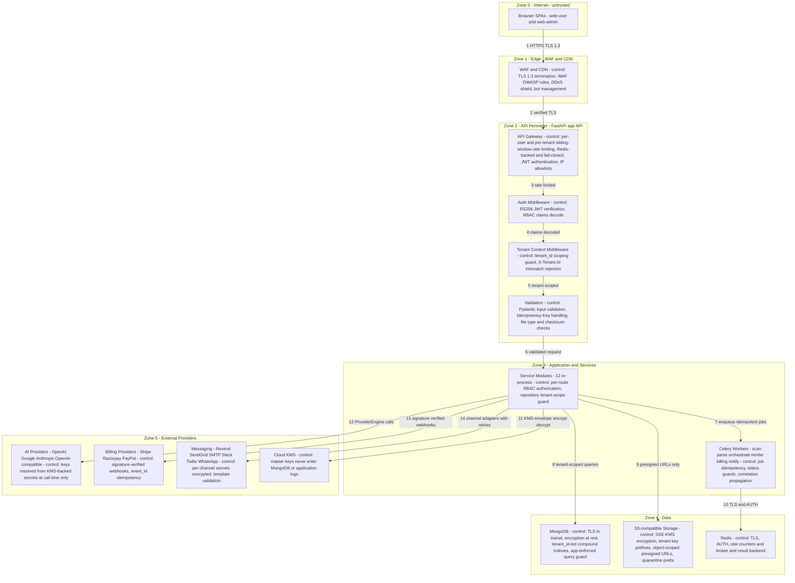
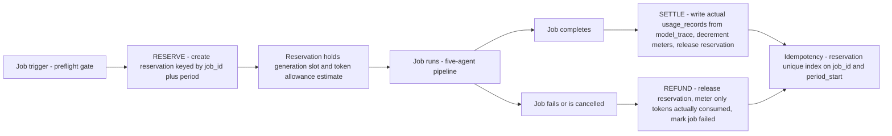
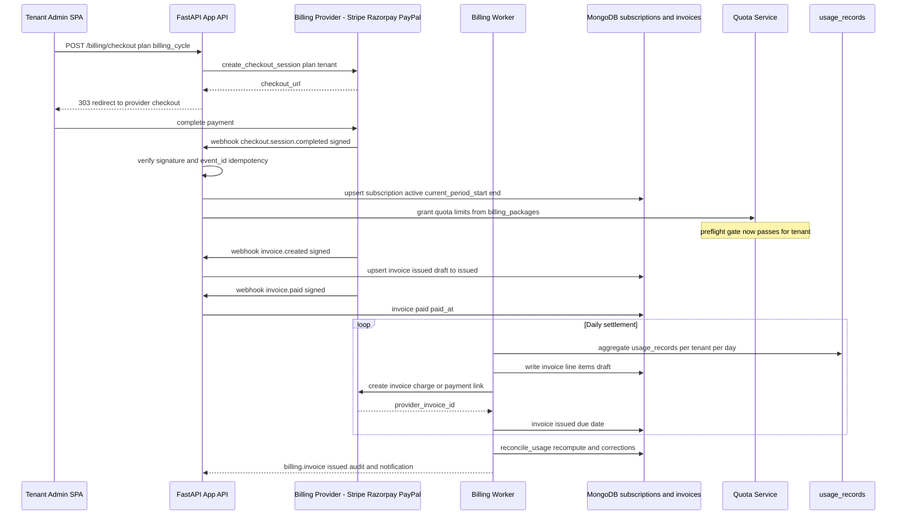
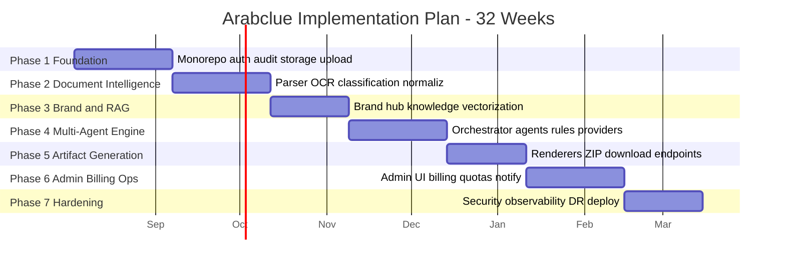

# Arabclue — Security, Billing & Operations Blueprint

| Field | Value |
|---|---|
| **Title** | Arabclue Platform — Security & Governance, Billing & Quotas, Notifications, Phase-by-Phase Implementation Plan, Production Operations & Open-Question Resolutions |
| **Status** | Draft |
| **Version** | 0.5.0 |
| **Date** | 2026-08-01 |
| **Owner** | Platform Architecture Team (principal product & solutions architect) |
| **Scope** | V1 web-only, multi-tenant B2B SaaS with a deterministic five-agent proposal generation workflow over Saudi Etimad tender documents. This document covers: (1) security architecture and governance — multi-tenant isolation, authentication and RBAC, encrypted secret management, immutable audit logging, malware scanning, signed URLs, rate limiting and quota enforcement, and PII-aware logging; (2) billing architecture — Stripe/Razorpay/PayPal, billing packages, subscriptions, usage metering, invoices, and quota adjustment; (3) notifications — email, Slack, and Twilio WhatsApp; (4) the Phase 1–7 implementation plan with entry/exit criteria and acceptance checks; (5) production operations — logging, metrics, tracing, alerting, health, backup/disaster recovery, deployment pipelines, and tenant onboarding; and (6) the resolutions of the five open questions. |

**Scope note.** This document intentionally does **not** duplicate content from the sibling documents; it references them by section. The API surface and five-agent orchestration contracts live in `02-api-contracts-and-multiagent-engine.md`. Backend service responsibilities, MongoDB collection schemas, object storage layout, multi-tenant isolation mechanics, and the worker job catalog live in `01-backend-services-and-data-layer.md`. Frontend screen maps, the design system, and the artifact rendering pipeline live in `03-frontend-and-artifact-pipeline.md`. The master index, architecture diagrams, repository layout, tech-stack mapping, and ADRs (including ADR-006 S3 with presigned URLs, ADR-008 Auto-Finalize without Mandatory Legal Review, ADR-009 KMS-Managed Envelope Encryption, ADR-010 Bilingual UX Phasing) live in `00-architecture-overview.md`.

**Conventions inherited from the sibling documents** (consistent with `02-api-contracts-and-multiagent-engine.md` §1): ULID identifiers; ISO 8601 UTC timestamps with microsecond precision; money as integers in minor units (SAR halalas / USD cents); ratios as decimal strings; `X-Correlation-Id` on every request and job; `tenant_id` present on every tenant-scoped document; `X-Tenant-Id` header must match the JWT `tenant_id` claim.

---

## 1. Security Architecture Overview

The platform is a **service-oriented monolith-plus-workers** deployment (ADR-001 in `00-architecture-overview.md` §8): one FastAPI application API terminates the browser trust boundary, in-process service modules enforce tenant scope and authorization, and Celery workers execute compute-heavy jobs. Security is enforced as **defense-in-depth across five trust zones**; a failure at any single layer cannot leak tenant data on its own.

### 1.1 Trust Boundary Diagram



### 1.2 Boundary Control Summary

| # | Boundary | From → To | Security control applied |
|---|---|---|---|
| 1 | Internet → Edge | Browser → WAF/CDN | TLS 1.3 termination; WAF OWASP rule set; DDoS protection; bot management; request size caps |
| 2 | Edge → API | WAF/CDN → FastAPI app API | Origin protection; cache rules for static assets only; API never cached by default |
| 3 | API perimeter | Gateway → Auth middleware | Per-user and per-tenant sliding-window rate limiting (Redis-backed, fail-closed); JWT RS256 signature verification; IP allowlists for admin and webhook paths |
| 4 | Auth → Tenant scope | Auth middleware → Tenant context middleware | RBAC claim decode; `tenant_id` binding; `X-Tenant-Id` vs JWT mismatch rejected with `403` before any service call |
| 5 | Tenant scope → Validation | Tenant context → Pydantic validation | Tenant-scope guard asserts a tenant filter on every repository call; input schema validation; `Idempotency-Key` enforcement on job-creating POSTs |
| 6 | Application → Services | FastAPI app → 12 service modules | Per-route RBAC authorization from flattened JWT `permissions[]`; repository `TenantScopeGuard`; no cross-tenant query patterns |
| 7 | Application → Workers | Services → Celery queues | Jobs carry `correlation_id` and `tenant_id`; handlers are idempotent (status guards, unique indexes); at-least-once delivery with acks-late |
| 8 | Application → MongoDB | Services/workers → MongoDB | TLS in transit; encryption at rest; `tenant_id`-led compound indexes; app-enforced scoping (ADR in `01` §7.2); no cross-tenant read paths |
| 9 | Application → Storage | Services → S3-compatible | SSE-KMS server-side encryption; tenant-prefixed keys; object-scoped presigned URLs only; quarantine prefix before scan |
| 10 | Workers → Redis | Workers → Redis | TLS + AUTH; rate-limit counters and Celery broker/result backend; no tenant data persisted |
| 11 | Application → KMS | Services → Cloud KMS | Envelope encryption: per-secret data keys, master keys never in the database (ADR-009) |
| 12 | Application → AI | Services → AI providers | ProviderEngine abstraction over LiteLLM; credentials resolved from `env_secrets` at call time; usage metered to `usage_records` |
| 13 | Application → Billing | Services → Stripe/Razorpay/PayPal | Webhook signature verification; replay protection; `event_id` idempotency; no raw provider keys at rest |
| 14 | Application → Messaging | Services → Resend/SendGrid/SMTP/Slack/Twilio | Per-channel secrets encrypted; template validation; retry with backoff; suppression lists |

### 1.3 Multi-Tenant Isolation

Multi-tenant isolation is implemented at the **API layer** (JWT `tenant_id` + `TenantContextMiddleware` + `X-Tenant-Id` matching), the **database layer** (`tenant_id` on every tenant-owned document, compound indexes leading with `tenant_id`, repository `TenantScopeGuard`, integration tests that assert cross-tenant reads return nothing), the **object-storage layer** (tenant-segmented key prefixes `{tenant_id}/…`, object-scoped presigned URLs, `s3:ListBucket` denied to all user-facing roles), and the **RAG layer** (`tenant_id` preFilter on every `$vectorSearch`, identical filter on the kNN fallback). The full mechanics — including the illustrative middleware pattern and the CI scan that bans unscoped `find({})` queries — are specified in `01-backend-services-and-data-layer.md` §7 (Multi-Tenant Isolation Implementation). Defense-in-depth means a compromise at any single layer does not expose another tenant's data.

---

## 2. Authentication and RBAC

The auth contract (endpoints, payloads, status codes) is fully specified in `02-api-contracts-and-multiagent-engine.md` §3.1 (Authentication) with the catalog in §2 and the JWT claim format in §1.2. This section defines the security policy: token lifetimes, rotation, revocation, role model, permission matrix, MFA, and password policy.

### 2.1 Token Flow — Short-Lived JWT + Rotating Refresh Token

| Item | Policy |
|---|---|
| Access token | RS256-signed JWT, **15-minute TTL**, claims: `iss`, `aud`, `sub`, `jti`, `iat`, `exp`, `token_type=access`, `tenant_id`, `roles[]`, `permissions[]`, `workspace_scopes[]` (format in `02` §1.2) |
| Refresh token | Opaque rotating token, **30-day TTL**, stored **hashed (SHA-256)** in `users.refresh_token_family` (`01` §3.2), single-use, rotated on every `POST /auth/refresh` |
| Refresh transport | `httpOnly; Secure; SameSite=Strict` cookie set by the API on login and rotated on refresh (client storage decision in `03` §2.2) — XSS cannot read the refresh credential; `SameSite=Strict` bounds CSRF |
| Rotation and reuse detection | Each refresh rotates the token and stores `{family_id, current_hash, prev_hash, rotated_at}`; presenting a **rotated (old) token** is treated as reuse → revoke the entire family, blacklist the access token, alert security, force re-login with MFA |
| Access-token blacklist | On logout/suspension/tenant-switch, `jti` is added to a Redis denylist with TTL equal to remaining token life; auth middleware rejects blacklisted `jti` |
| Session revocation | `POST /auth/logout` revokes the presented refresh token and blacklists the access token; tenant suspension revokes all refresh tokens for the tenant; password change revokes all sessions except the current one |

### 2.2 RBAC Claims and Enforcement

- Roles are resolved to **flattened permissions at login** and embedded in the access token (`02` §1.2). Auth middleware validates signature, `tenant_id` claim, and route permission requirements — **no per-request role lookup**.
- Permissions are re-resolved at every login; a background consistency job reconciles token claims with current role definitions (`01` §2.2).
- Route guard on the client (`GuardedRoute`, `03` §2.5) only affects the UI; the server is the enforcement point.
- `workspace_scopes[]` restricts external-consultant accounts to explicit workspace ids; membership checks run in addition to permission checks for every workspace-scoped endpoint.

### 2.3 Role Model

| Role | Tenant scope | Description | Notes |
|---|---|---|---|
| `platform_admin` | Platform (reserved tenant `platform`) | Operates the platform: AI providers, env secrets, billing packages, global quotas, RBAC catalog, full audit, notifications config, tenant management | System role, immutable |
| `tenant_admin` | One tenant | Manages the tenant: users, roles, branding, subscription/quota view, tenant-scoped audit and security settings | System role, immutable |
| `proposal_manager` | One tenant | Owns the proposal lifecycle: workspace creation, generation orchestration, review checkpoint, brand and knowledge hub management, team assignment | System role, immutable |
| `bid_team_member` | One tenant | Engineer/estimator/coordinator: workspaces (view/edit assigned), upload, generation status, artifact downloads, knowledge read | System role, immutable |
| `external_consultant` | One or more tenants | Third-party consultant; same permissions as `bid_team_member` but strictly scoped to `workspace_scopes[]` assigned workspaces; no billing or admin access | Scoped membership enforcement |

Custom tenant roles may be created by `tenant_admin` from the assignable permission catalog (`permissions.is_assignable`, `01` §3.2); system roles are immutable (`roles.is_system = true`).

### 2.4 Default Permission Matrix

| Permission | platform_admin | tenant_admin | proposal_manager | bid_team_member | external_consultant |
|---|---|---|---|---|---|
| `workspace:read` | ✓ | ✓ | ✓ | ✓ | ✓ (scoped) |
| `workspace:create` | ✓ | ✓ | ✓ | – | – |
| `workspace:update` | ✓ | ✓ | ✓ | – | – (assigned only) |
| `workspace:archive` | ✓ | ✓ | ✓ | – | – |
| `document:upload` | ✓ | ✓ | ✓ | ✓ | ✓ (scoped) |
| `document:read` | ✓ | ✓ | ✓ | ✓ | ✓ (scoped) |
| `generation:trigger` | ✓ | ✓ | ✓ | ✓ | ✓ (scoped) |
| `generation:read` | ✓ | ✓ | ✓ | ✓ | ✓ (scoped) |
| `generation:manage` | ✓ | ✓ | ✓ | – | – |
| `generation:cancel` | ✓ | ✓ | ✓ | – | – |
| `artifact:download` | ✓ | ✓ | ✓ | ✓ | ✓ (scoped) |
| `artifact:share` | ✓ | ✓ | ✓ | ✓ | – |
| `knowledge:read` | ✓ | ✓ | ✓ | ✓ | ✓ (scoped) |
| `knowledge:write` | ✓ | ✓ | ✓ | – | – |
| `knowledge:approve` | ✓ | ✓ | ✓ | – | – |
| `brand:read` | ✓ | ✓ | ✓ | ✓ | ✓ (scoped) |
| `brand:write` | ✓ | ✓ | ✓ | – | – |
| `review:approve` | ✓ | ✓ | ✓ | – | – |
| `user:manage` | ✓ | ✓ | – | – | – |
| `role:assign` | ✓ | ✓ | – | – | – |
| `subscription:read` | ✓ | ✓ | – | – | – |
| `usage:read` | ✓ | ✓ | – | – | – |
| `audit:read` | ✓ | ✓ (tenant scope) | – | – | – |
| `audit:read-all` | ✓ | – | – | – | – |
| `security:read` | ✓ | ✓ | – | – | – |
| `provider:write` | ✓ | – | – | – | – |
| `env:write` | ✓ | – | – | – | – |
| `package:manage` | ✓ | – | – | – | – |
| `billing:manage` | ✓ | – | – | – | – |
| `tenant:manage` | ✓ | – | – | – | – |
| `admin:notify` | ✓ | – | – | – | – |
| `config:write` | ✓ | – | – | – | – |

### 2.5 MFA Policy

| Policy | Value |
|---|---|
| Method | TOTP (RFC 6238), 6-digit, 30-second period; secret stored encrypted (`users.mfa_secret_enc`, `01` §3.2) |
| Default | Optional per tenant; `tenant_admin` may require MFA for all tenant members (`tenants.settings.mfa_required`) |
| Enforcement | When `mfa_enabled` on the account (or tenant-wide policy), `POST /auth/login` returns a challenge state; tokens are issued only after the TOTP code verifies |
| Enrollment | Settings → Security UI: QR secret + verify-code; enrollment writes an `audit_logs` entry (`auth.mfa_enrolled`) |
| Backup codes | 8 single-use recovery codes generated at enrollment, stored hashed; used once each; regeneration requires re-enrollment |
| Lockout | 5 consecutive failed MFA attempts → account locked for 15 minutes + security alert notification |
| Disable | Requires current password + valid TOTP; disable is audited (`auth.mfa_disabled`) and triggers a security notification (template `notify.security.mfa_disabled`) |

### 2.6 Password Policy

| Policy | Value |
|---|---|
| Hashing | Argon2id (`m=65536, t=3, p=4`), per-user salt; never plaintext (ADR: `01` §2.2) |
| Minimum length | 12 characters |
| Composition | No mandatory composition rules beyond length; a breached-password check (HaveIBeenPwned k-anonymity API, SHA-1 prefix) rejects known-compromised passwords |
| Reset | Email-based reset link (one-time token, 30-min TTL); re-authentication required for the account to issue new tokens |
| Rotation | Optional; not force-expired in V1 (breach check is the primary control) |
| Brute force | Per-user + per-IP exponential backoff and CAPTCHA threshold at the gateway (`01` §2.2); `failed_login_count` resets on success |
| Reuse | Argon2id re-hash comparison on change rejects the last 5 passwords |

### 2.7 Session Revocation and Tenant Switch Semantics

| Event | Behavior |
|---|---|
| Logout | Refresh token revoked, access-token `jti` blacklisted in Redis |
| Password change | All refresh-token families revoked except current session; audit `auth.password_changed` |
| MFA disabled | All sessions revoked; audit + security notification |
| User suspended / tenant suspended | All refresh tokens for the user/tenant revoked; logins rejected (`401 account_disabled`); generation preflight fails with `403`; pending jobs transition to `cancelled` |
| Tenant switch | **Session rebind**, not a UI preference: client requests `POST /auth/refresh` with the selected `tenant_id`; the API re-issues the access token with the new tenant's `tenant_id` and re-resolved `roles[]`/`permissions[]`/`workspace_scopes[]`; the client clears all tenant-scoped query caches (flow and cache-key rules in `03` §2.4) |

---

## 3. Secret Management and Encryption

Secret management follows ADR-009 (Envelope Encryption with KMS-Managed Master Keys, `00-architecture-overview.md` §8). Two layers exist:

| Layer | Scope | Stored in | Shape |
|---|---|---|---|
| **(a) Platform env secrets** | AI API keys, DB URIs, billing provider keys, SMTP credentials, rate-limit config | `env_secrets` collection, `scope = platform` | Ciphertext only, envelope-encrypted |
| **(b) Tenant-scoped credentials** | OpenAI-compatible provider keys entered by tenant/platform admins for bring-your-own-key scenarios | `env_secrets` collection, `scope = tenant` (carries `tenant_id`); referenced by `ai_providers.api_key_ref` | Ciphertext only; **never** stored inline in `ai_providers` |

### 3.1 Encryption Scheme

| Concern | Design |
|---|---|
| Algorithm | AES-256-GCM envelope encryption: a **per-secret data key (DEK)** encrypts the value; the DEK is wrapped by a **master key** in cloud KMS (`kms_key_id` recorded per secret) |
| Storage | `env_secrets` stores only `encrypted_value` (base64 ciphertext), `kms_key_id`, `scope`, `tenant_id`, `rotated_at` — full shape in `01` §3.7 |
| Master keys | Never enter MongoDB, application memory beyond the decrypt call, or any log sink; KMS access is restricted to the api-gateway and worker service identities |
| Decryption | Occurs only inside the service that needs the credential (e.g., `sync_provider_models` decrypts the provider key; the billing service decrypts the Stripe key); every decrypt that serves a human is audit-logged |
| Self-hosted fallback | For self-hosted KSA deployments a KMS-compatible software/hardware module (e.g., local KMS appliance or HSM-backed key service) implements the same `Encrypt`/`Decrypt` interface; the `env_secrets` shape is unchanged |

### 3.2 Encryption Workflow (Admin Submits a Key)

1. PlatformAdmin opens the **Secure Environment Config Editor** (`/admin/env-secrets`, screen in `03` §5.1) and submits `{key, value, scope, description}` via `POST /admin/env-secrets` (`02` §3.7).
2. The API validates key naming and scope, generates a fresh DEK, encrypts the value, wraps the DEK with the KMS master key, and stores the ciphertext + `kms_key_id` + `key_version`.
3. The API returns **metadata only** (`value_redacted: "••••••••"`); the raw value is never returned by any endpoint (`GET /admin/env-secrets/{key}` returns metadata with the value redacted).
4. The UI shows a masked value with a **Reveal On Demand** action. Reveal calls a decrypt operation server-side; the plaintext is streamed once to the caller, and an `audit_logs` entry (`secret.reveal`) records actor, key, timestamp, IP, and correlation id.
5. Rotation (`PUT /admin/env-secrets/{key}`) encrypts the new value with a new DEK, bumps `key_version` and `rotated_at`, and is audited (`secret.rotate`). Old ciphertext versions are deleted after a grace window; a nightly job verifies no plaintext residue.

### 3.3 Provider Keys and `api_key_ref` Indirection

- `POST /providers` accepts the raw `api_key` **write-once**; the API encrypts it into `env_secrets` and stores `api_key_ref` (e.g., `enc:providers/<provider_id>/api_key`) on the `ai_providers` record (`02` §3.4, §6.1). The raw key never appears in any record, response, or log.
- `GET /providers`, `GET /providers/{id}`, and model discovery responses return the reference only; the ProviderEngine resolves the key from `env_secrets` at call time inside the worker.
- `POST /providers/{id}/test` decrypts transiently for the connection test; test failures return structured errors (`auth_failed`, `timeout`, `model_not_found`, `network_error`) that never include the key.

### 3.4 Key Rotation Procedure

| Step | Action | Audit event |
|---|---|---|
| 1 | PlatformAdmin schedules or triggers rotation for a secret (platform env secret or provider key) | `secret.rotate.initiated` |
| 2 | API encrypts the new value with a new DEK and KMS wrap; stores new ciphertext + `key_version` | `secret.rotate` |
| 3 | Provider registry tests connectivity with the new key (`POST /providers/{id}/test` for provider keys) | `provider.test` |
| 4 | After a configurable grace window (default 7 days), the old DEK version is retired in KMS (ciphertext invalidated); the old ciphertext is deleted | `secret.rotate.completed` |
| 5 | A monthly `secret_rotation_due` alert (see §11.4) lists secrets older than 180 days | – |

---

## 4. Audit Logging

Audit logging is **immutable, append-only, and tamper-evident**. The collection is owned exclusively by the Audit and Security Service (`01` §2.11); there is no update/delete API and no admin UI affordance to modify entries.

### 4.1 `audit_logs` Collection Shape

The canonical shape is specified in `01` §3.9. The governance fields used by this document are:

| Field | Type | Description |
|---|---|---|
| `_id` / `audit_id` | string (ULID) | Event id |
| `tenant_id` | string (ULID) | Owning tenant; `platform` for platform-global events (nullable for system boot) |
| `actor_user_id` | string (ULID) | Acting user (null for system/billing-provider events) |
| `actor_role` | string | Role of the actor at event time (resolved from token), e.g. `platform_admin` |
| `actor_type` | enum | `user \| system \| admin \| billing_provider` |
| `action` | string | e.g. `auth.login`, `document.upload`, `generation.trigger`, `config.change`, `billing.invoice`, `secret.reveal` |
| `category` | enum | `auth \| config \| upload \| generation \| billing \| security \| admin` |
| `resource_type` | string | Collection/resource class, e.g. `proposal_jobs`, `env_secrets`, `subscriptions` |
| `resource_id` | string (ULID) | Target document id |
| `before` / `after` | object or null | Field-level diff for config changes; null for events without a diff |
| `ip_address` | string | Source IP (retained in audit; masked in logs per §4.5) |
| `user_agent` | string | Client UA |
| `correlation_id` | string | Request/job correlation id |
| `created_at` | datetime | Immutable timestamp |
| `prev_hash` | string | Hash of the previous audit document (chain link) |
| `hash` | string | `sha256(prev_hash + canonical_payload)` |
| `retention_tier` | enum | `warm \| archive` — warm (7 years in MongoDB), then archived to S3 cold storage |

### 4.2 Append-Only WAL Pattern and Hash Chaining

- **WAL-style append-only**: writes are single-document inserts to a capped-growth collection; no in-place updates, no deletes. Collection write access is restricted to the Audit service role; DB users used by other services get read-only access to `audit_logs`.
- **Hash chain**: each document's `hash = sha256(prev_hash + canonical_json(payload))`, where `payload` excludes `hash`/`prev_hash` themselves. A nightly `verify_audit_chain` job recomputes the chain and alerts on any mismatch (tamper evidence). Edits to any past entry break every subsequent link.
- Canonical JSON serialization (`src/lib/canonical-json.ts` pattern server-side) ensures deterministic hashing across runtimes.

### 4.3 Write Path

| Severity class | Actions | Write mode |
|---|---|---|
| **Sensitive (synchronous)** | `auth.login`, `auth.logout`, `auth.mfa_enrolled/disabled`, `config.change` (env secrets, providers, packages, roles, quotas), `document.upload`, `generation.trigger`, `generation.complete`, `billing.*` (checkout, invoice issued/paid/failed, quota adjust), `secret.reveal` | Blocking write with timeout; on timeout, buffer and retry + alert — these events are never dropped |
| **Routine (asynchronous)** | Reads, list views, search queries, notification deliveries, stage progress polls | Fire-and-forget via a bounded retry buffer; a gap monitor alerts if the buffer overflows |

### 4.4 Read Path

- **Platform admin explorer**: `GET /admin/audit-logs` with filters `actor_id`, `action`, `entity_type`, `entity_id`, `tenant_id`, `from`, `to`, pagination — contract in `02` §3.7; UI in `03` §5.1 (Audit log explorer: filter bar, detail drawer with before/after deltas, integrity badge, no edit/delete affordance).
- **Tenant admin explorer**: `GET /audit-logs` returns only the caller's tenant scope (`audit:read`).
- Retention: warm in MongoDB for 7 years (no TTL per `01` §3.11), then archived to S3 with a nightly integrity verification of the archived chain.

### 4.5 PII-Aware Logging Policy

**Policy statement.** Logs never contain tokens, password hashes, API keys, TOTP secrets, or document text. Personal data is masked at the logging boundary (the gateway edge and the shared `packages/logging` redactor) before any sink — stdout, file, or metrics.

| Field | Redaction rule |
|---|---|
| `email` | `sha256(email)[:12]` or `***@<domain>` in log payloads; full value only inside audit `after` diffs where legally required and access-restricted |
| `phone` | Keep last 4 digits, mask the rest (`+9665••••4567`) |
| `ip_address` | Mask last octet in logs (`185.107.10.•`); full value retained only in `audit_logs` |
| `password` / `hashed_password` | Never logged; always `[REDACTED]` |
| `access_token` / `refresh_token` | Never logged; `[REDACTED]` |
| `api_key` / `secret_value` | Never logged; `[REDACTED]` |
| `mfa_secret_enc` | Never logged; `[REDACTED]` |
| CR / commercial registration numbers | Mask middle digits |
| `user_agent` | Retained (not PII) |
| Document content / extracted text | Never logged; log `storage_key` + checksum references only |
| `correlation_id` | Retained (not PII; required for tracing) |
| Billing card data | Never touches the platform (tokenized by providers); provider tokens logged as `[REDACTED]` |

The redactor is a shared library applied at: the FastAPI logging middleware, worker log formatters, and the frontend `packages/logging` console redactor. CI tests assert no secret-shaped values leak from log fixtures (§10 Phase 7 acceptance).

---

## 5. Rate Limiting and Quota Enforcement

Two complementary mechanisms protect the platform:

1. **API rate limiting** — per-user and per-IP sliding-window counters in Redis, applied at the gateway for every request class. Fail-closed behavior: when Redis is unavailable, mutating endpoints return `503` and reads are allowed, with an alert (`RateLimitStoreDown`, §11.4).
2. **Quota enforcement** — per-tenant entitlement limits (`generation_limits`, `token_limits`, `quota_limits`) checked in the **preflight gate before a job starts** and decremented/refunded on completion/failure.

### 5.1 API Rate Limiting

| Parameter | Value |
|---|---|
| Algorithm | Sliding window (fixed-window with rolling counters), Redis-backed (`INCR` + TTL) |
| Keys | `rl:{tenant_id}:{user_id}:{route_class}` and `rl:ip:{ip}:{route_class}` — the stricter of the two applies |
| Fail-closed behavior | Redis down → mutating endpoints `503` with `Retry-After`; reads allowed; alert `RateLimitStoreDown` |
| Headers | `X-RateLimit-Limit`, `X-RateLimit-Remaining`, `X-RateLimit-Reset` on every response; `429` responses include `Retry-After` |
| Login/register | Per-IP + per-email stricter window; exponential backoff; CAPTCHA threshold (`01` §2.2) |

### 5.2 Quota Enforcement (Entitlement)

Quota is enforced in two places:

| Checkpoint | Behavior |
|---|---|
| **Preflight gate** (before job start) | `POST /workspaces/{id}/generate` runs the preflight checks — quota/token balance is a **FAIL_EARLY** gate (see `02` §4.4–§4.5): remaining `generation_limits` and `token_limits` are validated; exhaustion returns `429` with quota detail before any job is enqueued |
| **Decrement on completion** | Meters are settled when the job finishes: actual token consumption is written to `usage_records` (from `model_trace`) and the generation count is decremented from the period budget |

### 5.3 Enforcement Points Table

| Endpoint / action | Limiter | Limits source | On exceed |
|---|---|---|---|
| `POST /auth/login`, `POST /auth/register` | Per-IP + per-email sliding window | Redis counters | `429` + `Retry-After`; CAPTCHA after threshold |
| `POST /workspaces` | Per-user rate | Redis | `429` |
| `POST /workspaces/{id}/documents` | Per-tenant storage quota (`quota_limits.documents_per_month`, `storage_mb`) + per-user rate | `subscriptions.quota_limits` + Redis | `429` (quota) / `413` (size) |
| `POST /brand-profiles/{id}/assets`, `POST /knowledge-assets` | Per-tenant storage quota + asset count | `subscriptions.quota_limits` | `429` |
| `POST /knowledge-assets/{id}/vectorize` | Per-tenant embed token allowance (`token_limits.embed_tokens_per_month`) | `subscriptions.token_limits` | `429` `embed_quota_exhausted` |
| `POST /workspaces/{id}/generate` | Per-tenant `generation_limits.monthly` + `concurrent_jobs` + per-user rate | `subscriptions.generation_limits` + Redis semaphore | `429` `generation_quota_exhausted`; concurrent cap returns `409` `concurrent_job_limit` |
| All read endpoints | Per-user + per-tenant sliding window | Redis | `429` + `Retry-After` |
| `POST /providers/{id}/test` | Per-admin rate | Redis | `429` |
| Worker AI calls (per provider) | Per-provider rate cap | `ai_providers.config` + `usage_records` | Backoff → fallback chain → stage retry |
| Billing webhooks | Provider IP allowlist + signature | `env_secrets` + provider config | `401` (bad signature) / `429` (replay burst) |
| `POST /billing/checkout` | Per-tenant rate | Redis | `429` |

### 5.4 Quota Decrement / Idempotency Flow (Reserve → Settle → Refund)



| Concern | Design |
|---|---|
| Reserve | At preflight, a `quota_reservations` entry is created with `{job_id, tenant_id, period_start, generation_slot:1, token_estimate}` and a unique index on `{job_id}` — replayed `Idempotency-Key` POSTs return the original job, never double-reserving |
| Settle | On completion, actual tokens from `proposal_jobs.stages[].model_trace` are written to `usage_records` (append-only, unique `{job_id}` index per meter) and the generation counter decrements once |
| Refund | On failure/cancel, the reservation is released and only consumed tokens are metered; a job paused mid-run (`quota_blocked`) holds its reservation until resume or expiry |
| Reconciliation | `reconcile_usage` recomputes meters from append-only `usage_records` (read-only recompute, corrections audited) — worker in `01` §6 |

### 5.5 Overage Handling Recommendation

**Block (fail-closed) with soft-warn at 80%.** When a meter reaches 80% of the period limit, the notification service sends `notify.quota.warning.80`; at 100% the preflight gate blocks new jobs with `429` and the tenant sees a `quota_blocked` banner linking to the billing portal (`03` §7.5). Rationale: token consumption is real spend against the platform's provider bills; silently overrunning committed budgets produces negative-margin tenants and unpredictable cost. Soft-warn keeps the UX cooperative while block keeps cost bounded. A platform admin may raise limits via `POST /admin/quotas/adjust` (audited, optionally expiring — §7.3).

---

## 6. Billing Architecture

The Billing and Quota Service (`01` §2.10) owns `subscriptions`, `usage_records`, `billing_packages`, and `invoices` (`01` §3.8). Stripe, Razorpay, and PayPal are exposed behind a common `BillingProvider` adapter interface; webhook ingestion is provider-neutral and idempotent by `event_id`. The `bill_tenant` and `reconcile_usage` workers are cataloged in `01` §6 (Worker and Job Catalog).

### 6.1 BillingProvider Interface

```python
# Interface contract (illustrative; implementations: stripe, razorpay, paypal)
class BillingProvider:
    provider_id: str                      # "stripe" | "razorpay" | "paypal"
    def create_customer(tenant) -> provider_customer_id
    def create_checkout_session(plan, tenant, billing_cycle) -> checkout_url
    def get_subscription(provider_sub_id) -> provider_subscription
    def verify_webhook_signature(raw_body, headers) -> bool
    def parse_event(raw_body, headers) -> provider_event   # normalized
    def create_invoice_payment_link(invoice) -> payment_url
    def get_balance / refund / prorate hooks
```

| Concern | Design |
|---|---|
| Plan mapping | `billing_packages` (admin-managed) map 1:1 to provider price/plan ids (`billing_packages.provider_plan_ids.{stripe,razorpay,paypal}`); checkout uses the active package's provider plan |
| Customer creation | On first checkout the adapter calls `create_customer(tenant)` and stores `provider_customer_id` on the tenant's subscription record |
| Webhook verification | Each adapter verifies its own signature scheme (Stripe `Stripe-Signature` with secret; Razorpay `X-Razorpay-Signature`; PayPal webhook id with cert/callback validation); unverifiable events are rejected with `401` before processing |
| Idempotent events | Every processed event upserts on `provider_event_id` (unique index on `invoices`, `01` §3.8); replayed events are ignored; conflicting payloads for the same `event_id` are rejected with `409` |
| Checkout flow | `POST /billing/checkout` → create provider session → redirect → provider confirmation webhook → subscription activation → quota grant (§6.4) |

### 6.2 Subscription Lifecycle

```
trialing → active → past_due → canceled
    ↑          ↓
    └──────────┘ (reactivate / dunning resolution)
```

| State | Entered by | Behavior |
|---|---|---|
| `trialing` | New tenant registration (default free/trial tier) | Full feature set within trial `quota_limits`; 14-day window; dunning reminder at day 10 |
| `active` | Checkout webhook `checkout.session.completed` or `invoice.paid` | Quota grant applied; `current_period_start/end` set; normal operation |
| `past_due` | `invoice.payment_failed` | Grace of 7 days; dunning emails on days 1/3/7; quota stays active during grace; generation preflight passes with a `past_due` warning |
| `canceled` | `subscription.canceled` or grace expiry | Feature access frozen at period end; workspaces read-only; new generations blocked; data retained 90 days then archived per retention policy |
| Reactivation | `invoice.paid` after `past_due` | Returns to `active`; quota period continues |

### 6.3 Usage Metering Flow

1. Every model call (agents, embeddings) writes a `usage_records` row with `meter_type = ai_tokens` (or `embeddings`), `quantity`, `unit`, `unit_price_minor` at time of use, `job_id`, `period_start` (`01` §3.8). Writes are append-only; the `{job_id}` unique index guarantees one settlement per job.
2. Storage is metered by a nightly job computing `storage_gb_hours` from object-storage byte counts per tenant.
3. The `bill_tenant` worker (queue `billing`, concurrency 1, `01` §6) aggregates `usage_records` per tenant per period → invoice line items: `subscription` (plan price), `ai_tokens`, `document_uploads`, `storage_gb_hours`, and overage line items.
4. `reconcile_usage` recomputes totals from the append-only ledger and writes corrections only if a drift is detected (audited).
5. Invoice totals are computed deterministically: `subtotal = Σ line_total`, `tax = subtotal × VAT rate (15% default, configurable)`, `total = subtotal + tax` (minor units, SAR).

### 6.4 Checkout → Webhook → Activation → Quota → Settle → Invoice Sequence



### 6.5 Invoice Lifecycle and Proration

| State | Transition |
|---|---|
| `draft` | Aggregated line items, not yet sent to the provider |
| `issued` | Sent/created in the provider; `payment_due_at` set (default 5 days after period end) |
| `paid` | `invoice.paid` webhook; `paid_at` recorded; `provider_event_id` set |
| `failed` | `invoice.payment_failed` webhook → subscription `past_due`; dunning |
| `void` | Admin void of an erroneous draft/issued invoice; audited |

**Proration:** package changes mid-period compute a prorated credit/debit line item using the daily rate of the package price; the next invoice includes the prorated delta. **Currency:** pricing is SAR; all money is integer minor units (halalas). Multi-currency is a Phase 7 extension; V1 supports SAR only for checkout while provider-native currency conversion is delegated to the provider.

### 6.6 Webhook Security Summary

| Control | Implementation |
|---|---|
| Signature verification | Provider-native verification before parsing; `401` on failure |
| Replay protection | `provider_event_id` unique index; processed events return `200` no-op |
| IP allowlist | Webhook endpoints restricted to provider source IP ranges at the gateway |
| Correlation | Every webhook handler generates/echoes `X-Correlation-Id` into audit and invoice records |
| Reconciliation | If a webhook is lost, `bill_tenant`/`reconcile_usage` recompute from `usage_records` and provider invoice state — the ledger is the source of truth, webhooks are triggers not truth |

---

## 7. Quotas and Packages

### 7.1 `billing_packages` Record Shape

The canonical stored shape is in `01` §3.8 (`billing_packages`). The logical entitlement model used by the admin package builder (`03` §5.1) and the quota service is:

| Logical field | Description | Stored field mapping (`01` §3.8) |
|---|---|---|
| `package_id` | ULID | `_id` |
| `name` | Display name | `name` |
| `tier` | `free \| starter \| professional \| enterprise` | `code` |
| `price` | List price per cycle, minor units | `price_minor` |
| `billing_cycle` | `monthly \| annual` | `billing_cycle` |
| `quota_limits.storage_mb` | Storage allowance | `quota_limits.storage_gb` (convert) |
| `quota_limits.documents` | Documents per month | `quota_limits.documents_per_month` |
| `quota_limits.knowledge_assets` | Knowledge asset count | `quota_limits.seats` field repurposed or extended via schema version; enforced by `knowledge_assets` count check |
| `token_limits.monthly_tokens` | AI tokens per month | `token_limits.ai_tokens_per_month` |
| `token_limits.per_generation` | Per-generation token cap | `token_limits.per_generation` (extended in V1.1 schema) |
| `generation_limits.monthly` | Generations per month | `quota_limits.generations_per_month` |
| `generation_limits.concurrent` | Concurrent jobs | `generation_limits.concurrent_jobs` |
| `features` | Feature bitmap | `features[]` (e.g. `artifacts, boq, compliance, api_access, priority_queue`) |
| `active` | Sellable flag | `is_active` |

### 7.2 Default Seed Packages (Indicative)

| Package | Tier | Price (SAR/mo) | Storage | Documents/mo | Knowledge assets | Generations/mo | Concurrent jobs | AI tokens/mo | Key features |
|---|---|---|---|---|---|---|---|---|---|
| Starter | `starter` | 199 | 10 GB | 50 | 50 | 5 | 2 | 2M | PDF, compliance matrix, 1 seat, email support |
| Professional | `professional` | 599 | 50 GB | 200 | 500 | 25 | 3 | 10M | All artifacts incl. PPTX/BoQ XLSX, 10 seats, priority queue |
| Enterprise | `enterprise` | Custom (annual) | 500 GB | Unlimited | 5,000 | 200 | 8 | 100M | Everything + API access, SSO (Phase 7), Slack, dedicated onboarding |

A `free`/`trial` tier (14 days) mirrors Starter limits for new tenant registration.

### 7.3 Admin Quota Adjustment

`POST /admin/quotas/adjust` (`02` §3.7) applies an **additive delta** by default with an optional `expires_at`:

```json
{ "tenant_id": "...", "quota_name": "generations_per_month", "delta": 10,
  "reason": "Customer success approved trial extension", "expires_at": "2026-09-01T00:00:00Z" }
```

| Concern | Design |
|---|---|
| Semantics | Delta is additive to the subscription limits; an `absolute: true` flag replaces the limit outright (both audited). Negative deltas allowed for clawback |
| Audit | Every adjustment writes `config.change` audit with `before`/`after` quota values, actor, reason, and expiry |
| Expiry | `expires_at` restores the package default at the given time (a scheduled `expire_quota_adjustments` worker applies the revert) |
| Validation | Unknown `quota_name` or invalid delta → `422`; tenant not found → `404` |
| UI | `QuotaAdjustDialog` in the admin quota & usage dashboard (`03` §5.1) |

### 7.4 Overage Handling

See §5.5 — **block at 100%, soft-warn at 80%** is the recommendation. Rationale: metered token consumption is direct provider spend; fail-closed blocking keeps cost deterministic and is transparent to tenants via `429` + `quota_blocked` job state + upsell banner.

---

## 8. Notifications

The Notification Service (`01` §2.12) fans out workflow updates across channels — email (Resend primary, SendGrid fallback, Gmail SMTP), optional Slack, optional Twilio WhatsApp — with bilingual AR/EN templates, per-tenant channel preferences, idempotent delivery, and retry with backoff. Delivery runs on the `notify` queue (`01` §6, `send_notification` worker).

### 8.1 `notifications` Collection Shape

The stored shape is specified in `01` §3.9 (single recipient per record, `idempotency_key` unique, TTL 90 days). The logical model used by this section:

| Logical field | Description | Stored mapping |
|---|---|---|
| `notification_id` | ULID | `_id` |
| `tenant_id` | Owning tenant | `tenant_id` |
| `user_ids[]` | Recipients — expanded to **one record per recipient** to preserve per-channel idempotency keys | `recipient_user_id` per document |
| `type` | Enum: `parse_complete \| parse_failed \| generation_progress \| generation_completed \| generation_failed \| compliance_flags \| quota_warning \| invoice \| security_alert \| provider_health` | `type` |
| `channel(s)` | `in_app \| email \| slack \| whatsapp` | `channel` per document; fan-out creates one document per channel |
| `template_id` | Catalog id (§8.2) | Derived from `type` + `locale` |
| `payload` | Context refs `{workspace_id, job_id, artifact_id, url}` | `payload` |
| `status per channel` | `queued \| delivered \| failed \| suppressed` | `delivery_status` + `channel_refs` |
| `attempts` | Delivery attempts | `updated_at` sweep + retry counter in worker |
| `delivered_at` | Timestamp | `updated_at` on success |
| `read_at` | In-app read marker | `read_at` |

### 8.2 Template Catalog

| template_id | Purpose | Channels | Variables |
|---|---|---|---|
| `notify.generation.started` | Generation started | email, in_app | `tender_ref`, `workspace_name`, `job_id` |
| `notify.generation.progress` | Stage progress (optional, throttled) | in_app, email(optional) | `stage`, `progress_pct` |
| `notify.generation.completed` | Completed with download link | email, slack, whatsapp, in_app | `download_url`, `artifact_count`, `workspace_name` |
| `notify.generation.failed` | Failed with reason | email, slack, whatsapp, in_app | `error_code`, `retry_count`, `workspace_name` |
| `notify.compliance.flags` | Compliance flags pending review | email, in_app | `flagged_count`, `uncertain_count`, `matrix_url` |
| `notify.quota.warning.80` | Quota at 80% | email, slack, in_app | `meter`, `used_pct`, `limit` |
| `notify.quota.warning.100` | Quota exhausted | email, slack, in_app | `meter`, `billing_url` |
| `notify.billing.invoice_issued` | Invoice issued | email | `invoice_number`, `total_minor`, `due_date`, `payment_url` |
| `notify.billing.invoice_paid` | Invoice paid | email, in_app | `invoice_number`, `total_minor` |
| `notify.billing.invoice_failed` | Payment failed | email, whatsapp | `invoice_number`, `retry_hint` |
| `notify.security.new_device_login` | Login from new device | email, whatsapp | `device`, `ip_masked`, `time` |
| `notify.security.mfa_disabled` | MFA disabled | email, in_app | `time`, `audit_url` |
| `notify.provider.health.degraded` | Provider degraded | slack (ops), email | `provider_name`, `error` |
| `notify.provider.health.restored` | Provider restored | slack (ops) | `provider_name` |

### 8.3 Channel Adapters

| Channel | Primary | Fallback | Notes |
|---|---|---|---|
| Email | **Resend** SDK | SendGrid SDK, then Gmail SMTP relay (`smtplib`) | Provider preference chain configurable in `GET/PUT /admin/notification-settings`; bounces/unsubscribes write suppression entries honored before enqueue |
| Slack | Incoming webhooks per tenant workspace | – | Optional per tenant; `notify.generation.completed/failed`, `notify.quota.warning`, `notify.provider.health` |
| Twilio WhatsApp | WhatsApp Business API, template messages | – | **Opt-in required** per recipient; only approved template messages are sent; used for generation completed/failed and invoice failure |

### 8.4 Delivery Guarantees

| Concern | Design |
|---|---|
| At-least-once | `send_notification` retries with exponential backoff (max 5: 1m/2m/4m/8m/16m, `01` §6); acks-late so a worker crash re-queues |
| Idempotency | Unique index on `idempotency_key = type + recipient + correlation_id`; re-delivery is a no-op (a duplicate `delivery_status = delivered` record is suppressed) |
| Rate caps | Per-channel rate limits (email 100/hr/tenant, Slack 20/min, WhatsApp template-message cadence); low-priority types batch into a digest when capped |
| Escalation | Critical types (`notify.security.*`, `notify.billing.invoice_failed`) escalate to a secondary channel when the primary fails after 2 attempts |
| Dashboard | Admin notifications screen shows per-channel health, template editor (AR/EN), and a test-send button (`03` §5.1, `ChannelStatusCard`) |
| Endpoints | `GET /notifications`, `PATCH /notifications/{id}` (read), `PATCH /notifications/preferences`, `GET/PUT /admin/notification-settings` — catalog in `02` §2 |

---

## 9. Phase-by-Phase Implementation Plan

Baseline: 7 sequential phases, **32 weeks total** (within the 26–34 week envelope). Phase 6 billing work may start alongside Phase 5 if staffing permits, but the critical path below is sequential.



| Phase | Weeks | Goal | Blueprint mapping |
|---|---|---|---|
| 1 Foundation | 5 | Repository, shells, data layer, auth, RBAC, audit, storage, upload | `00` §6–§7; `01` §1–§3, §7; `03` §1–§3 |
| 2 Document Intelligence | 5 | Parser pipeline, OCR, classification, tender normalization | `01` §2.3, §3.3; `02` §4.1 agent 1 |
| 3 Brand Hub and RAG | 4 | Brand profile, knowledge assets, vectorization, retrieval | `01` §2.4, §2.6, §4; `02` §3.3 |
| 4 Multi-Agent Engine | 5 | Orchestrator, five agents, rules/prompts, provider abstraction | `02` §4–§6 |
| 5 Artifact Generation | 4 | PDF/PPTX/XLSX renderers, ZIP, download endpoints | `03` §6–§7; `01` §2.9 |
| 6 Admin, Billing, Ops | 5 | Admin panel, billing integrations, quotas, notifications | `03` §5; `01` §2.10–§2.12; this doc §6–§8 |
| 7 Hardening | 4 | Security review, retries/idempotency, observability, DR, deploy, onboarding | this doc §11; `00` §8 ADRs |

### 9.1 Phase 1 — Foundation

- **Goal:** A working monorepo with both React shells, the FastAPI app shell, the MongoDB data layer with the tenant model, full auth + RBAC, audit logging, object-storage integration, and the workspace/file upload pipeline.
- **Deliverables**
  - Monorepo scaffold: bun workspaces (`apps/web-user`, `apps/web-admin`, `packages/ui|shared-types|auth|logging`) and uv workspace services (`services/api-gateway`, worker entrypoints `services/document-intelligence`, `services/ai-orchestrator`, `services/output-generator`, `services/billing`); CI lint/test/build gates.
  - FastAPI app shell: `/health`, `/ready`, error envelopes (RFC 7807), list envelope, `X-Correlation-Id` middleware, auth middleware, tenant-context middleware, rate-limit middleware, OpenAPI schema export.
  - React shells: routing, app shells, `GuardedRoute`, Zustand session store, i18next AR/EN catalogs, Tailwind design tokens with logical properties (ADR-010 foundations).
  - MongoDB data layer: all 22 collections per `01` §3 with indexes (§3.10) and TTL policies (§3.11); schema-version convention; repository layer with `TenantScopeGuard`.
  - Auth & RBAC module: register/login/refresh/logout, RS256 JWT, rotating refresh with reuse detection, argon2id hashing, permission catalog seeds, role seeds, TOTP enrollment + challenge.
  - Audit service: `audit_logs` collection, hash chaining, `audit.record()` helper, sync path for sensitive events.
  - Object storage: bucket + prefix layout, presigned PUT uploads, quarantine prefix, `scan_upload` worker (ClamAV), file-type allowlist + magic-byte validation + checksum verification.
  - Workspace & Document service: workspace CRUD, upload pipeline `uploaded → scanning → parsed → schema_extracted → failed`.
  - Notification service skeleton + Resend email adapter (invite/verification).
- **Entry criteria:** Team in place; stack decisions locked (ADRs 001–007); dev environment with MongoDB, Redis, MinIO, KMS dev substitute; sample tenant + test identities available locally.
- **Exit criteria:** Authenticated upload → scan → storage round trip works; audit trail exists for login, upload, and config events; both SPAs render shells behind RBAC guards; `/health` green.
- **Acceptance checks**
  - E2E: login → create workspace → upload a PDF → quarantine → scan clean → stored under `{tenant_id}/source/…`.
  - Cross-tenant read returns `403/404` (repository integration tests + `property-22-tenant-isolation` style spec).
  - `audit_logs` contains `auth.login`, `document.upload`, `config.change` entries with valid hash chain.
  - JWT refresh rotation test: replay of a rotated refresh token revokes the family.
  - CI gates pass (lint, unit, component, E2E bilingual matrix skeleton).
- **Dependencies:** External — MongoDB, Redis, S3-compatible storage, ClamAV container, KMS (dev substitute). None internal.
- **Rough timeline:** 5 weeks.

### 9.2 Phase 2 — Document Intelligence

- **Goal:** Convert uploaded tender files into the normalized `parsed_tenders` graph with per-field confidence and source traces, for Arabic and English.
- **Deliverables**
  - Parser pipeline: `ingest_document` and `extract_tender_schema` workers (`01` §6); extractors for PDF (PyMuPDF + pdfplumber), DOCX (python-docx), XLSX (openpyxl), PPTX (python-pptx).
  - OCR: Tesseract 5 `ara`+`eng` traineddata with `arabic-reshaper`/`python-bidi` preprocessing; PaddleOCR enhancement path documented.
  - Tender classification: Arabic/English heading dictionaries, doc-class detection (`tender_rfp | tender_sow | … | other`).
  - Normalization: `parsed_tenders` fields — scope, evaluation criteria, deliverables, contract terms, SLAs, deadlines, qualification requirements, `boq_lines`, `financial_statements` — each with `confidence` and `source_trace` (`01` §3.3).
  - Extraction trace: `extraction_trace[]` per field (doc id, page, paragraph, method, confidence); parse error codes; retry policy (max 3) + DLQ handling.
- **Entry criteria:** Phase 1 upload pipeline live; sample tender corpus (Arabic + English: RFP, SOW, specs, evaluation, BoQ, scanned PDFs); ClamAV scans passing.
- **Exit criteria:** A mixed corpus classifies and normalizes into a valid tender graph with complete provenance; parse failures are typed and retryable; re-parse bumps `parsed_tenders.version` without duplication.
- **Acceptance checks**
  - Accuracy benchmark on sample corpus: heading detection and field extraction meet defined confidence thresholds (e.g., key fields ≥ 0.85 mean confidence); per-field `source_trace` resolves to real document spans.
  - BoQ lines normalize to `boq_lines` with `unit`, `qty`, `unit_price_minor`; currency/unit aliases handled per `02` §5.5 rules.
  - OCR Arabic scan yields usable text with reshaping applied; `language = ar|en|mixed` detected.
  - Schema validation rejects malformed graphs; `extract_tender_schema` is idempotent (version bump, never duplicate).
- **Dependencies:** Phase 1 pipeline; sample corpus provisioned; embedding provider not yet required.
- **Rough timeline:** 5 weeks.

### 9.3 Phase 3 — Brand Knowledge Hub and RAG

- **Goal:** Tenant brand profiles, knowledge asset ingestion with approval workflow, vectorization, and tenant-scoped evidence retrieval.
- **Deliverables**
  - Brand profile CRUD + brand assets (logo/letterhead/fonts/signature) with dimension/byte validation and compiled `brand_context` snapshot.
  - Knowledge asset ingestion: asset types (`company_profile | certification | capability_statement | policy | methodology | cv | project_card`), approval workflow (`draft → pending_approval → approved → rejected`), eligibility gating (`approved + is_active` only).
  - Chunking: hybrid fixed-window (800 tokens, 100 overlap) + heading-aware splits for AR/EN; per-chunk `language` tag.
  - Embedding: `vectorize_knowledge_asset` worker, `embeddings` collection, Atlas Vector Search index (`01` §4.4) + dedicated-collection kNN fallback (`01` §4.6).
  - Retrieval service: tenant-scoped `$vectorSearch` with `preFilter`, `minScore` threshold (default 0.72), ranking logs, `no_evidence` handling.
  - APIs + UI: `POST/GET/DELETE /knowledge-assets`, `POST /knowledge-assets/{id}/vectorize`, `GET /knowledge/search`; Knowledge hub screen (`03` §4.1).
- **Entry criteria:** Phase 1 workspaces + Phase 2 parsing live; embedding provider key configured in `env_secrets`.
- **Exit criteria:** Approved assets vectorize and are retrievable with `evidence_ref` + scores; ranking logs written; revoked/inactive assets removed from results.
- **Acceptance checks**
  - Cross-tenant search returns empty (tenant preFilter verified end to end).
  - Threshold filtering: below-`minScore` chunks excluded; `no_evidence` marker when nothing qualifies.
  - `evidence_ref` resolves to chunk with `source_ref` (document id, page, paragraph, heading).
  - Re-vectorize is idempotent (delete-then-insert, unique `{owner_id, chunk_index}`).
  - kNN fallback path returns behavior-parity results when Atlas search is disabled.
- **Dependencies:** Phase 1 + 2; embedding provider.
- **Rough timeline:** 4 weeks.

### 9.4 Phase 4 — Multi-Agent Engine

- **Goal:** The deterministic five-agent orchestration with the versioned rules/prompt engine and the AI provider abstraction.
- **Deliverables**
  - Orchestrator: `proposal_jobs` state machine (`02` §4.2), `run_agent_stage` worker, stage chaining, `resume_from_stage`, cancellation, preflight gate (`02` §4.4–§4.5) including quota checks.
  - ProviderEngine + LiteLLM gateway: `ai_providers`/`ai_models` registry CRUD, `sync_provider_models` discovery, parameter controls (temperature, max_tokens, confidence_threshold), fallback chains, `POST /providers/{id}/test`.
  - Five agents: `ingestion_parser` (reuses Phase 2), `compliance_regulatory`, `technical_solution_architect` (RAG integration), `financial_qualification`, `proposal_drafting` — each emitting the provenance envelope (`02` §4.3).
  - Compliance packs: `saudi-procurement-law`, `nca-ecc1-2018`, `nca-ccc1-2020`, `pdpl`, `local-content`, `nora` + `financial-formulas` + `drafting-guardrails` — versioned and pinned per job (`02` §5.1–§5.3).
  - Financial formula library (immutable, versioned): `QUICK_LIQUIDITY_RATIO`, `CURRENT_RATIO`, `DEBT_TO_EQUITY`, `NET_WORTH`, `PROFIT_MARGIN`, `BID_CAPACITY` with per-metric audit trail (`02` §5.4); BoQ normalization (`02` §5.5).
  - Drafting guardrails + post-hoc claim validator (`02` §5.6); prompt template catalog (`02` §5.7).
  - Usage metering per stage (`usage_records` from `model_trace`).
- **Entry criteria:** Phase 2 parser + Phase 3 RAG live; provider registry functional with ≥ 1 configured provider; compliance pack content authored and versioned.
- **Exit criteria:** An end-to-end generation job completes all five stages producing intermediate JSON envelopes with provenance, confidence, warnings, and model trace; deterministic replay produces identical outputs for identical inputs + pinned versions.
- **Acceptance checks**
  - Guardrail violations blocked (invented certifications/projects hard-blocked; unsupported claims downgraded or dropped).
  - Uncertain interpretations flagged `review_flagged` but job auto-finalizes (ADR-008).
  - Per-metric audit trail complete (formula id, version, inputs, output, source refs).
  - `model_trace` + `usage_records` written per stage; fallback chain engages on provider error; stage retry policy enforced.
  - Preflight gate returns `429` when quota exhausted before job start.
  - Determinism test: two identical workspaces + pinned pack versions produce identical matrices.
- **Dependencies:** Phases 2–3; LLM provider keys; compliance pack legal review of content.
- **Rough timeline:** 5 weeks.

### 9.5 Phase 5 — Artifact Generation

- **Goal:** Render the finalized proposal payload into PDF, PPTX, compliance XLSX, BoQ XLSX, and the ZIP bundle with signed download endpoints.
- **Deliverables**
  - Technical proposal JSON schema (`proposal-payload.v1`) validation gate before `RENDERING` (`03` §6.1).
  - PDF renderer: WeasyPrint primary (Jinja2 HTML templates, Pango RTL shaping) + Playwright/Chromium fallback; embedded Arabic fonts; print-ready standards (`03` §6.2).
  - PPTX renderer: `python-pptx`, RTL paragraph direction, brand master, per-slide citation footers (`03` §6.3).
  - Compliance XLSX generator: openpyxl, three sheets, conditional formatting, bilingual headers (`03` §6.4).
  - Financial BoQ XLSX generator: real Excel formulas, summary sheet, formulas reference sheet, validation status (`03` §6.5).
  - ZIP packaging: four artifacts + `manifest.json` with per-file sha256; streamed multipart upload (`03` §6.6).
  - Download endpoints: `GET /artifacts/{workspace_id}`, `GET /artifacts/{workspace_id}/{artifact_id}/download` (presigned GET, 30-min expiry, audit logged) (`02` §3.6, `01` §5.3).
  - Download center UI + basic review checkpoint UI (flagged statements list, approve-and-finalize button for Phase 7 gate).
- **Entry criteria:** Phase 4 drafting payload validated; brand assets available; render fonts packaged in the render worker image.
- **Exit criteria:** All five artifacts + ZIP generate from a real payload; signed-URL download works; manifest checksums verify against `output_files`.
- **Acceptance checks**
  - Golden render tests in CI: bilingual PDF/PPTX/XLSX snapshots (Arabic shaping, font embedding, brand styling) — no regression.
  - Checksum integrity: manifest sha256 == `generated_proposals.output_files.sha256`.
  - Download flow writes `artifact.download` audit entries; `410` on expired URL re-requests a fresh signature.
  - Partial artifact handling: a failed render leaves the other artifacts downloadable with per-artifact status.
  - Render failure retries idempotently (versioned keys overwrite partial output).
- **Dependencies:** Phase 4 payload; font/licensing packaging; render worker image builds.
- **Rough timeline:** 4 weeks.

### 9.6 Phase 6 — Admin, Billing, and Ops

- **Goal:** The full admin portal, billing integrations (Stripe/Razorpay/PayPal), quota enforcement, usage/cost telemetry, and notifications.
- **Deliverables**
  - Admin portal screens (`03` §5.1): overview dashboard, provider & model management (discovery UI, param editor, fallback chain, test connection), secure env config editor (write-only, reveal-on-demand audited, rotation), billing package builder, quota & usage dashboard (with `QuotaAdjustDialog`), audit log explorer, role & permission manager, notifications admin, tenant management.
  - Billing service: `BillingProvider` interface + Stripe/Razorpay/PayPal adapters; checkout flow; signature-verified webhook ingestion with `event_id` idempotency; subscription lifecycle; invoice lifecycle + proration; dunning.
  - Usage metering + `bill_tenant` + `reconcile_usage` workers; `GET /billing/subscription|invoices|usage`.
  - Quota enforcement middleware: preflight quota checks, `quota_reservations` reserve/settle/refund, `POST /admin/quotas/adjust`.
  - Notification service full catalog (§8.2): email (Resend/SendGrid/SMTP), Slack webhooks, Twilio WhatsApp; retries, idempotency, channel status dashboard.
  - Secrets: `env_secrets` API + KMS envelope encryption + reveal + rotation.
  - Seed billing packages (Starter/Professional/Enterprise).
- **Entry criteria:** Phase 5 artifacts; Phase 4 metering hooks; sandbox accounts for Stripe, Razorpay, PayPal; KMS production-shaped key available.
- **Exit criteria:** Sandbox E2E: checkout → webhook → subscription active → quota grant → generation → usage settle → invoice issued/paid; env secret create/reveal/rotate audited; quota adjust audited.
- **Acceptance checks**
  - Webhook replay ignored (unique `provider_event_id`); conflicting payload same event → `409`.
  - Invoice totals reconcile exactly with `usage_records` aggregation (`property-14-reconciliation-idempotence` style spec).
  - Quota exhaustion blocks generation with `429`; `quota_blocked` job state; admin adjustment restores.
  - Secret reveal writes `secret.reveal` audit; raw value never returned by any API response.
  - Notification delivered per channel with retry/backoff; duplicate delivery suppressed by `idempotency_key`.
  - Usage/cost dashboards render from `GET /admin/usage-metrics` and `GET /admin/cost-metrics`.
- **Dependencies:** Phases 4–5; provider sandbox accounts; KMS; SMTP/Slack/WhatsApp test endpoints.
- **Rough timeline:** 5 weeks.

### 9.7 Phase 7 — Hardening for Production

- **Goal:** Security review, reliability controls, observability, backup/DR, deployment pipelines, tenant onboarding, and the ADR-010 full bilingual toggle.
- **Deliverables**
  - Security review: dependency audit, secrets scanning in CI, OWASP-oriented review, pen-test-style pass on auth/upload/webhook paths; WAF + CDN production config; PII redaction test suite.
  - Retry/idempotency controls: full audit of every job handler; DLQ supervision job; `Idempotency-Key` semantics verified; dead-letter policy (`01` §6.2).
  - Observability: Prometheus metrics (§10.2), OpenTelemetry tracing (§10.3), structured JSON logging with redaction (§10.1), Grafana dashboards, alert rules (§10.4).
  - Backup/DR: MongoDB daily snapshots + point-in-time recovery, S3 versioning + replication, restore runbook, RTO/RPO targets (§10.6).
  - Deployment pipelines: CI/CD to dev/staging/prod; KSA data-residency placement per open question 4; canary releases; runbooks.
  - Tenant onboarding workflow (§10.8): tenant creation → package selection → admin user creation → workspace seeding → provider defaults → onboarding checklist.
  - ADR-010 completion: full bilingual toggle enabled on all surfaces (config exercise, not rewrite).
  - Optional per open question 3: internal review screen as an **opt-in** per-workspace hard gate (`review_required`); SSO (SAML/OIDC) evaluation for enterprise tenants per open question 2.
- **Entry criteria:** Phases 1–6 complete; staging environment; load-test baseline; DR test environment.
- **Exit criteria:** Security review sign-off; DR drill passes; alert coverage verified; onboarding path automated; production runbook exercised.
- **Acceptance checks**
  - Restore drill: restore MongoDB from snapshot + PITR within RTO; verify tenant data integrity and audit chain.
  - Alert rule coverage verified against injected faults (job failure, queue backlog, provider outage, cost anomaly).
  - Rate-limit fail-closed behavior verified (Redis down → mutating endpoints `503`).
  - PII redaction tests pass (no secret-shaped values in log fixtures).
  - Onboarding checklist E2E: new tenant → package → admin → brand → first workspace → first generation.
  - Full bilingual toggle: all user + admin screens render AR/RTL and EN/LTR with no missing-key CI failure.
- **Dependencies:** Phases 1–6; production KSA cloud accounts; security reviewer availability.
- **Rough timeline:** 4 weeks.

---

## 10. Production Operations and Observability

### 10.1 Logging

- **Structured JSON logs** (single-line) at every layer: gateway, services, workers, renderers. Fields: `ts`, `level`, `logger`, `correlation_id`, `tenant_id`, `user_id` (masked), `action`, `resource_type`, `resource_id`, `duration_ms`, `status`, `error_code`.
- **Correlation propagation:** `X-Correlation-Id` generated at the gateway, stamped on every job message, worker log line, MongoDB write, and outbound notification; end-to-end trace is a single filter (`01` §6.2).
- **PII redaction:** the shared redactor (§4.5) applies at every sink; CI test suite asserts redaction.
- **Sensitive fields:** never logged (tokens, keys, passwords, TOTP secrets, document text).

### 10.2 Metrics (Prometheus)

| Metric group | Example series | Purpose |
|---|---|---|
| API latency/errors | `api_request_duration_seconds{method,route,status}`, `api_errors_total` | SLO tracking, error-rate alerting |
| Job durations per stage | `agent_stage_duration_seconds{stage}`, `job_completion_total{status}` | Pipeline performance, per-stage regression detection |
| Queue depths | `celery_queue_depth{queue}` | Backlog alerting, autoscaling signals |
| Token usage per provider | `ai_tokens_total{provider_id,model_id,meter_type}` | Cost attribution |
| Cost per tenant | `tenant_cost_minor_total{tenant_id}` (USD minor units) | Cost anomaly detection, invoice reconciliation sanity |
| Storage | `storage_bytes_total{prefix_class}`, `storage_utilization_ratio` | Quota and lifecycle management |
| Quota | `quota_utilization_pct{tenant_id,meter}`, `quota_blocked_total` | Abuse detection, upsell targeting |

### 10.3 Tracing (OpenTelemetry)

Distributed traces span **API → queue → workers**: `POST /generate` → `run_agent_stage` → provider call → `generate_artifacts` → `send_notification`. Span attributes carry `correlation_id`, `tenant_id`, `job_id`, `stage`, `provider_id`, `model_id`. Traces export to the tracing backend (e.g., Jaeger/Grafana Tempo) with sampling: 100% for job-creating and billing paths, 10% for read paths. Trace-to-log correlation via `correlation_id` on both.

### 10.4 Alerting Rules

| Alert name | Condition | Severity | Action |
|---|---|---|---|
| `HighJobFailureRate` | Generation job failure rate > 5% over 10 min | critical | Page on-call; inspect DLQ and stage errors; rollback prompt/pack change if correlated |
| `QueueBacklogHigh` | `agents` or `render` queue depth > 50 for 5 min | warning | Scale workers; throttle new triggers; investigate slow provider |
| `ProviderOutage` | Provider error rate > 90% over 5 min | critical | Engage fallback chain; notify platform admin; pause affected stages |
| `CostAnomaly` | Daily cost > 2× 7-day rolling average | warning | Investigate runaway jobs/tenants; check `usage_records` spikes |
| `QuotaExhaustionRate` | Spike in tenants blocked by quota | info | Review package caps; prepare upsell campaign |
| `StorageUtilizationHigh` | Bucket usage > 80% | warning | Review lifecycle rules; archive cold audit data |
| `SecretRotationDue` | Any `env_secrets` key older than 180 days | info | Schedule rotation |
| `AuditChainIntegrityFailed` | Nightly `verify_audit_chain` mismatch | critical | Incident response; isolate audit store; investigate tamper |
| `RateLimitStoreDown` | Redis unavailable and fail-open mode active | critical | Restore Redis; verify rate limiting back to fail-closed |
| `BillingWebhookFailure` | Billing webhook processing errors > 5 in 10 min | critical | Verify signatures/config; reconcile via `reconcile_usage` |

### 10.5 Health Endpoints

| Endpoint | Type | Checks |
|---|---|---|
| `GET /api/v1/health` | Liveness | Process up; returns `200 {"status":"ok"}` with service and dependency status map |
| `GET /api/v1/ready` | Readiness | MongoDB reachable, Redis reachable, KMS reachable, provider health probe (cached ≤ 60 s), queue workers alive; returns `503` with failing dependency list when not ready |

Provider health probe runs via `sync_provider_models`-adjacent worker every 60 s and writes `ai_providers.status` (`enabled | disabled | error`); degraded/restored states fire `notify.provider.health.*` alerts.

### 10.6 Backup and Disaster Recovery

| Asset | Backup | RPO | RTO | Restore runbook |
|---|---|---|---|---|
| MongoDB | Daily full snapshot + oplog-based point-in-time recovery (regional, per data-residency placement) | ≤ 15 min (PITR) | ≤ 4 h | Restore latest snapshot + replay oplog to target time; verify tenant data + audit chain integrity |
| S3-compatible objects | Versioning enabled on all prefixes + replication to a second regional bucket (same residency zone for managed-KSA) | Version-level (object overwrites/deletes recoverable) | ≤ 2 h | Restore objects from version history or replicated copy; re-issue presigned URLs |
| `env_secrets` | KMS-backed; key material in KMS; ciphertext in MongoDB (backed up with DB) | DB snapshot | ≤ 4 h | Re-key check: KMS keys must exist in the DR region; verify decrypt works before cutover |
| Redis | Ephemeral (rate counters, broker) — no backup; drains on restart | – | ≤ 5 min | Redis restarts clean; jobs re-queued by at-least-once delivery |

**DR drill:** quarterly restore drill in staging; documented runbook in `infra/deployment`; audit chain verified post-restore.

### 10.7 Deployment Pipelines

| Environment | Purpose | Data placement |
|---|---|---|
| dev | Local/CI; MinIO + local Mongo substitute | None (test data) |
| staging | Full parity; real provider sandboxes | Isolated staging tenants |
| prod | Managed cloud inside KSA (per open question 4) | KSA region, no cross-border replication |

Pipeline: PR → lint/typecheck/unit/component → E2E bilingual matrix → renderer golden tests → build images → deploy to staging → smoke (health, login, generate with fixture) → canary to prod → full rollout. Secret injection at deploy time from KMS-backed store, never from repo. Rollback: previous image tag + DB schema-version compatibility check.

### 10.8 Tenant Onboarding Workflow

```
tenant creation → package selection → admin user creation → workspace seeding → provider defaults → onboarding checklist
```

| Step | Action | Owner |
|---|---|---|
| 1 Tenant creation | `POST /auth/register` (invite-based in production) creates `tenants` (status `trial`) + initial `tenant_admin` | Auth service |
| 2 Package selection | Default trial package applied; tenant admin may self-serve checkout (`POST /billing/checkout`) or be provisioned manually | Billing service |
| 3 Admin user creation | Initial admin activated; additional users invited via `POST /users` (email invite) | Auth + Notification |
| 4 Workspace seeding | First workspace template created; brand profile prompt surfaced | Workspace service |
| 5 Provider defaults | Platform defaults for AI provider/model routing applied unless tenant BYOK is configured | Provider registry |
| 6 Onboarding checklist | Progress tracked: invite accepted → brand configured → knowledge asset approved → first document parsed → first generation → first download | `tenants.settings.onboarding` + admin tenant screen (`03` §5.1) |

Onboarding progress is visible to platform admins (`OnboardingProgress`) and drives the `notify` nudges (quota warnings, generation completion).

---

## 11. Open Questions Register — Resolutions

### Open Question 1 — Fully bilingual end-user UI in V1, or Arabic-for-workspace + English-for-admin only?

- **Question:** Should the end-user UI be fully bilingual in V1, or is Arabic for the proposal workspace and English for admin enough?
- **Recommended resolution:** **Arabic-first user workspace** (RTL default, English toggle) + **English-first admin panel** (LTR default, Arabic toggle), with the full bilingual toggle enabled by design in Phase 7 (ADR-010).
- **Rationale:** The end users (bid teams) are Arabic-first; the admin audience is typically English-literate. Building the i18n framework, logical-property layout engine, and token system in Phase 1 (per ADR-010) means Phase 7 flips a configuration switch rather than rewriting. Document processing is fully bilingual (Arabic + English extraction and rendering) from Phase 2 regardless of UI language, so the core value proposition is never degraded.
- **Alternative considered:** Full bilingual everywhere in V1 — eliminates the Phase 7 toggle work but roughly doubles translation and QA scope across the entire surface in V1, risking delivery slip of the deterministic engine.
- **Blueprint impact if alternative chosen:** Phase 1 i18n/QA matrix expands to all screens (`03` §3.3, §9.6); Phase 7 toggle work is removed; ADR-010 status changes from Accepted to Superseded.
- **Decision owner:** Product.

### Open Question 2 — SSO in V1 for enterprise tenants?

- **Question:** Should SSO be included in V1 for enterprise tenants?
- **Recommended resolution:** **No SSO in V1.** Email/password with optional TOTP MFA is the V1 auth model; SAML/OIDC SSO is evaluated and added in **Phase 7** for enterprise tenants (behind `features` bit `sso` on the Enterprise package).
- **Rationale:** V1's buyer is the bid team, not the enterprise IT procurement office; email + MFA meets the security bar. SSO adds IdP integration, JIT provisioning, claims mapping, and session federation work disproportionate to V1. The AuthService boundary keeps identity pluggable, so SSO lands as an external identity adapter without reworking the JWT/RBAC model.
- **Alternative considered:** SSO in V1 — stronger enterprise-readiness signal, but expands Phase 1 auth scope, requires IdP certification testing, and delays the deterministic engine work.
- **Blueprint impact if alternative chosen:** Phase 1 auth scope grows with IdP adapters and JIT provisioning; `02` §3.1 adds SSO endpoints; `03` §2 adds SSO login UX; this doc §2 adds session-federation policy.
- **Decision owner:** Product + Security.

### Open Question 3 — Internal review screen before final ZIP packaging even if legal review is not mandatory?

- **Question:** Should generated proposals include an internal review screen before final ZIP packaging even if legal review is not mandatory?
- **Recommended resolution:** **Yes — a lightweight review checkpoint is recommended as an opt-in Phase 7 enhancement.** V1 default is auto-finalize (ADR-008); a per-workspace `review_required` setting can enable a hard gate where the review screen (flagged statements: uncertain legal interpretation, evidence gaps) must be acknowledged before ZIP packaging. The review metadata already exists in the proposal payload (`review_flagged`, `02` §4.7), so the screen is a UI addition, not a pipeline change.
- **Rationale:** It preserves the chosen fast-path posture while giving proposal managers a trust checkpoint and giving tenants control. Flagged statements are never silently published — they are surfaced in the UI and embedded in artifact appendixes either way.
- **Alternative considered:** No review screen at all — fastest and simplest, but removes the trust checkpoint and weakens differentiation versus manual proposal shops; compliance flags would only appear inside the artifacts.
- **Blueprint impact if alternative chosen:** The Review screen (`03` §4.1) and `review_required` gate are dropped; `tenants.settings.review_required` unused; ADR-008 unchanged (auto-finalize remains).
- **Decision owner:** Product.

### Open Question 4 — Preferred production deployment target: self-hosted KSA cloud, managed cloud inside KSA, or hybrid?

- **Question:** Which deployment target is preferred for production — self-hosted KSA cloud, managed cloud inside KSA, or hybrid?
- **Recommended resolution:** **Managed cloud inside KSA as the primary target** (KSA-region managed cloud services with regional data residency), with **self-hosted KSA cloud documented as a supported deployment variant**; hybrid is reserved for later.
- **Rationale:** PDPL residency and Etimad-adjacent trust favor KSA-region hosting; managed services cut operational load for a small platform team. The stack is fully containerized (Docker/K8s, S3-compatible MinIO, MongoDB with a documented vector fallback for non-Atlas deployments, KMS-compatible key module for self-hosted) — so self-hosted remains a real variant, not a footnote.
- **Alternative considered:** Self-hosted KSA cloud as primary — maximum control and sovereignty, but higher ops cost, slower feature velocity, and self-managed reliability burden. Hybrid (managed app + on-prem data) — splits the trust boundary and complicates latency/compliance for marginal benefit in V1.
- **Blueprint impact if alternative chosen:** Self-hosted primary would make `01` §4.6 kNN fallback and `01` §5 MinIO the default paths, tighten billing/messaging provider reachability constraints, and change the Phase 7 DR runbook; hybrid would add a cross-boundary data flow section to this document.
- **Decision owner:** CTO + Security.

### Open Question 5 — Local-content scoring: advisory only, or does it influence financial recommendation outputs?

- **Question:** Should local-content scoring be advisory only, or influence financial recommendation outputs?
- **Recommended resolution:** **Advisory only in V1.** The local-content score is surfaced as scored guidance in the compliance matrix and the financial summary, and it **never alters BoQ totals or financial qualification recommendations**. A documented upgrade path (configurable weights influencing a future "local-content-adjusted" recommendation) is deferred to a later phase.
- **Rationale:** The local-content preference (10% guidance) is interpretive; letting it change bid prices or qualification verdicts before the weighting methodology is validated risks mispriced bids and legally fragile outputs. Advisory keeps V1 outputs deterministic and defensible (per `01` §2.8 and the `local-content` pack being advisory, `02` §5.1).
- **Alternative considered:** Influencing financial outputs — differentiation for local-content-heavy tenders, but requires a validated weighting model, expanded formula library variants (`02` §5.4), and higher risk of price distortion.
- **Blueprint impact if alternative chosen:** `02` §5.4 gains local-content-adjusted formula variants; the `local-content` pack moves from advisory to binding; financial outputs and BoQ summaries change; the risk register's "proposal output quality variance" entry gains a pricing-integrity dimension.
- **Decision owner:** Product + Financial lead.

---

## 12. Risk Register

| Risk | Likelihood | Impact | Mitigation | Owner |
|---|---|---|---|---|
| AI provider availability / outage | High | High | LiteLLM gateway + per-model fallback chains; per-stage retry budget with backoff (`02` §4.6); local deterministic drafting fallback when unconfigured; `ProviderOutage` alert + `notify.provider.health.*` | Platform / DevOps |
| LLM hallucination in proposals | Medium | High | Drafting guardrails 1–6 + post-hoc claim validator (`02` §5.6); evidence thresholds; provenance envelopes; confidence scoring; review flags | Product + ML engineering |
| Arabic OCR accuracy on scanned tenders | High | Medium-High | Tesseract `ara`+`eng` with reshaping; PaddleOCR enhancement path; per-field confidence thresholds; human re-parse with source traces | Document intelligence lead |
| Data residency / PDPL compliance | Medium | High | KSA-region managed cloud; regional buckets with no cross-border replication; PDPL compliance pack; legal review of pack content; DR placement in-region | Security + CTO |
| Quota abuse (runaway usage, shared-credential misuse) | Medium | Medium | Per-tenant reservation + settle/refund; per-user rate limits; `reconcile_usage`; `CostAnomaly` and `QuotaExhaustionRate` alerts; audited admin adjustments | Platform |
| Billing webhook failures (loss, replay, signature issues) | Medium | High | Signature verification; `event_id` idempotency; IP allowlists; `bill_tenant`/`reconcile_usage` ledger-as-truth; `BillingWebhookFailure` alert; DLQ supervision | Backend / billing |
| Secret leakage (keys, env values, tokens) | Low | High | Envelope encryption with KMS (ADR-009); write-once keys; reveal-on-demand audited; PII/secret redaction; CI secret scanning; rotation policy | Security |
| Vendor lock-in (AI, storage, billing, vector search) | Medium | Medium | Provider abstraction (ProviderEngine/LiteLLM, `BillingProvider`); S3-compatible storage; OpenAI-compatible provider support; Atlas vector + kNN fallback; OpenAI-compatible model discovery | CTO |
| Proposal output quality variance across tenants/tenders | Medium | High | Pinned prompt/pack/formula versions per job; deterministic replay tests; golden render tests; confidence thresholds; review flags; `HighJobFailureRate` alert | Product |

---

## 13. Sibling Cross-Reference Summary

| Concern | Where specified |
|---|---|
| Multi-tenant isolation mechanics (API/DB/storage/RAG) | `01-backend-services-and-data-layer.md` §7 |
| MongoDB collection shapes: users, roles, permissions, env_secrets, subscriptions, usage_records, billing_packages, invoices, audit_logs, notifications | `01-backend-services-and-data-layer.md` §3 |
| Object storage layout, presigned URLs, SSE encryption, malware scan flow | `01-backend-services-and-data-layer.md` §5 |
| Worker job catalog: scan_upload, bill_tenant, reconcile_usage, sync_provider_models, send_notification | `01-backend-services-and-data-layer.md` §6 |
| Auth endpoint contracts and JWT claim format | `02-api-contracts-and-multiagent-engine.md` §3.1, §1.2 |
| Admin contracts: env-secrets, billing-packages, usage/cost metrics, audit-logs, quotas/adjust | `02-api-contracts-and-multiagent-engine.md` §3.7, §2 |
| Preflight gate and quota checks | `02-api-contracts-and-multiagent-engine.md` §4.4–§4.5 |
| Provenance metadata on generated sections | `02-api-contracts-and-multiagent-engine.md` §4.3, §4.7 |
| Artifact pipeline, download endpoints, trust cues, admin screen map | `03-frontend-and-artifact-pipeline.md` §6, §3.5, §5.1 |
| ADRs: auto-finalize (008), KMS envelope encryption (009), bilingual phasing (010), S3 presigned URLs (006) | `00-architecture-overview.md` §8 |
